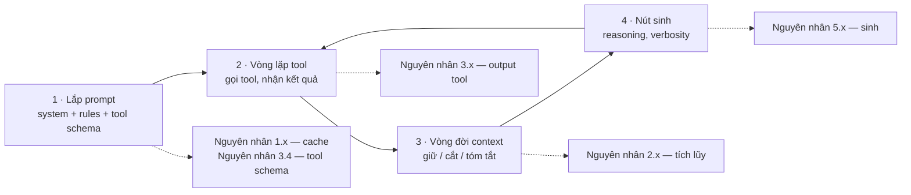
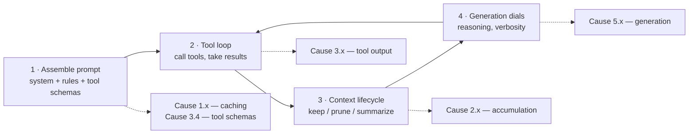

# Harness: lớp quyết định hóa đơn của bạn (Tiếng Việt)

**Harness** là phần mềm nằm giữa bạn và API của model: nó lắp prompt, chạy
vòng lặp tool, và quyết định cái gì được giữ lại trong context. Bạn không gọi
model — harness gọi hộ bạn, và nó quyết định phần lớn số token bị tính tiền.

Tài liệu này mô tả harness làm gì, rồi đối chiếu **bốn agent**: Claude Code,
Codex CLI, Gemini CLI và Cline.

> ⚠️ **Đây là lý do quan trọng nhất khiến bạn phải đọc [`PROOF.md`](PROOF.md)
> trước.** Mọi con số trong kho này đều là *giá trị biên so với một harness cụ
> thể*, không phải thuộc tính của công cụ. Cùng một công cụ đo ra −69% trên
> harness này và **+7.6%** trên harness khác — chỉ vì harness thứ hai đã tự
> làm sẵn phần việc đó.

---

## Harness tiêu tiền của bạn ở đâu

Bốn việc, ánh xạ thẳng sang các nhóm nguyên nhân trong
[`CAUSE.md`](CAUSE.md):

| Việc harness làm | Nếu làm tốt | Nếu làm dở |
| --- | --- | --- |
| **Lắp prompt** | Tiền tố ổn định theo byte, cache đặt đúng chỗ | Sửa rules giữa phiên → xây lại cache toàn phiên (1.3) |
| **Vòng lặp tool** | Cắt output quá khổ trước khi đưa vào history | Nhét nguyên 50.000 dòng log vào context (3.1) |
| **Vòng đời context** | Cắt tool result cũ, nén khi gần đầy | Gửi lại toàn bộ transcript mỗi lượt (2.1, 2.2) |
| **Nút sinh** | Effort thấp cho việc dễ | Reasoning tối đa để đổi tên một biến (5.1) |

Hệ quả thực tế: **chọn harness là đòn bẩy lớn hơn cài thêm công cụ.** Một
harness đã cắt output, đã cache, đã nén sẽ lấy mất phần lớn dư địa mà một
công cụ bên thứ ba định khai thác.

---

## Bảng đối chiếu năng lực

Ký hiệu: ✅ có sẵn · ⚠️ có nhưng thiếu/một phần · ❌ không có · ⚪ chưa xác
minh. Trạng thái tổng hợp từ tài liệu nhà cung cấp, tháng 8/2026 — cả bốn
công cụ đều phát hành rất nhanh, hãy kiểm lại trước khi triển khai.

### 1 — Caching (nguyên nhân 1.x)

| Năng lực | Claude Code | Codex CLI | Gemini CLI | Cline |
| --- | --- | --- | --- | --- |
| Caching mặc định | ✅ tự động | ✅ cache tiền tố chính xác | ✅ implicit (auth bằng API key) | ✅ trên provider hỗ trợ |
| Thấy được cache read | ✅ `/cost`, `/context` | ✅ `/status` | ✅ `/stats` | ✅ **theo từng task, ngay trên UI** |
| Nén làm hỏng cache | ✅ có (tiền tố mới) | ✅ có | ✅ có | ✅ có |

Nén *luôn* phá cache ở mọi harness: tiền tố mới nghĩa là lần đầu sau nén trả
giá đầy đủ. Đó là lý do nên chủ động nén ở điểm dừng tự nhiên thay vì để nó
tự kích hoạt giữa dòng công việc — xem
[`solutions/compaction.md`](solutions/compaction.md).

### 2 — Vòng đời context (nguyên nhân 2.x)

| Năng lực | Claude Code | Codex CLI | Gemini CLI | Cline |
| --- | --- | --- | --- | --- |
| Tự động nén | ✅ gần ngưỡng | ✅ `model_auto_compact_token_limit` | ✅ `model.compressionThreshold` (mặc định `0.5`) | ✅ Auto Compact |
| Ngưỡng chỉnh được | ⚪ không phải nút số công khai | ✅ số token (≤ 90% cửa sổ) | ✅ tỷ lệ + `historyWindow.maxTokens` (`150000`) | ⚪ |
| Nén thủ công | ✅ `/compact` | ✅ `/compact` | ✅ `/compress` | ✅ `/smol` |
| Cắt tool result cũ | ✅ tự động trước khi nén hẳn | ✅ theo ngân sách lưu trữ | ✅ `retainedTokens` (`40000`) | ⚠️ qua nén |
| Bàn giao sang phiên mới | ✅ subagent + tóm tắt | ✅ subagent | ✅ subagent | ✅ `/newtask` + Focus Chain |

### 3 — Vòng lặp tool (nguyên nhân 3.x)

| Năng lực | Claude Code | Codex CLI | Gemini CLI | Cline |
| --- | --- | --- | --- | --- |
| Tool đọc/tìm file riêng | ✅ Read/Grep/Glob | ⚠️ phần lớn qua shell | ✅ | ✅ `read_file`/`search_files` |
| Cắt output quá khổ | ✅ **đã đo** | ✅ | ✅ `truncateToolOutputThreshold` (`40000` ký tự) | ⚪ |
| **Ngân sách output chỉnh được** | ⚠️ chủ yếu cho MCP | ✅ **`tool_output_token_limit`** | ✅ **`summarizeToolOutput` theo từng tool** | ❌ |
| Tóm tắt output bằng LLM | ⚪ | ✅ tóm tắt khi vượt ngưỡng | ✅ `distillation.summarizationThresholdTokens` (`20000`) | ❌ |
| Tải tool trì hoãn / tìm tool | ✅ | ⚪ | ✅ hook lọc tool trước khi chọn | ❌ **schema MCP nhét vào mọi request** |
| MCP | ✅ | ✅ | ✅ | ✅ |
| **Chèn quy tắc tất định (hook)** | ✅ hook | ⚠️ **hook chỉ bắt tool shell** | ✅ hook + extension | ❌ **chỉ có file rules** |

Ba hàng in đậm là nơi bốn harness khác nhau nhiều nhất, và cũng là nơi quyết
định một công cụ bên thứ ba có tác dụng hay không:

- **Ngân sách output**: Codex và Gemini cho bạn một con số để chỉnh. Ở đó,
  cài thêm bộ nén output là làm lại việc harness đã làm.
- **Chèn tất định**: đây là khác biệt sống còn. Một ruleset nạp qua hook thì
  *chắc chắn* chạy; cùng ruleset đó đặt trong file rules đã **kích hoạt 0
  lần trong 10 phiên** ([`PROOF.md`](PROOF.md)). Cline chỉ có tầng file rules
  — mọi công cụ dạng "bộ quy tắc" đều rơi vào tầng yếu nhất ở đó.
- **Hook của Codex chỉ chặn tool shell**: `apply_patch`, đọc/ghi file và lời
  gọi MCP không kích hoạt hook. Đúng lỗ hổng độ phủ đã hạ gục RTK trên Claude
  Code — chỉ khác chỗ nó nằm ở tầng hook thay vì tầng tool.

### 4 — Nút sinh và định tuyến (nguyên nhân 5.x, 6.x)

| Năng lực | Claude Code | Codex CLI | Gemini CLI | Cline |
| --- | --- | --- | --- | --- |
| Nút reasoning effort | ✅ mức thinking | ✅ **`model_reasoning_effort`: `minimal`…`xhigh`** | ⚪ | ✅ ngân sách thinking (model Anthropic) |
| Nút verbosity | ⚪ qua prompt | ✅ **`model_verbosity`: `low`/`medium`/`high`** | ⚪ | ⚪ qua prompt |
| Sửa file bằng diff | ✅ | ✅ `apply_patch` | ✅ | ✅ `replace_in_file` |
| Định tuyến model | ✅ theo phiên/subagent | ✅ theo phiên | ✅ theo phiên | ✅ **Plan/Act: hai model, một cấu hình** |
| Subagent | ✅ | ✅ | ✅ cô lập tool | ❌ (`/newtask` là bản thủ công) |

---

## Ghi chú theo từng agent

### Claude Code

Harness được đo kỹ nhất trong kho này — và vì thế là **baseline** của mọi con
số ở đây. Nó tự cắt output, tự cache, tự cắt tool result cũ, và system prompt
đã ép súc tích sẵn. Hệ quả: dư địa cho công cụ nén bên ngoài rất mỏng. RTK đo
ra **+7.6% chi phí** ở đây không phải vì RTK tệ, mà vì phần nó định nén thì
harness đã vứt đi rồi, còn phần nó thực sự chạm tới (Bash) chỉ chiếm dưới 20%
lưu lượng context.

Việc nên làm ở đây: chèn quy tắc qua **hook** (tầng đã đo được kết quả:
ponytail −10.3%), và tấn công phía *ngăn việc phát sinh* thay vì nén sau.

### Codex CLI

Harness có **nhiều nút số nhất**. `tool_output_token_limit`,
`model_auto_compact_token_limit`, `model_reasoning_effort` (tới `xhigh`) và
`model_verbosity` đều là giá trị trong `config.toml` — nghĩa là ba nguyên
nhân tốn kém nhất (3.1, 2.1, 5.1) chỉnh được bằng cấu hình, không cần công cụ.

Cạm bẫy: **hook chỉ chặn tool shell**. Nếu bạn định dùng hook để ép ngân sách
hay ép định dạng cho các thao tác sửa file, nó sẽ không chạy. Yêu cầu mở rộng
hook gốc vẫn đang mở
([openai/codex#19001](https://github.com/openai/codex/issues/19001)).

### Gemini CLI

Hệ thống quản lý context **có nhiều tầng nhất**: ngưỡng nén theo tỷ lệ, cửa
sổ history có `retainedTokens`, cắt output theo ký tự, *và* một tầng
"distillation" tóm tắt output lớn bằng LLM. Có cả hook chạy **trước khi chọn
tool** — tức là lọc được tập tool trước mỗi lượt, đúng cách khắc phục nguyên
nhân 3.4 ([`solutions/tool-search.md`](solutions/tool-search.md)).

Lưu ý: tóm tắt bằng LLM *tự nó tốn token*. Nó đổi token đắt (giữ nguyên) lấy
token rẻ hơn (tóm tắt) — đúng đắn khi output thực sự lớn, lãng phí khi bạn chỉ
cần cắt bớt. Đặt `truncateToolOutputThreshold` trước, rồi mới bật tóm tắt.

### Cline

BYO-provider: mọi nguyên nhân đổ thẳng vào hóa đơn của bạn, nhưng gần như mọi
nút chỉnh đều lộ ra trong extension. Điểm mạnh riêng: **hiển thị cache
read/write và chi phí theo từng task** — khả năng quan sát tốt nhất trong bốn
cái — và **Plan/Act**, cơ chế định tuyến hai model gốc.

Hai lỗ hổng cấu trúc, cả hai đều quan trọng:

- **Schema MCP nhét vào mọi request.** Vài server bật sẵn mà không dùng có
  thể âm thầm cộng hàng nghìn token mỗi lượt (nguyên nhân 3.4). Tắt server
  không dùng *hôm nay*.
- **Chỉ có file rules, không có hook.** Đây là tầng đã đo được là kích hoạt
  0/10 phiên. Mọi công cụ dạng ruleset trên Cline đều phải được xác minh là
  thực sự chạy, chứ không giả định.

Chi tiết triển khai: [`setups/coding-setup-cline.md`](setups/coding-setup-cline.md).

---

## Trạng thái đo lường

| | Claude Code | Codex CLI | Gemini CLI | Cline |
| --- | --- | --- | --- | --- |
| Có A/B đối chứng trong kho này | ✅ toàn bộ | ❌ | ❌ | ❌ |
| Công cụ chuyên biệt từng được đo | 4 | 0 | 0 | **0** |

**Không một con số nào trong kho này được đo trên Codex, Gemini hay Cline.**
Bảng năng lực ở trên nói *harness có gì*; nó không nói *cài thêm gì thì tiết
kiệm bao nhiêu*. Với ba harness còn lại, chỉ tầng công cụ độc lập với agent
(LLMLingua, RouteLLM) là có thể khuyến nghị một cách trung thực.

Muốn tự đo harness của mình trong 15 phút: xem
[`tools/README.md`](tools/README.md).

---

## Nguồn

- [Codex config reference](https://learn.chatgpt.com/docs/config-file/config-reference) ·
  [Codex CLI features](https://developers.openai.com/codex/cli/features) ·
  [openai/codex#19001](https://github.com/openai/codex/issues/19001)
- [Gemini CLI configuration](https://geminicli.com/docs/reference/configuration/) ·
  [Gemini CLI hooks](https://geminicli.com/docs/hooks/reference/) ·
  [Gemini CLI extensions](https://geminicli.com/docs/extensions/)
- [Context compaction deep dive: Codex CLI, Claude Code, OpenCode](https://codex.danielvaughan.com/2026/04/14/context-compaction-deep-dive-codex-cli-claude-code-opencode/) ·
  [Prompt caching in Codex CLI](https://codex.danielvaughan.com/2026/04/21/codex-cli-prompt-caching-maximise-cache-hits-cost-reduction/)
- [Gemini CLI chat compression (DeepWiki)](https://deepwiki.com/google-gemini/gemini-cli/4.12-chat-compression-and-context-management)

---

# Harness: the layer that decides your bill

A **harness** is the software between you and the model API: it assembles the
prompt, runs the tool loop, and decides what stays in context. You don't call
the model — the harness calls it for you, and it determines most of what you
are billed for.

This doc describes what a harness does, then compares **four agents**: Claude
Code, Codex CLI, Gemini CLI and Cline.

> ⚠️ **This is the single most important reason to read
> [`PROOF.md`](PROOF.md) first.** Every number in this repo is a *marginal
> value against one specific harness*, not a property of the tool. The same
> tool measured −69% on one harness and **+7.6%** on another — purely because
> the second harness already did that job itself.

---

## Where a harness spends your money

Four jobs, mapping directly onto the cause groups in [`CAUSE.md`](CAUSE.md):

| What the harness does | Done well | Done badly |
| --- | --- | --- |
| **Assemble the prompt** | Byte-stable prefix, cache breakpoints in the right place | Rules edited mid-session → session-wide cache rebuild (1.3) |
| **Run the tool loop** | Oversized output capped before it enters history | 50,000 lines of log pasted into context (3.1) |
| **Manage context** | Stale tool results pruned, compaction near the limit | Whole transcript re-sent every turn (2.1, 2.2) |
| **Set generation dials** | Low effort for easy work | Maximum reasoning to rename a variable (5.1) |

The practical consequence: **choosing a harness is a bigger lever than
installing a tool.** A harness that already caps output, already caches and
already compacts has consumed most of the headroom a third-party tool was
planning to exploit.

---

## Capability matrix

Symbols: ✅ present · ⚠️ present but partial/limited · ❌ absent · ⚪
unverified. Compiled from vendor docs, August 2026 — all four ship fast;
re-check before you roll anything out.

### 1 — Caching (cause 1.x)

| Capability | Claude Code | Codex CLI | Gemini CLI | Cline |
| --- | --- | --- | --- | --- |
| Caching on by default | ✅ automatic | ✅ exact-prefix caching | ✅ implicit (API-key auth) | ✅ on supporting providers |
| Cache reads visible | ✅ `/cost`, `/context` | ✅ `/status` | ✅ `/stats` | ✅ **per task, in the UI** |
| Compaction breaks the cache | ✅ yes (new prefix) | ✅ yes | ✅ yes | ✅ yes |

Compaction breaks the cache on *every* harness: a new prefix means the first
turn after it pays full price. That's why you want to compact deliberately at
a natural pause rather than let it fire mid-flow — see
[`solutions/compaction.md`](solutions/compaction.md).

### 2 — Context lifecycle (cause 2.x)

| Capability | Claude Code | Codex CLI | Gemini CLI | Cline |
| --- | --- | --- | --- | --- |
| Auto-compaction | ✅ near the limit | ✅ `model_auto_compact_token_limit` | ✅ `model.compressionThreshold` (default `0.5`) | ✅ Auto Compact |
| Threshold configurable | ⚪ not an exposed numeric dial | ✅ token count (≤ 90% of window) | ✅ ratio + `historyWindow.maxTokens` (`150000`) | ⚪ |
| Manual compaction | ✅ `/compact` | ✅ `/compact` | ✅ `/compress` | ✅ `/smol` |
| Stale tool-result pruning | ✅ automatic, before full compaction | ✅ via storage budget | ✅ `retainedTokens` (`40000`) | ⚠️ via compaction |
| Hand-off to a fresh session | ✅ subagents + summaries | ✅ subagents | ✅ subagents | ✅ `/newtask` + Focus Chain |

### 3 — The tool loop (cause 3.x)

| Capability | Claude Code | Codex CLI | Gemini CLI | Cline |
| --- | --- | --- | --- | --- |
| Own file read/search tools | ✅ Read/Grep/Glob | ⚠️ mostly via shell | ✅ | ✅ `read_file`/`search_files` |
| Truncates oversized output | ✅ **measured** | ✅ | ✅ `truncateToolOutputThreshold` (`40000` chars) | ⚪ |
| **Configurable output budget** | ⚠️ mainly for MCP | ✅ **`tool_output_token_limit`** | ✅ **`summarizeToolOutput` per tool** | ❌ |
| LLM summarization of output | ⚪ | ✅ summarizes above the limit | ✅ `distillation.summarizationThresholdTokens` (`20000`) | ❌ |
| Deferred tool loading / search | ✅ | ⚪ | ✅ pre-tool-selection hooks filter tools | ❌ **MCP schemas injected every request** |
| MCP | ✅ | ✅ | ✅ | ✅ |
| **Deterministic rule injection** | ✅ hooks | ⚠️ **hooks intercept the shell tool only** | ✅ hooks + extensions | ❌ **rules files only** |

The three bold rows are where these four differ most, and where a
third-party tool lives or dies:

- **Output budget**: Codex and Gemini hand you a number to set. There,
  installing an output compressor duplicates what the harness already does.
- **Deterministic injection**: the decisive difference. A ruleset loaded via
  a hook *definitely* runs; the same ruleset in a rules file fired **0 times
  in 10 sessions** ([`PROOF.md`](PROOF.md)). Cline has only the rules-file
  tier — every "ruleset" tool lands on the weakest rung there.
- **Codex hooks intercept shell only**: `apply_patch`, file reads/writes and
  MCP calls never fire them. That is precisely the coverage gap that sank RTK
  on Claude Code, relocated from the tool tier to the hook tier.

### 4 — Generation dials and routing (causes 5.x, 6.x)

| Capability | Claude Code | Codex CLI | Gemini CLI | Cline |
| --- | --- | --- | --- | --- |
| Reasoning-effort dial | ✅ thinking levels | ✅ **`model_reasoning_effort`: `minimal`…`xhigh`** | ⚪ | ✅ thinking budget (Anthropic models) |
| Verbosity dial | ⚪ via prompt | ✅ **`model_verbosity`: `low`/`medium`/`high`** | ⚪ | ⚪ via prompt |
| Diff-based edits | ✅ | ✅ `apply_patch` | ✅ | ✅ `replace_in_file` |
| Model routing | ✅ per session/subagent | ✅ per session | ✅ per session | ✅ **Plan/Act: two models, one config** |
| Subagents | ✅ | ✅ | ✅ with tool isolation | ❌ (`/newtask` is the manual equivalent) |

---

## Per-agent notes

### Claude Code

The most heavily measured harness in this repo — and therefore the
**baseline** behind every number here. It truncates output, caches, and
prunes stale tool results on its own, and its system prompt already enforces
concision. The consequence is that headroom for external compression tools is
thin. RTK measured **+7.6% cost** here not because RTK is bad, but because
what it set out to compress was already being discarded, and what it actually
reached (Bash) carried under 20% of context traffic.

What works here: inject rules via **hooks** (the tier with a measured result:
ponytail at −10.3%), and attack the *prevent the work* side rather than
compressing after the fact.

### Codex CLI

The harness with the **most numeric dials**. `tool_output_token_limit`,
`model_auto_compact_token_limit`, `model_reasoning_effort` (up to `xhigh`)
and `model_verbosity` are all `config.toml` values — meaning the three most
expensive causes (3.1, 2.1, 5.1) are configuration changes, not tool
installs.

The trap: **hooks only intercept the shell tool**. If you planned to enforce
budgets or formats around file edits with a hook, it will not fire. The
request for broader native hooks is still open
([openai/codex#19001](https://github.com/openai/codex/issues/19001)).

### Gemini CLI

The **most layered** context-management system: a ratio-based compression
threshold, a history window with `retainedTokens`, character-level output
truncation, *and* a "distillation" tier that LLM-summarizes large tool
output. It also has hooks that run **before tool selection** — letting you
filter the tool set per turn, which is exactly the fix for cause 3.4
([`solutions/tool-search.md`](solutions/tool-search.md)).

One caution: LLM summarization *itself costs tokens*. It trades expensive
tokens (keep everything) for cheaper ones (a summary) — right when output is
genuinely large, wasteful when you only needed a cap. Set
`truncateToolOutputThreshold` first, then turn summarization on.

### Cline

BYO-provider, so every cause lands straight on your invoice — but nearly
every dial is exposed in the extension. Its distinctive strengths: **per-task
cache read/write and cost display**, the best observability of the four, and
**Plan/Act**, a native two-model routing mechanism.

Two structural gaps, both consequential:

- **MCP schemas are injected into every request.** A few idle servers can
  quietly add thousands of tokens per turn (cause 3.4). Disable servers you
  aren't using *today*.
- **Rules files only, no hooks.** This is the tier measured at 0 activations
  in 10 sessions. Any ruleset-style tool on Cline has to be verified as
  actually firing, not assumed.

Implementation detail: [`setups/coding-setup-cline.md`](setups/coding-setup-cline.md).

---

## Measurement status

| | Claude Code | Codex CLI | Gemini CLI | Cline |
| --- | --- | --- | --- | --- |
| Controlled A/B in this repo | ✅ all of them | ❌ | ❌ | ❌ |
| Agent-specific tools ever measured | 4 | 0 | 0 | **0** |

**No number in this repo was measured on Codex, Gemini or Cline.** The
capability matrix above says *what the harness has*; it does not say *what
installing something saves*. On the other three, only the agent-independent
tier (LLMLingua, RouteLLM) can be honestly recommended.

To profile your own harness in 15 minutes, see
[`tools/README.md`](tools/README.md).

---

## Sources

- [Codex config reference](https://learn.chatgpt.com/docs/config-file/config-reference) ·
  [Codex CLI features](https://developers.openai.com/codex/cli/features) ·
  [openai/codex#19001](https://github.com/openai/codex/issues/19001)
- [Gemini CLI configuration](https://geminicli.com/docs/reference/configuration/) ·
  [Gemini CLI hooks](https://geminicli.com/docs/hooks/reference/) ·
  [Gemini CLI extensions](https://geminicli.com/docs/extensions/)
- [Context compaction deep dive: Codex CLI, Claude Code, OpenCode](https://codex.danielvaughan.com/2026/04/14/context-compaction-deep-dive-codex-cli-claude-code-opencode/) ·
  [Prompt caching in Codex CLI](https://codex.danielvaughan.com/2026/04/21/codex-cli-prompt-caching-maximise-cache-hits-cost-reduction/)
- [Gemini CLI chat compression (DeepWiki)](https://deepwiki.com/google-gemini/gemini-cli/4.12-chat-compression-and-context-management)
