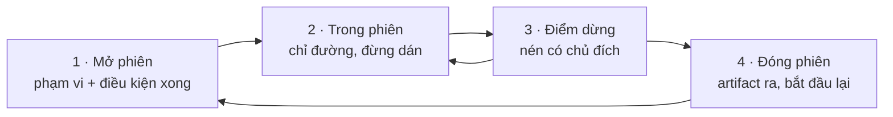
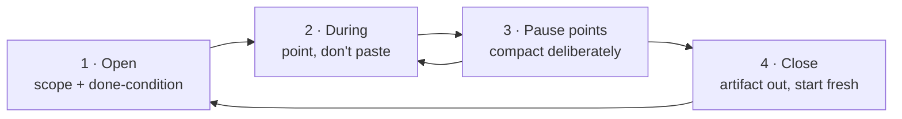

# Quy trình làm việc: tầng tính tiền theo từng phiên (Tiếng Việt)

Ba tài liệu trước đặt trần cho thiệt hại. [`HARNESS.md`](HARNESS.md) chọn
harness, [`CONFIG.md`](CONFIG.md) đặt các nút, [`tools/`](tools/README.md) chọn
công cụ. Cả ba đều là việc **làm một lần**.

Tài liệu này nói về tầng còn lại: những gì bạn làm ở mỗi phiên. Đó là tầng duy
nhất bị tính tiền lặp đi lặp lại, và là tầng duy nhất mà kho này có **kết quả
đo dương rõ ràng nhất**.

> Bằng chứng vì sao tầng này quan trọng: can thiệp được đo tốt nhất trong cả
> kho — ponytail, **−10.3% chi phí, p=0.004** — không phải bộ nén, không phải
> cache, không phải nút cấu hình. Nó là **một ruleset mã hóa kỷ luật của lập
> trình viên**: đừng xây thứ không cần, đừng viết lại thứ đã có, đọc trước khi
> quyết định. Nó thắng vì khoản tiết kiệm là *output thật không bao giờ được
> sinh ra*. Xem [`tools/ponytail.md`](tools/ponytail.md).

⚪ **Trạng thái bằng chứng:** ngoài con số ponytail ở trên, những thói quen
trong tài liệu này **chưa được A/B trong kho này**. Chúng suy ra từ cơ chế tính
tiền trong [`CAUSE.md`](CAUSE.md), không phải từ phép đo. Phần số học được ghi
rõ là số học.

Một cảnh báo về đơn vị: nếu bạn ở gói cố định và chưa chạm trần, những thói
quen này vẫn đáng làm — nhưng vì lý do **chất lượng**, không phải tiền bạc.
Xem [`BILLING.md`](BILLING.md).

---

## Sự thật kinh tế chi phối tất cả

Model không có trí nhớ. Mỗi lượt, harness gửi lại **toàn bộ** cuộc hội thoại
tính đến thời điểm đó. Nghĩa là một token bạn thêm vào ở lượt 5 không bị tính
một lần — nó bị tính lại ở lượt 6, 7, 8, cho tới hết phiên.

Hệ quả là quy tắc quan trọng nhất trong cả tài liệu:

> **Chi phí của một sai lầm tỷ lệ với việc bạn phạm nó sớm đến đâu trong phiên.**

Số học minh họa (là số học, không phải phép đo). Dán 20.000 token log vào một
phiên 50 lượt:

| Dán ở lượt | Số lượt phải mang nó | Token · lượt |
| --- | --- | --- |
| Lượt 5 | 45 | 900.000 |
| Lượt 25 | 25 | 500.000 |
| Lượt 45 | 5 | 100.000 |

Cùng một hành động, chênh nhau **9 lần**, chỉ khác thời điểm.

**Caching làm dịu điều này, không xóa bỏ nó.** Byte gửi lại được tính khoảng
1/10 giá, nên hãy chia các con số trên cho ~10 khi cache đang trúng. Nhưng cache
*trượt* mỗi khi nén chạy (nguyên nhân 1.3), và ngay lúc đó bạn trả giá đầy đủ
cho mọi thứ vẫn còn trong context — kể cả đống log bạn dán ở lượt 5. Nén càng
nhiều lần, bạn càng trả lại khoản đó nhiều lần.

Hai hệ quả thực tế:

1. **Dọn sớm quan trọng hơn dọn nhiều.** Giữ 200 lượt đầu gọn gàng đáng giá
   hơn nén quyết liệt về sau.
2. **Việc phạm vi hẹp thì rẻ theo cấp số nhân.** Không phải vì prompt ngắn hơn,
   mà vì phiên ngắn hơn.

---

## Vòng đời một phiên

### 1 — Mở phiên: phạm vi quyết định hóa đơn

Quyết định đắt nhất trong cả phiên được đưa ra trước khi agent chạy tool đầu
tiên: **bạn đã giao việc gì.**

- **Một đơn vị công việc cho một phiên.** "Sửa lỗi đăng nhập" là một phiên.
  "Sửa lỗi đăng nhập rồi refactor lớp auth rồi thêm test" là ba phiên bị ép
  vào một, và phiên thứ ba đang trả tiền để mang theo context của hai phiên
  đầu.
- **Nói rõ điều kiện hoàn thành.** "Xong khi `pytest tests/auth` xanh" chặn
  vòng lặp "còn gì nữa không?". Không có nó, agent tiếp tục đề xuất, và mỗi đề
  xuất là một lượt nữa mang theo toàn bộ lịch sử.
- **Nêu ràng buộc lên trước, không phải khi review.** "Đừng thêm dependency
  mới", "giữ trong file này", "không cần test" — mỗi ràng buộc nói ở lượt 1 là
  ~10 token. Cũng ràng buộc đó nói ở lượt 20 khiến toàn bộ công việc phải làm
  lại (nguyên nhân 5.3).
- **Chỉ đường tới file.** `src/auth/session.py` tốn ~8 token. Để agent tự tìm
  ra file đó tốn một vòng khám phá: glob, grep, đọc vài file sai. Bạn đã biết
  câu trả lời — đừng bắt nó trả tiền để tìm lại.

**Cạm bẫy ngược:** đừng chỉ đường khi bạn *đoán*. Chỉ sai file còn đắt hơn
không chỉ gì cả, vì agent đọc nó, tin bạn, rồi mới phải tự tìm.

### 2 — Trong phiên: chỉ đường, đừng dán

- **Đừng dán thứ agent tự đọc được.** Dán 800 dòng file là 800 dòng nằm trong
  context vĩnh viễn. Nói tên file thì agent đọc nó, và trên harness có theo dõi
  trạng thái file thì lần đọc đó có thể được tái sử dụng thay vì lặp lại.
- **Đọc lỗi trước khi chuyển tiếp nó.** Stack trace 2.000 dòng có khoảng 5 dòng
  quan trọng. Bạn tìm ra chúng trong 10 giây. Dán cả cục là nguyên nhân 3.1 do
  chính bạn tự gây ra — và theo phần số học ở trên, nó ở lại tới hết phiên.
- **Gộp các yêu cầu liên quan vào một lượt.** Ba câu hỏi trong ba lượt gửi lại
  toàn bộ context ba lần. Cùng ba câu hỏi trong một lượt gửi một lần
  (nguyên nhân 3.2).
- **Đừng hỏi thứ bạn chạy được.** "Cái này có compile không?" là một lượt LLM
  để trả lời một câu hỏi mà compiler trả lời chính xác hơn và miễn phí. Chạy
  nó, rồi chỉ đưa lỗi vào nếu có.
- **Đừng sửa rules giữa phiên.** Sửa `CLAUDE.md` / `.clinerules` / `AGENTS.md`
  giữa chừng làm thay đổi tiền tố prompt và buộc xây lại cache **toàn phiên**
  (nguyên nhân 1.3). Ghi lại, sửa giữa hai phiên.
- **Để agent xây thừa là tốn tiền hai lần.** Code thừa là output token lúc
  viết, input token ở mọi lượt sau, và thêm token nữa khi bạn bảo nó bỏ đi. Đây
  chính xác là thứ ponytail chặn — và bạn có thể tự làm bằng một câu: *"bản tối
  thiểu, đừng thêm gì tôi không yêu cầu."*

### 3 — Điểm dừng: nén có chủ đích

Nén **luôn** phá cache trên mọi harness — tiền tố mới, lượt kế tiếp trả giá đầy
đủ. Bạn không tránh được điều đó, nhưng bạn chọn được *thời điểm*.

- **Nén ở ranh giới tự nhiên**, khi vừa xong một phần việc: test đã xanh, tính
  năng đã chạy. Lúc đó phần lịch sử bị bỏ đi thật sự đã hết giá trị.
- **Đừng để nó tự kích hoạt giữa dòng suy nghĩ.** Nén giữa lúc gỡ lỗi vứt đi
  đúng những chi tiết đang cần, và bạn trả tiền để nạp lại chúng.
- **Trước khi nén, yêu cầu một artifact.** "Tóm tắt những gì đã thay đổi và còn
  lại gì" ghi kết luận ra ngoài context. Sau đó chi tiết bị vứt đi cũng không
  sao.

### 4 — Đóng phiên: biết lúc nào nên bắt đầu lại

Đây là quyết định bị bỏ lỡ nhiều nhất. Có một điểm mà phiên hiện tại đắt hơn
một phiên mới, kể cả khi tính cả chi phí khởi động nguội (nguyên nhân 6.5).

Heuristic — ⚪ chưa đo, nhưng suy ra trực tiếp từ phần số học ở trên:

| Tín hiệu | Nên làm |
| --- | --- |
| Agent thất bại **hai lần liên tiếp** cùng một việc | **Bắt đầu lại.** Context giờ chứa hai cách sai và nó đang neo vào chúng |
| Việc tiếp theo dùng chung **dưới một nửa** số file với việc vừa xong | **Bắt đầu lại.** Bạn đang mang theo context không liên quan |
| Bạn vừa đọc lại lịch sử để nhớ ra đang làm gì | **Bắt đầu lại**, kèm một artifact tóm tắt |
| Việc tiếp theo là phần tiếp nối trực tiếp, cùng file | Tiếp tục — cold start sẽ tốn hơn |

**Vòng xoáy tử thần** đáng được gọi tên riêng: agent hiểu sai, bạn sửa, nó hiểu
sai theo cách khác, bạn sửa tiếp. Mỗi vòng thêm cả câu trả lời sai *lẫn* phần
sửa vào một context mà từ đó lượt nào cũng phải mang. Đến vòng thứ ba, bạn đang
trả tiền để model đọc lại chính những hiểu nhầm của nó. Bắt đầu lại với một câu
mô tả tốt hơn gần như luôn rẻ hơn.

---

## Thói quen, xếp theo mức tốn kém

| # | Thói quen | Nguyên nhân | Vì sao tốn |
| --- | --- | --- | --- |
| 1 | Nhồi nhiều việc vào một phiên | 2.1 | Nhân toàn bộ context với số lượt |
| 2 | Dán log / file / stack trace nguyên khối | 3.1 + 2.1 | Trả tiền lại ở mọi lượt còn lại |
| 3 | Để agent tự tìm thứ bạn đã biết | 4.2, 6.5 | Cả một vòng khám phá cho một câu trả lời bạn có sẵn |
| 4 | Chạy tiếp qua vòng xoáy tử thần | 2.1 + 5.3 | Trả tiền để model đọc lại lỗi của chính nó |
| 5 | Để agent xây thừa | 5.1, 5.2 | Đây là khoảng −10.3% đã đo được |
| 6 | Round-trip vụn vặt | 3.2 | Gửi lại toàn bộ context cho mỗi câu hỏi nhỏ |
| 7 | Sửa rules giữa phiên | 1.3 | Xây lại cache toàn phiên |
| 8 | Reasoning tối đa cho việc lặt vặt | 5.1 | Token sinh ra là loại đắt nhất |
| 9 | Hỏi thứ bạn chạy được | 6.6 | Một lượt LLM cho việc compiler làm miễn phí |
| 10 | Fan-out song song khi cache còn nguội | 6.3 | N bản sao cùng trả giá đầy đủ |

Bốn dòng đầu là hành vi của **con người**, không phải của agent. Đó là điểm
chính của tài liệu này: phần lớn dư địa còn lại sau khi bạn đã chỉnh harness
nằm ở phía bàn phím.

---

## Việc này quan trọng đến đâu tùy theo loại tác vụ

Cần nói thẳng, vì dữ liệu ponytail nói rất rõ: khoản tiết kiệm **tập trung
hoàn toàn** vào tình huống xây thừa — −31% ở các bản build lớn, **bằng 0 khi
code vốn đã tối giản**.

| Loại tác vụ | Dư địa từ kỷ luật workflow |
| --- | --- |
| Xây tính năng end-to-end, agent tự quyết kiến trúc | **Cao** — đây là chỗ có con số |
| Khám phá / tìm hiểu codebase lạ | **Cao** — phạm vi và chỉ đường quyết định tất cả |
| Sửa lỗi có phạm vi hẹp | Thấp — không có gì để ngăn xây thừa |
| Refactor cơ học | Thấp |
| Tác vụ chỉ đọc, hỏi đáp | Thấp — phiên vốn đã ngắn |

Nếu ngày làm việc của bạn phần lớn là sửa lỗi nhỏ, đừng kỳ vọng nhiều ở tầng
này — và đừng đưa những tác vụ đó vào baseline khi đo, vì làm vậy là tự pha
loãng phép đo của chính mình.

---

## Quy ước cho cả đội

Thói quen cá nhân không mở rộng ra được; quy ước ghi thành văn thì có. Bốn thứ
đáng viết xuống, xếp theo tỷ lệ lợi ích trên công sức:

1. **Một ràng buộc mặc định trong rules file:** *"bản tối thiểu; đừng thêm thứ
   không được yêu cầu; đọc code liên quan trước khi quyết định."* Đây là phiên
   bản viết tay của can thiệp duy nhất trong kho này có p-value. Nếu harness
   của bạn có hook, hãy nạp qua hook — tầng file rules đã đo được là **kích
   hoạt 0/10 phiên**.
2. **Định nghĩa "một phiên" cho đội bạn.** Một ticket? Một PR? Hãy thống nhất,
   vì đây là nút chỉnh phạm vi và nó không nằm trong file cấu hình nào.
3. **Một `.clineignore` / `.gitignore`-cho-agent dùng chung** để `build/`,
   `dist/`, `node_modules/`, snapshot và lock file không bao giờ vào context ở
   máy bất kỳ ai.
4. **Quy ước artifact bàn giao** — mỗi phiên kết thúc bằng một bản tóm tắt ngắn
   đủ để bắt đầu phiên sau. Chi tiết:
   [`solutions/subagent-context-handoff.md`](solutions/subagent-context-handoff.md).

---

## Tự đo quy trình của bạn

Ba con số, thu ở mức phiên. Nếu telemetry đã dựng theo
[`solutions/token-counting.md`](solutions/token-counting.md), bạn đã có sẵn dữ
liệu.

1. **Token mỗi phiên hoàn thành**, không phải mỗi request. Đây là con số duy
   nhất phản ánh chi phí phạm vi.
2. **Tỷ lệ cache read.** Tụt đột ngột nghĩa là có gì đó phá tiền tố — thường là
   sửa rules giữa phiên, hoặc nén chạy quá thường xuyên.
3. **Số lượt tới lúc xong.** Tăng dần theo thời gian nghĩa là phạm vi đang phình
   ra, chứ không phải tác vụ khó lên.

Muốn so sánh một thói quen: chạy ghép cặp trên **tác vụ thật cùng loại**, hai
tuần, một thay đổi mỗi lần. Đổi hai thứ cùng lúc thì không đo được gì cả — đó
đúng là sai lầm mà [`PROOF.md`](PROOF.md) tồn tại để chỉ ra.

---

# The developer workflow: the layer billed per session

The three preceding documents cap the damage. [`HARNESS.md`](HARNESS.md) picks
the harness, [`CONFIG.md`](CONFIG.md) sets the dials,
[`tools/`](tools/README.md) picks the tools. All three are **done once**.

This document covers the layer that's left: what you do in every session. It's
the only layer billed repeatedly, and the only one where this repo has a
**clearly positive measured result**.

> The evidence for why this layer matters: the best-measured intervention in
> the entire repo — ponytail, **−10.3% cost, p=0.004** — is not a compressor,
> not a cache, not a config dial. It is **a ruleset encoding developer
> discipline**: don't build what isn't needed, don't rewrite what exists, read
> before deciding. It won because the saving is *real output never generated*.
> See [`tools/ponytail.md`](tools/ponytail.md).

⚪ **Evidence status:** apart from that ponytail figure, the habits in this
document are **not A/B tested in this repo**. They're derived from the billing
mechanics in [`CAUSE.md`](CAUSE.md), not measured. Where there's arithmetic,
it's labelled as arithmetic.

One caveat about units: if you're on a flat plan and never hit your limits,
these habits are still worth adopting — but for **quality** reasons, not
financial ones. See [`BILLING.md`](BILLING.md).

---

## The economic fact that drives everything

The model has no memory. On every turn, the harness re-sends the **entire**
conversation so far. Which means a token you add at turn 5 isn't billed once —
it's billed again at turns 6, 7, 8, and every turn until the session ends.

That produces the single most important rule here:

> **The cost of a mistake scales with how early in the session you make it.**

Illustrative arithmetic (arithmetic, not a measurement). Pasting 20,000 tokens
of log into a 50-turn session:

| Pasted at | Turns that carry it | Token · turns |
| --- | --- | --- |
| Turn 5 | 45 | 900,000 |
| Turn 25 | 25 | 500,000 |
| Turn 45 | 5 | 100,000 |

Identical action, **9× apart**, purely on timing.

**Caching softens this; it doesn't remove it.** Re-sent bytes bill at roughly
1/10, so divide the numbers above by ~10 while the cache is hitting. But the
cache *misses* every time compaction runs (cause 1.3), and at that moment you
pay full price for everything still in context — including the log you pasted
at turn 5. The more often you compact, the more times you re-pay for it.

Two practical consequences:

1. **Cleaning early beats cleaning hard.** Keeping the first 200 turns tidy is
   worth more than compacting aggressively later.
2. **Narrow tasks are cheap non-linearly.** Not because the prompt is shorter,
   but because the session is.

---

## The session lifecycle

### 1 — Opening: scope decides the bill

The most expensive decision of the session is made before the agent runs its
first tool: **what you asked for.**

- **One unit of work per session.** "Fix the login bug" is a session. "Fix the
  login bug then refactor the auth layer then add tests" is three sessions
  crammed into one, and the third is paying to carry the first two's context.
- **State the done-condition.** "Done when `pytest tests/auth` is green" stops
  the "anything else?" loop. Without it the agent keeps proposing, and each
  proposal is another turn carrying the whole history.
- **State constraints up front, not at review time.** "No new dependencies,"
  "keep it in this file," "no tests needed" — each one costs ~10 tokens at turn
  1. The same constraint at turn 20 invalidates the work already done (cause
  5.3).
- **Point at the file.** `src/auth/session.py` costs ~8 tokens. Letting the
  agent find it costs a discovery loop: glob, grep, a couple of wrong files
  read. You already knew the answer — don't pay for it to be rediscovered.

**The inverse trap:** don't point when you're *guessing*. The wrong file costs
more than no file, because the agent reads it, believes you, and only then
starts searching.

### 2 — During: point, don't paste

- **Don't paste what the agent can read itself.** An 800-line paste is 800
  lines in context permanently. Naming the file lets the agent read it — and on
  harnesses with file-state tracking, that read can be reused rather than
  repeated.
- **Read the error before forwarding it.** A 2,000-line stack trace has about
  5 lines that matter. You find them in ten seconds. Pasting the whole thing is
  cause 3.1, self-inflicted — and per the arithmetic above, it stays for the
  rest of the session.
- **Batch related asks into one turn.** Three questions across three turns
  re-send the whole context three times. The same three in one turn send it
  once (cause 3.2).
- **Don't ask what you can run.** "Does this compile?" is an LLM turn spent on
  a question the compiler answers more accurately and for free. Run it, then
  feed in the error only if there is one.
- **Don't edit rules mid-session.** Editing `CLAUDE.md` / `.clinerules` /
  `AGENTS.md` partway through changes the prompt prefix and forces a
  **session-wide** cache rebuild (cause 1.3). Note it down; change it between
  sessions.
- **Letting the agent over-build costs twice.** Surplus code is output tokens
  when written, input tokens on every later turn, and more tokens again when
  you tell it to remove them. This is exactly what ponytail prevents — and you
  can do it by hand with one sentence: *"minimum version, don't add anything I
  didn't ask for."*

### 3 — Pause points: compact deliberately

Compaction **always** breaks the cache, on every harness — new prefix, next
turn at full price. You can't avoid that, but you choose *when*.

- **Compact at natural boundaries**, right after something lands: tests green,
  feature working. That's when the discarded history has genuinely stopped
  being useful.
- **Don't let it fire mid-thought.** Compaction in the middle of a debugging
  run discards exactly the details you're using, and you pay to reload them.
- **Ask for an artifact before compacting.** "Summarize what changed and what's
  left" writes the conclusions outside the context. After that, losing the
  detail is fine.

### 4 — Closing: know when to start over

This is the most commonly missed decision. There's a point where continuing the
current session costs more than a fresh one, even counting the cold start
(cause 6.5).

Heuristics — ⚪ unmeasured, but following directly from the arithmetic above:

| Signal | Do this |
| --- | --- |
| The agent failed the same thing **twice in a row** | **Start over.** The context now holds two wrong approaches and it's anchoring on them |
| The next task shares **fewer than half** its files with the last one | **Start over.** You're carrying irrelevant context |
| You just re-read the history to remember what you were doing | **Start over**, with a summary artifact |
| The next task is a direct continuation in the same files | Continue — the cold start would cost more |

**The death spiral** deserves its own name: the agent misunderstands, you
correct it, it misunderstands differently, you correct again. Each round adds
both the wrong answer *and* the correction to a context that every subsequent
turn must carry. By the third round you're paying for the model to re-read its
own misunderstandings. Starting over with a better one-sentence description is
almost always cheaper.

---

## Habits, ranked by what they cost

| # | Habit | Cause | Why it costs |
| --- | --- | --- | --- |
| 1 | Cramming several tasks into one session | 2.1 | Multiplies the whole context by the turn count |
| 2 | Pasting logs / files / stack traces wholesale | 3.1 + 2.1 | Re-billed on every remaining turn |
| 3 | Letting the agent search for what you already know | 4.2, 6.5 | A full discovery loop for an answer you had |
| 4 | Pushing on through the death spiral | 2.1 + 5.3 | Paying the model to re-read its own errors |
| 5 | Letting the agent over-build | 5.1, 5.2 | This is the measured −10.3% |
| 6 | Chatty round-trips | 3.2 | Re-sends the entire context per small question |
| 7 | Editing rules mid-session | 1.3 | Session-wide cache rebuild |
| 8 | Maximum reasoning on trivial work | 5.1 | Generated tokens are the expensive kind |
| 9 | Asking what you could run | 6.6 | An LLM turn for what the compiler does free |
| 10 | Parallel fan-out on a cold cache | 6.3 | N copies all paying full price |

The top four are **human** behaviors, not agent behaviors. That's the point of
this document: most of the headroom left after you've tuned the harness sits on
the keyboard side.

---

## How much this matters depends on the task

Worth stating plainly, because the ponytail data is explicit about it: savings
concentrate **entirely** in over-build scenarios — −31% on large builds, **zero
where the code was already minimal**.

| Task type | Headroom from workflow discipline |
| --- | --- |
| End-to-end feature work, agent has architectural latitude | **High** — this is where the numbers came from |
| Exploring an unfamiliar codebase | **High** — scoping and pointing decide everything |
| Narrowly-scoped bug fixes | Low — there's no over-building to prevent |
| Mechanical refactors | Low |
| Read-only questions | Low — the session is already short |

If most of your day is small fixes, don't expect much from this layer — and
don't put those tasks in your baseline when measuring, because doing so dilutes
your own measurement.

---

## Team conventions

Individual habits don't scale; written conventions do. Four worth writing down,
in benefit-per-effort order:

1. **One default constraint in the rules file:** *"minimum version; don't add
   what wasn't asked for; read the relevant code before deciding."* This is the
   hand-written version of the only intervention in this repo with a p-value.
   If your harness has hooks, load it via a hook — the rules-file tier measured
   **0 activations in 10 sessions**.
2. **Define what "a session" means on your team.** One ticket? One PR? Agree on
   it, because it's the scope dial and it lives in no config file.
3. **A shared `.clineignore` / agent-ignore file** so `build/`, `dist/`,
   `node_modules/`, snapshots and lock files never reach context on anyone's
   machine.
4. **A handoff artifact convention** — every session ends with a summary short
   enough to start the next one from. Detail in
   [`solutions/subagent-context-handoff.md`](solutions/subagent-context-handoff.md).

---

## Measuring your own workflow

Three numbers, collected per session. If you've wired telemetry per
[`solutions/token-counting.md`](solutions/token-counting.md), you already have
the data.

1. **Tokens per completed session**, not per request. It's the only figure that
   reflects the cost of scoping.
2. **Cache-read ratio.** A sudden drop means something is breaking the prefix —
   usually a mid-session rules edit, or compaction firing too often.
3. **Turns to completion.** Creeping upward over time means scope is expanding,
   not that the tasks got harder.

To compare a habit: run paired trials on **real tasks of the same type**, over
two weeks, changing one thing at a time. Change two things at once and you've
measured nothing — which is precisely the mistake [`PROOF.md`](PROOF.md) exists
to point out.
