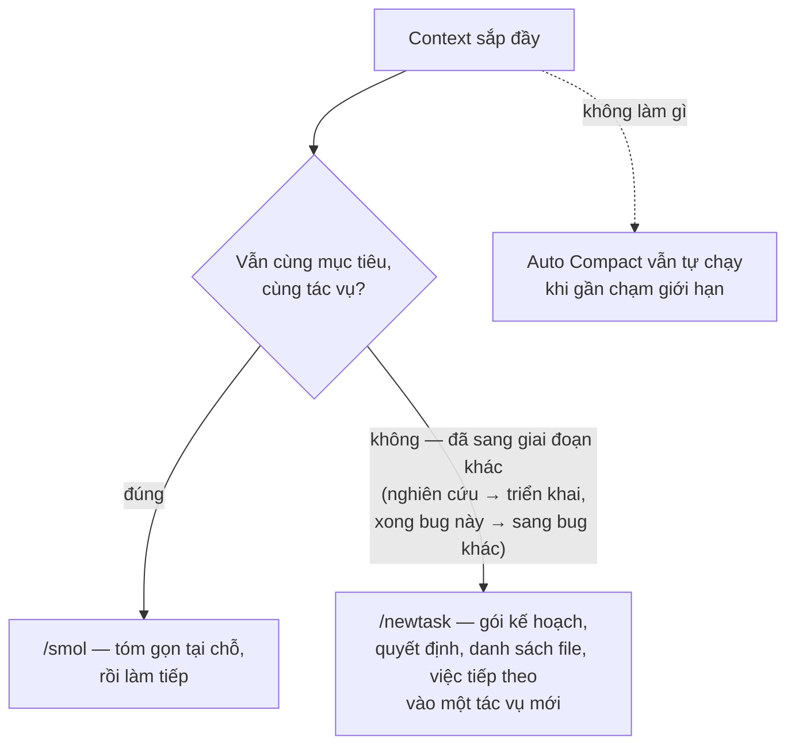
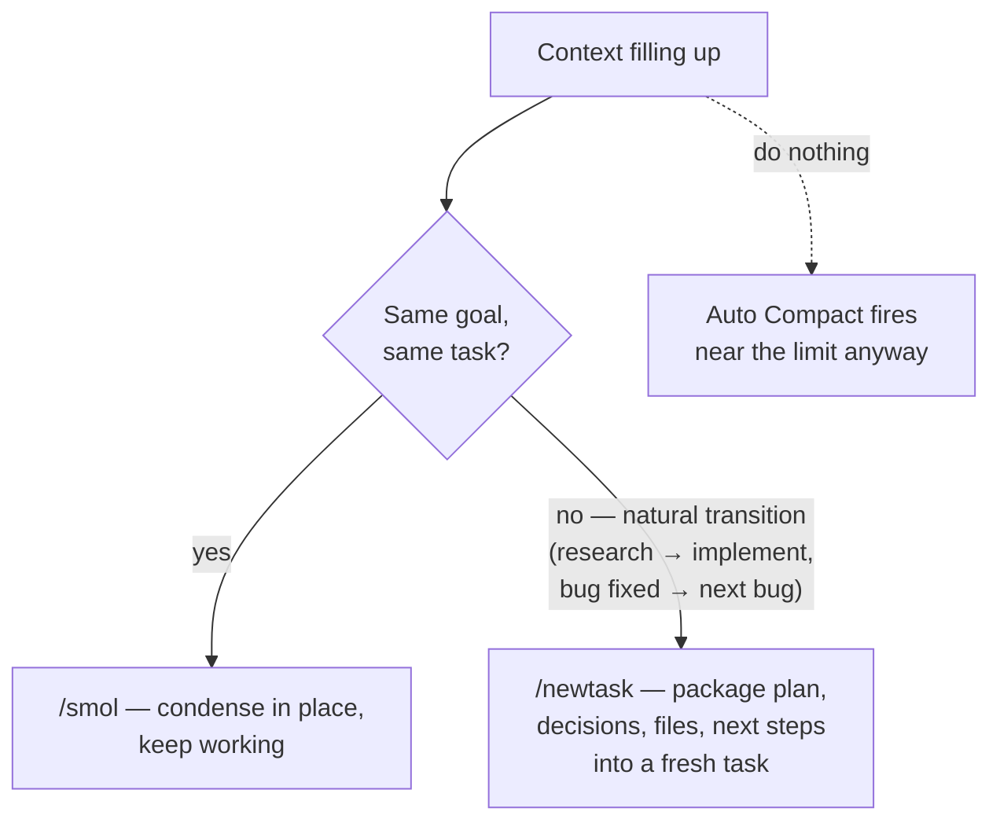

# Thiết lập Coding: Cline (Tiện ích mở rộng VS Code) (Tiếng Việt)

Đây là bản áp dụng cụ thể của [`recommended-setup.md`](recommended-setup.md)
cho **Cline** — coding agent mã nguồn mở (Apache-2.0) chạy trong VS Code.
Cline theo mô hình "tự mang nhà cung cấp" (BYO-provider): bạn dùng API key
của chính mình và trả tiền theo từng token. Nghĩa là mọi nguyên nhân tốn
token trong [`../CAUSE.md`](../CAUSE.md) đều chảy thẳng vào hóa đơn của
bạn — nhưng bù lại, gần như mọi nút chỉnh để khắc phục cũng nằm ngay
trong extension.

> Trước khi áp dụng, hãy đối chiếu lại với tài liệu và bản phát hành
> Cline mới nhất — extension này ra bản mới rất nhanh, tên tính năng có
> thể thay đổi.

---

## Tier 0 — Cline đã có sẵn những gì

Đối chiếu với checklist năng lực harness trong `recommended-setup.md`:

| Năng lực | Trạng thái trong Cline | Tài liệu chi tiết |
| --- | --- | --- |
| Prompt caching | ✅ Tự động khi nhà cung cấp hỗ trợ (Anthropic, OpenRouter, Gemini…); mỗi tác vụ hiển thị số lần đọc/ghi cache và số tiền tiết kiệm được | `prompt-caching.md` |
| Nén context | ✅ **Auto Compact** tự chạy khi gần đầy cửa sổ context; lệnh thủ công `/smol` (tên khác: `/compact`) và `/newtask`; **Focus Chain** giữ danh sách việc không bị mất sau mỗi lần tóm tắt | `compaction.md` |
| Sửa file theo diff | ✅ `replace_in_file` với khối SEARCH/REPLACE là cách sửa file mặc định | `diff-based-edits.md` |
| Giới hạn output của tool | ⚠️ Một phần — Cline đọc nguyên cả file chứ không cắt bớt; giảm thiểu bằng `.clineignore`, giao việc phạm vi hẹp, và rules (xem bên dưới) | `tool-output-budgets.md` |
| Nạp tool khi cần | ❌ Schema tool của mọi MCP server đều bị chèn vào từng request — bạn phải tự tắt bớt (xem bên dưới) | `tool-search.md` |

Như vậy phần lớn Tier 0 đã có sẵn. Việc thiết lập còn lại xoay quanh ba
chuyện: **chọn nhà cung cấp, giảm chi phí cố định của mỗi request, và
giữ kỷ luật context**.

---

## 1. Nhà cung cấp & caching — đòn bẩy lớn nhất

Ở mỗi request, Cline gửi lại toàn bộ cuộc hội thoại từ đầu. Không có
cache, trong các phiên dài bạn sẽ trả đắt hơn 5–10 lần (nguyên nhân 1.1).

| Cách kết nối | Caching | Ghi chú |
| --- | --- | --- |
| **API key Anthropic (trực tiếp)** — khuyến nghị | ✅ Tự động đặt breakpoint; đọc cache ~0.1× giá thường, ghi 1.25× | Đường đi được đo đạc tốt nhất; Cline hiển thị chỉ số cache cho từng tác vụ |
| **OpenRouter / nhà cung cấp của Cline** | ✅ Với các model hỗ trợ caching | Một key dùng được nhiều model — hợp với cách tách Plan/Act ở mục 2 |
| **API key Gemini** | ✅ Caching ngầm định | Các bản Flash rẻ mà vẫn đủ mạnh cho cả Act lẫn Plan |
| **Tương thích OpenAI / chạy local (Ollama, LM Studio)** | ⚠️ Tùy server | Nếu tự host: đặt vLLM/SGLang phía trước để có prefix caching (APC/RadixAttention) |
| OAuth tài khoản thuê bao Claude | ❌ Bị chặn từ tháng 1/2026, chỉ còn dùng được trong CLI của Anthropic | Hãy dùng API key thật |

Cách kiểm tra caching có chạy hay không: mở phần chi phí của một tác vụ
đã hoàn thành — từ vài lượt sau trở đi, số lần đọc cache phải lớn. **Nếu
đến lượt thứ 5 trở đi mà đọc cache vẫn bằng 0, có gì đó đang phá prefix
cache** — thủ phạm thường gặp nhất là file rules bị sửa giữa phiên
(nguyên nhân 1.3).

## 2. Chọn model theo chế độ Plan/Act

Cơ chế tách Plan/Act của Cline chính là bộ định tuyến model có sẵn
(`model-routing.md`): trong phần cài đặt, bạn chọn được **model riêng
cho từng chế độ**.

| Chế độ | Nên chọn (theo thang Anthropic) | Lý do |
| --- | --- | --- |
| Plan | Model mạnh nhất (tier Opus) | Khâu kiến trúc và ra quyết định là nơi model giỏi đáng đồng tiền nhất |
| Act | Model mạnh nhất, hoặc tier giữa (tier Sonnet) — thử trên tác vụ thật của bạn | Khi kế hoạch đã rõ, phần triển khai thường vẫn giữ được chất lượng dù hạ một bậc model |

Thang tương đương ở nhà cung cấp khác: GPT-5.x ↔ bản mini; Gemini 3 Pro
↔ Flash — một key OpenRouter là phủ được tất cả.

Nếu chạy model Anthropic, chỉnh thêm **thinking budget** theo từng chế
độ: cao cho Plan, thấp cho Act
([`reasoning-effort-tuning.md`](../solutions/reasoning-effort-tuning.md)).

Hai lưu ý về cache (nguyên nhân 1.3):

- **Đổi model giữa chừng tác vụ đồng nghĩa với xây lại cache từ đầu** —
  model mới phải trả nguyên giá input cho toàn bộ lịch sử. Chỉ đổi model
  ở ranh giới chuyển chế độ (đằng nào cũng phải đi qua), đừng đổi khi
  đang triển khai dở.
- Nếu được, để cả hai chế độ dùng chung một nhà cung cấp: khi model dùng
  chung, lịch sử vẫn còn "ấm" trong cache lúc chuyển từ Plan sang Act.

Với tác vụ lớn, hãy dùng **Deep Planning**: có sẵn một kế hoạch rõ ràng
ngay từ đầu giúp giai đoạn Act (phần tốn tiền nhất) ngắn hơn và ít phải
dò dẫm.

## 3. Kỷ luật context — Auto Compact, `/smol`, `/newtask`

- **Một tác vụ = một mục tiêu.** Tác vụ dài ôm nhiều mục tiêu sẽ tích
  lũy lịch sử, và cả khối lịch sử đó bị tính tiền lại ở mỗi lượt (nguyên
  nhân 2.1). Gõ `/newtask` ở điểm chuyển giai đoạn chính là mẫu "bàn
  giao bằng bản tóm tắt" trong `subagent-context-handoff.md`: thứ mang
  sang tác vụ mới là *bản tóm tắt*, không phải nguyên cả transcript.
- Chủ động gõ `/smol` khi đến một điểm dừng tự nhiên, thay vì để Auto
  Compact tự chạy giữa chừng — như vậy bạn là người chọn thời điểm cho
  lần xây lại cache (chỉ xảy ra một lần) đó.
- Với tác vụ dài, bật **Focus Chain** để danh sách việc sống sót qua các
  lần nén.
- Đừng dán nguyên log hay file dài vào chat — chỉ cần đưa đường dẫn để
  Cline tự đọc, và dùng `@file` để chỉ phần cần thiết mới đi vào context.

## 4. Cắt chi phí cố định của mỗi request

Những thứ dưới đây đi kèm **mọi request** của mọi tác vụ:

- **`.clinerules`** — giữ thật gọn: nội dung rules được nối thẳng vào
  system prompt (nguyên nhân 6.4). Các hướng dẫn theo tình huống nên
  chuyển thành tài liệu để Cline đọc khi cần, đừng biến thư mục rules
  thành wiki. Không bao giờ đặt nội dung hay thay đổi (ngày tháng, số
  ticket) vào rules — mỗi lần nó đổi là cache của cả phiên bị vô hiệu.
  Và **đừng sửa rules khi tác vụ đang chạy dở**: làm xong rồi hãy sửa,
  hoặc mở `/newtask`.
- **`.clineignore`** — loại trừ `node_modules`, thư mục build, lockfile,
  code sinh tự động, fixture. Vừa giảm chi phí liệt kê file, vừa chặn
  những cú đọc nhầm file khổng lồ.
- **MCP server** — schema tool của mọi server đang bật đều bị chèn
  nguyên vào request (nguyên nhân 3.4). Server nào hôm nay không dùng
  thì tắt đi; server nào giữ lại thì tắt bớt các tool không dùng — bật
  lại chỉ mất vài giây. Vài server để không cũng có thể âm thầm cộng
  thêm hàng nghìn token vào mỗi request.

## 5. Đo lường

- **Mức tác vụ**: header của mỗi tác vụ trong Cline hiển thị token
  vào/ra, số lần đọc/ghi cache, và chi phí. Hãy tập thói quen liếc qua
  nó — các dấu hiệu bất thường (đọc cache bằng 0, input phình dần) lộ ra
  ngay tại đó.
- **Mức đội nhóm** (yêu cầu của Tier 1.1): trỏ nhà cung cấp "tương thích
  OpenAI" trong Cline vào một **gateway LiteLLM** (MIT), cấp key riêng
  cho từng kỹ sư, rồi đẩy dữ liệu usage sang **Langfuse** (MIT) hoặc
  **Helicone** (Apache-2.0). Bạn sẽ có đủ ba cảnh báo của
  `recommended-setup.md` (tỷ lệ cache-hit sụt, usage tăng phi tuyến, chi
  phí mỗi tác vụ) trên toàn bộ usage Cline của cả đội. Lưu ý: route đi
  qua gateway vẫn phải hỗ trợ caching, nên sau khi chen proxy vào hãy
  kiểm tra lại chỉ số cache.

## 6. Add-on bên ngoài, xếp theo nguyên nhân mà chúng xử lý

Mỗi add-on dưới đây ứng với một nguyên nhân được đánh số trong
[`../CAUSE.md`](../CAUSE.md) và một tài liệu solution giải thích cơ chế.
Danh sách này cố ý chỉ nhắm vào chỗ còn trống: Cline đã tự lo được nén,
sửa theo diff, và caching (§Tier 0), nên công cụ bên thứ ba chỉ đáng
thêm ở những chỗ Cline còn thiếu.

### Output tool quá lớn — nguyên nhân 3.1, 2.1 → [`tool-output-compression.md`](../solutions/tool-output-compression.md)

Chỗ trống lớn nhất của Cline: nội dung file được đọc và output lệnh đi
thẳng vào context, không được cắt bớt.

| Công cụ | Giấy phép | Cách dùng với Cline |
| --- | --- | --- |
| RTK (`rtk-ai/rtk`) | Apache-2.0 | Nén output của hơn 100 lệnh dev đi 60–90% trước khi vào context; **có sẵn cấu hình theo dự án cho Cline**; giữ nguyên phần test fail/diff/lỗi |
| Headroom (`headroomlabs-ai/headroom`) | Apache-2.0 | Proxy local hoặc MCP server, nén kết quả tool ngay trên đường truyền (JSON 60–95%, build log ~94%); `CacheAligner` giữ cho prefix cache tiếp tục trúng; **Cline nằm trong danh sách hỗ trợ** |

### Khởi động nguội & làm quen repo — nguyên nhân 6.5, 4.2 → [`code-maps.md`](../solutions/code-maps.md)

Mỗi tác vụ Cline mới lại phải tự khám phá repo từ đầu — khoản "thuế khởi
động nguội" 25–60K token.

| Công cụ | Giấy phép | Cách dùng với Cline |
| --- | --- | --- |
| Repomix (`yamadashy/repomix`) | MIT | Đóng gói/nén repo (`--compress` = chỉ giữ chữ ký hàm) thành một file commit sẵn trong repo; đầu mỗi tác vụ đưa nó vào bằng `@file` |
| Codesight (`Houseofmvps/codesight`) | MIT | Sinh một gói context `.codesight/` cho agent đọc, thay vì quét lại repo |
| TokenSave (`aovestdipaperino/tokensave`) | Mã nguồn mở | MCP server đồ thị code chạy local — Cline truy vấn đồ thị ký hiệu dựng sẵn thay vì lặp đi lặp lại grep/read (lưu ý nguyên nhân 3.4: chính nó cũng thêm schema tool) |
| OpenMemory MCP (mem0) | Apache-2.0 | MCP server bộ nhớ chạy local, **hỗ trợ Cline chính thức** — quyết định và dữ kiện được giữ lại qua các tác vụ, giúp bàn giao `/newtask` và phiên mới bắt đầu "ấm" |

Phương án thuần Cline cho bộ nhớ: mẫu **Memory Bank** của cộng đồng (bộ
file `.clinerules` có cấu trúc do chính agent duy trì) — không cần hạ
tầng mới, nhưng nó đi kèm mọi request nên phải giữ gọn (nguyên nhân 6.4).

### Trả lời dài dòng — nguyên nhân 5.2 → [`concise-output-prompting.md`](../solutions/concise-output-prompting.md)

| Công cụ | Giấy phép | Cách dùng với Cline |
| --- | --- | --- |
| Caveman (`wilpel/caveman-compression`) | MIT | Bộ rules/skill nén phần trả lời, có hỗ trợ Cline; lược bỏ phần kể lể đưa đẩy, giữ lại code và dữ kiện — chỉ dùng cho việc nội bộ, không dùng cho văn bản người dùng sẽ đọc |

### Mức hệ thống: request trùng lặp, đo lường, định tuyến — nguyên nhân 6.6, 4.3, 6.2

| Công cụ | Giấy phép | Cách dùng với Cline |
| --- | --- | --- |
| Gateway LiteLLM + Langfuse / Helicone | MIT / Apache-2.0 | Trỏ nhà cung cấp tương thích OpenAI của Cline vào gateway → usage theo từng kỹ sư, ba cảnh báo, định tuyến thống nhất (`token-counting.md`, `model-routing.md`) |
| GPTCache (`zilliztech/GPTCache`) | MIT | Cache ở mức câu trả lời, đặt tại gateway, cho các prompt chỉ-đọc lặp lại; **tránh dùng trên các route sửa code** (`semantic-caching.md`) |

### Chi phí prompt — nguyên nhân 6.4 → [`prompt-de-scaffolding.md`](../solutions/prompt-de-scaffolding.md)

| Công cụ | Giấy phép | Cách dùng với Cline |
| --- | --- | --- |
| promptfoo | MIT | Tỉa `.clinerules` như tỉa bất kỳ prompt nào: xóa thử một khối, chạy bộ tác vụ đánh giá của bạn, nếu chất lượng không giảm thì giữ nguyên việc xóa |

### Chạy model local — nguyên nhân 1.1 → [`prompt-caching.md`](../solutions/prompt-caching.md)

| Công cụ | Giấy phép | Cách dùng với Cline |
| --- | --- | --- |
| vLLM / SGLang | Apache-2.0 | Đặt phía trước các setup kiểu Ollama/LM Studio để APC/RadixAttention tái sử dụng prefix cho phần lịch sử mà Cline gửi lại — điều một server local trần không làm được |

Bộ ba **RTK + Headroom + Caveman** được cộng đồng xem là "stack tiết
kiệm token" cho các agent VS Code: nén output lệnh ở phía đầu vào, nén
kết quả tool ở tầng API, và nén câu trả lời ở phía đầu ra; cả ba đều ghi
Cline trong danh sách hỗ trợ. Thêm **OpenMemory hoặc một file Repomix đã
commit sẵn** nữa là hai chỗ trống cấu trúc còn lại (output tool quá lớn
và khởi động nguội) đều được lấp.

Những thứ **không nên** thêm: bộ nén context kiểu LLMLingua (rủi ro sai
lệch khi nén code — `recommended-setup.md` Tier 3), một tầng nén thứ hai
(Auto Compact + `/smol` của Cline đã phủ nguyên nhân 2.1), hay một bộ
định tuyến model động (cơ chế tách Plan/Act *chính là* bộ định tuyến
của profile này rồi).

## Checklist thiết lập

1. ☐ Dùng API key của nhà cung cấp có caching (Anthropic trực tiếp hoặc
   OpenRouter); xác nhận có số lần đọc cache trong phần chi phí tác vụ
2. ☐ Cấu hình model Plan/Act theo bảng ở mục 2; chỉnh effort/thinking
   budget theo từng chế độ
3. ☐ `.clineignore` phủ hết dependency và build artifact; `.clinerules`
   gọn và không sửa khi tác vụ đang chạy
4. ☐ Tắt các MCP server hôm nay không dùng; tắt các tool thừa của những
   server còn giữ
5. ☐ Thói quen: một tác vụ = một mục tiêu, `/smol` ở điểm dừng,
   `/newtask` ở điểm chuyển giai đoạn, bật Focus Chain
6. ☐ (Cấp đội) Gateway LiteLLM + Langfuse với ba cảnh báo
7. ☐ Chỉ thêm add-on khi số liệu cho thấy cần: RTK/Headroom cho output
   tool quá lớn, Repomix hoặc OpenMemory MCP cho khởi động nguội,
   Caveman cho các luồng nội bộ dài dòng

## Tác động dự kiến

| Thay đổi | Hiệu quả điển hình |
| --- | --- |
| Nhà cung cấp có caching (so với không có) | Lượng input phải trả tiền giảm 5–10× trong phiên dài |
| Tách model Plan/Act | Giá bình quân mỗi token giảm 2–4× với công việc nặng phần Act |
| Tỉa MCP + rules gọn | Bớt hàng nghìn token trên *mọi* request |
| Kỷ luật `/smol`–`/newtask` | Chi phí phiên từ tăng theo bậc hai → có chặn trên; ít gặp tác vụ quá dài làm giảm chất lượng |
| `.clineignore` | Chặn hẳn nhóm đột biến chi phí do đọc nhầm file khổng lồ |

# Coding Setup: Cline (VS Code Extension)

A concrete instantiation of [`recommended-setup.md`](recommended-setup.md)
for **Cline** — the open-source (Apache-2.0) VS Code coding agent. Cline is
BYO-provider and bills per token through your own API keys, so every cause
in [`../CAUSE.md`](../CAUSE.md) lands directly on your invoice — and almost
every dial to fix it is exposed in the extension.

> Verify against current Cline docs/releases before rollout — the
> extension ships fast and feature names move.

---

## Tier 0 — what Cline gives you natively

Checked against the harness-capability checklist in `recommended-setup.md`:

| Capability | Cline status | Catalog doc |
| --- | --- | --- |
| Prompt caching | ✅ Automatic on supporting providers (Anthropic, OpenRouter, Gemini…); cache reads/writes and savings shown per task | `prompt-caching.md` |
| Compaction | ✅ **Auto Compact** near the window limit + manual `/smol` (alias `/compact`) and `/newtask`; **Focus Chain** keeps the todo list alive across summarizations | `compaction.md` |
| Diff-based edits | ✅ `replace_in_file` SEARCH/REPLACE blocks as the default edit path | `diff-based-edits.md` |
| Budgeted tools | ⚠️ Partial — file reads are not sliced by default; mitigate with `.clineignore`, tight task scoping, and rules (below) | `tool-output-budgets.md` |
| Deferred tool loading | ❌ MCP schemas are injected into every request — you must trim manually (below) | `tool-search.md` |

So Tier 0 is mostly inherited; your setup work concentrates on **provider
choice, the fixed prompt overhead, and context discipline**.

---

## 1. Provider & caching setup (the single biggest lever)

Cline re-sends the full conversation every request — without cache-resident
history you pay 5–10× more in long sessions (cause 1.1).

| Route | Caching | Notes |
| --- | --- | --- |
| **Anthropic API key (direct)** — recommended | ✅ Automatic breakpoints; reads ~0.1×, writes 1.25× | Best-instrumented path; Cline surfaces cache metrics per task |
| **OpenRouter / Cline provider** | ✅ For caching-capable models | One key, many models — pairs well with the Plan/Act split below |
| **Gemini API key** | ✅ Implicit caching | Flash tiers are strong cheap Act/Plan options |
| **OpenAI-compatible / local (Ollama, LM Studio)** | ⚠️ Depends on server | Self-hosted: front with vLLM/SGLang so APC/RadixAttention gives you prefix reuse |
| Claude subscription OAuth | ❌ Blocked since Jan 2026 outside Anthropic's own CLI | Use a real API key |

Verify it's working: open any completed task's cost breakdown — steady-state
turns should show large cache-read counts. **Zero cache reads on turn 5+ of
a session means something is invalidating the prefix** (usually an edited
rules file mid-session — cause 1.3).

## 2. Model & effort map via Plan/Act

Cline's Plan/Act split is its native routing mechanism
(`model-routing.md`): configure a **separate model per mode** in settings.

| Mode | Pick (Anthropic ladder) | Rationale |
| --- | --- | --- |
| Plan | Frontier (Opus-tier) | Architecture/decisions is where capability pays |
| Act | Frontier or strong-mid (Sonnet-tier); sweep on your tasks | Well-planned implementation often holds quality one tier down |

Equivalent ladders: GPT-5.x ↔ mini; Gemini 3 Pro ↔ Flash — one key via
OpenRouter covers all of them.

On Anthropic models, also dial the **thinking budget** per mode — high for
Plan, low for Act
([`reasoning-effort-tuning.md`](../solutions/reasoning-effort-tuning.md)).

Two cache caveats (cause 1.3):

- **Switching models mid-task rebuilds the cache** — the new model re-pays
  the whole history at full input price. Switch at mode boundaries you'd
  cross anyway, not mid-implementation.
- Keep both modes within one provider where possible so the history stays
  cache-warm across the Plan→Act transition when the model is shared.

Use **Deep Planning** for big tasks: front-loading a clean plan makes the
(expensive) Act phase shorter and less exploratory.

## 3. Context discipline — Auto Compact, `/smol`, `/newtask`

- **One task = one goal.** Long multi-goal tasks accumulate history that
  every turn re-bills (cause 2.1). `/newtask` at transitions is the
  briefing-handoff pattern from `subagent-context-handoff.md` — carried
  state is the *summary*, not the transcript.
- Prefer an explicit `/smol` at a natural pause over waiting for Auto
  Compact mid-flow — you choose the moment the (one-time) cache rebuild
  happens.
- Keep **Focus Chain** on for long tasks so the todo list survives
  compaction.
- Don't paste huge logs/files into chat — reference paths and let Cline
  read; mention files with `@file` so only what's needed enters context.

## 4. Trim the fixed per-request overhead

Everything below rides in **every single request** of every task:

- **`.clinerules`** — keep it lean (it's a system-prompt extension, cause
  6.4). Move situational playbooks into docs Cline reads on demand; don't
  let the rules folder become a wiki. Never put volatile content
  (dates, ticket numbers) in rules — that's a session-wide cache
  invalidator; and **don't edit rules mid-task** (finish, edit, `/newtask`).
- **`.clineignore`** — exclude `node_modules`, build output, lockfiles,
  generated code, fixtures. Cuts both file-listing overhead and accidental
  giant reads.
- **MCP servers** — every connected server's tool schemas are injected
  wholesale (cause 3.4). Disable servers you're not using *today* and
  toggle off unused tools of the ones you keep; re-enable takes seconds.
  A few idle servers can quietly add thousands of tokens per request.

## 5. Telemetry

- **Per-task**: Cline's task header shows tokens (in/out), cache
  reads/writes, and cost — make checking it a habit; anomalies (zero cache
  reads, ballooning input) are visible right there.
- **Team/fleet level** (the Tier 1.1 requirement): point Cline's
  OpenAI-compatible provider at a **LiteLLM gateway** (MIT) with keys per
  engineer, and ship usage to **Langfuse** (MIT) / **Helicone**
  (Apache-2.0). You get the three alerts from `recommended-setup.md`
  (cache-hit drop, super-linear growth, cost per task) across everyone's
  Cline usage — the caveat is that gateway routes must still be
  caching-capable, so validate cache metrics after inserting the proxy.

## 6. Agent-agnostic add-ons, by the cause they attack

Each add-on below maps to a numbered cause in [`../CAUSE.md`](../CAUSE.md)
and a solution doc that explains the mechanism. The list is deliberately
gap-shaped: Cline already covers compaction, diff edits, and caching
natively (§Tier 0), so third-party tools are only worth adding where Cline
has a gap.

### Tool-output bloat — causes 3.1, 2.1 → [`tool-output-compression.md`](../solutions/tool-output-compression.md)

Cline's biggest native gap: file reads and command output enter context
unsliced.

| Tool | License | How it plugs into Cline |
| --- | --- | --- |
| RTK (`rtk-ai/rtk`) | Apache-2.0 | Compresses 100+ dev commands' output 60–90% before it hits context; **native Cline project-scoped config**; preserves test failures/diffs/errors |
| Headroom (`headroomlabs-ai/headroom`) | Apache-2.0 | Local proxy or MCP server compressing tool results in-flight (JSON 60–95%, build logs ~94%); `CacheAligner` keeps the prefix cache hitting; **Cline in its support matrix** |

### Cold starts & repo orientation — causes 6.5, 4.2 → [`code-maps.md`](../solutions/code-maps.md)

Every new Cline task re-explores the repo (the 25–60K-token cold-start tax).

| Tool | License | How it plugs into Cline |
| --- | --- | --- |
| Repomix (`yamadashy/repomix`) | MIT | Pack/compress the repo (`--compress` = signatures only) into a checked-in file; reference it with `@file` at task start |
| Codesight (`Houseofmvps/codesight`) | MIT | Generates a `.codesight/` context pack agents read instead of re-scanning |
| TokenSave (`aovestdipaperino/tokensave`) | OSS | Local MCP code-graph server — Cline queries the pre-built symbol graph instead of grep/read loops (mind cause 3.4: it adds tool schemas) |
| OpenMemory MCP (mem0) | Apache-2.0 | Local-first memory MCP server, **Cline officially supported** — decisions/facts persist across tasks so `/newtask` handoffs and new sessions start warm |

Cline-native alternative for memory: the community **Memory Bank** pattern
(structured `.clinerules` files the agent maintains) — zero new
infrastructure, but it rides in every request, so keep it lean (cause 6.4).

### Output verbosity — cause 5.2 → [`concise-output-prompting.md`](../solutions/concise-output-prompting.md)

| Tool | License | How it plugs into Cline |
| --- | --- | --- |
| Caveman (`wilpel/caveman-compression`) | MIT | Output-compression rules/skill, Cline supported; strips narration/filler while keeping code and facts — internal work only, not user-facing prose |

### Fleet-level: duplicates, telemetry, routing — causes 6.6, 4.3, 6.2

| Tool | License | How it plugs into Cline |
| --- | --- | --- |
| LiteLLM gateway + Langfuse / Helicone | MIT / Apache-2.0 | Point Cline's OpenAI-compatible provider at the gateway → per-engineer usage, the three alerts, uniform routing (`token-counting.md`, `model-routing.md`) |
| GPTCache (`zilliztech/GPTCache`) | MIT | Response-level cache at the gateway for repetitive read-only prompts; **keep off coding-edit routes** (`semantic-caching.md`) |

### Prompt overhead — cause 6.4 → [`prompt-de-scaffolding.md`](../solutions/prompt-de-scaffolding.md)

| Tool | License | How it plugs into Cline |
| --- | --- | --- |
| promptfoo | MIT | Ablate `.clinerules` blocks like any prompt: delete a block, run your eval tasks, keep the deletion if quality holds |

### Local-model serving — cause 1.1 → [`prompt-caching.md`](../solutions/prompt-caching.md)

| Tool | License | How it plugs into Cline |
| --- | --- | --- |
| vLLM / SGLang | Apache-2.0 | Front Ollama/LM Studio-style setups with APC/RadixAttention so Cline's re-sent history gets prefix reuse a bare local server won't give |

The **RTK + Headroom + Caveman** trio is the community's "token-saving
stack" for VS Code agents — input-side CLI compression, API-layer
tool-result compression, and output-side response compression respectively;
all three list Cline as supported. Add **OpenMemory or a checked-in
Repomix map** on top and the two remaining structural gaps (tool-output
bloat and cold starts) are both covered.

What you should **not** add: LLMLingua-style context compressors (fidelity
risk on code — `recommended-setup.md` Tier 3), a second compaction layer
(Cline's Auto Compact + `/smol` already covers cause 2.1), or a dynamic
model router (the Plan/Act split *is* the router for this profile).

## Setup checklist

1. ☐ API-key provider with caching (Anthropic direct or OpenRouter); confirm
   cache reads in the task cost breakdown
2. ☐ Plan/Act models configured per the map; effort/thinking dialed per mode
3. ☐ `.clineignore` covering deps/build artifacts; `.clinerules` lean and
   frozen mid-task
4. ☐ MCP servers pruned to today's set; unused tools toggled off
5. ☐ Habits: one task = one goal, `/smol` at pauses, `/newtask` at
   transitions, Focus Chain on
6. ☐ (Team) LiteLLM gateway + Langfuse with the three alerts
7. ☐ Gap add-ons where telemetry justifies them: RTK/Headroom for tool-output
   bloat, Repomix map or OpenMemory MCP for cold starts, Caveman for verbose
   internal routes

## Expected impact

| Change | Typical effect |
| --- | --- |
| Caching-capable provider (vs none) | 5–10× effective input reduction in long sessions |
| Plan/Act model split | 2–4× off blended per-token price on Act-heavy work |
| MCP pruning + lean rules | Thousands of tokens off *every* request |
| `/smol`–`/newtask` discipline | Quadratic → bounded session cost; fewer quality-degrading overlong tasks |
| `.clineignore` | Removes the accidental-giant-read class of spikes |
