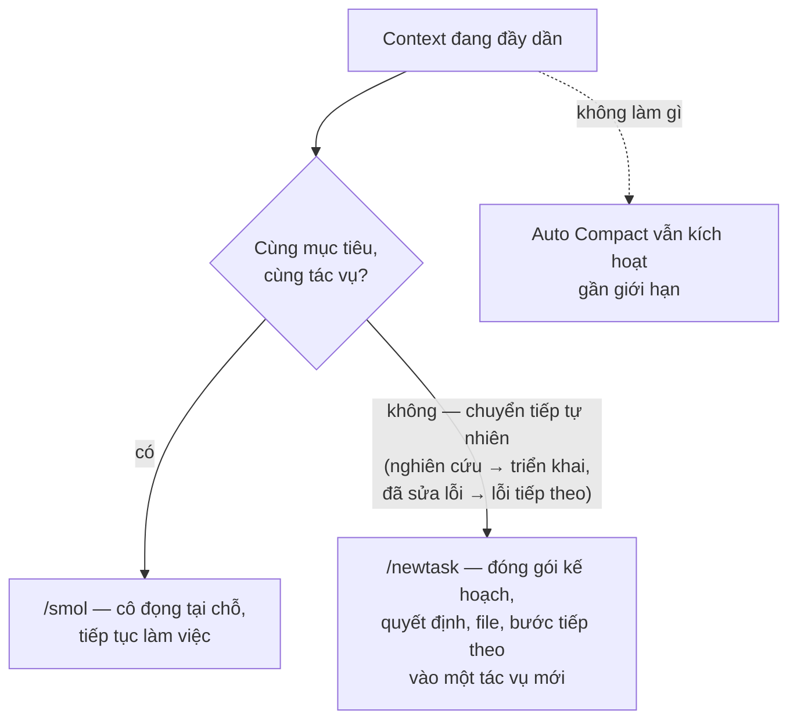
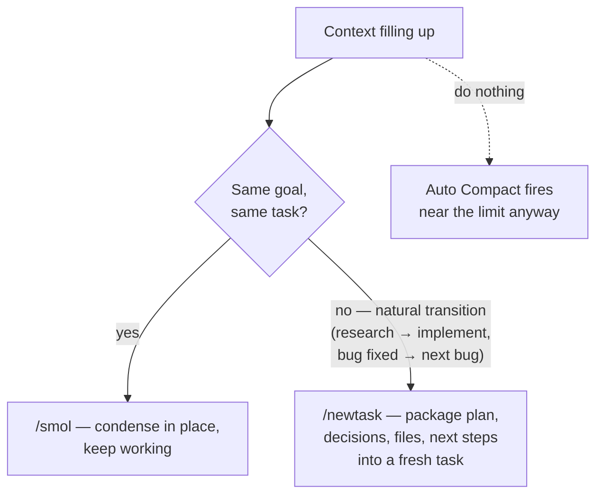

# Thiết lập Coding: Cline (Tiện ích mở rộng VS Code) (Tiếng Việt)

Một cách hiện thực hóa cụ thể của
[`recommended-setup.md`](recommended-setup.md) cho **Cline** — coding agent
mã nguồn mở (Apache-2.0) cho VS Code. Cline dùng nhà cung cấp do bạn tự mang
(BYO-provider) và tính phí theo token qua chính API key của bạn. Vì vậy, mọi
nguyên nhân trong [`../CAUSE.md`](../CAUSE.md) đều đổ trực tiếp vào hóa đơn
của bạn — nhưng bù lại, hầu như mọi nút điều chỉnh để sửa nó cũng có sẵn
trong tiện ích mở rộng.

> Xác minh lại với tài liệu/bản phát hành Cline hiện tại trước khi triển
> khai — tiện ích mở rộng ra bản nhanh và tên tính năng có thể thay đổi.

---

## Tier 0 — những gì Cline cung cấp sẵn có

Đối chiếu với checklist năng lực harness trong `recommended-setup.md`:

| Năng lực | Trạng thái Cline | Tài liệu trong danh mục |
| --- | --- | --- |
| Caching prompt | ✅ Tự động trên các nhà cung cấp hỗ trợ (Anthropic, OpenRouter, Gemini…); số lần đọc/ghi cache và mức tiết kiệm hiển thị theo từng tác vụ | `prompt-caching.md` |
| Nén | ✅ **Auto Compact** gần giới hạn cửa sổ + `/smol` (bí danh `/compact`) thủ công và `/newtask`; **Focus Chain** giữ danh sách việc cần làm sống sót qua các lần tóm tắt | `compaction.md` |
| Chỉnh sửa dựa trên diff | ✅ Khối SEARCH/REPLACE của `replace_in_file` là đường chỉnh sửa mặc định | `diff-based-edits.md` |
| Tool có ngân sách | ⚠️ Một phần — đọc file không được cắt lát theo mặc định; giảm thiểu bằng `.clineignore`, giới hạn phạm vi tác vụ chặt, và rules (bên dưới) | `tool-output-budgets.md` |
| Tải tool trì hoãn | ❌ Schema MCP được chèn vào mọi request — bạn phải tự cắt gọt thủ công (bên dưới) | `tool-search.md` |

Vì vậy Tier 0 phần lớn được kế thừa; công việc thiết lập của bạn tập
trung vào **lựa chọn nhà cung cấp, chi phí prompt cố định, và kỷ luật context**.

---

## 1. Thiết lập nhà cung cấp & caching (đòn bẩy lớn nhất)

Cline gửi lại toàn bộ cuộc hội thoại trên mỗi request — không có lịch sử
thường trú trong cache, bạn trả nhiều hơn 5–10× trong các phiên dài
(nguyên nhân 1.1).

| Tuyến | Caching | Ghi chú |
| --- | --- | --- |
| **API key Anthropic (trực tiếp)** — khuyến nghị | ✅ Breakpoint tự động; đọc ~0.1×, ghi 1.25× | Tuyến được đo lường tốt nhất; Cline hiển thị chỉ số cache theo từng tác vụ |
| **OpenRouter / nhà cung cấp Cline** | ✅ Cho các model hỗ trợ caching | Một key, nhiều model — kết hợp tốt với việc tách Plan/Act bên dưới |
| **API key Gemini** | ✅ Caching ngầm định | Các tier Flash là lựa chọn Act/Plan rẻ, mạnh |
| **Tương thích OpenAI / local (Ollama, LM Studio)** | ⚠️ Tùy server | Tự host: đặt vLLM/SGLang phía trước để APC/RadixAttention cho bạn tái sử dụng prefix |
| OAuth thuê bao Claude | ❌ Bị chặn từ tháng 1/2026 ngoài CLI riêng của Anthropic | Dùng một API key thực sự |

Xác minh nó hoạt động: mở phân tích chi phí của bất kỳ tác vụ đã hoàn
thành nào — các lượt ở trạng thái ổn định nên hiển thị số lần đọc cache
lớn. **Số lần đọc cache bằng 0 ở lượt 5+ của một phiên nghĩa là có gì đó
đang vô hiệu hóa prefix** (thường là một file rules bị chỉnh sửa giữa
phiên — nguyên nhân 1.3).

## 2. Bản đồ Model & effort qua Plan/Act

Việc tách Plan/Act của Cline là cơ chế định tuyến có sẵn của nó
(`model-routing.md`): cấu hình một **model riêng cho mỗi chế độ** trong
cài đặt.

| Chế độ | Chọn (bậc thang Anthropic) | Lý do |
| --- | --- | --- |
| Plan | Frontier (tier Opus) | Kiến trúc/quyết định là nơi năng lực đáng giá |
| Act | Frontier hoặc mid mạnh (tier Sonnet); quét trên tác vụ của bạn | Triển khai đã được lên kế hoạch tốt thường giữ chất lượng ở một tier thấp hơn |

Các bậc thang tương đương: GPT-5.x ↔ mini; Gemini 3 Pro ↔ Flash — một key
qua OpenRouter bao phủ tất cả.

Hai lưu ý về cache (nguyên nhân 1.3):

- **Đổi model giữa tác vụ sẽ làm mới cache** — model mới trả giá lại toàn
  bộ lịch sử ở giá input đầy đủ. Đổi tại ranh giới chế độ mà bạn sẽ vượt
  qua dù sao đi nữa, không phải giữa lúc triển khai.
- Giữ cả hai chế độ trong một nhà cung cấp khi có thể để lịch sử vẫn ấm
  trong cache qua quá trình chuyển Plan→Act khi model được chia sẻ.

Dùng **Deep Planning** cho các tác vụ lớn: nạp trước một kế hoạch sạch làm
cho giai đoạn Act (đắt đỏ) ngắn hơn và ít khám phá hơn.

## 3. Kỷ luật context — Auto Compact, `/smol`, `/newtask`

- **Một tác vụ = một mục tiêu.** Các tác vụ dài, nhiều mục tiêu tích lũy
  lịch sử mà mỗi lượt đều tính phí lại (nguyên nhân 2.1). `/newtask` tại
  các điểm chuyển tiếp là mẫu hình bàn giao-tóm-tắt từ
  `subagent-context-handoff.md` — trạng thái mang theo là *tóm tắt*,
  không phải transcript.
- Ưu tiên `/smol` tường minh tại một điểm dừng tự nhiên hơn là chờ Auto
  Compact giữa luồng — bạn chọn thời điểm việc làm mới cache (một lần)
  xảy ra.
- Giữ **Focus Chain** bật cho các tác vụ dài để danh sách việc cần làm
  sống sót qua nén.
- Đừng dán log/file khổng lồ vào chat — tham chiếu đường dẫn và để Cline
  đọc; nhắc đến file bằng `@file` để chỉ những gì cần thiết vào context.

## 4. Cắt gọt chi phí cố định mỗi request

Mọi thứ dưới đây đi theo **mỗi request đơn lẻ** của mọi tác vụ:

- **`.clinerules`** — giữ nó gọn nhẹ (nó là một phần mở rộng system
  prompt, nguyên nhân 6.4). Chuyển các playbook theo tình huống vào tài
  liệu Cline đọc theo yêu cầu; đừng để thư mục rules trở thành một wiki.
  Không bao giờ đặt nội dung dễ thay đổi (ngày tháng, số ticket) trong
  rules — đó là một yếu tố vô hiệu hóa cache toàn phiên. Và **đừng chỉnh
  sửa rules giữa tác vụ** — hãy hoàn thành tác vụ, rồi mới chỉnh sửa, hoặc
  dùng `/newtask`.
- **`.clineignore`** — loại trừ `node_modules`, output build, lockfile,
  code sinh ra, fixture. Cắt giảm cả chi phí liệt kê file lẫn các lần đọc
  khổng lồ vô tình.
- **MCP server** — schema tool của mọi server đã kết nối đều bị chèn vào
  trọn gói (nguyên nhân 3.4). Tắt các server bạn không dùng *hôm nay* và
  tắt các tool không dùng của những cái bạn giữ lại; bật lại chỉ tốn vài
  giây. Vài server rảnh rỗi có thể âm thầm thêm hàng nghìn token mỗi
  request.

## 5. Đo lường

- **Theo từng tác vụ**: tiêu đề tác vụ của Cline hiển thị token
  (vào/ra), số lần đọc/ghi cache, và chi phí — hãy biến việc kiểm tra nó
  thành thói quen; các bất thường (đọc cache bằng 0, input phình to) hiển
  thị ngay tại đó.
- **Cấp đội/hệ thống** (yêu cầu Tier 1.1): trỏ nhà cung cấp tương thích
  OpenAI của Cline vào một **gateway LiteLLM** (MIT) với key theo từng kỹ
  sư, và gửi usage tới **Langfuse** (MIT) / **Helicone** (Apache-2.0). Bạn
  nhận được ba cảnh báo từ `recommended-setup.md` (sụt cache-hit, tăng
  trưởng siêu tuyến tính, chi phí mỗi tác vụ) trên toàn bộ usage Cline của
  mọi người — lưu ý là các route gateway vẫn phải hỗ trợ caching, nên hãy
  kiểm chứng chỉ số cache sau khi chèn proxy.

## 6. Các add-on không phụ thuộc agent, theo nguyên nhân chúng tấn công

Mỗi add-on dưới đây ánh xạ tới một nguyên nhân được đánh số trong
[`../CAUSE.md`](../CAUSE.md) và một tài liệu giải pháp giải thích cơ chế.
Danh sách này cố tình có hình dạng-theo-khoảng-trống: Cline đã bao phủ
nén, chỉnh sửa diff, và caching có sẵn (§Tier 0), nên công cụ bên thứ ba
chỉ đáng thêm vào ở nơi Cline có khoảng trống.

### Phình to output tool — nguyên nhân 3.1, 2.1 → [`tool-output-compression.md`](tool-output-compression.md)

Khoảng trống có sẵn lớn nhất của Cline: đọc file và output lệnh vào context không được cắt lát.

| Công cụ | Giấy phép | Cách nó lắp vào Cline |
| --- | --- | --- |
| RTK (`rtk-ai/rtk`) | Apache-2.0 | Nén output của 100+ lệnh dev 60–90% trước khi vào context; **cấu hình dự án Cline có sẵn**; giữ nguyên thất bại test/diff/lỗi |
| Headroom (`headroomlabs-ai/headroom`) | Apache-2.0 | Proxy local hoặc MCP server nén kết quả tool khi đang truyền (JSON 60–95%, build log ~94%); `CacheAligner` giữ cache prefix tiếp tục hit; **Cline có trong ma trận hỗ trợ của nó** |

### Cold-start & định hướng repo — nguyên nhân 6.5, 4.2 → [`code-maps.md`](code-maps.md)

Mỗi tác vụ Cline mới đều khám phá lại repo (chi phí cold-start
25–60K token).

| Công cụ | Giấy phép | Cách nó lắp vào Cline |
| --- | --- | --- |
| Repomix (`yamadashy/repomix`) | MIT | Đóng gói/nén repo (`--compress` = chỉ chữ ký) vào một file đã check-in; tham chiếu nó bằng `@file` khi bắt đầu tác vụ |
| Codesight (`Houseofmvps/codesight`) | MIT | Sinh một gói context `.codesight/` agent đọc thay vì quét lại |
| TokenSave (`aovestdipaperino/tokensave`) | Mã nguồn mở | Server đồ thị code MCP cục bộ — Cline truy vấn đồ thị ký hiệu đã dựng sẵn thay vì các vòng lặp grep/read (lưu ý nguyên nhân 3.4: nó thêm schema tool) |
| OpenMemory MCP (mem0) | Apache-2.0 | Server bộ nhớ MCP local-first, **Cline được hỗ trợ chính thức** — quyết định/sự kiện tồn tại lâu qua các tác vụ để bàn giao `/newtask` và các phiên mới bắt đầu ấm |

Lựa chọn thay thế có sẵn của Cline cho bộ nhớ: mẫu hình cộng đồng
**Memory Bank** (các file `.clinerules` có cấu trúc mà agent duy trì) —
không hạ tầng mới, nhưng nó đi theo mọi request, nên hãy giữ nó gọn nhẹ
(nguyên nhân 6.4).

### Dài dòng output — nguyên nhân 5.2 → [`concise-output-prompting.md`](concise-output-prompting.md)

| Công cụ | Giấy phép | Cách nó lắp vào Cline |
| --- | --- | --- |
| Caveman (`wilpel/caveman-compression`) | MIT | Rules/skill nén output, Cline được hỗ trợ; loại bỏ tường thuật/từ đệm trong khi giữ code và sự kiện — chỉ dùng cho công việc nội bộ, không phải văn xuôi hướng người dùng |

### Cấp hệ thống: trùng lặp, đo lường, định tuyến — nguyên nhân 6.6, 4.3, 6.2

| Công cụ | Giấy phép | Cách nó lắp vào Cline |
| --- | --- | --- |
| Gateway LiteLLM + Langfuse / Helicone | MIT / Apache-2.0 | Trỏ nhà cung cấp tương thích OpenAI của Cline vào gateway → usage theo từng kỹ sư, ba cảnh báo, định tuyến thống nhất (`token-counting.md`, `model-routing.md`) |
| GPTCache (`zilliztech/GPTCache`) | MIT | Cache cấp phản hồi tại gateway cho các prompt chỉ-đọc lặp lại; **tránh xa các route chỉnh sửa code** (`semantic-caching.md`) |

### Chi phí prompt — nguyên nhân 6.4 → [`prompt-de-scaffolding.md`](prompt-de-scaffolding.md)

| Công cụ | Giấy phép | Cách nó lắp vào Cline |
| --- | --- | --- |
| promptfoo | MIT | Loại bỏ các khối `.clinerules` như bất kỳ prompt nào: xóa một khối, chạy các tác vụ đánh giá của bạn, giữ việc xóa nếu chất lượng vẫn vững |

### Phục vụ model local — nguyên nhân 1.1 → [`prompt-caching.md`](prompt-caching.md)

| Công cụ | Giấy phép | Cách nó lắp vào Cline |
| --- | --- | --- |
| vLLM / SGLang | Apache-2.0 | Đặt trước các thiết lập kiểu Ollama/LM Studio với APC/RadixAttention để lịch sử gửi lại của Cline được tái sử dụng prefix mà một server local trần sẽ không cho bạn |

Bộ ba **RTK + Headroom + Caveman** là "bộ công cụ tiết kiệm token" của
cộng đồng cho các agent VS Code — lần lượt là nén CLI phía input, nén kết
quả tool ở cấp API, và nén phản hồi phía output; cả ba đều liệt kê Cline là
được hỗ trợ. Thêm **OpenMemory hoặc một bản đồ Repomix đã check-in** vào bộ
này, và hai khoảng trống cấu trúc còn lại (phình to output tool và
cold-start) sẽ đều được lấp đầy.

Những gì bạn **không nên** thêm: các trình nén context kiểu LLMLingua
(rủi ro độ trung thực trên code — `recommended-setup.md` Tier 3), một lớp
nén thứ hai (Auto Compact + `/smol` của Cline đã bao phủ nguyên nhân
2.1), hoặc một router model động (việc tách Plan/Act *chính là* router
cho profile này).

## Checklist thiết lập

1. ☐ Nhà cung cấp API key có caching (Anthropic trực tiếp hoặc
   OpenRouter); xác nhận số lần đọc cache trong phân tích chi phí tác vụ
2. ☐ Model Plan/Act được cấu hình theo bản đồ; effort/thinking được chỉnh
   theo từng chế độ
3. ☐ `.clineignore` bao phủ dependency/build artifact; `.clinerules` gọn
   nhẹ và cố định giữa tác vụ
4. ☐ MCP server đã cắt gọt về tập hiện tại; các tool không dùng đã tắt
5. ☐ Thói quen: một tác vụ = một mục tiêu, `/smol` tại các điểm dừng,
   `/newtask` tại các điểm chuyển tiếp, Focus Chain bật
6. ☐ (Đội) Gateway LiteLLM + Langfuse với ba cảnh báo
7. ☐ Add-on lấp khoảng trống nơi đo lường biện minh được: RTK/Headroom
   cho phình to output tool, bản đồ Repomix hoặc OpenMemory MCP cho cold-start, Caveman cho các route nội bộ dài dòng

## Tác động dự kiến

| Thay đổi | Hiệu ứng điển hình |
| --- | --- |
| Nhà cung cấp hỗ trợ caching (so với không có) | Giảm 5–10× input hiệu dụng trong các phiên dài |
| Tách model Plan/Act | Giảm 2–4× giá pha trộn mỗi token trên công việc nặng về Act |
| Cắt gọt MCP + rules gọn nhẹ | Giảm hàng nghìn token trên *mọi* request |
| Kỷ luật `/smol`–`/newtask` | Chi phí phiên từ bậc hai → có giới hạn; ít tác vụ quá dài làm giảm chất lượng hơn |
| `.clineignore` | Loại bỏ lớp tăng vọt do đọc khổng lồ vô tình |

---

# Coding Setup: Cline (VS Code Extension)

A concrete instantiation of [`recommended-setup.md`](recommended-setup.md)
for **Cline** — the open-source (Apache-2.0) VS Code coding agent. Cline is
BYO-provider and bills per token through your own API keys, so every cause
in [`../CAUSE.md`](../CAUSE.md) lands directly on your invoice — and almost
every dial to fix it is exposed in the extension.

> Verify against current Cline docs/releases before rollout — the
> extension ships fast and feature names move.

---

## Tier 0 — what Cline gives you natively

Checked against the harness-capability checklist in `recommended-setup.md`:

| Capability | Cline status | Catalog doc |
| --- | --- | --- |
| Prompt caching | ✅ Automatic on supporting providers (Anthropic, OpenRouter, Gemini…); cache reads/writes and savings shown per task | `prompt-caching.md` |
| Compaction | ✅ **Auto Compact** near the window limit + manual `/smol` (alias `/compact`) and `/newtask`; **Focus Chain** keeps the todo list alive across summarizations | `compaction.md` |
| Diff-based edits | ✅ `replace_in_file` SEARCH/REPLACE blocks as the default edit path | `diff-based-edits.md` |
| Budgeted tools | ⚠️ Partial — file reads are not sliced by default; mitigate with `.clineignore`, tight task scoping, and rules (below) | `tool-output-budgets.md` |
| Deferred tool loading | ❌ MCP schemas are injected into every request — you must trim manually (below) | `tool-search.md` |

So Tier 0 is mostly inherited; your setup work concentrates on **provider
choice, the fixed prompt overhead, and context discipline**.

---

## 1. Provider & caching setup (the single biggest lever)

Cline re-sends the full conversation every request — without cache-resident
history you pay 5–10× more in long sessions (cause 1.1).

| Route | Caching | Notes |
| --- | --- | --- |
| **Anthropic API key (direct)** — recommended | ✅ Automatic breakpoints; reads ~0.1×, writes 1.25× | Best-instrumented path; Cline surfaces cache metrics per task |
| **OpenRouter / Cline provider** | ✅ For caching-capable models | One key, many models — pairs well with the Plan/Act split below |
| **Gemini API key** | ✅ Implicit caching | Flash tiers are strong cheap Act/Plan options |
| **OpenAI-compatible / local (Ollama, LM Studio)** | ⚠️ Depends on server | Self-hosted: front with vLLM/SGLang so APC/RadixAttention gives you prefix reuse |
| Claude subscription OAuth | ❌ Blocked since Jan 2026 outside Anthropic's own CLI | Use a real API key |

Verify it's working: open any completed task's cost breakdown — steady-state
turns should show large cache-read counts. **Zero cache reads on turn 5+ of
a session means something is invalidating the prefix** (usually an edited
rules file mid-session — cause 1.3).

## 2. Model & effort map via Plan/Act

Cline's Plan/Act split is its native routing mechanism
(`model-routing.md`): configure a **separate model per mode** in settings.

| Mode | Pick (Anthropic ladder) | Rationale |
| --- | --- | --- |
| Plan | Frontier (Opus-tier) | Architecture/decisions is where capability pays |
| Act | Frontier or strong-mid (Sonnet-tier); sweep on your tasks | Well-planned implementation often holds quality one tier down |

Equivalent ladders: GPT-5.x ↔ mini; Gemini 3 Pro ↔ Flash — one key via
OpenRouter covers all of them.

Two cache caveats (cause 1.3):

- **Switching models mid-task rebuilds the cache** — the new model re-pays
  the whole history at full input price. Switch at mode boundaries you'd
  cross anyway, not mid-implementation.
- Keep both modes within one provider where possible so the history stays
  cache-warm across the Plan→Act transition when the model is shared.

Use **Deep Planning** for big tasks: front-loading a clean plan makes the
(expensive) Act phase shorter and less exploratory.

## 3. Context discipline — Auto Compact, `/smol`, `/newtask`

- **One task = one goal.** Long multi-goal tasks accumulate history that
  every turn re-bills (cause 2.1). `/newtask` at transitions is the
  briefing-handoff pattern from `subagent-context-handoff.md` — carried
  state is the *summary*, not the transcript.
- Prefer an explicit `/smol` at a natural pause over waiting for Auto
  Compact mid-flow — you choose the moment the (one-time) cache rebuild
  happens.
- Keep **Focus Chain** on for long tasks so the todo list survives
  compaction.
- Don't paste huge logs/files into chat — reference paths and let Cline
  read; mention files with `@file` so only what's needed enters context.

## 4. Trim the fixed per-request overhead

Everything below rides in **every single request** of every task:

- **`.clinerules`** — keep it lean (it's a system-prompt extension, cause
  6.4). Move situational playbooks into docs Cline reads on demand; don't
  let the rules folder become a wiki. Never put volatile content
  (dates, ticket numbers) in rules — that's a session-wide cache
  invalidator; and **don't edit rules mid-task** (finish, edit, `/newtask`).
- **`.clineignore`** — exclude `node_modules`, build output, lockfiles,
  generated code, fixtures. Cuts both file-listing overhead and accidental
  giant reads.
- **MCP servers** — every connected server's tool schemas are injected
  wholesale (cause 3.4). Disable servers you're not using *today* and
  toggle off unused tools of the ones you keep; re-enable takes seconds.
  A few idle servers can quietly add thousands of tokens per request.

## 5. Telemetry

- **Per-task**: Cline's task header shows tokens (in/out), cache
  reads/writes, and cost — make checking it a habit; anomalies (zero cache
  reads, ballooning input) are visible right there.
- **Team/fleet level** (the Tier 1.1 requirement): point Cline's
  OpenAI-compatible provider at a **LiteLLM gateway** (MIT) with keys per
  engineer, and ship usage to **Langfuse** (MIT) / **Helicone**
  (Apache-2.0). You get the three alerts from `recommended-setup.md`
  (cache-hit drop, super-linear growth, cost per task) across everyone's
  Cline usage — the caveat is that gateway routes must still be
  caching-capable, so validate cache metrics after inserting the proxy.

## 6. Agent-agnostic add-ons, by the cause they attack

Each add-on below maps to a numbered cause in [`../CAUSE.md`](../CAUSE.md)
and a solution doc that explains the mechanism. The list is deliberately
gap-shaped: Cline already covers compaction, diff edits, and caching
natively (§Tier 0), so third-party tools are only worth adding where Cline
has a gap.

### Tool-output bloat — causes 3.1, 2.1 → [`tool-output-compression.md`](tool-output-compression.md)

Cline's biggest native gap: file reads and command output enter context
unsliced.

| Tool | License | How it plugs into Cline |
| --- | --- | --- |
| RTK (`rtk-ai/rtk`) | Apache-2.0 | Compresses 100+ dev commands' output 60–90% before it hits context; **native Cline project-scoped config**; preserves test failures/diffs/errors |
| Headroom (`headroomlabs-ai/headroom`) | Apache-2.0 | Local proxy or MCP server compressing tool results in-flight (JSON 60–95%, build logs ~94%); `CacheAligner` keeps the prefix cache hitting; **Cline in its support matrix** |

### Cold starts & repo orientation — causes 6.5, 4.2 → [`code-maps.md`](code-maps.md)

Every new Cline task re-explores the repo (the 25–60K-token cold-start tax).

| Tool | License | How it plugs into Cline |
| --- | --- | --- |
| Repomix (`yamadashy/repomix`) | MIT | Pack/compress the repo (`--compress` = signatures only) into a checked-in file; reference it with `@file` at task start |
| Codesight (`Houseofmvps/codesight`) | MIT | Generates a `.codesight/` context pack agents read instead of re-scanning |
| TokenSave (`aovestdipaperino/tokensave`) | OSS | Local MCP code-graph server — Cline queries the pre-built symbol graph instead of grep/read loops (mind cause 3.4: it adds tool schemas) |
| OpenMemory MCP (mem0) | Apache-2.0 | Local-first memory MCP server, **Cline officially supported** — decisions/facts persist across tasks so `/newtask` handoffs and new sessions start warm |

Cline-native alternative for memory: the community **Memory Bank** pattern
(structured `.clinerules` files the agent maintains) — zero new
infrastructure, but it rides in every request, so keep it lean (cause 6.4).

### Output verbosity — cause 5.2 → [`concise-output-prompting.md`](concise-output-prompting.md)

| Tool | License | How it plugs into Cline |
| --- | --- | --- |
| Caveman (`wilpel/caveman-compression`) | MIT | Output-compression rules/skill, Cline supported; strips narration/filler while keeping code and facts — internal work only, not user-facing prose |

### Fleet-level: duplicates, telemetry, routing — causes 6.6, 4.3, 6.2

| Tool | License | How it plugs into Cline |
| --- | --- | --- |
| LiteLLM gateway + Langfuse / Helicone | MIT / Apache-2.0 | Point Cline's OpenAI-compatible provider at the gateway → per-engineer usage, the three alerts, uniform routing (`token-counting.md`, `model-routing.md`) |
| GPTCache (`zilliztech/GPTCache`) | MIT | Response-level cache at the gateway for repetitive read-only prompts; **keep off coding-edit routes** (`semantic-caching.md`) |

### Prompt overhead — cause 6.4 → [`prompt-de-scaffolding.md`](prompt-de-scaffolding.md)

| Tool | License | How it plugs into Cline |
| --- | --- | --- |
| promptfoo | MIT | Ablate `.clinerules` blocks like any prompt: delete a block, run your eval tasks, keep the deletion if quality holds |

### Local-model serving — cause 1.1 → [`prompt-caching.md`](prompt-caching.md)

| Tool | License | How it plugs into Cline |
| --- | --- | --- |
| vLLM / SGLang | Apache-2.0 | Front Ollama/LM Studio-style setups with APC/RadixAttention so Cline's re-sent history gets prefix reuse a bare local server won't give |

The **RTK + Headroom + Caveman** trio is the community's "token-saving
stack" for VS Code agents — input-side CLI compression, API-layer
tool-result compression, and output-side response compression respectively;
all three list Cline as supported. Add **OpenMemory or a checked-in
Repomix map** on top and the two remaining structural gaps (tool-output
bloat and cold starts) are both covered.

What you should **not** add: LLMLingua-style context compressors (fidelity
risk on code — `recommended-setup.md` Tier 3), a second compaction layer
(Cline's Auto Compact + `/smol` already covers cause 2.1), or a dynamic
model router (the Plan/Act split *is* the router for this profile).

## Setup checklist

1. ☐ API-key provider with caching (Anthropic direct or OpenRouter); confirm
   cache reads in the task cost breakdown
2. ☐ Plan/Act models configured per the map; effort/thinking dialed per mode
3. ☐ `.clineignore` covering deps/build artifacts; `.clinerules` lean and
   frozen mid-task
4. ☐ MCP servers pruned to today's set; unused tools toggled off
5. ☐ Habits: one task = one goal, `/smol` at pauses, `/newtask` at
   transitions, Focus Chain on
6. ☐ (Team) LiteLLM gateway + Langfuse with the three alerts
7. ☐ Gap add-ons where telemetry justifies them: RTK/Headroom for tool-output
   bloat, Repomix map or OpenMemory MCP for cold starts, Caveman for verbose
   internal routes

## Expected impact

| Change | Typical effect |
| --- | --- |
| Caching-capable provider (vs none) | 5–10× effective input reduction in long sessions |
| Plan/Act model split | 2–4× off blended per-token price on Act-heavy work |
| MCP pruning + lean rules | Thousands of tokens off *every* request |
| `/smol`–`/newtask` discipline | Quadratic → bounded session cost; fewer quality-degrading overlong tasks |
| `.clineignore` | Removes the accidental-giant-read class of spikes |
