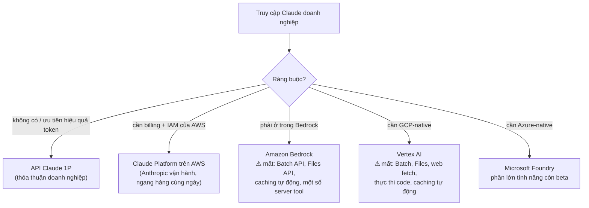
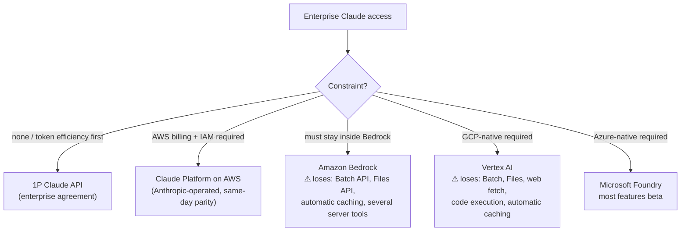

# Thiết lập Coding-Agent Doanh nghiệp: Claude, GPT, Gemini (Tiếng Việt)

Tài liệu này trình bày các cách hiện thực hóa cụ thể theo từng nhà cung cấp
của [`recommended-setup.md`](recommended-setup.md) cho **coding agent trong
môi trường doanh nghiệp**, áp dụng cho ba stack lớn. Mỗi phần bao gồm: tuyến
truy cập doanh nghiệp (và tuyến nào âm thầm *mất* các tính năng tối ưu
token), harness coding nên chuẩn hóa, cách caching thực sự hoạt động ở đó,
bản đồ model/effort, và các kết nối batch + đo lường.

> ⚠️ Giá cả, tên model, và tính khả dụng tính năng thay đổi nhanh — coi các
> con số ở đây là hình dạng của bối cảnh và xác minh lại với tài liệu hiện
> tại của nhà cung cấp trước khi ký hợp đồng.

---

## Bản thiết kế mà cả ba đều hiện thực hóa

| Tier (từ `recommended-setup.md`) | Claude | GPT | Gemini |
| --- | --- | --- | --- |
| Harness (Tier 0) | Claude Code / Claude Agent SDK | Codex (CLI + cloud) / Agents SDK | Gemini CLI + Code Assist / ADK |
| Cơ chế caching | Breakpoint `cache_control` tường minh (TTL 5 phút/1 giờ) | Caching prefix tự động (≥1.024 token) + `prompt_cache_key` | Caching ngầm định + `CachedContent` tường minh (TTL, tính phí lưu trữ) |
| Giảm giá input đã cache | ~90% (đọc ~0.1×) | 50–90% tùy dòng model (GPT-5.x: ~90%) | ~75% trên token đã cache |
| Nút điều chỉnh reasoning | `output_config.effort` (low→max) + adaptive thinking | `reasoning_effort` (minimal→high) + `verbosity` | `thinking_level` / `thinking_budget` |
| Tier batch | Message Batches −50% | Batch API −50% (+ tier Flex trên một số model) | Batch Vertex/Gemini −50% |
| Frontier/mid/nhỏ cho bản đồ model | Opus 4.8 / Sonnet 5 / Haiku 4.5 | GPT-5.x-Codex / GPT-5.x / GPT-5-mini·nano | Gemini 3 Pro / Gemini 2.5 Flash / Flash-Lite |

---

## 1. Claude (Anthropic)

### Tuyến truy cập — quyết định chi phối mọi thứ

Claude doanh nghiệp tiếp cận bạn qua năm cánh cửa, và **chúng không tương
đương về tính năng**. Với một hệ thống coding tối ưu token, sự khác biệt
quan trọng hơn sự tiện lợi mua sắm:

**Khuyến nghị:** dùng API 1P hoặc **Claude Platform trên AWS** (do Anthropic
vận hành, tính năng tương đương ngay trong ngày, hỗ trợ SigV4/IAM, billing
qua AWS Marketplace) — cách này giữ được toàn bộ bề mặt tối ưu. Chỉ chọn
Bedrock/Vertex khi chính sách bắt buộc, và cần dự trù trước rằng bạn sẽ mất
tier batch giảm 50% cùng Files API (cả hai đều ảnh hưởng trực tiếp đến hóa
đơn token).

### Harness

- **Coding tương tác + CI:** **Claude Code** — triển khai doanh nghiệp hỗ
  trợ SSO, cài đặt/chính sách quản lý, kiểm soát chi tiêu, và có thể chạy
  trên backend 1P, Bedrock, hoặc Vertex. Nó có sẵn toàn bộ stack Tier-0:
  phần đầu prompt ổn định đã cache, tự động nén, tool có ngân sách (`Read`
  offset/limit, `Grep` head_limit, bash nền với file log), `Edit` xác minh
  anchor, tải tool MCP trì hoãn.
- **Hệ thống agent tùy chỉnh:** **Claude Agent SDK** (cùng harness nhưng
  dưới dạng thư viện) thay vì một vòng lặp Messages-API trần; bạn kế thừa
  nén, subagent, hook, và phân quyền thay vì tự xây lại chúng.
- **Hệ thống quản lý phía server:** Managed Agents (beta) nếu bạn muốn
  Anthropic chạy vòng lặp + sandbox — các phiên có sẵn nén và caching
  prompt.

### Cấu hình tối ưu token

1. **Caching:** `cache_control: {type: "ephemeral"}` tường minh trên khối
   ổn định cuối cùng (cache tool+system cùng nhau); dùng `ttl: "1h"` cho
   các hệ thống agent có khoảng nghỉ giữa các lượt chạy; pre-warm
   `max_tokens: 0` trước khi hệ thống khởi động theo lịch. Đọc ~0.1×, ghi
   1.25×/2×. Thực thi kiểm thử CI ổn định prompt — caching của Claude là
   tường minh, nên một phần đầu bị thay đổi sẽ thất bại *rõ ràng trong đo
   lường của bạn* nếu bạn theo dõi `cache_read_input_tokens`.
2. **Bản đồ model/effort** (theo từng vai trò agent, trong config):

   | Vai trò | Model | Effort |
   | --- | --- | --- |
   | Orchestrator / coding khó | `claude-opus-4-8` ($5/$25 mỗi MTok) | `high`, quét `xhigh` |
   | Subagent coding tiêu chuẩn | `claude-sonnet-5` ($3/$15) | `high` |
   | Tìm kiếm/khám phá/tóm tắt/commit-msg | `claude-haiku-4-5` ($1/$5) | `low` |

3. **Batch:** định tuyến bộ đánh giá, quét refactor hàng đêm, và phân
   loại hàng loạt qua Message Batches (−50%, cộng dồn với đọc cache) — chỉ
   trên 1P và Claude Platform trên AWS.
4. **Vệ sinh phiên dài:** nén phía server / chỉnh sửa context
   (`clear_tool_uses`) đi kèm với harness; xác minh round-trip của khối nén
   (compaction block) nếu bạn điều khiển API trực tiếp.
5. **Đo lường:** `usage` mang đủ bốn đại lượng bao gồm
   `cache_creation_input_tokens` — kết nối vào Langfuse/OTel với thẻ
   `agent_role`; cảnh báo khi tỷ trọng cache-hit sụt theo từng vai trò.

---

## 2. GPT (OpenAI / Azure)

### Tuyến truy cập

- **OpenAI trực tiếp (thỏa thuận doanh nghiệp)** — đầy đủ bề mặt tính
  năng, chỗ ngồi ChatGPT Enterprise cho con người + API cho agent; có sẵn
  phụ lục zero-data-retention và tuân thủ.
- **Azure OpenAI (Azure AI Foundry)** — cho IAM native của Azure, mạng,
  cư trú dữ liệu theo vùng/khu vực, và **Provisioned Throughput Units
  (PTU)** cho giá dung lượng dự đoán được. Tương đương tính năng khá tốt
  nhưng thường trễ hơn API trực tiếp vài tuần; xác minh mức giảm giá
  Batch + caching trên loại triển khai mục tiêu của bạn trước khi giả định
  chúng có sẵn.

### Harness

- **Coding tương tác + CI:** **Codex** — CLI cho local/CI, Codex cloud
  cho tác vụ ủy thác, với admin/SSO doanh nghiệp qua workspace ChatGPT
  Enterprise. Các biến thể Codex của GPT-5.x được huấn luyện tiếp chuyên
  cho coding agentic và là mặc định dự kiến ở đó.
- **Hệ thống tùy chỉnh:** **OpenAI Agents SDK** trên **Responses API**
  (không phải chat completions trần) — bạn có trạng thái hội thoại phía
  server (`previous_response_id`), tool có sẵn, và handoff; Responses API
  cũng là nơi việc tái sử dụng mục reasoning giữa các lượt được xử lý hộ
  bạn, điều quan trọng cho cả chi phí lẫn chất lượng trên các model
  reasoning dòng o-series/GPT-5.

### Cấu hình tối ưu token

1. **Caching tự động — việc của bạn là kỷ luật prefix.** Caching prefix
   kích hoạt trên các prompt ≥1.024 token, không cần bật, không phụ phí
   ghi; input đã cache được giảm giá 50–90% tùy dòng model (GPT-5.x ở đầu
   cao). Vì không có breakpoint tường minh, đòn bẩy *duy nhất* là thứ tự
   prefix ổn định từng byte (`stable-prompt-architecture.md`) cộng với
   `prompt_cache_key` để cải thiện định tuyến cho các prefix chia sẻ QPS
   cao. Theo dõi `usage.prompt_tokens_details.cached_tokens` theo từng
   route.
2. **Bản đồ model/effort:**

   | Vai trò | Model | Nút điều chỉnh |
   | --- | --- | --- |
   | Orchestrator / coding khó | GPT-5.x-Codex (biến thể tier Max cho công việc dài hơi) | `reasoning_effort: high` |
   | Subagent coding tiêu chuẩn | GPT-5.x / Codex tiêu chuẩn | `reasoning_effort: medium` |
   | Công việc chân tay tìm kiếm/tóm tắt/định dạng | GPT-5-mini / nano | `reasoning_effort: minimal`–`low`, `verbosity: low` |

   `verbosity` là nút điều chỉnh độ dài output có sẵn — dùng nó thay vì
   can thiệp prompt cho các route kiểu báo cáo.
3. **Batch + Flex:** Batch API −50% cho đánh giá/backfill; tier dịch vụ
   **Flex** (chậm hơn, rẻ hơn) bao phủ lưu lượng "sớm nhưng chưa cần ngay"
   không khớp ngữ nghĩa batch 24 giờ. Trên Azure, ưu tiên kết hợp
   Batch/PTU: PTU cho tải tương tác ổn định, batch cho tải offline dồn
   cục.
4. **Theo dõi token reasoning:** chi tiêu reasoning hiển thị tại
   `usage.completion_tokens_details.reasoning_tokens` — cảnh báo khi tỷ
   trọng reasoning leo thang theo từng route; đó là mục tương đương phía
   GPT của dòng token thinking.
5. **Quản lý context là việc của bạn (hoặc của SDK):** các vòng lặp kiểu
   chat-completions không có nén phía server — dùng cắt tỉa/tóm tắt phiên
   của Agents SDK, hoặc `truncation: "auto"` của Responses API, và áp dụng
   các heuristic của `context-editing.md` trong các harness tùy chỉnh.

---

## 3. Gemini (Google Cloud)

### Tuyến truy cập

- **Vertex AI** là cửa ngõ doanh nghiệp cho hệ thống API: CMEK, VPC-SC, cư
  trú dữ liệu, **Provisioned Throughput** cho dung lượng dự trữ, và batch
  prediction. Khóa AI Studio cấp người tiêu dùng không phải là con đường
  doanh nghiệp.
- Giấy phép **Gemini Code Assist Enterprise** cho nhà phát triển con người
  (IDE + tùy biến code trên repo riêng của bạn); **Gemini Enterprise** cho
  quản trị agent/workspace toàn tổ chức.

### Harness

- **Coding tương tác + CI:** **Gemini CLI** (agent terminal, gắn với cấp
  phép Code Assist cho kiểm soát doanh nghiệp), Code Assist trong IDE;
  IDE agentic của Google (Antigravity) và agent coding bất đồng bộ Jules
  là các lựa chọn trải nghiệm được quản lý — đánh giá độ trưởng thành cho
  hệ thống của bạn trước khi chuẩn hóa.
- **Hệ thống tùy chỉnh:** **Agent Development Kit (ADK)** + Vertex AI
  Agent Engine cho các vòng lặp được host — một lần nữa, kế thừa thay vì
  tự xây tay vòng lặp, phiên, và hệ thống ống nước tool.

### Cấu hình tối ưu token

1. **Caching hai lớp — quản lý chủ động lớp tường minh.**
   - *Caching ngầm định*: tự động trên các model 2.5+/3, giảm giá ~75%
     trên token đã cache, cùng kỷ luật ổn định prefix như mọi nơi khác
     (theo dõi `cached_content_token_count`).
   - *`CachedContent` tường minh*: gắn một corpus lớn (tài liệu
     monorepo, tóm tắt bề mặt API, hướng dẫn phong cách) một lần với TTL
     đã chọn. **Nó tính phí lưu trữ theo token-giờ** — đặt TTL theo cửa sổ
     sử dụng và xóa khi rảnh, nếu không bản thân cache trở thành một
     dòng chi phí. Đây là cơ chế tốt nhất trong ba nhà cung cấp cho "nhiều
     agent chia sẻ một corpus khổng lồ", và là cơ chế duy nhất bạn
     có thể *quên tắt đi*.
2. **Chú ý các bậc giá context dài.** Các cửa sổ khổng lồ của Gemini
   (1–2M) mang **giá mỗi token cao hơn trên một ngưỡng** (ví dụ >200K
   input trên các tier Pro). "Cứ nhồi cả monorepo vào" sẽ vượt qua vào
   bậc giá cao cấp — truy xuất/cắt lát (`retrieval-tuning.md`,
   `tool-output-budgets.md`) vẫn rẻ hơn kích thước cửa sổ thô.
3. **Bản đồ model/thinking:**

   | Vai trò | Model | Nút điều chỉnh |
   | --- | --- | --- |
   | Orchestrator / coding khó | Gemini 3 Pro | `thinking_level: high` |
   | Subagent tiêu chuẩn | Gemini 2.5 Flash (hoặc flash tier-3 khi có sẵn) | `thinking_budget` vừa phải |
   | Chân tay / phân loại / tóm tắt | 2.5 Flash-Lite | `thinking_budget: 0`/tối thiểu |

   Token thinking được hiển thị dưới dạng `thoughts_token_count` — cùng
   cách cảnh báo theo route như hai nhà cung cấp kia.
4. **Batch:** batch prediction của Vertex ở mức −50% cho đánh giá/backfill/
   biến đổi hàng loạt; kết hợp với caching tường minh cho hỏi-đáp hàng loạt
   trên shared corpus.
5. **Đo lường:** `usageMetadata` (số token prompt/candidate/cached/thoughts)
   vào cùng pipeline Langfuse/OTel — giữ một schema dashboard duy nhất qua
   cả ba nhà cung cấp (mô hình bốn đại lượng từ
   [`../CAUSE.md`](../CAUSE.md) §Cẩm nang Đo lường ánh xạ gọn gàng).

---

## Vận hành một hệ thống hỗn hợp (hầu hết doanh nghiệp cuối cùng đều ở đây)

1. **Một gateway, một schema đo lường.** Đặt một gateway (LiteLLM, Portkey,
   hoặc của riêng bạn) trước cả ba để usage đổ vào một pipeline với thẻ
   `vendor / model / agent_role / session` thống nhất. Chi phí-mỗi-tác-vụ-
   hoàn-thành phải so sánh được qua các nhà cung cấp nếu không cuộc tranh
   luận về thành phần hệ thống sẽ chạy trên cảm tính.
2. **Định tuyến theo hệ thống/vai-trò-agent, không bao giờ theo từng
   lượt.** Cache gắn với nhà-cung-cấp+model cụ thể; nhảy nhà cung cấp giữa
   phiên sẽ làm mới lại mọi thứ. Gán một nhà-cung-cấp+model cho mỗi vai trò
   agent (như trong các bản đồ ở trên) và giữ các phiên đồng nhất.
3. **Đừng ép một harness duy nhất qua các nhà cung cấp.** Harness coding
   riêng của mỗi nhà cung cấp mang theo tối ưu Tier-0 của nó (Claude Code,
   Codex, Gemini CLI); một vòng lặp tùy chỉnh theo mẫu số chung nhỏ nhất
   thường đánh mất chất lượng caching/nén trên cả ba. Chuẩn hóa các *quy
   ước* (hợp đồng tóm tắt/artifact, thẻ đo lường, CI ổn định prompt) —
   không phải chuẩn hóa binary.
4. **Đàm phán bằng dữ liệu sử dụng.** Các thỏa thuận doanh nghiệp trên cả
   ba phía đều định giá theo khối lượng cam kết — stack đo lường từ Tier 1
   đồng thời là bằng chứng đàm phán của bạn cho việc nhà cung cấp nào nhận
   khối lượng công việc nào.

## Kết quả dự kiến

Áp dụng theo từng nhà cung cấp, cùng mức cải thiện chi phí-mỗi-tác-vụ
5–20× từ `recommended-setup.md` vẫn giữ vững, với các chênh lệch đặc thù
theo nhà cung cấp là:

- **Claude:** lợi ích caching *có thể kiểm soát* lớn nhất (breakpoint
  tường minh, TTL 1 giờ, pre-warm) — phù hợp nhất cho các hệ thống agent
  sống lâu; chú ý ma trận tính năng theo tuyến truy cập nếu không bạn sẽ
  âm thầm mất các công cụ batch/caching.
- **GPT:** caching ít công sức nhất (tự động, không phụ phí ghi) và các
  nút điều chỉnh `verbosity`/`reasoning_effort` có sẵn — nhanh nhất để đạt
  trạng thái "tốt"; quản lý context là phần bạn phải tự lo.
- **Gemini:** kinh tế kho-ngữ-liệu-chung mạnh nhất (cache tường minh) và
  tier chân tay rẻ nhất — phù hợp nhất cho các hệ thống nặng về corpus;
  chủ động quản lý lưu trữ cache và các bậc giá context dài nếu không mức
  tiết kiệm sẽ đảo ngược.

---

# Enterprise Coding-Agent Setups: Claude, GPT, Gemini

Concrete, vendor-specific instantiations of
[`recommended-setup.md`](recommended-setup.md) for **coding agents in an
enterprise environment**, for the three major stacks. Each section covers:
the enterprise access route (and which routes silently *lose*
token-optimization features), the coding harness to standardize on, how
caching actually works there, the model/effort map, and the batch +
telemetry hookups.

> ⚠️ Pricing, model names, and feature availability move fast — treat the
> numbers here as the shape of the landscape and re-verify against current
> vendor docs before contracting.

---

## The blueprint all three instantiate

| Tier (from `recommended-setup.md`) | Claude | GPT | Gemini |
| --- | --- | --- | --- |
| Harness (Tier 0) | Claude Code / Claude Agent SDK | Codex (CLI + cloud) / Agents SDK | Gemini CLI + Code Assist / ADK |
| Caching mechanism | Explicit `cache_control` breakpoints (5m/1h TTL) | Automatic prefix caching (≥1,024 tokens) + `prompt_cache_key` | Implicit caching + explicit `CachedContent` (TTL, storage-billed) |
| Cached-input discount | ~90% (reads ~0.1×) | 50–90% by model family (GPT-5.x: ~90%) | ~75% on cached tokens |
| Reasoning dial | `output_config.effort` (low→max) + adaptive thinking | `reasoning_effort` (minimal→high) + `verbosity` | `thinking_level` / `thinking_budget` |
| Batch tier | Message Batches −50% | Batch API −50% (+ Flex tier on some models) | Vertex/Gemini batch −50% |
| Frontier / mid / small for the model map | Opus 4.8 / Sonnet 5 / Haiku 4.5 | GPT-5.x-Codex / GPT-5.x / GPT-5-mini·nano | Gemini 3 Pro / Gemini 2.5 Flash / Flash-Lite |

---

## 1. Claude (Anthropic)

### Access route — the decision that gates everything

Enterprise Claude reaches you through five doors, and **they are not
feature-equivalent**. For a token-optimized coding fleet the differences
matter more than the procurement convenience:

**Recommendation:** 1P API or **Claude Platform on AWS** (Anthropic-operated
with same-day API parity, SigV4/IAM, AWS Marketplace billing) — you keep the
full optimization surface. Choose Bedrock/Vertex only when policy forces it,
and budget for the missing 50%-batch tier and Files API (both directly
token-bill-relevant).

### Harness

- **Interactive + CI coding:** **Claude Code** — enterprise deployment
  supports SSO, managed settings/policies, spend controls, and can run
  against 1P, Bedrock, or Vertex backends. It ships the whole Tier-0 stack:
  cached stable prompt head, auto-compaction, budgeted tools
  (`Read` offset/limit, `Grep` head_limit, background bash with log files),
  anchor-verified `Edit`, deferred MCP tool loading.
- **Custom agent fleets:** **Claude Agent SDK** (same harness as a library)
  rather than a bare Messages-API loop; you inherit compaction, subagents,
  hooks, and permissioning instead of rebuilding them.
- **Server-managed fleets:** Managed Agents (beta) if you want Anthropic to
  run the loop + sandbox — sessions get compaction and prompt caching
  built in.

### Token-optimization configuration

1. **Caching:** explicit `cache_control: {type: "ephemeral"}` on the last
   stable block (tools+system cache together); use `ttl: "1h"` for agent
   fleets with gaps between runs; `max_tokens: 0` pre-warm before scheduled
   fleet starts. Reads ~0.1×, writes 1.25×/2×. Enforce the prompt-stability
   CI test — Claude's caching is explicit, so a mutated head fails *loudly
   in your telemetry* if you watch `cache_read_input_tokens`.
2. **Model/effort map** (per agent role, in config):

   | Role | Model | Effort |
   | --- | --- | --- |
   | Orchestrator / hard coding | `claude-opus-4-8` ($5/$25 per MTok) | `high`, sweep `xhigh` |
   | Standard coding subagents | `claude-sonnet-5` ($3/$15) | `high` |
   | Search/explore/summarize/commit-msg | `claude-haiku-4-5` ($1/$5) | `low` |

3. **Batch:** route eval suites, nightly refactor scans, and bulk
   triage through Message Batches (−50%, stacks with cache reads) — 1P and
   Claude Platform on AWS only.
4. **Long-session hygiene:** server-side compaction / context editing
   (`clear_tool_uses`) come with the harness; verify the compaction block
   round-trip if you drive the API directly.
5. **Telemetry:** `usage` carries all four quantities incl.
   `cache_creation_input_tokens` — wire into Langfuse/OTel with
   `agent_role` tags; alert on cache-hit-share drops per role.

---

## 2. GPT (OpenAI / Azure)

### Access route

- **OpenAI direct (enterprise agreement)** — full feature surface,
  ChatGPT Enterprise seats for humans + API for agents; zero-data-retention
  and compliance addenda available.
- **Azure OpenAI (Azure AI Foundry)** — for Azure-native IAM, networking,
  data-zone/regional residency, and **Provisioned Throughput Units (PTU)**
  for predictable capacity pricing. Feature parity is good but typically
  lags direct API by weeks; verify Batch + caching discounts on your target
  deployment type before assuming them.

### Harness

- **Interactive + CI coding:** **Codex** — CLI for local/CI, Codex cloud
  for delegated tasks, with enterprise admin/SSO via ChatGPT Enterprise
  workspaces. Codex variants of GPT-5.x are specifically post-trained for
  agentic coding and are the intended default there.
- **Custom fleets:** **OpenAI Agents SDK** on the **Responses API** (not
  bare chat completions) — you get server-side conversation state
  (`previous_response_id`), built-in tools, and handoffs; the Responses API
  is also where reasoning-item reuse between turns is handled for you,
  which matters for both cost and quality on o-series/GPT-5 reasoning
  models.

### Token-optimization configuration

1. **Caching is automatic — your job is prefix discipline.** Prefix caching
   engages on prompts ≥1,024 tokens with no opt-in and no write surcharge;
   cached input is discounted 50–90% depending on family (GPT-5.x at the
   high end). Because there are no explicit breakpoints, the *only* lever
   is byte-stable prefix ordering (`stable-prompt-architecture.md`) plus
   `prompt_cache_key` to improve routing for high-QPS shared prefixes.
   Monitor `usage.prompt_tokens_details.cached_tokens` per route.
2. **Model/effort map:**

   | Role | Model | Dials |
   | --- | --- | --- |
   | Orchestrator / hard coding | GPT-5.x-Codex (Max-tier variant for long-horizon) | `reasoning_effort: high` |
   | Standard coding subagents | GPT-5.x / Codex standard | `reasoning_effort: medium` |
   | Search/summarize/format legwork | GPT-5-mini / nano | `reasoning_effort: minimal`–`low`, `verbosity: low` |

   `verbosity` is a native output-length dial — use it instead of prompt
   surgery for report-style routes.
3. **Batch + Flex:** Batch API −50% for evals/backfills; the **Flex**
   service tier (slower, cheaper) covers "soon but not now" traffic that
   doesn't fit 24h batch semantics. On Azure, prefer Batch/PTU mix: PTU for
   steady interactive load, batch for spiky offline load.
4. **Reasoning-token watch:** reasoning spend is visible at
   `usage.completion_tokens_details.reasoning_tokens` — alert on
   reasoning-share creep per route; it's the GPT-side equivalent of the
   thinking-token line item.
5. **Context management is yours (or the SDK's):** chat-completions-style
   loops have no server-side compaction — use the Agents SDK session
   trimming/summarization, or the Responses API `truncation: "auto"`, and
   apply `context-editing.md` heuristics in custom harnesses.

---

## 3. Gemini (Google Cloud)

### Access route

- **Vertex AI** is the enterprise front door for the API fleet: CMEK,
  VPC-SC, data residency, **Provisioned Throughput** for reserved capacity,
  and batch prediction. Consumer-grade AI Studio keys are not the
  enterprise path.
- **Gemini Code Assist Enterprise** licenses for human developers
  (IDE + code customization against your private repos); **Gemini
  Enterprise** for org-wide agent/workspace governance.

### Harness

- **Interactive + CI coding:** **Gemini CLI** (terminal agent, ties to Code
  Assist licensing for enterprise controls), Code Assist in IDEs; Google's
  agentic IDE (Antigravity) and the Jules async coding agent are the
  managed-experience options — evaluate maturity for your fleet before
  standardizing.
- **Custom fleets:** **Agent Development Kit (ADK)** + Vertex AI Agent
  Engine for hosted loops — again, inherit rather than hand-build the loop,
  sessions, and tool plumbing.

### Token-optimization configuration

1. **Two-layer caching — manage the explicit layer actively.**
   - *Implicit caching*: automatic on 2.5+/3 models, ~75% discount on
     cached tokens, same prefix-stability discipline as everyone else
     (watch `cached_content_token_count`).
   - *Explicit `CachedContent`*: pin a large corpus (monorepo docs, API
     surface summaries, style guides) once with a chosen TTL. **It bills
     storage per token-hour** — size TTLs to usage windows and delete on
     idle, or the cache itself becomes a cost line. This is the best
     mechanism of the three vendors for "many agents share one huge
     corpus," and the only one you can *forget to turn off*.
2. **Mind long-context pricing tiers.** Gemini's huge windows (1–2M) carry
   **higher per-token rates above a threshold** (e.g. >200K input on Pro
   tiers). "Just stuff the monorepo in" crosses into the premium band —
   retrieval/slicing (`retrieval-tuning.md`, `tool-output-budgets.md`)
   is still cheaper than raw window size.
3. **Model/thinking map:**

   | Role | Model | Dials |
   | --- | --- | --- |
   | Orchestrator / hard coding | Gemini 3 Pro | `thinking_level: high` |
   | Standard subagents | Gemini 2.5 Flash (or 3-tier flash when available) | moderate `thinking_budget` |
   | Legwork / classify / summarize | 2.5 Flash-Lite | `thinking_budget: 0`/minimal |

   Thinking tokens are surfaced as `thoughts_token_count` — same
   per-route alerting as the other two vendors.
4. **Batch:** Vertex batch prediction at −50% for evals/backfills/bulk
   transforms; pairs with explicit caching for shared-corpus batch Q&A.
5. **Telemetry:** `usageMetadata` (prompt/candidates/cached/thoughts token
   counts) into the same Langfuse/OTel pipeline — keep one dashboard schema
   across all three vendors (the four-quantity model from
   [`../CAUSE.md`](../CAUSE.md) §Measurement Primer maps cleanly).

---

## Running a mixed fleet (most enterprises end up here)

1. **One gateway, one telemetry schema.** Put a gateway (LiteLLM,
   Portkey, or your own) in front of all three so usage lands in one
   pipeline with uniform `vendor / model / agent_role / session` tags.
   Cost-per-completed-task must be comparable across vendors or the fleet
   composition debate runs on vibes.
2. **Route per fleet/agent-role, never per turn.** Caches are
   vendor+model-scoped; mid-session vendor hops rebuild everything. Assign
   a vendor+model per agent role (as in the maps above) and keep sessions
   homogeneous.
3. **Don't force one harness across vendors.** Each vendor's own coding
   harness carries its Tier-0 optimizations (Claude Code, Codex, Gemini
   CLI); a lowest-common-denominator custom loop typically forfeits
   caching/compaction quality on all three. Standardize the *conventions*
   (briefing/artifact contracts, telemetry tags, prompt-stability CI) —
   not the binary.
4. **Negotiate with usage data.** Enterprise agreements on all three sides
   price on committed volume — the telemetry stack from Tier 1 doubles as
   your negotiation evidence for which vendor gets which workload.

## Expected result

Applied per vendor, the same 5–20× cost-per-task improvement from
`recommended-setup.md` holds, with the vendor-specific deltas being:

- **Claude:** largest *controllable* caching upside (explicit breakpoints,
  1h TTL, pre-warm) — best fit for long-lived agent fleets; watch the
  access-route feature matrix or you silently lose batch/caching tools.
- **GPT:** lowest-effort caching (automatic, no write surcharge) and native
  `verbosity`/`reasoning_effort` dials — fastest to a "good" state; context
  management is the part you must own.
- **Gemini:** strongest shared-corpus economics (explicit cache) and
  cheapest legwork tier — best fit for corpus-heavy fleets; actively manage
  cache storage and long-context pricing bands or the savings invert.
