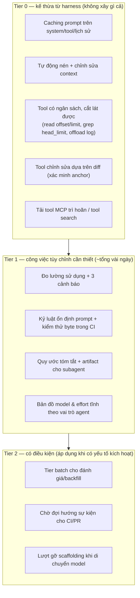
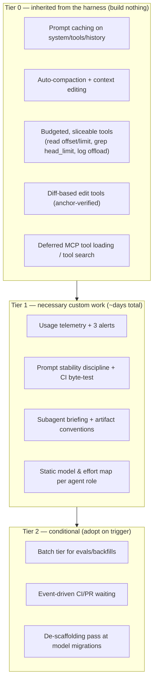

# Thiết lập Đề xuất: Codebase Lớn, Nhiều Agent (Tiếng Việt)

Một khuyến nghị ưu tiên chắt lọc từ toàn bộ danh mục, cho một profile cụ thể
(và phổ biến): **một codebase lớn được làm việc bởi nhiều coding/dev
agent** — orchestrator spawn subagent, các phiên dài, dùng tool nặng, MCP
server, tương tác CI.

Bộ lọc được áp dụng: *chi phí thiết lập so với lợi ích cho profile này*.
Nhiều mục trong danh mục là tùy tình huống (tinh chỉnh RAG, ngân sách thị
giác, router động) — trang này nói rõ cái gì là **cần thiết**, cái gì
**miễn phí nếu bạn chọn đúng harness**, và cái gì nên **bỏ qua một cách rõ
ràng cho đến khi đo lường chứng minh nhu cầu**.

---

## Nhận định cốt lõi

Với profile này, phần lớn cỗ máy cần thiết không nên được xây dựng — nó nên
được **kế thừa từ một harness agent trưởng thành**. Một harness hiện đại
(Claude Code / Claude Agent SDK, hoặc một cái tương đương có cùng đặc
điểm) đã có sẵn caching prompt, tự động nén, tool có ngân sách, chỉnh sửa
dựa trên diff, và tải tool trì hoãn. Tự xây dựng những thứ này là cái bẫy
nỗ lực kinh điển.

Những gì thực sự *là việc của bạn để xây dựng* thì nhỏ: **quan sát được,
kỷ luật ổn định prompt, quy ước bàn giao subagent, và một bản đồ
model/effort tĩnh.**



---

## Tier 0 — Chọn một harness đã làm điều này (chi phí: một quyết định lựa chọn)

**Đừng tự xây tay những thứ này.** Thay vào đó, biến chúng thành tiêu chí
chọn harness. Dù bạn chạy gì (Claude Code / Agent SDK, OpenHands, Aider,
một vòng lặp LangGraph tùy chỉnh), hãy xác minh nó cung cấp:

| Năng lực | Tài liệu trong danh mục | Tại sao nó không thể thương lượng cho profile này |
| --- | --- | --- |
| Caching prompt qua các lượt (phần đầu ổn định, lịch sử chỉ-nối-thêm) | `prompt-caching.md` | Các phiên agent dài có 80–95% là lịch sử gửi lại; không có lịch sử thường trú trong cache, hóa đơn cao hơn 5–10× — không có gì khác bạn làm quan trọng bằng điều này |
| Tự động nén + cắt tỉa kết quả tool cũ | `compaction.md`, `context-editing.md` | Các phiên nhiều lượt trên một repo lớn liên tục chạm giới hạn context; nếu không thì chi phí bậc hai |
| Tool có ngân sách: `read(offset,limit)`, tìm kiếm có giới hạn, offload output lớn ra file | `tool-output-budgets.md` | Codebase lớn = file lớn, log lớn. Đọc không giới hạn là lãng phí #1 trong coding agent |
| Tool chỉnh sửa xác minh anchor (str-replace/diff), không bao giờ viết lại toàn bộ file | `diff-based-edits.md` | Tiết kiệm output 10–50× mỗi lần chỉnh sửa; cũng ít hồi quy hơn |
| Tải schema MCP/tool trì hoãn | `tool-search.md` | Nhiều agent ⇒ nhiều MCP server; phình to schema là chi phí cố định trên mỗi request của mỗi agent |

Nếu thiết lập hiện tại của bạn thiếu một trong những điều này, **chuyển
sang/nâng cấp harness rẻ hơn việc lắp thêm năng lực đó** trong hầu hết mọi
trường hợp.

> Một vòng lặp framework tùy chỉnh (LangGraph/SDK trần) hoàn toàn có thể
> là lựa chọn đúng — nhưng khi đó Tier 0 trở thành backlog của bạn, theo
> thứ tự này: caching → ngân sách tool → nén → chỉnh sửa diff → tool trì
> hoãn.

---

## Tier 1 — Công việc tùy chỉnh cần thiết

Bốn điều này không đến từ bất kỳ harness nào, rẻ (tổng cộng vài ngày,
không phải vài tuần), và là điều kiện cho mọi thứ khác.

### 1. Đo lường sử dụng với ba cảnh báo (~1 ngày) — `token-counting.md`

Lắp một lớp quan sát LLM (Langfuse hoặc Helicone là con đường nhanh nhất;
quy ước OTel GenAI nếu bạn đã có sẵn stack chỉ số). Ghi lại bốn đại lượng
sử dụng mỗi request kèm `agent_role`, `session_id`, `turn`. Sau đó đặt
đúng ba cảnh báo:

1. **Sụt tỷ trọng cache-hit** theo từng vai trò agent → bắt được các yếu
   tố vô hiệu hóa âm thầm (lớp hồi quy tốn kém nhất, và vô hình nếu không
   có cảnh báo này).
2. **Đường cong tăng trưởng input mỗi phiên** siêu tuyến tính → nén/cắt
   tỉa đã hỏng hoặc đặt sai ngưỡng.
3. **Chi phí mỗi tác vụ hoàn thành** thay đổi đột ngột → bắt được mọi thứ
   khác, kể cả các chỉnh sửa prompt có ý tốt.

*Tại sao cần thiết:* với nhiều agent, lãng phí ẩn trong tổng hợp. Mọi
quyết định khác trên trang này (và trong repo) đều là đoán mò nếu không
có sự quy trách nhiệm.

### 2. Kỷ luật ổn định prompt (~1 ngày + liên tục) — `stable-prompt-architecture.md`

- Cố định phần đầu của mỗi agent (system + tool) theo từng phiên; đánh
  phiên bản prompt; chỉ chuyển đổi tại ranh giới phiên.
- Cấm `now()`/UUID/serialize không sắp xếp trong các bộ dựng prompt.
- Thêm kiểm thử CI duy nhất quan trọng: render hai lần → khẳng định giống
  hệt từng byte; render lượt N và N+1 → khẳng định tính chất prefix.

*Tại sao cần thiết:* caching của harness (Tier 0) chỉ tốt bằng các byte
bạn nạp vào nó. Một kỹ sư thêm một timestamp vào một system prompt chung
sẽ âm thầm phá cache của **mọi agent trong hệ thống** — đây là một hệ số
nhân toàn hệ thống, và chỉ kỷ luật + kiểm thử CI mới ngăn được nó.

### 3. Quy ước tóm tắt + artifact cho subagent (~2 ngày) — `subagent-context-handoff.md`

Đây là đòn bẩy *đặc thù cho nhiều-agent*. Chuẩn hóa hai hợp đồng:

- **Tóm tắt đầu vào**: mỗi lần sinh mang theo mục tiêu, ràng buộc, đường
  dẫn/ID chính xác, phát hiện hiện có, định nghĩa "xong". Biến nó thành
  một mẫu mà prompt orchestrator thực thi — một mô tả tác vụ một dòng đảm
  bảo phải trả tiền cho việc khám phá lại một codebase lớn.
- **Artifact đầu ra**: subagent ghi toàn bộ kết quả vào hệ thống file/kho
  artifact chung và trả về *con trỏ + tóm tắt ≤300 token*. Agent cha không
  bao giờ nạp các bản đổ transcript.

*Tại sao cần thiết:* trên một codebase lớn, việc khám phá lại cực kỳ tốn
kém (khám phá repo là rất nhiều lệnh gọi tool lớn), và với nhiều agent nó
xảy ra N lần. Quy ước này thường loại bỏ 50–90% chi tiêu tool của subagent
và giữ context orchestrator không phình to (nếu không sẽ bị tính phí lại
trên mọi lượt sau).

### 4. Bản đồ model & effort tĩnh theo vai trò agent (~nửa ngày) — `model-routing.md`, `reasoning-effort-tuning.md`

Một file config, không phải một router:

| Vai trò agent | Tier model | Effort reasoning |
| --- | --- | --- |
| Orchestrator/lập kế hoạch | Frontier | high |
| Subagent coding | Frontier hoặc mid mạnh | high (quét xhigh trên đánh giá) |
| Subagent tìm kiếm/khám phá | Tier nhỏ–mid | low |
| Summarizer, compactor, verifier, viết commit message | Tier nhỏ | low/off |
| Bộ phân loại, phân luồng, định dạng | Tier nhỏ | off |

*Tại sao cần thiết:* các vai trò công việc chân tay chiếm phần lớn khối
lượng request trong một hệ thống nhiều agent và không cần bất kỳ năng lực
nào của tier frontier. Đây là 50–80% khối lượng chuyển sang rẻ hơn 5–25×
với chi phí chỉ là chỉnh một file config — tỷ lệ chi phí-trên-lợi-ích tốt
nhất trong toàn bộ danh mục.

---

## Tier 2 — Có điều kiện: áp dụng khi yếu tố kích hoạt xuất hiện

| Yếu tố kích hoạt | Sau đó áp dụng | Tài liệu |
| --- | --- | --- |
| Bạn chạy bộ đánh giá, backfill, hoặc job đêm trên codebase | Tier batch (giảm cố định 2×, gần như không đổi code cho công việc dạng job) | `batch-processing.md` |
| Agent trông chừng CI/PR và bạn bắt gặp chúng polling | Chờ đợi hướng sự kiện qua webhook (ưu tiên đăng ký cấp harness trước; chưa cần workflow engine) | `event-driven-waiting.md` |
| Một lần di chuyển model diễn ra | Một lượt loại bỏ scaffolding trên các prompt của toàn hệ thống | `prompt-de-scaffolding.md` |
| Đo lường cho thấy đọc file trùng lặp chi phối lịch sử | Registry hash nội dung trong harness | `context-hygiene.md` |
| Xuất hiện các fan-out map-reduce trên context chung | Cổng làm-ấm-một-rồi-fan | `fan-out-warming.md` |
| Agent bắt đầu tiêu thụ screenshot (browser/computer use) | Ngân sách độ phân giải + cắt tỉa screenshot cũ | `image-downsampling.md` |
| Một khối lượng công việc tài liệu/hỏi-đáp gia nhập hệ thống | Tái sử dụng tài liệu + tinh chỉnh truy xuất | `document-reuse.md`, `retrieval-tuning.md` |
| Đo lường cho thấy output tool/CLI nhiễu (build log, chạy test, JSON) chi phối input | Proxy/hook nén output tool lắp trực tiếp (RTK/Headroom) — không cần thiết kế lại tool | `tool-output-compression.md` |
| Agent tốn phần lớn token khám phá repo để định hướng (chi phí 67–76% tìm file) | Bản đồ code/gói context đã check-in; đọc theo yêu cầu ưu tiên grep | `code-maps.md` |
| Một endpoint hỏi-đáp/phân tích chỉ-đọc, lặp lại cao gia nhập hệ thống | Cache cấp phản hồi (ngữ nghĩa) tại gateway — tránh xa các route chỉnh sửa code | `semantic-caching.md` |

## Tier 3 — Bỏ qua một cách rõ ràng (cho profile này, cho đến khi có bằng chứng ngược lại)

- **Router model động/đã học và cascade** (kiểu RouteLLM, kiểu FrugalGPT):
  có lợi ích thực sự, nhưng với các hệ thống dev-agent nội bộ, bản đồ vai
  trò tĩnh nắm bắt phần lớn giá trị với ~1% chi phí thiết lập và bảo trì.
  Chỉ xem lại nếu đo lường cho thấy một route duy nhất có khối lượng khổng
  lồ *và* tỷ trọng model frontier cao.
- **Pipeline nén/tóm tắt tự viết tay**: nén có sẵn từ harness đã được tinh
  chỉnh và bảo trì; tự xây của bạn là hàng tuần công sức để cho ra kết quả
  tệ hơn.
- **Framework tối ưu prompt (DSPy et al.) như điểm khởi đầu**: có giá trị
  sau này, nhưng chúng giả định trước hạ tầng đánh giá mà bạn chưa có; đo
  lường Tier 1 + một lượt loại bỏ tại thời điểm di chuyển đáp ứng nhu cầu
  gần hạn.
- **Nén context kiểu LLMLingua**: rủi ro độ trung thực trên code cao và
  Tier 0/1 loại bỏ sự phình to an toàn hơn.

---

## Bộ công cụ tham chiếu cụ thể (công cụ cụ thể)

Một cách hiện thực hóa có quan điểm của các tier trên, với các công cụ
thực tế. Đổi bất kỳ phần nào lấy lựa chọn thay thế được liệt kê — *hình
dạng* mới là điều quan trọng.

| Phần | Chọn | Thay thế | Tại sao chọn cái này |
| --- | --- | --- | --- |
| Harness Tier 0 | **Claude Code / Claude Agent SDK** | Codex CLI, Gemini CLI, OpenHands (MIT) | Có sẵn cả năm năng lực Tier 0 bật mặc định (caching, tự động nén + cắt tỉa, tool có ngân sách, chỉnh sửa xác minh anchor, tải MCP trì hoãn) |
| Đo lường Tier 1.1 | **Langfuse tự host (MIT)** nạp bởi **OpenLLMetry (Apache-2.0)** | Proxy Helicone (Apache-2.0); OTel GenAI thuần → Grafana/Datadog hiện có của bạn | Có thể tự host, usage + chi phí mỗi request, phiên bản prompt, và đánh giá trong một nơi |
| Kiểm thử byte CI Tier 1.2 | **pytest + syrupy** (hoặc Jest snapshots) | Bất kỳ trình chạy kiểm thử snapshot nào | ~30 dòng; thực thi bất biến prefix mãi mãi |
| Hợp đồng bàn giao Tier 1.3 | **Định nghĩa subagent của harness + hệ thống file chung** | Trạng thái có kiểu của LangGraph (MIT) cho các vòng lặp tùy chỉnh | Mẫu tóm tắt sống trong prompt orchestrator; artifact trên đĩa |
| Bản đồ model/effort Tier 1.4 | **Một file config đã check-in** (định nghĩa agent của harness hoặc cấu hình router LiteLLM, MIT) | Gateway Portkey (MIT) | Một lần chỉnh config, không phải một service |
| Batch Tier 2 | API batch của nhà cung cấp qua **LiteLLM** | Gọi SDK trực tiếp | Gửi thống nhất nếu bạn dùng nhiều nhà cung cấp |
| CI hướng sự kiện Tier 2 | **Đăng ký PR của harness + webhook GitHub** | Temporal (MIT) khi workflow vượt quá khả năng của harness | Không hạ tầng mới lúc đầu |
| Gỡ scaffolding Tier 2 | Lượt loại bỏ bằng **promptfoo (MIT)** | DSPy (MIT) khi hạ tầng đánh giá đã trưởng thành | Các biến thể song song với chi phí token mỗi biến thể |
| Ép output tùy chọn | Skill **Caveman (MIT)** trên các agent nội bộ dài dòng | Chỉ hợp đồng output cấp prompt | Skill lắp trực tiếp; cắt token output trên lưu lượng agent — chỉ route nội bộ |

### Tier 1.1 — Lắp dây đo lường

```bash
# Langfuse tự host + đo lường OpenLLMetry trong harness
docker compose up  # langfuse/langfuse
pip install traceloop-sdk  # phát ra span OTel GenAI (gen_ai.usage.*)
```

Gắn thẻ mỗi span với `agent_role`, `session_id`, `turn`. Định nghĩa ba
cảnh báo trên đúng các biểu thức này:

1. `cache_read_tokens / (input + cache_read + cache_creation)` theo
   `agent_role` — cảnh báo khi có cú sụt bậc (yếu tố vô hiệu hóa âm thầm).
2. Độ dốc của `input_tokens` so với `turn` theo `session_id` — cảnh báo
   khi siêu tuyến tính (nén/cắt tỉa đã hỏng).
3. `sum(cost) / count(tasks_completed)` theo từng route — cảnh báo khi
   thay đổi đột ngột.

### Tier 1.2 — Kiểm thử byte trong CI

```python
def test_prompt_prefix_stability():
    a = render_request(session_state, turn=5)
    b = render_request(session_state, turn=5)
    assert a == b                        # tất định
    c = render_request(session_state, turn=6)
    assert c.startswith(a[: len(a)])     # prefix chỉ-nối-thêm
```

Cộng thêm một quy tắc lint: cấm `now()`, `uuid`, và serialize không sắp
xếp trong bất kỳ module nào nạp vào phần đầu prompt.

### Tier 1.3 — Quy ước tóm tắt + artifact

Được check-in vào prompt/định nghĩa agent của orchestrator:

```markdown
Mỗi lần spawn subagent PHẢI bao gồm: mục tiêu, ràng buộc, đường dẫn/ID file
chính xác, phát hiện hiện có, định nghĩa "xong".
Mỗi subagent PHẢI ghi toàn bộ kết quả vào artifacts/<task-id>/ và chỉ trả
về đường dẫn + tóm tắt ≤300 token.
```

### Tier 1.4 — Bản đồ model/effort (ví dụ, tier giữa 2026)

```yaml
# roles.yaml — toàn bộ "router"
orchestrator:      {model: claude-opus-4-8,  effort: high}
coding_subagent:   {model: claude-opus-4-8,  effort: high}   # quét sonnet trên đánh giá
explore_subagent:  {model: claude-haiku-4-5, effort: low}
summarizer:        {model: claude-haiku-4-5, effort: low}
classifier:        {model: claude-haiku-4-5, effort: none}
```

Các bậc thang tương đương ở nơi khác: GPT-5.x ↔ mini/nano với
`reasoning_effort`; Gemini 3 Pro ↔ Flash/Flash-Lite với `thinking_budget`.
Hệ thống đa nhà cung cấp: biểu diễn cùng bản đồ một lần dưới dạng cấu hình
router LiteLLM và trỏ mọi agent vào gateway.

---

## Kết quả dự kiến của bộ công cụ cần thiết

Theo bậc độ lớn, cho một hệ thống hiện chưa có gì trong số này:

| Lớp | Hiệu ứng điển hình trên tổng chi tiêu |
| --- | --- |
| Năng lực harness Tier 0 (đặc biệt caching + ngân sách tool + nén) | Giảm 3–10× so với một vòng lặp ngây thơ |
| Kỷ luật ổn định Tier 1.2 | Bảo vệ điều trên khỏi hồi quy về ~1× (giá trị của nó *chính là* sự bảo vệ) |
| Quy ước bàn giao Tier 1.3 | Giảm 30–60% tỷ trọng chi tiêu đa agent |
| Bản đồ model/effort tĩnh Tier 1.4 | Giảm 2–4× giá pha trộn mỗi token |
| Đo lường Tier 1.1 | Cho phép mọi sự quy trách nhiệm; thường phát hiện thêm một phát hiện lớn trong vòng vài ngày |

Kết hợp lại, các hệ thống chuyển từ "vòng lặp ngây thơ + hàng-đầu-cho-mọi-
thứ" sang thiết lập này thường đạt **chi phí mỗi tác vụ hoàn thành thấp
hơn 5–20×** — với toàn bộ bề mặt tự xây chỉ là bốn thành phần nhỏ, ít cần
bảo trì.

---

# Recommended Setup: Large Codebase, Many Agents

A prioritized recommendation distilled from the full catalog, for one
specific (and common) profile: **a large codebase worked on by many
coding/dev agents** — orchestrators spawning subagents, long sessions, heavy
tool use, MCP servers, CI interaction.

The filter applied: *setup effort vs. payoff for this profile*. Many
catalog entries are situational (RAG tuning, vision budgeting, dynamic
routers) — this page says what is **necessary**, what is **free if you
choose the right harness**, and what to explicitly **skip until telemetry
proves the need**.

---

## The core insight

For this profile, the majority of the necessary machinery should not be
built — it should be **inherited from a mature agent harness**. A modern
harness (Claude Code / Claude Agent SDK, or an equivalent with the same
properties) already ships prompt caching, auto-compaction, budgeted tools,
diff-based edits, and deferred tool loading. Building those yourself is the
classic effort trap.

What remains genuinely *yours to build* is small: **observability, prompt
stability discipline, subagent handoff conventions, and a static model/
effort map.**



---

## Tier 0 — Choose a harness that already does this (effort: a selection decision)

**Do not hand-build these.** Make them harness selection criteria instead.
Whatever you run (Claude Code / Agent SDK, OpenHands, Aider, a custom
LangGraph loop), verify it provides:

| Capability | Catalog doc | Why it's non-negotiable for this profile |
| --- | --- | --- |
| Prompt caching across turns (stable head, append-only history) | `prompt-caching.md` | Long agent sessions are 80–95% re-sent history; without cache-resident history the bill is 5–10× higher — nothing else you do matters as much |
| Auto-compaction + stale-tool-result pruning | `compaction.md`, `context-editing.md` | Many-turn sessions on a big repo hit context limits constantly; quadratic cost otherwise |
| Budgeted tools: `read(offset,limit)`, bounded search, big-output offload to files | `tool-output-budgets.md` | Large codebase = large files, large logs. Unbounded reads are the #1 waste in coding agents |
| Anchor-verified edit tools (str-replace/diff), never whole-file rewrite | `diff-based-edits.md` | 10–50× per-edit output savings; also fewer regressions |
| Deferred MCP/tool-schema loading | `tool-search.md` | Many agents ⇒ many MCP servers; schema bloat is fixed overhead on every request of every agent |

If your current setup lacks one of these, **switching/upgrading the harness
is cheaper than retrofitting the capability** in almost every case.

> A custom framework loop (bare LangGraph/SDK) can absolutely be the right
> choice — but then Tier 0 becomes your backlog, in this order: caching →
> tool budgets → compaction → diff edits → deferred tools.

---

## Tier 1 — The necessary custom work

These four don't come from any harness, are cheap (days, not weeks,
total), and gate everything else.

### 1. Usage telemetry with three alerts (~1 day) — `token-counting.md`

Drop in an LLM-observability layer (Langfuse or Helicone are the fastest
paths; OTel GenAI conventions if you have a metrics stack already). Record
the four usage quantities per request with `agent_role`, `session_id`,
`turn`. Then set exactly three alerts:

1. **Cache-hit share drop** per agent role → catches silent invalidators
   (the most expensive regression class, and invisible otherwise).
2. **Per-session input growth curve** super-linear → compaction/pruning
   broke or is mis-thresholded.
3. **Cost per completed task** step-change → catches everything else,
   including well-intentioned prompt edits.

*Why necessary:* with many agents, waste hides in aggregate. Every other
decision in this page (and the repo) is guesswork without attribution.

### 2. Prompt stability discipline (~1 day + ongoing) — `stable-prompt-architecture.md`

- Freeze each agent's head (system + tools) per session; version prompts;
  roll only at session boundaries.
- Ban `now()`/UUIDs/unsorted serialization from prompt builders.
- Add the one CI test that matters: render twice → assert byte-identical;
  render turn N and N+1 → assert prefix property.

*Why necessary:* the harness's caching (Tier 0) is only as good as the
bytes you feed it. One engineer adding a timestamp to a shared system
prompt silently un-caches **every agent in the fleet** — this is a fleet-
wide multiplier, and only discipline + the CI test prevents it.

### 3. Subagent briefing + artifact conventions (~2 days) — `subagent-context-handoff.md`

This is *the* many-agents-specific lever. Standardize two contracts:

- **Briefing in**: every spawn carries goal, constraints, exact paths/IDs,
  findings-so-far, definition of done. Make it a template the orchestrator
  prompt enforces — a one-line task description guarantees paid
  re-discovery of a large codebase.
- **Artifact out**: subagents write full results to the shared
  filesystem/artifact store and return *pointer + ≤300-token summary*.
  Parents never ingest transcript dumps.

*Why necessary:* on a large codebase, re-discovery is brutally expensive
(repo exploration is many large tool calls), and with many agents it
happens N times over. This convention typically removes 50–90% of subagent
tool spend and keeps orchestrator contexts from bloating (which otherwise
re-bills on every later turn).

### 4. Static model & effort map per agent role (~half a day) — `model-routing.md`, `reasoning-effort-tuning.md`

A config file, not a router:

| Agent role | Model tier | Reasoning effort |
| --- | --- | --- |
| Orchestrator / planner | Frontier | high |
| Coding subagents | Frontier or strong-mid | high (sweep xhigh on evals) |
| Search/explore subagents | Small–mid tier | low |
| Summarizers, compactors, verifiers, commit-message writers | Small tier | low/off |
| Classifiers, triagers, formatters | Small tier | off |

*Why necessary:* the legwork roles are the majority of request volume in a
many-agent system and need none of the frontier tier's capability. This is
50–80% of volume moved 5–25× cheaper for the cost of editing a config —
the best effort-to-payoff ratio in the entire catalog.

---

## Tier 2 — Conditional: adopt when the trigger appears

| Trigger | Then adopt | Doc |
| --- | --- | --- |
| You run eval suites, backfills, or nightly jobs against the codebase | Batch tier (flat 2× off, near-zero code change for job-shaped work) | `batch-processing.md` |
| Agents babysit CI/PRs and you catch them polling | Webhook/event-driven waiting (harness-level subscriptions first; no workflow engine yet) | `event-driven-waiting.md` |
| A model migration lands | One de-scaffolding ablation pass on the fleet's prompts | `prompt-de-scaffolding.md` |
| Telemetry shows duplicate file reads dominating history | Content-hash registry in the harness | `context-hygiene.md` |
| Map-reduce fan-outs over shared context appear | Warm-one-then-fan gate | `fan-out-warming.md` |
| Agents start consuming screenshots (browser/computer use) | Resolution budgeting + stale-screenshot pruning | `image-downsampling.md` |
| A docs/Q&A workload joins the fleet | Document reuse + retrieval tuning | `document-reuse.md`, `retrieval-tuning.md` |
| Telemetry shows noisy tool/CLI output (build logs, test runs, JSON) dominating input | Drop-in tool-output compression proxy/hook (RTK/Headroom) — no tool redesign | `tool-output-compression.md` |
| Agents spend most tokens exploring the repo to orient (the 67–76% file-finding tax) | Checked-in code map / context pack; grep-first just-in-time reads | `code-maps.md` |
| A high-repeat, read-only Q&A/analytics endpoint joins the fleet | Response-level (semantic) cache at the gateway — keep off coding-edit routes | `semantic-caching.md` |

## Tier 3 — Explicitly skip (for this profile, until proven otherwise)

- **Dynamic/learned model routers and cascades** (RouteLLM-style,
  FrugalGPT-style): real gains exist, but for internal dev-agent fleets the
  static role map captures most of the value at ~1% of the setup and
  maintenance cost. Revisit only if telemetry shows a single route with
  huge volume *and* high frontier-model share.
- **Hand-rolled compaction/summarization pipelines**: harness-native
  compaction is tuned and maintained; building your own is weeks of work to
  land worse.
- **Prompt-optimization frameworks (DSPy et al.) as a starting point**:
  valuable later, but they presuppose the eval infrastructure you don't
  have yet; the Tier 1 telemetry + a migration-time ablation pass covers
  the near-term need.
- **LLMLingua-style context compression**: fidelity risk on code is high
  and Tier 0/1 removes the bloat more safely.

---

## Concrete reference stack (specific tools)

One opinionated instantiation of the tiers above, with real tools. Swap any
piece for its listed alternative — the *shape* is what matters.

| Piece | Pick | Alternative | Why this pick |
| --- | --- | --- | --- |
| Tier 0 harness | **Claude Code / Claude Agent SDK** | Codex CLI, Gemini CLI, OpenHands (MIT) | Ships all five Tier 0 capabilities enabled by default (caching, auto-compact + pruning, budgeted tools, anchor-verified edits, deferred MCP loading) |
| Tier 1.1 telemetry | **Langfuse self-hosted (MIT)** fed by **OpenLLMetry (Apache-2.0)** | Helicone proxy (Apache-2.0); plain OTel GenAI → your existing Grafana/Datadog | Self-hostable, per-request usage + cost, prompt versions, and evals in one place |
| Tier 1.2 CI byte-test | **pytest + syrupy** (or Jest snapshots) | Any snapshot test runner | ~30 lines; enforces the prefix invariant forever |
| Tier 1.3 handoff contracts | **Harness subagent definitions + shared filesystem** | LangGraph typed state (MIT) for custom loops | Briefing template lives in the orchestrator prompt; artifacts on disk |
| Tier 1.4 model/effort map | **A checked-in config file** (harness agent definitions or LiteLLM router config, MIT) | Portkey gateway (MIT) | A config edit, not a service |
| Tier 2 batch | Provider batch API via **LiteLLM** | Direct SDK calls | Uniform submission if you're multi-provider |
| Tier 2 event-driven CI | **Harness PR subscriptions + GitHub webhooks** | Temporal (MIT) when workflows outgrow the harness | Zero new infra at first |
| Tier 2 de-scaffolding | **promptfoo (MIT)** ablation runs | DSPy (MIT) once eval infra matures | Side-by-side variants with token cost per variant |
| Optional output squeeze | **Caveman (MIT)** skill on chatty internal agents | Prompt-level output contracts only | Drop-in skill; output-token cut on agent traffic — internal routes only |

### Tier 1.1 — telemetry wiring

```bash
# Langfuse self-hosted + OpenLLMetry instrumentation in the harness
docker compose up  # langfuse/langfuse
pip install traceloop-sdk  # emits OTel GenAI spans (gen_ai.usage.*)
```

Tag every span with `agent_role`, `session_id`, `turn`. Define the three
alerts on these exact expressions:

1. `cache_read_tokens / (input + cache_read + cache_creation)` per
   `agent_role` — alert on a step-drop (silent invalidator).
2. Slope of `input_tokens` vs `turn` per `session_id` — alert when
   super-linear (compaction/pruning broke).
3. `sum(cost) / count(tasks_completed)` per route — alert on step-change.

### Tier 1.2 — the CI byte-test

```python
def test_prompt_prefix_stability():
    a = render_request(session_state, turn=5)
    b = render_request(session_state, turn=5)
    assert a == b                        # deterministic
    c = render_request(session_state, turn=6)
    assert c.startswith(a[: len(a)])     # append-only prefix
```

Plus one lint rule: ban `now()`, `uuid`, and unsorted serialization in any
module that feeds the prompt head.

### Tier 1.3 — briefing + artifact conventions

Checked into the orchestrator's prompt/agent definition:

```markdown
Every subagent spawn MUST include: goal, constraints, exact file paths/IDs,
findings so far, definition of done.
Every subagent MUST write full results to artifacts/<task-id>/ and return
only the path + a ≤300-token summary.
```

### Tier 1.4 — the model/effort map (example, mid-2026 tiers)

```yaml
# roles.yaml — the entire "router"
orchestrator:      {model: claude-opus-4-8,  effort: high}
coding_subagent:   {model: claude-opus-4-8,  effort: high}   # sweep sonnet on evals
explore_subagent:  {model: claude-haiku-4-5, effort: low}
summarizer:        {model: claude-haiku-4-5, effort: low}
classifier:        {model: claude-haiku-4-5, effort: none}
```

Equivalent ladders elsewhere: GPT-5.x ↔ mini/nano with `reasoning_effort`;
Gemini 3 Pro ↔ Flash/Flash-Lite with `thinking_budget`. Multi-provider
fleets: express the same map once as a LiteLLM router config and point every
agent at the gateway.

---

## Expected result of the necessary stack

Order-of-magnitude, for a fleet that currently has none of it:

| Layer | Typical effect on total spend |
| --- | --- |
| Tier 0 harness capabilities (esp. caching + tool budgets + compaction) | 3–10× reduction vs. a naive loop |
| Tier 1.2 stability discipline | Protects the above from regressing to ~1× (its value *is* the protection) |
| Tier 1.3 handoff conventions | 30–60% off the multi-agent share of spend |
| Tier 1.4 static model/effort map | 2–4× off blended per-token price |
| Tier 1.1 telemetry | Enables all attribution; typically surfaces one additional large finding within days |

Combined, fleets going from "naive loops + frontier-everywhere" to this
setup commonly land **5–20× lower cost per completed task** — with the
entire custom-built surface being four small, low-maintenance components.
