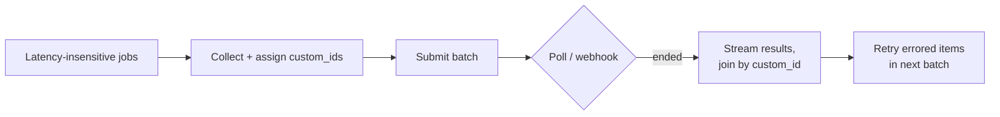

# Batch Processing (The 50% Discount for Patience)

**Addresses:** Cause 6.2 in [`../CAUSE.md`](../CAUSE.md) (cost-side), and
amplifies `document-reuse.md` / `prompt-caching.md`

**Idea:** Every major provider sells the same tokens at **50% off** if you
don't need the answer now. Route all latency-insensitive traffic — nightly
jobs, backfills, evals, bulk classification/extraction, report generation —
through the batch tier.

---

## Provider landscape

| Provider | Offering | Discount | Completion window |
| --- | --- | --- | --- |
| Anthropic | Message Batches API | 50% on all token usage (stacks with prompt-cache discounts) | Most < 1h, max 24h |
| OpenAI | Batch API | 50% | 24h target |
| Google Gemini | Batch mode | 50% | 24h target |
| Self-hosted | vLLM/SGLang offline inference | Effectively more (max GPU utilization, off-peak scheduling) | Yours to choose |

All support the full feature surface (tools, vision, structured outputs,
caching) with per-request `custom_id` correlation; results return in
arbitrary order.

## How to apply

1. **Inventory traffic by latency need.** Anything not blocking a human in
   real time is a batch candidate: evals and regression suites, embeddings/
   enrichment backfills, nightly summaries/reports, moderation sweeps,
   dataset labeling/generation, re-processing after prompt changes.
2. **Restructure "loops over items" into batches.** A cron job that calls
   the API in a for-loop is paying 2× for interactive latency nobody
   observes. Collect the items, submit one batch, poll/webhook for
   completion, fan results back out by `custom_id`.
3. **Stack the discounts.** Share one cached prefix (corpus, few-shot
   battery, system prompt) across all requests in the batch — cache-read
   pricing *and* the 50% batch discount combine (on Anthropic, cached-read
   tokens in a batch are ~5% of base input price).
4. **Handle batch semantics properly:** key by `custom_id` (never
   position), treat `errored`/`expired` items as individually retryable,
   and make jobs idempotent so a re-submit is safe.
5. **Hybrid pattern for "soon but not now":** queue requests for up to N
   minutes, flush as a batch; if the batch tier is backed up near your
   deadline, spill to the interactive tier. This captures the discount for
   semi-interactive workloads (e.g. "results by end of meeting").

## SOTA tools

### Native — coding agents & provider APIs

| Provider / agent | Feature | Notes |
| --- | --- | --- |
| Anthropic API | Message Batches API | The 50% discount itself; 100K-requests-scale per batch; stacks with cache-read pricing |
| OpenAI API | Batch API | 50%, 24h target window |
| Google Gemini API | Batch mode | 50%, 24h target window |

### Third-party — agent-agnostic (open source preferred)

| Tool | License | Notes |
| --- | --- | --- |
| LiteLLM batch support | MIT | Uniform batch submission across providers |
| Airflow / Dagster / Temporal | Apache-2.0 / Apache-2.0 / MIT | Schedule, poll, retry, and fan-out around batch jobs |
| vLLM / SGLang offline mode | Apache-2.0 | Throughput-optimized bulk inference for open models — effectively more than 50% off via max GPU utilization |

## Trade-offs

- Results within up to 24h — genuinely interactive traffic can't use it.
- Async plumbing (submit/poll/join/retry) replaces simple request/response
  code.
- Debugging is slower-cycle: a bad prompt burns a batch turnaround, so
  validate on a small interactive sample first.
- Provider batch queues share org rate-limit pools on some platforms —
  check interaction with interactive traffic.

## Expected impact

- Flat **2× cost reduction** on all migrated traffic — deterministic, no
  quality trade-off whatsoever (same models, same outputs).
- Stacked with shared-prefix caching, bulk Q&A/eval workloads commonly land
  at **5–20× cheaper** than naive interactive loops.
- For many teams, evals + backfills are 30–70% of total token spend —
  making this one of the highest-certainty wins in the catalog.
