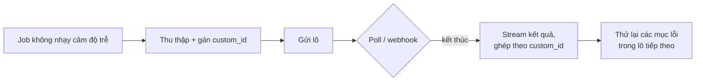
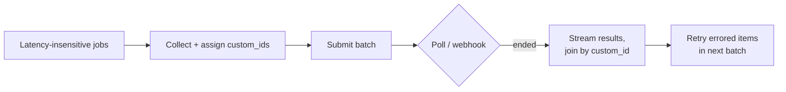

# Xử lý theo Lô (Giảm giá 50% cho sự Kiên nhẫn) (Tiếng Việt)

**Giải quyết:** Nguyên nhân 6.2 trong [`../CAUSE.md`](../CAUSE.md) (phía chi
phí), và khuếch đại `document-reuse.md` / `prompt-caching.md`

**Ý tưởng:** Mọi nhà cung cấp lớn đều bán cùng loại token với giá **giảm
50%** nếu bạn không cần câu trả lời ngay lập tức. Định tuyến mọi lưu lượng
không nhạy cảm về độ trễ — job đêm, backfill, đánh giá, phân loại/trích
xuất hàng loạt, sinh báo cáo — qua tier batch.

---

## Bối cảnh các nhà cung cấp

| Nhà cung cấp | Sản phẩm | Giảm giá | Khung thời gian hoàn tất |
| --- | --- | --- | --- |
| Anthropic | Message Batches API | 50% trên mọi mức sử dụng token (cộng dồn với giảm giá prompt-cache) | Phần lớn < 1 giờ, tối đa 24 giờ |
| OpenAI | Batch API | 50% | Mục tiêu 24 giờ |
| Google Gemini | Chế độ Batch | 50% | Mục tiêu 24 giờ |
| Tự host | Suy luận offline vLLM/SGLang | Thực tế còn hơn (tối đa hóa sử dụng GPU, lên lịch giờ thấp điểm) | Tùy bạn chọn |

Tất cả đều hỗ trợ đầy đủ bề mặt tính năng (tool, thị giác, structured
output, caching) với tương quan `custom_id` theo từng request; kết quả trả
về theo thứ tự tùy ý.

## Cách áp dụng

1. **Kiểm kê lưu lượng theo nhu cầu độ trễ.** Bất cứ điều gì không chặn
   một con người trong thời gian thực đều là ứng viên batch: bộ đánh giá
   và hồi quy, backfill embedding/làm giàu, tóm tắt/báo cáo hàng đêm, quét
   kiểm duyệt, gán nhãn/sinh dataset, xử lý lại sau khi đổi prompt.
2. **Tái cấu trúc "vòng lặp qua các mục" thành các lô.** Một cron job gọi
   API trong một vòng for đang trả giá 2× cho độ trễ tương tác mà không ai
   quan sát. Thu thập các mục, gửi một lô, poll/webhook để chờ hoàn tất,
   phân phối kết quả trở lại theo `custom_id`.
3. **Chồng các mức giảm giá.** Chia sẻ một prefix đã cache (ngữ liệu, bộ
   few-shot, system prompt) trên mọi request trong lô — giá cache-read
   *và* mức giảm giá batch 50% kết hợp (trên Anthropic, token cache-read
   trong một lô chỉ ~5% giá input cơ bản).
4. **Xử lý đúng ngữ nghĩa của batch:** dùng khóa `custom_id` (không bao
   giờ dùng vị trí), coi các mục `errored`/`expired` là có thể thử lại
   riêng lẻ, và làm cho job có tính bất biến để việc gửi lại là an toàn.
5. **Mẫu hình lai cho "sớm nhưng chưa cần ngay":** xếp hàng các request
   tới N phút, sau đó xả ra như một lô; nếu tier batch bị dồn ứ gần deadline
   của bạn, tràn sang tier tương tác. Điều này thu được mức giảm giá cho
   các khối lượng công việc bán-tương-tác (ví dụ "có kết quả trước khi
   họp kết thúc").

## Công cụ hiện đại nhất (SOTA)

### Có sẵn — coding agent & API của nhà cung cấp

| Nhà cung cấp / agent | Tính năng | Ghi chú |
| --- | --- | --- |
| Anthropic API | Message Batches API | Chính mức giảm giá 50%; quy mô 100K request mỗi lô; cộng dồn với giá cache-read |
| OpenAI API | Batch API | 50%, khung mục tiêu 24 giờ |
| Google Gemini API | Chế độ Batch | 50%, khung mục tiêu 24 giờ |

### Bên thứ ba — không phụ thuộc agent (ưu tiên mã nguồn mở)

| Công cụ | Giấy phép | Ghi chú |
| --- | --- | --- |
| Hỗ trợ batch của LiteLLM | MIT | Gửi lô thống nhất qua các nhà cung cấp |
| Airflow / Dagster / Temporal | Apache-2.0 / Apache-2.0 / MIT | Lên lịch, poll, thử lại, và fan-out xung quanh các job batch |
| Chế độ offline vLLM / SGLang | Apache-2.0 | Suy luận hàng loạt tối ưu thông lượng cho model mở — thực tế còn giảm giá hơn 50% nhờ tối đa hóa GPU |

## Đánh đổi

- Kết quả trong vòng tối đa 24 giờ — lưu lượng thực sự tương tác không
  dùng được.
- Hệ thống ống nước bất đồng bộ (gửi/poll/ghép/thử lại) thay thế code
  request/response đơn giản.
- Gỡ lỗi có chu kỳ chậm hơn: một prompt tệ đốt cả một lượt quay vòng
  batch, nên hãy kiểm chứng trên một mẫu tương tác nhỏ trước.
- Hàng đợi batch của nhà cung cấp chia sẻ pool giới hạn tốc độ của tổ
  chức trên một số nền tảng — kiểm tra tương tác với lưu lượng tương tác.

## Tác động dự kiến

- Giảm chi phí cố định **2×** trên toàn bộ lưu lượng đã chuyển — tất
  định, hoàn toàn không đánh đổi chất lượng (cùng model, cùng output).
- Chồng với caching prefix chia sẻ, các khối lượng công việc hỏi-đáp/đánh
  giá hàng loạt thường đạt **rẻ hơn 5–20×** so với các vòng lặp tương tác
  ngây thơ.
- Với nhiều đội, đánh giá + backfill chiếm 30–70% tổng chi tiêu token —
  khiến đây là một trong những thắng lợi chắc chắn nhất trong danh mục.

---

# Batch Processing (The 50% Discount for Patience)

**Addresses:** Cause 6.2 in [`../CAUSE.md`](../CAUSE.md) (cost-side), and
amplifies `document-reuse.md` / `prompt-caching.md`

**Idea:** Every major provider sells the same tokens at **50% off** if you
don't need the answer now. Route all latency-insensitive traffic — nightly
jobs, backfills, evals, bulk classification/extraction, report generation —
through the batch tier.

---

## Provider landscape

| Provider | Offering | Discount | Completion window |
| --- | --- | --- | --- |
| Anthropic | Message Batches API | 50% on all token usage (stacks with prompt-cache discounts) | Most < 1h, max 24h |
| OpenAI | Batch API | 50% | 24h target |
| Google Gemini | Batch mode | 50% | 24h target |
| Self-hosted | vLLM/SGLang offline inference | Effectively more (max GPU utilization, off-peak scheduling) | Yours to choose |

All support the full feature surface (tools, vision, structured outputs,
caching) with per-request `custom_id` correlation; results return in
arbitrary order.

## How to apply

1. **Inventory traffic by latency need.** Anything not blocking a human in
   real time is a batch candidate: evals and regression suites, embeddings/
   enrichment backfills, nightly summaries/reports, moderation sweeps,
   dataset labeling/generation, re-processing after prompt changes.
2. **Restructure "loops over items" into batches.** A cron job that calls
   the API in a for-loop is paying 2× for interactive latency nobody
   observes. Collect the items, submit one batch, poll/webhook for
   completion, fan results back out by `custom_id`.
3. **Stack the discounts.** Share one cached prefix (corpus, few-shot
   battery, system prompt) across all requests in the batch — cache-read
   pricing *and* the 50% batch discount combine (on Anthropic, cached-read
   tokens in a batch are ~5% of base input price).
4. **Handle batch semantics properly:** key by `custom_id` (never
   position), treat `errored`/`expired` items as individually retryable,
   and make jobs idempotent so a re-submit is safe.
5. **Hybrid pattern for "soon but not now":** queue requests for up to N
   minutes, flush as a batch; if the batch tier is backed up near your
   deadline, spill to the interactive tier. This captures the discount for
   semi-interactive workloads (e.g. "results by end of meeting").

## SOTA tools

### Native — coding agents & provider APIs

| Provider / agent | Feature | Notes |
| --- | --- | --- |
| Anthropic API | Message Batches API | The 50% discount itself; 100K-requests-scale per batch; stacks with cache-read pricing |
| OpenAI API | Batch API | 50%, 24h target window |
| Google Gemini API | Batch mode | 50%, 24h target window |

### Third-party — agent-agnostic (open source preferred)

| Tool | License | Notes |
| --- | --- | --- |
| LiteLLM batch support | MIT | Uniform batch submission across providers |
| Airflow / Dagster / Temporal | Apache-2.0 / Apache-2.0 / MIT | Schedule, poll, retry, and fan-out around batch jobs |
| vLLM / SGLang offline mode | Apache-2.0 | Throughput-optimized bulk inference for open models — effectively more than 50% off via max GPU utilization |

## Trade-offs

- Results within up to 24h — genuinely interactive traffic can't use it.
- Async plumbing (submit/poll/join/retry) replaces simple request/response
  code.
- Debugging is slower-cycle: a bad prompt burns a batch turnaround, so
  validate on a small interactive sample first.
- Provider batch queues share org rate-limit pools on some platforms —
  check interaction with interactive traffic.

## Expected impact

- Flat **2× cost reduction** on all migrated traffic — deterministic, no
  quality trade-off whatsoever (same models, same outputs).
- Stacked with shared-prefix caching, bulk Q&A/eval workloads commonly land
  at **5–20× cheaper** than naive interactive loops.
- For many teams, evals + backfills are 30–70% of total token spend —
  making this one of the highest-certainty wins in the catalog.
