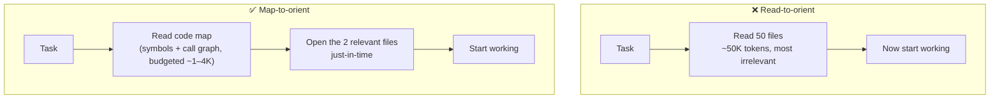

# Code Maps (Orient Without Reading Everything)

**Addresses:** Causes 4.2, 6.5, 6.1, and 2.1 in [`../CAUSE.md`](../CAUSE.md)

**Idea:** Coding agents burn most of their tokens just *finding* the right
code. Instead of reading dozens of files to orient, give the agent a
compact, token-budgeted **map of the codebase** — symbols, signatures, and
the dependency graph — and let it read full files just-in-time, only where
the map says to look.

---

## Why this is the biggest coding-agent tax

Measurements consistently put **~67–76% of a coding agent's token budget on
reading files** — much of it exploratory reads that turn out irrelevant. A
cold agent re-derives the same structural understanding every session
(cause 6.1), and every file it reads persists in history (cause 2.1). A map
replaces "read 50 files to understand the module" with "read the 300-token
map, then open the 2 files that matter."

## How to apply

1. **Give the agent a symbol/graph map, not raw files.** A tree-sitter parse
   extracts definitions and signatures; a graph-ranking pass (PageRank over
   the definition/reference graph) surfaces the most-referenced entities.
   Feed a **token-budgeted** slice of that map, not the whole thing.
2. **Prefer just-in-time retrieval over pre-stuffing.** The map is for
   orientation; actual content is pulled on demand with `grep`/`glob`/read.
   This is why grep-first agents beat "embed the whole repo" for code —
   embedding recall degrades as the codebase grows, while a symbol map +
   targeted read stays precise (see `retrieval-tuning.md` for the RAG side).
3. **Pack once for whole-repo questions.** For "understand this repo" tasks,
   a single packed representation (with per-file token counts so you can see
   and trim the heavy files) beats ad-hoc reads — but *budget it*: packing a
   large repo unfiltered can itself blow the window, so compress and exclude
   generated/vendored code first.
4. **Persist a context pack to kill cold-start cost.** Generate a compact
   project-context artifact once and check it in / cache it, so each new
   session doesn't re-spend 25–60K tokens re-exploring the same layout.
   Regenerate on meaningful structural change, not every session.
5. **Hand-authored maps still count.** A lean `CLAUDE.md` / rules file that
   names the key modules, entry points, and conventions is a human-written
   code map — keep it *lean* (it rides every request, cause 6.4) and point
   to detail rather than inlining it.

## SOTA tools

### Native — coding agents & provider APIs

| Provider / agent | Feature | Notes |
| --- | --- | --- |
| Claude Code / Codex CLI / Gemini CLI | `Grep`/`Glob`/`Read` just-in-time retrieval | The native "navigate, don't ingest" baseline — read files only when the map points at them |
| Claude Code | `CLAUDE.md` orientation file | A hand-authored code map loaded up front; keep it lean and reference-heavy |

### Third-party — agent-agnostic (open source preferred)

| Tool | License | Notes |
| --- | --- | --- |
| aider repo map (`Aider-AI/aider`) | Apache-2.0 | tree-sitter + PageRank ranked symbol map, token-budgeted via `--map-tokens`; 130+ languages; the reference implementation |
| Repomix (`yamadashy/repomix`) | MIT | Packs a repo into one AI-friendly file with `--token-count-tree` (see the heavy files) and `--compress` (tree-sitter signature-only mode) |
| Codesight (`Houseofmvps/codesight`) | MIT | Generates a compact `.codesight/` context pack so agents skip 25–60K tokens of cold-start exploration |
| TokenSave (`aovestdipaperino/tokensave`) | Open source | MCP code-intelligence server: pre-indexed semantic graph queried via MCP tools instead of grep/glob/read loops; 100% local |
| tree-sitter | MIT | The parsing layer under most of the above; roll your own budgeted map for bespoke stacks |

## Trade-offs

- **Maps go stale.** A map generated before an edit misrepresents the code;
  regenerate on structural change and don't trust an old pack blindly.
- **Graph rank ≠ task relevance.** PageRank surfaces *central* code, which
  isn't always what *this* task needs — keep just-in-time read as the escape
  hatch.
- **Packing can itself be large.** Whole-repo packs must be compressed and
  filtered (exclude `node_modules`, generated code, fixtures) or they
  recreate the problem they solve.
- **An MCP code-graph server adds tool schemas** to every request (cause
  3.4) — pair with deferred tool loading (`tool-search.md`).

## Expected impact

- Attacks the largest single cost line in coding agents directly: the
  **67–76% file-finding tax** shrinks toward the cost of one small map plus a
  couple of targeted reads.
- Persisted context packs remove the **25–60K-token cold-start** re-exploration
  from every new session on a repo.
- Compounds with history persistence (cause 2.1) — files never opened never
  accrue in the transcript — and with caching (a stable checked-in map sits
  in the cacheable prefix).
