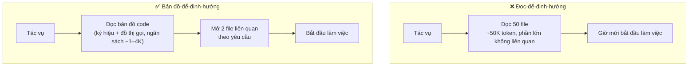
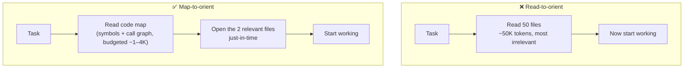

# Bản đồ Code (Định hướng mà không cần đọc mọi thứ) (Tiếng Việt)

**Giải quyết:** Nguyên nhân 4.2, 6.5, 6.1, và 2.1 trong
[`../CAUSE.md`](../CAUSE.md)

**Ý tưởng:** Các coding agent đốt phần lớn token chỉ để *tìm* đúng đoạn
code. Thay vì đọc hàng chục file để định hướng, hãy cho agent một **bản đồ
codebase** gọn nhẹ, có ngân sách token — ký hiệu, chữ ký hàm, và đồ thị phụ
thuộc — và để nó đọc toàn bộ file theo yêu cầu, chỉ ở những nơi bản đồ chỉ
tới.

---

## Tại sao đây là chi phí lớn nhất của coding agent

Các phép đo nhất quán cho thấy **~67–76% ngân sách token của một coding
agent dành cho việc đọc file** — phần lớn là các lần đọc khám phá cuối
cùng hóa ra không liên quan. Một agent lạnh phải tự suy luận lại cùng một
hiểu biết cấu trúc mỗi phiên (nguyên nhân 6.1), và mỗi file nó đọc đều tồn
tại lâu trong lịch sử (nguyên nhân 2.1). Một bản đồ thay thế "đọc 50 file
để hiểu module" bằng "đọc bản đồ 300 token, sau đó mở 2 file liên quan".

## Cách áp dụng

1. **Cho agent một bản đồ ký hiệu/đồ thị, không phải file thô.** Một phép
   phân tích tree-sitter trích xuất định nghĩa và chữ ký hàm; một lượt xếp
   hạng đồ thị (PageRank trên đồ thị định nghĩa/tham chiếu) làm nổi bật
   các thực thể được tham chiếu nhiều nhất. Nạp một lát cắt **có ngân
   sách token** của bản đồ đó, không phải toàn bộ.
2. **Ưu tiên truy xuất theo yêu cầu hơn nhồi sẵn.** Bản đồ dùng để định
   hướng; nội dung thực tế được lấy theo yêu cầu bằng `grep`/`glob`/đọc.
   Đây là lý do các agent ưu tiên grep thắng "nhúng toàn bộ repo" đối với
   code — recall của embedding suy giảm khi codebase lớn lên, trong khi
   bản đồ ký hiệu + đọc có mục tiêu vẫn giữ độ chính xác (xem
   `retrieval-tuning.md` cho phía RAG).
3. **Đóng gói một lần cho các câu hỏi về toàn bộ repo.** Với các tác vụ
   "hiểu repo này", một biểu diễn đóng gói duy nhất (kèm số token mỗi file
   để bạn có thể thấy và cắt bớt các file nặng) thắng các lần đọc tùy hứng
   — nhưng *hãy đặt ngân sách*: đóng gói một repo lớn không lọc có thể tự
   nó làm nổ cửa sổ, nên hãy nén và loại trừ code sinh ra/thư viện bên thứ
   ba trước.
4. **Lưu giữ một gói ngữ cảnh để xóa bỏ chi phí khởi động lạnh.** Sinh một
   artifact ngữ cảnh dự án gọn nhẹ một lần và check-in / cache nó, để mỗi
   phiên mới không phải tốn lại 25–60K token khám phá lại cùng một bố cục.
   Tái sinh khi có thay đổi cấu trúc đáng kể, không phải mỗi phiên.
5. **Bản đồ tự viết tay vẫn có giá trị.** Một file `CLAUDE.md`/rules gọn
   nhẹ nêu tên các module chính, điểm vào, và quy ước là một bản đồ code
   do con người viết — giữ nó *gọn nhẹ* (nó đi theo mọi request, nguyên
   nhân 6.4) và trỏ tới chi tiết thay vì nhúng trực tiếp.

## Công cụ hiện đại nhất (SOTA)

### Có sẵn — coding agent & API của nhà cung cấp

| Nhà cung cấp / agent | Tính năng | Ghi chú |
| --- | --- | --- |
| Claude Code / Codex CLI / Gemini CLI | Truy xuất theo yêu cầu `Grep`/`Glob`/`Read` | Đường cơ sở có sẵn "định hướng, đừng nạp hết" — chỉ đọc file khi bản đồ chỉ tới |
| Claude Code | File định hướng `CLAUDE.md` | Một bản đồ code viết tay được tải từ đầu; giữ gọn nhẹ và nhiều tham chiếu |

### Bên thứ ba — không phụ thuộc agent (ưu tiên mã nguồn mở)

| Công cụ | Giấy phép | Ghi chú |
| --- | --- | --- |
| Bản đồ repo của aider (`Aider-AI/aider`) | Apache-2.0 | Bản đồ ký hiệu xếp hạng tree-sitter + PageRank, có ngân sách token qua `--map-tokens`; 130+ ngôn ngữ; triển khai tham chiếu |
| Repomix (`yamadashy/repomix`) | MIT | Đóng gói một repo vào một file thân thiện với AI với `--token-count-tree` (xem các file nặng) và `--compress` (chế độ chỉ chữ ký tree-sitter) |
| Codesight (`Houseofmvps/codesight`) | MIT | Sinh một gói ngữ cảnh `.codesight/` gọn nhẹ để agent bỏ qua 25–60K token khám phá khởi động lạnh |
| TokenSave (`aovestdipaperino/tokensave`) | Mã nguồn mở | Server trí tuệ code MCP: đồ thị ngữ nghĩa đã index sẵn được truy vấn qua tool MCP thay vì các vòng lặp grep/glob/read; hoàn toàn cục bộ |
| tree-sitter | MIT | Lớp phân tích cú pháp bên dưới hầu hết các công cụ trên; tự viết bản đồ có ngân sách riêng cho các stack đặc thù |

## Đánh đổi

- **Bản đồ có thể lỗi thời.** Một bản đồ được sinh trước một lần chỉnh sửa
  sẽ mô tả sai code; tái sinh khi có thay đổi cấu trúc và đừng tin tưởng
  mù quáng một gói cũ.
- **Xếp hạng đồ thị ≠ độ liên quan với tác vụ.** PageRank làm nổi bật code
  *trung tâm*, không phải lúc nào cũng là thứ *tác vụ này* cần — giữ đọc
  theo yêu cầu như lối thoát.
- **Bản thân việc đóng gói có thể lớn.** Các gói toàn repo phải được nén
  và lọc (loại trừ `node_modules`, code sinh ra, fixture) nếu không chúng
  sẽ tái tạo lại chính vấn đề chúng giải quyết.
- **Một server đồ thị code MCP thêm schema tool** vào mỗi request (nguyên
  nhân 3.4) — kết hợp với tải tool trì hoãn (`tool-search.md`).

## Tác động dự kiến

- Tấn công trực tiếp vào dòng chi phí lớn nhất của coding agent: **chi phí
  67–76% dành cho tìm file** thu nhỏ về mức chi phí của một bản đồ nhỏ
  cộng với vài lần đọc có mục tiêu.
- Các gói ngữ cảnh lưu giữ loại bỏ việc khám phá lại tốn **25–60K token
  khởi động lạnh** khỏi mỗi phiên mới trên một repo.
- Cộng dồn với việc lịch sử tồn tại lâu (nguyên nhân 2.1) — các file không
  bao giờ mở thì không bao giờ tích lũy trong transcript — và với caching
  (một bản đồ ổn định đã check-in nằm trong prefix có thể cache).

---

# Code Maps (Orient Without Reading Everything)

**Addresses:** Causes 4.2, 6.5, 6.1, and 2.1 in [`../CAUSE.md`](../CAUSE.md)

**Idea:** Coding agents burn most of their tokens just *finding* the right
code. Instead of reading dozens of files to orient, give the agent a
compact, token-budgeted **map of the codebase** — symbols, signatures, and
the dependency graph — and let it read full files just-in-time, only where
the map says to look.

---

## Why this is the biggest coding-agent tax

Measurements consistently put **~67–76% of a coding agent's token budget on
reading files** — much of it exploratory reads that turn out irrelevant. A
cold agent re-derives the same structural understanding every session
(cause 6.1), and every file it reads persists in history (cause 2.1). A map
replaces "read 50 files to understand the module" with "read the 300-token
map, then open the 2 files that matter."

## How to apply

1. **Give the agent a symbol/graph map, not raw files.** A tree-sitter parse
   extracts definitions and signatures; a graph-ranking pass (PageRank over
   the definition/reference graph) surfaces the most-referenced entities.
   Feed a **token-budgeted** slice of that map, not the whole thing.
2. **Prefer just-in-time retrieval over pre-stuffing.** The map is for
   orientation; actual content is pulled on demand with `grep`/`glob`/read.
   This is why grep-first agents beat "embed the whole repo" for code —
   embedding recall degrades as the codebase grows, while a symbol map +
   targeted read stays precise (see `retrieval-tuning.md` for the RAG side).
3. **Pack once for whole-repo questions.** For "understand this repo" tasks,
   a single packed representation (with per-file token counts so you can see
   and trim the heavy files) beats ad-hoc reads — but *budget it*: packing a
   large repo unfiltered can itself blow the window, so compress and exclude
   generated/vendored code first.
4. **Persist a context pack to kill cold-start cost.** Generate a compact
   project-context artifact once and check it in / cache it, so each new
   session doesn't re-spend 25–60K tokens re-exploring the same layout.
   Regenerate on meaningful structural change, not every session.
5. **Hand-authored maps still count.** A lean `CLAUDE.md` / rules file that
   names the key modules, entry points, and conventions is a human-written
   code map — keep it *lean* (it rides every request, cause 6.4) and point
   to detail rather than inlining it.

## SOTA tools

### Native — coding agents & provider APIs

| Provider / agent | Feature | Notes |
| --- | --- | --- |
| Claude Code / Codex CLI / Gemini CLI | `Grep`/`Glob`/`Read` just-in-time retrieval | The native "navigate, don't ingest" baseline — read files only when the map points at them |
| Claude Code | `CLAUDE.md` orientation file | A hand-authored code map loaded up front; keep it lean and reference-heavy |

### Third-party — agent-agnostic (open source preferred)

| Tool | License | Notes |
| --- | --- | --- |
| aider repo map (`Aider-AI/aider`) | Apache-2.0 | tree-sitter + PageRank ranked symbol map, token-budgeted via `--map-tokens`; 130+ languages; the reference implementation |
| Repomix (`yamadashy/repomix`) | MIT | Packs a repo into one AI-friendly file with `--token-count-tree` (see the heavy files) and `--compress` (tree-sitter signature-only mode) |
| Codesight (`Houseofmvps/codesight`) | MIT | Generates a compact `.codesight/` context pack so agents skip 25–60K tokens of cold-start exploration |
| TokenSave (`aovestdipaperino/tokensave`) | Open source | MCP code-intelligence server: pre-indexed semantic graph queried via MCP tools instead of grep/glob/read loops; 100% local |
| tree-sitter | MIT | The parsing layer under most of the above; roll your own budgeted map for bespoke stacks |

## Trade-offs

- **Maps go stale.** A map generated before an edit misrepresents the code;
  regenerate on structural change and don't trust an old pack blindly.
- **Graph rank ≠ task relevance.** PageRank surfaces *central* code, which
  isn't always what *this* task needs — keep just-in-time read as the escape
  hatch.
- **Packing can itself be large.** Whole-repo packs must be compressed and
  filtered (exclude `node_modules`, generated code, fixtures) or they
  recreate the problem they solve.
- **An MCP code-graph server adds tool schemas** to every request (cause
  3.4) — pair with deferred tool loading (`tool-search.md`).

## Expected impact

- Attacks the largest single cost line in coding agents directly: the
  **67–76% file-finding tax** shrinks toward the cost of one small map plus a
  couple of targeted reads.
- Persisted context packs remove the **25–60K-token cold-start** re-exploration
  from every new session on a repo.
- Compounds with history persistence (cause 2.1) — files never opened never
  accrue in the transcript — and with caching (a stable checked-in map sits
  in the cacheable prefix).
