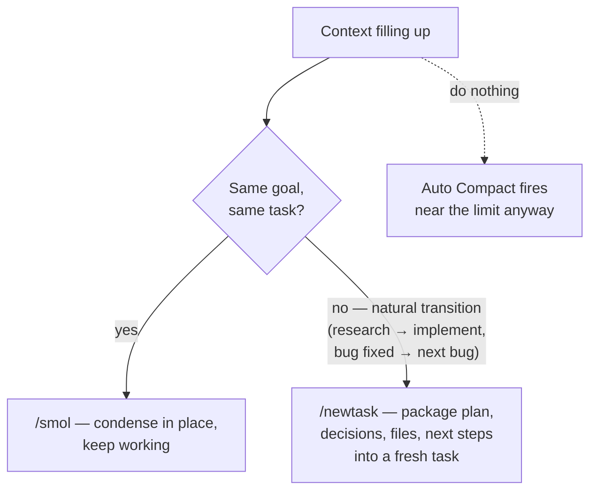

# Coding Setup: Cline (VS Code Extension)

A concrete instantiation of [`recommended-setup.md`](recommended-setup.md)
for **Cline** — the open-source (Apache-2.0) VS Code coding agent. Cline is
BYO-provider and bills per token through your own API keys, so every cause
in [`../CAUSE.md`](../CAUSE.md) lands directly on your invoice — and almost
every dial to fix it is exposed in the extension.

> Verify against current Cline docs/releases before rollout — the
> extension ships fast and feature names move.

---

## Tier 0 — what Cline gives you natively

Checked against the harness-capability checklist in `recommended-setup.md`:

| Capability | Cline status | Catalog doc |
| --- | --- | --- |
| Prompt caching | ✅ Automatic on supporting providers (Anthropic, OpenRouter, Gemini…); cache reads/writes and savings shown per task | `prompt-caching.md` |
| Compaction | ✅ **Auto Compact** near the window limit + manual `/smol` (alias `/compact`) and `/newtask`; **Focus Chain** keeps the todo list alive across summarizations | `compaction.md` |
| Diff-based edits | ✅ `replace_in_file` SEARCH/REPLACE blocks as the default edit path | `diff-based-edits.md` |
| Budgeted tools | ⚠️ Partial — file reads are not sliced by default; mitigate with `.clineignore`, tight task scoping, and rules (below) | `tool-output-budgets.md` |
| Deferred tool loading | ❌ MCP schemas are injected into every request — you must trim manually (below) | `tool-search.md` |

So Tier 0 is mostly inherited; your setup work concentrates on **provider
choice, the fixed prompt overhead, and context discipline**.

---

## 1. Provider & caching setup (the single biggest lever)

Cline re-sends the full conversation every request — without cache-resident
history you pay 5–10× more in long sessions (cause 1.1).

| Route | Caching | Notes |
| --- | --- | --- |
| **Anthropic API key (direct)** — recommended | ✅ Automatic breakpoints; reads ~0.1×, writes 1.25× | Best-instrumented path; Cline surfaces cache metrics per task |
| **OpenRouter / Cline provider** | ✅ For caching-capable models | One key, many models — pairs well with the Plan/Act split below |
| **Gemini API key** | ✅ Implicit caching | Flash tiers are strong cheap Act/Plan options |
| **OpenAI-compatible / local (Ollama, LM Studio)** | ⚠️ Depends on server | Self-hosted: front with vLLM/SGLang so APC/RadixAttention gives you prefix reuse |
| Claude subscription OAuth | ❌ Blocked since Jan 2026 outside Anthropic's own CLI | Use a real API key |

Verify it's working: open any completed task's cost breakdown — steady-state
turns should show large cache-read counts. **Zero cache reads on turn 5+ of
a session means something is invalidating the prefix** (usually an edited
rules file mid-session — cause 1.3).

## 2. Model & effort map via Plan/Act

Cline's Plan/Act split is its native routing mechanism
(`model-routing.md`): configure a **separate model per mode** in settings.

| Mode | Pick (Anthropic ladder) | Rationale |
| --- | --- | --- |
| Plan | Frontier (Opus-tier) | Architecture/decisions is where capability pays |
| Act | Frontier or strong-mid (Sonnet-tier); sweep on your tasks | Well-planned implementation often holds quality one tier down |

Equivalent ladders: GPT-5.x ↔ mini; Gemini 3 Pro ↔ Flash — one key via
OpenRouter covers all of them.

Two cache caveats (cause 1.3):

- **Switching models mid-task rebuilds the cache** — the new model re-pays
  the whole history at full input price. Switch at mode boundaries you'd
  cross anyway, not mid-implementation.
- Keep both modes within one provider where possible so the history stays
  cache-warm across the Plan→Act transition when the model is shared.

Use **Deep Planning** for big tasks: front-loading a clean plan makes the
(expensive) Act phase shorter and less exploratory.

## 3. Context discipline — Auto Compact, `/smol`, `/newtask`

- **One task = one goal.** Long multi-goal tasks accumulate history that
  every turn re-bills (cause 2.1). `/newtask` at transitions is the
  briefing-handoff pattern from `subagent-context-handoff.md` — carried
  state is the *summary*, not the transcript.
- Prefer an explicit `/smol` at a natural pause over waiting for Auto
  Compact mid-flow — you choose the moment the (one-time) cache rebuild
  happens.
- Keep **Focus Chain** on for long tasks so the todo list survives
  compaction.
- Don't paste huge logs/files into chat — reference paths and let Cline
  read; mention files with `@file` so only what's needed enters context.

## 4. Trim the fixed per-request overhead

Everything below rides in **every single request** of every task:

- **`.clinerules`** — keep it lean (it's a system-prompt extension, cause
  6.4). Move situational playbooks into docs Cline reads on demand; don't
  let the rules folder become a wiki. Never put volatile content
  (dates, ticket numbers) in rules — that's a session-wide cache
  invalidator; and **don't edit rules mid-task** (finish, edit, `/newtask`).
- **`.clineignore`** — exclude `node_modules`, build output, lockfiles,
  generated code, fixtures. Cuts both file-listing overhead and accidental
  giant reads.
- **MCP servers** — every connected server's tool schemas are injected
  wholesale (cause 3.4). Disable servers you're not using *today* and
  toggle off unused tools of the ones you keep; re-enable takes seconds.
  A few idle servers can quietly add thousands of tokens per request.

## 5. Telemetry

- **Per-task**: Cline's task header shows tokens (in/out), cache
  reads/writes, and cost — make checking it a habit; anomalies (zero cache
  reads, ballooning input) are visible right there.
- **Team/fleet level** (the Tier 1.1 requirement): point Cline's
  OpenAI-compatible provider at a **LiteLLM gateway** (MIT) with keys per
  engineer, and ship usage to **Langfuse** (MIT) / **Helicone**
  (Apache-2.0). You get the three alerts from `recommended-setup.md`
  (cache-hit drop, super-linear growth, cost per task) across everyone's
  Cline usage — the caveat is that gateway routes must still be
  caching-capable, so validate cache metrics after inserting the proxy.

## 6. Agent-agnostic add-ons, by the cause they attack

Each add-on below maps to a numbered cause in [`../CAUSE.md`](../CAUSE.md)
and a solution doc that explains the mechanism. The list is deliberately
gap-shaped: Cline already covers compaction, diff edits, and caching
natively (§Tier 0), so third-party tools are only worth adding where Cline
has a gap.

### Tool-output bloat — causes 3.1, 2.1 → [`tool-output-compression.md`](tool-output-compression.md)

Cline's biggest native gap: file reads and command output enter context
unsliced.

| Tool | License | How it plugs into Cline |
| --- | --- | --- |
| RTK (`rtk-ai/rtk`) | Apache-2.0 | Compresses 100+ dev commands' output 60–90% before it hits context; **native Cline project-scoped config**; preserves test failures/diffs/errors |
| Headroom (`headroomlabs-ai/headroom`) | Apache-2.0 | Local proxy or MCP server compressing tool results in-flight (JSON 60–95%, build logs ~94%); `CacheAligner` keeps the prefix cache hitting; **Cline in its support matrix** |

### Cold starts & repo orientation — causes 6.5, 4.2 → [`code-maps.md`](code-maps.md)

Every new Cline task re-explores the repo (the 25–60K-token cold-start tax).

| Tool | License | How it plugs into Cline |
| --- | --- | --- |
| Repomix (`yamadashy/repomix`) | MIT | Pack/compress the repo (`--compress` = signatures only) into a checked-in file; reference it with `@file` at task start |
| Codesight (`Houseofmvps/codesight`) | MIT | Generates a `.codesight/` context pack agents read instead of re-scanning |
| TokenSave (`aovestdipaperino/tokensave`) | OSS | Local MCP code-graph server — Cline queries the pre-built symbol graph instead of grep/read loops (mind cause 3.4: it adds tool schemas) |
| OpenMemory MCP (mem0) | Apache-2.0 | Local-first memory MCP server, **Cline officially supported** — decisions/facts persist across tasks so `/newtask` handoffs and new sessions start warm |

Cline-native alternative for memory: the community **Memory Bank** pattern
(structured `.clinerules` files the agent maintains) — zero new
infrastructure, but it rides in every request, so keep it lean (cause 6.4).

### Output verbosity — cause 5.2 → [`concise-output-prompting.md`](concise-output-prompting.md)

| Tool | License | How it plugs into Cline |
| --- | --- | --- |
| Caveman (`wilpel/caveman-compression`) | MIT | Output-compression rules/skill, Cline supported; strips narration/filler while keeping code and facts — internal work only, not user-facing prose |

### Fleet-level: duplicates, telemetry, routing — causes 6.6, 4.3, 6.2

| Tool | License | How it plugs into Cline |
| --- | --- | --- |
| LiteLLM gateway + Langfuse / Helicone | MIT / Apache-2.0 | Point Cline's OpenAI-compatible provider at the gateway → per-engineer usage, the three alerts, uniform routing (`token-counting.md`, `model-routing.md`) |
| GPTCache (`zilliztech/GPTCache`) | MIT | Response-level cache at the gateway for repetitive read-only prompts; **keep off coding-edit routes** (`semantic-caching.md`) |

### Prompt overhead — cause 6.4 → [`prompt-de-scaffolding.md`](prompt-de-scaffolding.md)

| Tool | License | How it plugs into Cline |
| --- | --- | --- |
| promptfoo | MIT | Ablate `.clinerules` blocks like any prompt: delete a block, run your eval tasks, keep the deletion if quality holds |

### Local-model serving — cause 1.1 → [`prompt-caching.md`](prompt-caching.md)

| Tool | License | How it plugs into Cline |
| --- | --- | --- |
| vLLM / SGLang | Apache-2.0 | Front Ollama/LM Studio-style setups with APC/RadixAttention so Cline's re-sent history gets prefix reuse a bare local server won't give |

The **RTK + Headroom + Caveman** trio is the community's "token-saving
stack" for VS Code agents — input-side CLI compression, API-layer
tool-result compression, and output-side response compression respectively;
all three list Cline as supported. Add **OpenMemory or a checked-in
Repomix map** on top and the two remaining structural gaps (tool-output
bloat and cold starts) are both covered.

What you should **not** add: LLMLingua-style context compressors (fidelity
risk on code — `recommended-setup.md` Tier 3), a second compaction layer
(Cline's Auto Compact + `/smol` already covers cause 2.1), or a dynamic
model router (the Plan/Act split *is* the router for this profile).

## Setup checklist

1. ☐ API-key provider with caching (Anthropic direct or OpenRouter); confirm
   cache reads in the task cost breakdown
2. ☐ Plan/Act models configured per the map; effort/thinking dialed per mode
3. ☐ `.clineignore` covering deps/build artifacts; `.clinerules` lean and
   frozen mid-task
4. ☐ MCP servers pruned to today's set; unused tools toggled off
5. ☐ Habits: one task = one goal, `/smol` at pauses, `/newtask` at
   transitions, Focus Chain on
6. ☐ (Team) LiteLLM gateway + Langfuse with the three alerts
7. ☐ Gap add-ons where telemetry justifies them: RTK/Headroom for tool-output
   bloat, Repomix map or OpenMemory MCP for cold starts, Caveman for verbose
   internal routes

## Expected impact

| Change | Typical effect |
| --- | --- |
| Caching-capable provider (vs none) | 5–10× effective input reduction in long sessions |
| Plan/Act model split | 2–4× off blended per-token price on Act-heavy work |
| MCP pruning + lean rules | Thousands of tokens off *every* request |
| `/smol`–`/newtask` discipline | Quadratic → bounded session cost; fewer quality-degrading overlong tasks |
| `.clineignore` | Removes the accidental-giant-read class of spikes |
