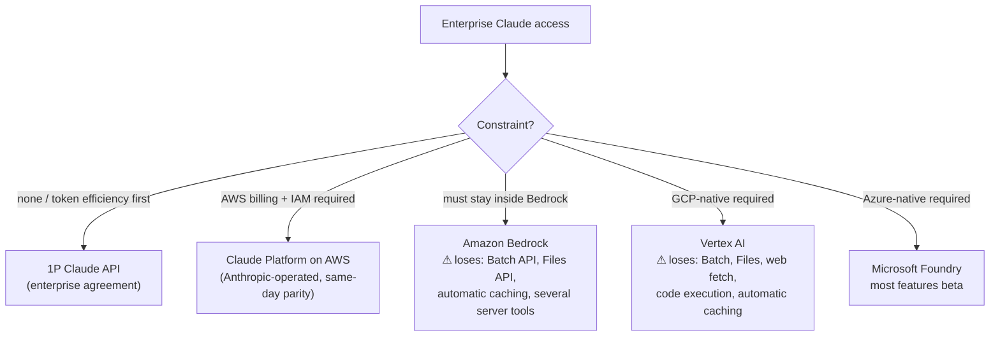

# Enterprise Coding-Agent Setups: Claude, GPT, Gemini

Concrete, vendor-specific instantiations of
[`recommended-setup.md`](recommended-setup.md) for **coding agents in an
enterprise environment**, for the three major stacks. Each section covers:
the enterprise access route (and which routes silently *lose*
token-optimization features), the coding harness to standardize on, how
caching actually works there, the model/effort map, and the batch +
telemetry hookups.

> ⚠️ Pricing, model names, and feature availability move fast — treat the
> numbers here as the shape of the landscape and re-verify against current
> vendor docs before contracting.

---

## The blueprint all three instantiate

| Tier (from `recommended-setup.md`) | Claude | GPT | Gemini |
| --- | --- | --- | --- |
| Harness (Tier 0) | Claude Code / Claude Agent SDK | Codex (CLI + cloud) / Agents SDK | Gemini CLI + Code Assist / ADK |
| Caching mechanism | Explicit `cache_control` breakpoints (5m/1h TTL) | Automatic prefix caching (≥1,024 tokens) + `prompt_cache_key` | Implicit caching + explicit `CachedContent` (TTL, storage-billed) |
| Cached-input discount | ~90% (reads ~0.1×) | 50–90% by model family (GPT-5.x: ~90%) | ~75% on cached tokens |
| Reasoning dial | `output_config.effort` (low→max) + adaptive thinking | `reasoning_effort` (minimal→high) + `verbosity` | `thinking_level` / `thinking_budget` |
| Batch tier | Message Batches −50% | Batch API −50% (+ Flex tier on some models) | Vertex/Gemini batch −50% |
| Frontier / mid / small for the model map | Opus 4.8 / Sonnet 5 / Haiku 4.5 | GPT-5.x-Codex / GPT-5.x / GPT-5-mini·nano | Gemini 3 Pro / Gemini 2.5 Flash / Flash-Lite |

---

## 1. Claude (Anthropic)

### Access route — the decision that gates everything

Enterprise Claude reaches you through five doors, and **they are not
feature-equivalent**. For a token-optimized coding fleet the differences
matter more than the procurement convenience:

**Recommendation:** 1P API or **Claude Platform on AWS** (Anthropic-operated
with same-day API parity, SigV4/IAM, AWS Marketplace billing) — you keep the
full optimization surface. Choose Bedrock/Vertex only when policy forces it,
and budget for the missing 50%-batch tier and Files API (both directly
token-bill-relevant).

### Harness

- **Interactive + CI coding:** **Claude Code** — enterprise deployment
  supports SSO, managed settings/policies, spend controls, and can run
  against 1P, Bedrock, or Vertex backends. It ships the whole Tier-0 stack:
  cached stable prompt head, auto-compaction, budgeted tools
  (`Read` offset/limit, `Grep` head_limit, background bash with log files),
  anchor-verified `Edit`, deferred MCP tool loading.
- **Custom agent fleets:** **Claude Agent SDK** (same harness as a library)
  rather than a bare Messages-API loop; you inherit compaction, subagents,
  hooks, and permissioning instead of rebuilding them.
- **Server-managed fleets:** Managed Agents (beta) if you want Anthropic to
  run the loop + sandbox — sessions get compaction and prompt caching
  built in.

### Token-optimization configuration

1. **Caching:** explicit `cache_control: {type: "ephemeral"}` on the last
   stable block (tools+system cache together); use `ttl: "1h"` for agent
   fleets with gaps between runs; `max_tokens: 0` pre-warm before scheduled
   fleet starts. Reads ~0.1×, writes 1.25×/2×. Enforce the prompt-stability
   CI test — Claude's caching is explicit, so a mutated head fails *loudly
   in your telemetry* if you watch `cache_read_input_tokens`.
2. **Model/effort map** (per agent role, in config):

   | Role | Model | Effort |
   | --- | --- | --- |
   | Orchestrator / hard coding | `claude-opus-4-8` ($5/$25 per MTok) | `high`, sweep `xhigh` |
   | Standard coding subagents | `claude-sonnet-5` ($3/$15) | `high` |
   | Search/explore/summarize/commit-msg | `claude-haiku-4-5` ($1/$5) | `low` |

3. **Batch:** route eval suites, nightly refactor scans, and bulk
   triage through Message Batches (−50%, stacks with cache reads) — 1P and
   Claude Platform on AWS only.
4. **Long-session hygiene:** server-side compaction / context editing
   (`clear_tool_uses`) come with the harness; verify the compaction block
   round-trip if you drive the API directly.
5. **Telemetry:** `usage` carries all four quantities incl.
   `cache_creation_input_tokens` — wire into Langfuse/OTel with
   `agent_role` tags; alert on cache-hit-share drops per role.

---

## 2. GPT (OpenAI / Azure)

### Access route

- **OpenAI direct (enterprise agreement)** — full feature surface,
  ChatGPT Enterprise seats for humans + API for agents; zero-data-retention
  and compliance addenda available.
- **Azure OpenAI (Azure AI Foundry)** — for Azure-native IAM, networking,
  data-zone/regional residency, and **Provisioned Throughput Units (PTU)**
  for predictable capacity pricing. Feature parity is good but typically
  lags direct API by weeks; verify Batch + caching discounts on your target
  deployment type before assuming them.

### Harness

- **Interactive + CI coding:** **Codex** — CLI for local/CI, Codex cloud
  for delegated tasks, with enterprise admin/SSO via ChatGPT Enterprise
  workspaces. Codex variants of GPT-5.x are specifically post-trained for
  agentic coding and are the intended default there.
- **Custom fleets:** **OpenAI Agents SDK** on the **Responses API** (not
  bare chat completions) — you get server-side conversation state
  (`previous_response_id`), built-in tools, and handoffs; the Responses API
  is also where reasoning-item reuse between turns is handled for you,
  which matters for both cost and quality on o-series/GPT-5 reasoning
  models.

### Token-optimization configuration

1. **Caching is automatic — your job is prefix discipline.** Prefix caching
   engages on prompts ≥1,024 tokens with no opt-in and no write surcharge;
   cached input is discounted 50–90% depending on family (GPT-5.x at the
   high end). Because there are no explicit breakpoints, the *only* lever
   is byte-stable prefix ordering (`stable-prompt-architecture.md`) plus
   `prompt_cache_key` to improve routing for high-QPS shared prefixes.
   Monitor `usage.prompt_tokens_details.cached_tokens` per route.
2. **Model/effort map:**

   | Role | Model | Dials |
   | --- | --- | --- |
   | Orchestrator / hard coding | GPT-5.x-Codex (Max-tier variant for long-horizon) | `reasoning_effort: high` |
   | Standard coding subagents | GPT-5.x / Codex standard | `reasoning_effort: medium` |
   | Search/summarize/format legwork | GPT-5-mini / nano | `reasoning_effort: minimal`–`low`, `verbosity: low` |

   `verbosity` is a native output-length dial — use it instead of prompt
   surgery for report-style routes.
3. **Batch + Flex:** Batch API −50% for evals/backfills; the **Flex**
   service tier (slower, cheaper) covers "soon but not now" traffic that
   doesn't fit 24h batch semantics. On Azure, prefer Batch/PTU mix: PTU for
   steady interactive load, batch for spiky offline load.
4. **Reasoning-token watch:** reasoning spend is visible at
   `usage.completion_tokens_details.reasoning_tokens` — alert on
   reasoning-share creep per route; it's the GPT-side equivalent of the
   thinking-token line item.
5. **Context management is yours (or the SDK's):** chat-completions-style
   loops have no server-side compaction — use the Agents SDK session
   trimming/summarization, or the Responses API `truncation: "auto"`, and
   apply `context-editing.md` heuristics in custom harnesses.

---

## 3. Gemini (Google Cloud)

### Access route

- **Vertex AI** is the enterprise front door for the API fleet: CMEK,
  VPC-SC, data residency, **Provisioned Throughput** for reserved capacity,
  and batch prediction. Consumer-grade AI Studio keys are not the
  enterprise path.
- **Gemini Code Assist Enterprise** licenses for human developers
  (IDE + code customization against your private repos); **Gemini
  Enterprise** for org-wide agent/workspace governance.

### Harness

- **Interactive + CI coding:** **Gemini CLI** (terminal agent, ties to Code
  Assist licensing for enterprise controls), Code Assist in IDEs; Google's
  agentic IDE (Antigravity) and the Jules async coding agent are the
  managed-experience options — evaluate maturity for your fleet before
  standardizing.
- **Custom fleets:** **Agent Development Kit (ADK)** + Vertex AI Agent
  Engine for hosted loops — again, inherit rather than hand-build the loop,
  sessions, and tool plumbing.

### Token-optimization configuration

1. **Two-layer caching — manage the explicit layer actively.**
   - *Implicit caching*: automatic on 2.5+/3 models, ~75% discount on
     cached tokens, same prefix-stability discipline as everyone else
     (watch `cached_content_token_count`).
   - *Explicit `CachedContent`*: pin a large corpus (monorepo docs, API
     surface summaries, style guides) once with a chosen TTL. **It bills
     storage per token-hour** — size TTLs to usage windows and delete on
     idle, or the cache itself becomes a cost line. This is the best
     mechanism of the three vendors for "many agents share one huge
     corpus," and the only one you can *forget to turn off*.
2. **Mind long-context pricing tiers.** Gemini's huge windows (1–2M) carry
   **higher per-token rates above a threshold** (e.g. >200K input on Pro
   tiers). "Just stuff the monorepo in" crosses into the premium band —
   retrieval/slicing (`retrieval-tuning.md`, `tool-output-budgets.md`)
   is still cheaper than raw window size.
3. **Model/thinking map:**

   | Role | Model | Dials |
   | --- | --- | --- |
   | Orchestrator / hard coding | Gemini 3 Pro | `thinking_level: high` |
   | Standard subagents | Gemini 2.5 Flash (or 3-tier flash when available) | moderate `thinking_budget` |
   | Legwork / classify / summarize | 2.5 Flash-Lite | `thinking_budget: 0`/minimal |

   Thinking tokens are surfaced as `thoughts_token_count` — same
   per-route alerting as the other two vendors.
4. **Batch:** Vertex batch prediction at −50% for evals/backfills/bulk
   transforms; pairs with explicit caching for shared-corpus batch Q&A.
5. **Telemetry:** `usageMetadata` (prompt/candidates/cached/thoughts token
   counts) into the same Langfuse/OTel pipeline — keep one dashboard schema
   across all three vendors (the four-quantity model from
   [`../CAUSE.md`](../CAUSE.md) §Measurement Primer maps cleanly).

---

## Running a mixed fleet (most enterprises end up here)

1. **One gateway, one telemetry schema.** Put a gateway (LiteLLM,
   Portkey, or your own) in front of all three so usage lands in one
   pipeline with uniform `vendor / model / agent_role / session` tags.
   Cost-per-completed-task must be comparable across vendors or the fleet
   composition debate runs on vibes.
2. **Route per fleet/agent-role, never per turn.** Caches are
   vendor+model-scoped; mid-session vendor hops rebuild everything. Assign
   a vendor+model per agent role (as in the maps above) and keep sessions
   homogeneous.
3. **Don't force one harness across vendors.** Each vendor's own coding
   harness carries its Tier-0 optimizations (Claude Code, Codex, Gemini
   CLI); a lowest-common-denominator custom loop typically forfeits
   caching/compaction quality on all three. Standardize the *conventions*
   (briefing/artifact contracts, telemetry tags, prompt-stability CI) —
   not the binary.
4. **Negotiate with usage data.** Enterprise agreements on all three sides
   price on committed volume — the telemetry stack from Tier 1 doubles as
   your negotiation evidence for which vendor gets which workload.

## Expected result

Applied per vendor, the same 5–20× cost-per-task improvement from
`recommended-setup.md` holds, with the vendor-specific deltas being:

- **Claude:** largest *controllable* caching upside (explicit breakpoints,
  1h TTL, pre-warm) — best fit for long-lived agent fleets; watch the
  access-route feature matrix or you silently lose batch/caching tools.
- **GPT:** lowest-effort caching (automatic, no write surcharge) and native
  `verbosity`/`reasoning_effort` dials — fastest to a "good" state; context
  management is the part you must own.
- **Gemini:** strongest shared-corpus economics (explicit cache) and
  cheapest legwork tier — best fit for corpus-heavy fleets; actively manage
  cache storage and long-context pricing bands or the savings invert.
