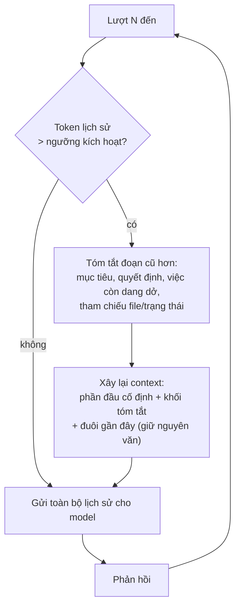
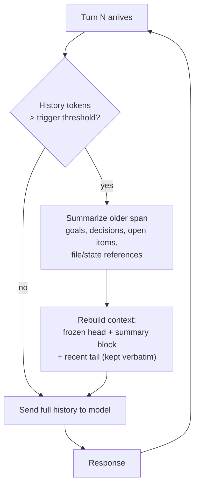

# Nén Hội thoại (Tóm tắt rồi Tiếp tục) (Tiếng Việt)

**Giải quyết:** Nguyên nhân 2.1 trong [`../CAUSE.md`](../CAUSE.md)

**Ý tưởng:** Khi lịch sử hội thoại tiến gần một ngưỡng token nhất định, hãy
thay phần cũ hơn bằng một bản tóm tắt cô đọng vẫn giữ được trạng thái liên
quan đến tác vụ. Sau đó tiếp tục phiên làm việc dựa trên bản tóm tắt đó,
nhờ vậy chi phí input mỗi lượt được giới hạn thay vì tăng trưởng không
điểm dừng.

---

## Cách hoạt động

Các quyết định thiết kế then chốt:

- **Ngưỡng kích hoạt**: thường vào khoảng 60–80% ngân sách context thực tế
  (ví dụ 150K trên cửa sổ 1M cho triển khai phía server), hoặc thấp hơn
  nhiều nếu mục tiêu của bạn là giới hạn chi phí chứ không chỉ tránh tràn.
- **Giữ nguyên đuôi hội thoại**: K lượt gần nhất được giữ nguyên văn, vì
  model cần trạng thái gần đây chính xác (kết quả tool cuối cùng, nội dung
  file hiện tại).
- **Hợp đồng tóm tắt**: bản tóm tắt phải nắm bắt được *mục tiêu, ràng buộc,
  các quyết định đã đưa ra, artifact đã tạo ra (đường dẫn/ID), và TODO còn
  mở* — chứ không phải văn xuôi kể lể dài dòng. Một bản tóm tắt tệ sẽ âm
  thầm làm mất trạng thái tác vụ, khiến agent phải khám phá lại từ đầu —
  và việc đó thường tốn nhiều token hơn số đã tiết kiệm được.
- **Tương tác với cache**: việc nén viết lại lịch sử nên sẽ vô hiệu hóa
  cache cấp tin nhắn một lần. Đây là đánh đổi hợp lý vì lịch sử sau khi
  viết lại chỉ còn một phần nhỏ so với bản gốc — prefix mới, nhỏ hơn, sẽ
  được cache lại ngay ở lượt tiếp theo.

## Cách áp dụng

1. **Ưu tiên dùng cơ chế nén phía server nếu nhà cung cấp hỗ trợ** — vì nó
   đã được tinh chỉnh sẵn, và artifact tóm tắt cũng được quản lý hộ bạn:
   - *Anthropic*: `context_management: {edits: [{type: "compact_20260112"}]}`
     (beta) — API tự động tóm tắt khi gần đến ngưỡng và trả về một khối
     `compaction` mà bạn **phải** nối lại nguyên văn ở các request tiếp
     theo. Các harness được quản lý sẵn (Claude Code, Claude Agent SDK,
     các phiên Managed Agents) tự động nén mà bạn không cần viết thêm code
     phía client.
   - *OpenAI*: Responses API với `previous_response_id` cùng truncation
     `auto` quản lý context phía server; Agents SDK cung cấp bộ nhớ phiên
     kèm các chiến lược tóm tắt.
2. **Ở phía client, hãy dùng bộ nhớ tóm tắt sẵn có của framework** thay vì
   tự viết tay: LangGraph `SummarizationNode` / LangChain
   `ConversationSummaryBufferMemory`, LlamaIndex `ChatSummaryMemoryBuffer`,
   hoặc tính năng auto-compact có sẵn của Claude Agent SDK.
3. **Nếu tự viết tay**: hãy chạy lệnh gọi tóm tắt trên một **model rẻ**
   (tier Haiku/mini), và tái sử dụng đúng prefix prompt của agent cha để
   chính request tóm tắt cũng trúng cache (xem `prompt-caching.md` — mục
   quy tắc fork).
4. **Lưu trạng thái bền vững bên ngoài cửa sổ context** để việc nén có thể
   mạnh tay hơn: ghi các quyết định/bài học ra file hoặc kho lưu bộ nhớ
   riêng (xem `subagent-context-handoff.md`) thay vì coi transcript là
   nguồn sự thật duy nhất.

## Công cụ hiện đại nhất (SOTA)

### Có sẵn — coding agent & API của nhà cung cấp

| Nhà cung cấp / agent | Tính năng | Ghi chú |
| --- | --- | --- |
| Anthropic API | Nén phía server (`compact-2026-01-12`) | Tự động tóm tắt khi gần ngưỡng; khối nén được gửi và nhận qua lại (round-trip) |
| Claude Code / Claude Agent SDK | Auto-compact + lệnh `/compact` | Không cần cấu hình; việc nén được kích hoạt và áp dụng ngay bên trong harness |
| OpenAI API · Codex CLI | Responses API (`truncation: "auto"`, `previous_response_id`); Codex `/compact` | Trạng thái hội thoại do server quản lý; có lệnh nén ở cấp harness |
| Gemini CLI | Lệnh `/compress` + ngưỡng tự nén | Tóm tắt lịch sử ở cấp harness |

### Bên thứ ba — không phụ thuộc agent (ưu tiên mã nguồn mở)

| Công cụ | Giấy phép | Ghi chú |
| --- | --- | --- |
| LangGraph `SummarizationNode` | MIT | Chính sách kích hoạt + tóm tắt + giữ-đuôi có thể kết hợp linh hoạt cho các vòng lặp tùy chỉnh |
| LlamaIndex `ChatSummaryMemoryBuffer` | MIT | Bộ nhớ tóm tắt có giới hạn ngân sách token |
| mem0 | Apache-2.0 | Trích xuất các sự kiện bền vững ra khỏi transcript để bản thân transcript có thể thu nhỏ lại; Zep là lựa chọn thương mại thay thế, có bản OSS cộng đồng |

## Đánh đổi

- **Có mất mát thông tin.** Bất cứ điều gì bản tóm tắt bỏ sót đều biến
  mất; model có thể phải suy luận lại nó (tốn thêm token) hoặc tiếp tục
  làm việc dựa trên giả định đã lỗi thời (tốn độ chính xác). Có thể giảm
  thiểu bằng hợp đồng tóm tắt nêu trên, kết hợp với các file trạng thái
  bên ngoài.
- Vô hiệu hóa cache một lần cho mỗi lần nén diễn ra.
- Bản thân lệnh gọi tóm tắt cũng tốn token — nên dùng model rẻ và đừng
  kích hoạt quá sớm.
- Khó gỡ lỗi hơn, vì transcript không còn chứa lịch sử nguyên văn.

## Tác động dự kiến

- Biến chi phí phiên vốn tăng theo cấp số nhân thành chi phí **gần như
  tuyến tính**: input mỗi lượt bị giới hạn bởi `ngưỡng_kích_hoạt` thay vì
  tăng trưởng mãi mãi.
- Trong các lượt chạy agentic dài (hàng trăm lượt), tổng chi tiêu input
  thường giảm **3–10 lần**, với mức giới hạn do ngưỡng kích hoạt của bạn
  quyết định.
- Loại bỏ các lỗi cứng `context_window_exceeded` — lỗi mà nếu xảy ra sẽ
  lãng phí toàn bộ công sức đã đầu tư cho cả phiên.

---

# Conversation Compaction (Summarize-and-Continue)

**Addresses:** Cause 2.1 in [`../CAUSE.md`](../CAUSE.md)

**Idea:** When the conversation history approaches a token threshold, replace
the older portion with a dense summary that preserves task-relevant state,
and continue the session on top of the summary — bounding per-turn input
cost instead of letting it grow without limit.

---

## How it works

Key design decisions:

- **Trigger**: usually 60–80% of the practical context budget (e.g. 150K on
  a 1M window for server-side implementations, or much lower if you want to
  bound cost rather than just avoid overflow).
- **Keep-tail**: the most recent K turns stay verbatim — the model needs
  exact recent state (last tool results, current file contents).
- **Summary contract**: the summary must capture *goals, constraints,
  decisions made, artifacts produced (paths/IDs), and open TODOs* — not
  narrative prose. A bad summary silently loses task state and causes
  expensive re-discovery (which costs more than it saved).
- **Cache interaction**: compaction rewrites the history, which invalidates
  the message-level cache once. That's the right trade when the rewritten
  history is a fraction of the original — the new, smaller prefix re-caches
  on the next turn.

## How to apply

1. **Prefer server-side compaction when the provider offers it** — it's
   tuned, and the summary artifact is managed for you:
   - *Anthropic*: `context_management: {edits: [{type: "compact_20260112"}]}`
     (beta) — the API summarizes automatically near the threshold and
     returns a `compaction` block that you **must** append back verbatim on
     subsequent requests. Managed harnesses (Claude Code, Claude Agent SDK,
     Managed Agents sessions) auto-compact without any client code.
   - *OpenAI*: the Responses API with `previous_response_id` + truncation
     `auto` manages context server-side; the Agents SDK exposes session
     memory with summarization strategies.
2. **Client-side, use your framework's summarization memory** rather than
   hand-rolling: LangGraph `SummarizationNode` / LangChain
   `ConversationSummaryBufferMemory`, LlamaIndex `ChatSummaryMemoryBuffer`,
   or the Claude Agent SDK's built-in auto-compact.
3. **Hand-rolled**: run the summarization call on a **cheap model**
   (Haiku-tier / mini-tier), reusing the parent's exact prompt prefix so the
   summarization request itself hits the cache (see
   `prompt-caching.md` — fork rule).
4. **Persist durable state outside the window** so compaction can be
   aggressive: write decisions/learnings to files or a memory store (see
   `subagent-context-handoff.md`) instead of relying on the transcript as
   the only source of truth.

## SOTA tools

### Native — coding agents & provider APIs

| Provider / agent | Feature | Notes |
| --- | --- | --- |
| Anthropic API | Server-side compaction (`compact-2026-01-12`) | Automatic near-threshold summarization; compaction block round-trip |
| Claude Code / Claude Agent SDK | Auto-compact + `/compact` command | Zero-config; compaction is triggered and applied inside the harness |
| OpenAI API · Codex CLI | Responses API (`truncation: "auto"`, `previous_response_id`); Codex `/compact` | Server-managed conversation state; harness-level compaction command |
| Gemini CLI | `/compress` command + auto-compression threshold | Harness-level history summarization |

### Third-party — agent-agnostic (open source preferred)

| Tool | License | Notes |
| --- | --- | --- |
| LangGraph `SummarizationNode` | MIT | Composable trigger + summarizer + keep-tail policy for custom loops |
| LlamaIndex `ChatSummaryMemoryBuffer` | MIT | Token-budgeted summary memory |
| mem0 | Apache-2.0 | Extract durable facts out of the transcript so the transcript itself can shrink; Zep is a commercial alternative with an OSS community edition |

## Trade-offs

- **Lossy.** Anything the summary drops is gone; the model may re-derive it
  (paying tokens) or proceed on stale assumptions (paying correctness).
  Mitigate with the summary contract above + external state files.
- One-time cache invalidation per compaction event.
- The summarization call itself costs tokens — use a cheap model and don't
  trigger too eagerly.
- Harder to debug: transcripts no longer contain the literal history.

## Expected impact

- Turns quadratic session cost into **roughly linear** cost: per-turn input
  is bounded by `trigger_threshold` instead of growing forever.
- On long agentic runs (hundreds of turns), total input spend typically
  drops **3–10×**, with the bound set by your trigger threshold.
- Eliminates hard `context_window_exceeded` failures, which otherwise waste
  the entire session's investment.
