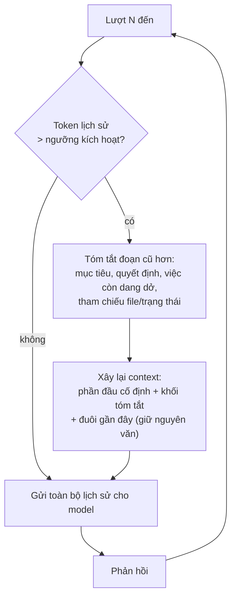
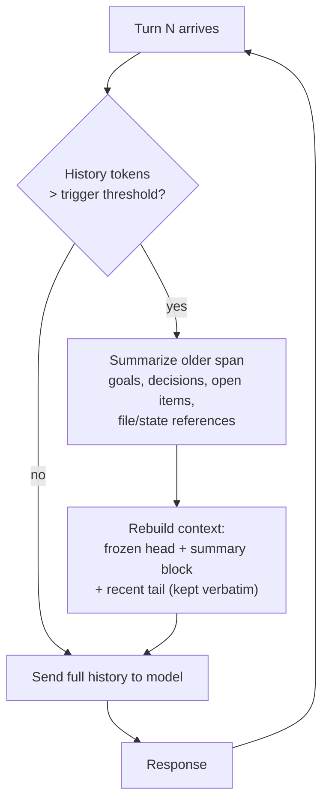

# Nén Hội thoại (Tóm tắt-và-Tiếp tục) (Tiếng Việt)

**Giải quyết:** Nguyên nhân 2.1 trong [`../CAUSE.md`](../CAUSE.md)

**Ý tưởng:** Khi lịch sử hội thoại tiệm cận một ngưỡng token, thay thế phần
cũ hơn bằng một bản tóm tắt cô đọng giữ lại trạng thái liên quan đến tác vụ,
và tiếp tục phiên trên nền bản tóm tắt đó — giới hạn chi phí input mỗi lượt
thay vì để nó tăng trưởng không giới hạn.

---

## Cách hoạt động

Các quyết định thiết kế then chốt:

- **Ngưỡng kích hoạt**: thường 60–80% ngân sách context thực tế (ví dụ
  150K trên cửa sổ 1M cho triển khai phía server, hoặc thấp hơn nhiều nếu
  bạn muốn giới hạn chi phí thay vì chỉ tránh tràn).
- **Giữ đuôi**: K lượt gần nhất được giữ nguyên văn — model cần trạng thái
  gần đây chính xác (kết quả tool cuối cùng, nội dung file hiện tại).
- **Hợp đồng tóm tắt**: bản tóm tắt phải nắm bắt *mục tiêu, ràng buộc,
  quyết định đã đưa ra, artifact đã tạo (đường dẫn/ID), và TODO còn mở* —
  không phải văn xuôi tường thuật. Một bản tóm tắt tệ sẽ âm thầm mất trạng
  thái tác vụ và gây ra việc khám phá lại tốn kém (tốn nhiều hơn số đã tiết
  kiệm được).
- **Tương tác với cache**: nén viết lại lịch sử, điều này vô hiệu hóa cache
  cấp tin nhắn một lần. Đó là đánh đổi hợp lý khi lịch sử được viết lại chỉ
  bằng một phần nhỏ của bản gốc — prefix mới, nhỏ hơn sẽ được cache lại
  trong lượt tiếp theo.

## Cách áp dụng

1. **Ưu tiên nén phía server khi nhà cung cấp hỗ trợ** — nó đã được tinh
   chỉnh, và artifact tóm tắt được quản lý hộ bạn:
   - *Anthropic*: `context_management: {edits: [{type: "compact_20260112"}]}`
     (beta) — API tự động tóm tắt gần ngưỡng và trả về một khối
     `compaction` mà bạn **phải** nối lại nguyên văn trên các request tiếp
     theo. Các harness được quản lý (Claude Code, Claude Agent SDK, các
     phiên Managed Agents) tự động nén mà không cần code phía client.
   - *OpenAI*: Responses API với `previous_response_id` + truncation
     `auto` quản lý context phía server; Agents SDK cung cấp bộ nhớ phiên
     với các chiến lược tóm tắt.
2. **Phía client, dùng bộ nhớ tóm tắt của framework của bạn** thay vì tự
   viết tay: LangGraph `SummarizationNode` / LangChain
   `ConversationSummaryBufferMemory`, LlamaIndex `ChatSummaryMemoryBuffer`,
   hoặc auto-compact có sẵn của Claude Agent SDK.
3. **Tự viết tay**: chạy lệnh gọi tóm tắt trên một **model rẻ** (tier
   Haiku/mini), tái sử dụng chính xác prefix prompt của agent cha để chính
   request tóm tắt cũng trúng cache (xem `prompt-caching.md` — quy tắc
   fork).
4. **Lưu trạng thái bền vững bên ngoài cửa sổ** để việc nén có thể mạnh
   tay hơn: ghi các quyết định/bài học vào file hoặc kho lưu bộ nhớ (xem
   `subagent-context-handoff.md`) thay vì dựa vào transcript như nguồn sự
   thật duy nhất.

## Công cụ hiện đại nhất (SOTA)

### Có sẵn — coding agent & API của nhà cung cấp

| Nhà cung cấp / agent | Tính năng | Ghi chú |
| --- | --- | --- |
| Anthropic API | Nén phía server (`compact-2026-01-12`) | Tự động tóm tắt gần ngưỡng; vòng lặp khối nén round-trip |
| Claude Code / Claude Agent SDK | Auto-compact + lệnh `/compact` | Không cần cấu hình; việc nén được kích hoạt và áp dụng bên trong harness |
| OpenAI API · Codex CLI | Responses API (`truncation: "auto"`, `previous_response_id`); Codex `/compact` | Trạng thái hội thoại quản lý bởi server; lệnh nén cấp harness |
| Gemini CLI | Lệnh `/compress` + ngưỡng tự nén | Tóm tắt lịch sử cấp harness |

### Bên thứ ba — không phụ thuộc agent (ưu tiên mã nguồn mở)

| Công cụ | Giấy phép | Ghi chú |
| --- | --- | --- |
| LangGraph `SummarizationNode` | MIT | Chính sách kích hoạt + tóm tắt + giữ-đuôi có thể kết hợp cho các vòng lặp tùy chỉnh |
| LlamaIndex `ChatSummaryMemoryBuffer` | MIT | Bộ nhớ tóm tắt có ngân sách token |
| mem0 | Apache-2.0 | Trích xuất các sự kiện bền vững ra khỏi transcript để bản thân transcript có thể thu nhỏ; Zep là lựa chọn thương mại thay thế có bản OSS cộng đồng |

## Đánh đổi

- **Có mất mát.** Bất cứ điều gì bản tóm tắt bỏ sót đều biến mất; model có
  thể phải suy luận lại nó (tốn token) hoặc tiếp tục dựa trên giả định lỗi
  thời (tốn độ chính xác). Giảm thiểu bằng hợp đồng tóm tắt ở trên + các
  file trạng thái bên ngoài.
- Vô hiệu hóa cache một lần cho mỗi sự kiện nén.
- Bản thân lệnh gọi tóm tắt cũng tốn token — dùng model rẻ và đừng kích
  hoạt quá sớm.
- Khó gỡ lỗi hơn: transcript không còn chứa lịch sử nguyên văn.

## Tác động dự kiến

- Biến chi phí phiên bậc hai thành chi phí **gần như tuyến tính**: input
  mỗi lượt bị giới hạn bởi `ngưỡng_kích_hoạt` thay vì tăng trưởng mãi mãi.
- Trên các lượt chạy agentic dài (hàng trăm lượt), tổng chi tiêu input
  thường giảm **3–10×**, với giới hạn được đặt bởi ngưỡng kích hoạt của
  bạn.
- Loại bỏ các lỗi cứng `context_window_exceeded`, vốn nếu không sẽ lãng
  phí toàn bộ đầu tư của phiên.

---

# Conversation Compaction (Summarize-and-Continue)

**Addresses:** Cause 2.1 in [`../CAUSE.md`](../CAUSE.md)

**Idea:** When the conversation history approaches a token threshold, replace
the older portion with a dense summary that preserves task-relevant state,
and continue the session on top of the summary — bounding per-turn input
cost instead of letting it grow without limit.

---

## How it works

Key design decisions:

- **Trigger**: usually 60–80% of the practical context budget (e.g. 150K on
  a 1M window for server-side implementations, or much lower if you want to
  bound cost rather than just avoid overflow).
- **Keep-tail**: the most recent K turns stay verbatim — the model needs
  exact recent state (last tool results, current file contents).
- **Summary contract**: the summary must capture *goals, constraints,
  decisions made, artifacts produced (paths/IDs), and open TODOs* — not
  narrative prose. A bad summary silently loses task state and causes
  expensive re-discovery (which costs more than it saved).
- **Cache interaction**: compaction rewrites the history, which invalidates
  the message-level cache once. That's the right trade when the rewritten
  history is a fraction of the original — the new, smaller prefix re-caches
  on the next turn.

## How to apply

1. **Prefer server-side compaction when the provider offers it** — it's
   tuned, and the summary artifact is managed for you:
   - *Anthropic*: `context_management: {edits: [{type: "compact_20260112"}]}`
     (beta) — the API summarizes automatically near the threshold and
     returns a `compaction` block that you **must** append back verbatim on
     subsequent requests. Managed harnesses (Claude Code, Claude Agent SDK,
     Managed Agents sessions) auto-compact without any client code.
   - *OpenAI*: the Responses API with `previous_response_id` + truncation
     `auto` manages context server-side; the Agents SDK exposes session
     memory with summarization strategies.
2. **Client-side, use your framework's summarization memory** rather than
   hand-rolling: LangGraph `SummarizationNode` / LangChain
   `ConversationSummaryBufferMemory`, LlamaIndex `ChatSummaryMemoryBuffer`,
   or the Claude Agent SDK's built-in auto-compact.
3. **Hand-rolled**: run the summarization call on a **cheap model**
   (Haiku-tier / mini-tier), reusing the parent's exact prompt prefix so the
   summarization request itself hits the cache (see
   `prompt-caching.md` — fork rule).
4. **Persist durable state outside the window** so compaction can be
   aggressive: write decisions/learnings to files or a memory store (see
   `subagent-context-handoff.md`) instead of relying on the transcript as
   the only source of truth.

## SOTA tools

### Native — coding agents & provider APIs

| Provider / agent | Feature | Notes |
| --- | --- | --- |
| Anthropic API | Server-side compaction (`compact-2026-01-12`) | Automatic near-threshold summarization; compaction block round-trip |
| Claude Code / Claude Agent SDK | Auto-compact + `/compact` command | Zero-config; compaction is triggered and applied inside the harness |
| OpenAI API · Codex CLI | Responses API (`truncation: "auto"`, `previous_response_id`); Codex `/compact` | Server-managed conversation state; harness-level compaction command |
| Gemini CLI | `/compress` command + auto-compression threshold | Harness-level history summarization |

### Third-party — agent-agnostic (open source preferred)

| Tool | License | Notes |
| --- | --- | --- |
| LangGraph `SummarizationNode` | MIT | Composable trigger + summarizer + keep-tail policy for custom loops |
| LlamaIndex `ChatSummaryMemoryBuffer` | MIT | Token-budgeted summary memory |
| mem0 | Apache-2.0 | Extract durable facts out of the transcript so the transcript itself can shrink; Zep is a commercial alternative with an OSS community edition |

## Trade-offs

- **Lossy.** Anything the summary drops is gone; the model may re-derive it
  (paying tokens) or proceed on stale assumptions (paying correctness).
  Mitigate with the summary contract above + external state files.
- One-time cache invalidation per compaction event.
- The summarization call itself costs tokens — use a cheap model and don't
  trigger too eagerly.
- Harder to debug: transcripts no longer contain the literal history.

## Expected impact

- Turns quadratic session cost into **roughly linear** cost: per-turn input
  is bounded by `trigger_threshold` instead of growing forever.
- On long agentic runs (hundreds of turns), total input spend typically
  drops **3–10×**, with the bound set by your trigger threshold.
- Eliminates hard `context_window_exceeded` failures, which otherwise waste
  the entire session's investment.
