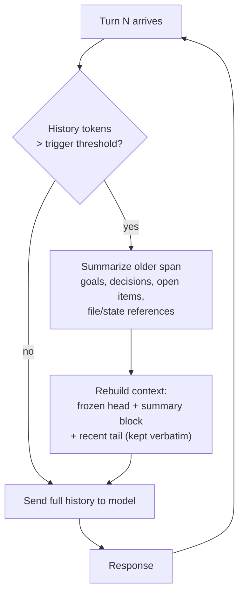

# Conversation Compaction (Summarize-and-Continue)

**Addresses:** Cause 2.1 in [`../CAUSE.md`](../CAUSE.md)

**Idea:** When the conversation history approaches a token threshold, replace
the older portion with a dense summary that preserves task-relevant state,
and continue the session on top of the summary — bounding per-turn input
cost instead of letting it grow without limit.

---

## How it works

Key design decisions:

- **Trigger**: usually 60–80% of the practical context budget (e.g. 150K on
  a 1M window for server-side implementations, or much lower if you want to
  bound cost rather than just avoid overflow).
- **Keep-tail**: the most recent K turns stay verbatim — the model needs
  exact recent state (last tool results, current file contents).
- **Summary contract**: the summary must capture *goals, constraints,
  decisions made, artifacts produced (paths/IDs), and open TODOs* — not
  narrative prose. A bad summary silently loses task state and causes
  expensive re-discovery (which costs more than it saved).
- **Cache interaction**: compaction rewrites the history, which invalidates
  the message-level cache once. That's the right trade when the rewritten
  history is a fraction of the original — the new, smaller prefix re-caches
  on the next turn.

## How to apply

1. **Prefer server-side compaction when the provider offers it** — it's
   tuned, and the summary artifact is managed for you:
   - *Anthropic*: `context_management: {edits: [{type: "compact_20260112"}]}`
     (beta) — the API summarizes automatically near the threshold and
     returns a `compaction` block that you **must** append back verbatim on
     subsequent requests. Managed harnesses (Claude Code, Claude Agent SDK,
     Managed Agents sessions) auto-compact without any client code.
   - *OpenAI*: the Responses API with `previous_response_id` + truncation
     `auto` manages context server-side; the Agents SDK exposes session
     memory with summarization strategies.
2. **Client-side, use your framework's summarization memory** rather than
   hand-rolling: LangGraph `SummarizationNode` / LangChain
   `ConversationSummaryBufferMemory`, LlamaIndex `ChatSummaryMemoryBuffer`,
   or the Claude Agent SDK's built-in auto-compact.
3. **Hand-rolled**: run the summarization call on a **cheap model**
   (Haiku-tier / mini-tier), reusing the parent's exact prompt prefix so the
   summarization request itself hits the cache (see
   `prompt-caching.md` — fork rule).
4. **Persist durable state outside the window** so compaction can be
   aggressive: write decisions/learnings to files or a memory store (see
   `subagent-context-handoff.md`) instead of relying on the transcript as
   the only source of truth.

## SOTA tools

| Tool | Scope | Notes |
| --- | --- | --- |
| Anthropic server-side compaction (`compact-2026-01-12`) | API | Automatic near-threshold summarization; compaction block round-trip |
| Claude Agent SDK / Claude Code auto-compact | Harness | Zero-config; compaction is triggered and applied inside the harness |
| OpenAI Responses API (`truncation: "auto"`, `previous_response_id`) | API | Server-managed conversation state |
| LangGraph `SummarizationNode` | Framework | Composable trigger + summarizer + keep-tail policy |
| LlamaIndex `ChatSummaryMemoryBuffer` | Framework | Token-budgeted summary memory |
| mem0 / Zep | Memory layer | Extract durable facts out of the transcript so the transcript itself can shrink |

## Trade-offs

- **Lossy.** Anything the summary drops is gone; the model may re-derive it
  (paying tokens) or proceed on stale assumptions (paying correctness).
  Mitigate with the summary contract above + external state files.
- One-time cache invalidation per compaction event.
- The summarization call itself costs tokens — use a cheap model and don't
  trigger too eagerly.
- Harder to debug: transcripts no longer contain the literal history.

## Expected impact

- Turns quadratic session cost into **roughly linear** cost: per-turn input
  is bounded by `trigger_threshold` instead of growing forever.
- On long agentic runs (hundreds of turns), total input spend typically
  drops **3–10×**, with the bound set by your trigger threshold.
- Eliminates hard `context_window_exceeded` failures, which otherwise waste
  the entire session's investment.
