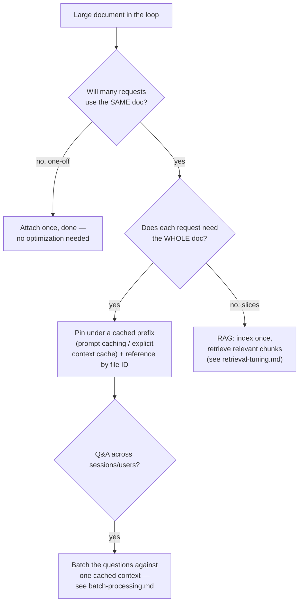

# Document Reuse (Upload Once, Reference Many)

**Addresses:** Cause 4.2 in [`../CAUSE.md`](../CAUSE.md) (with `retrieval-tuning.md`)

**Idea:** Stop re-transmitting and re-billing the same large document on
every request. Upload it once and reference it by ID, pin it under a cached
prefix, or — when only slices are relevant — retrieve slices instead of
attaching the whole thing.

---

## Decision guide

## How to apply

1. **Reference by ID instead of re-embedding bytes**
   - *Anthropic Files API*: upload once → `file_id` → reference in any
     number of messages. Upload/storage is free; content is billed as input
     when used — so pair with caching (below).
   - *OpenAI*: Files + vector stores (file search tool) or input file
     references on the Responses API.
   - *Gemini File API*: upload once, reference across requests (48h
     retention).
2. **Pair the document with a cache breakpoint.** Referencing by ID removes
   the *transmission* redundancy but the tokens are still processed per
   request unless cached. Place the document in the stable prefix with a
   cache breakpoint after it (`prompt-caching.md`); on Gemini, explicit
   `CachedContent` is designed exactly for this ("cache the corpus, vary
   the question") and discounts cached tokens ~4×.
3. **Order Q&A flows for prefix sharing.** `[doc][question]` caches the doc
   across questions; `[question][doc]` caches nothing. Always put the shared
   corpus before the varying query.
4. **Extract once, reuse the extraction.** For PDFs where only the text
   matters, run extraction (text layer / OCR) once in the harness and feed
   the clean text — a scanned-PDF page as an image costs multiples of its
   text content, every request.
5. **Chunk very large corpora into RAG** rather than context-stuffing:
   above a few hundred K tokens, retrieval beats "attach everything" on
   both cost and answer quality (long-context recall degrades; see
   `retrieval-tuning.md`).

## SOTA tools

| Tool | Scope | Notes |
| --- | --- | --- |
| Anthropic Files API + `cache_control` on the document block | API | Upload-once + cached processing |
| Gemini explicit context caching (`CachedContent`) | API | Purpose-built for shared-corpus Q&A; TTL-controlled |
| OpenAI vector stores + file search | API | Managed chunk/index/retrieve for slice-access patterns |
| unstructured.io / Marker / Docling | Extraction | High-quality PDF → text/markdown, run once in the harness |
| LlamaIndex / LangChain document stores | Framework | Index-once pipelines with per-query retrieval |

## Trade-offs

- Explicit caches and file stores have TTLs/storage quotas to manage; a
  cache-expired corpus silently reverts to full price (monitor usage
  metadata).
- RAG introduces retrieval-quality risk — a missed chunk is a wrong answer;
  whole-doc + cache is safer when the doc fits comfortably.
- File-ID references tie you to provider storage (egress/compliance
  considerations for sensitive documents).

## Expected impact

- Multi-question flows over one document go from `doc_tokens × questions`
  to `doc_tokens × 1 (+ cached reads at ~0.1–0.25×)` — for a 100K-token
  report and 50 questions, that's **~5M input tokens → ~600K** effective.
- Extraction-once (text instead of page images) typically cuts per-request
  document cost **3–10×** for scanned/graphic-heavy PDFs.
- Moving >500K-token corpora from context-stuffing to tuned RAG usually
  reduces per-query input **10–100×** while improving answer precision.
