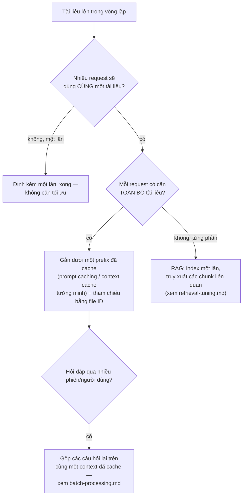
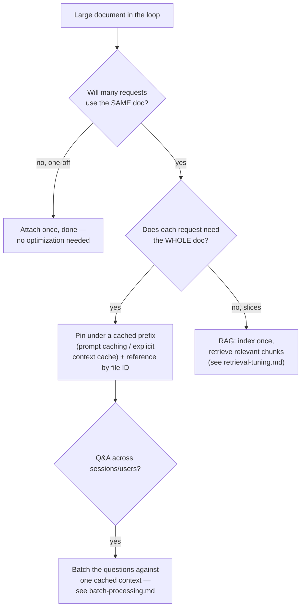

# Tái sử dụng Tài liệu (Tải lên một lần, Tham chiếu nhiều lần) (Tiếng Việt)

**Giải quyết:** Nguyên nhân 4.2 trong [`../CAUSE.md`](../CAUSE.md) (cùng với
`retrieval-tuning.md`)

**Ý tưởng:** Ngừng việc truyền lại và tính phí lại cùng một tài liệu lớn
trên mỗi request. Tải nó lên một lần và tham chiếu bằng ID, gắn nó dưới một
prefix đã cache, hoặc — khi chỉ một số phần là liên quan — truy xuất từng
phần thay vì đính kèm toàn bộ.

---

## Hướng dẫn ra quyết định

## Cách áp dụng

1. **Tham chiếu bằng ID thay vì nhúng lại byte**
   - *Anthropic Files API*: tải lên một lần → `file_id` → tham chiếu trong
     bất kỳ số lượng tin nhắn nào. Tải lên/lưu trữ miễn phí; nội dung được
     tính phí như input khi sử dụng — nên kết hợp với caching (bên dưới).
   - *OpenAI*: Files + vector store (tool file search) hoặc tham chiếu file
     input trên Responses API.
   - *Gemini File API*: tải lên một lần, tham chiếu qua nhiều request (giữ
     48 giờ).
2. **Kết hợp tài liệu với một breakpoint cache.** Tham chiếu bằng ID loại
   bỏ sự dư thừa *truyền tải* nhưng các token vẫn được xử lý theo từng
   request trừ khi được cache. Đặt tài liệu trong prefix ổn định với một
   breakpoint cache sau nó (`prompt-caching.md`); trên Gemini,
   `CachedContent` tường minh được thiết kế chính xác cho việc này ("cache
   corpus, thay đổi câu hỏi") và giảm giá token đã cache ~4×.
3. **Sắp xếp các luồng hỏi-đáp để chia sẻ prefix.** `[tài liệu][câu hỏi]`
   cache tài liệu qua các câu hỏi; `[câu hỏi][tài liệu]` không cache gì
   cả. Luôn đặt shared corpus trước truy vấn thay đổi.
4. **Trích xuất một lần, tái sử dụng bản trích xuất.** Với các PDF chỉ có
   văn bản là quan trọng, chạy trích xuất (lớp văn bản/OCR) một lần trong
   harness và nạp văn bản sạch — một trang PDF quét dưới dạng ảnh tốn kém
   gấp nhiều lần nội dung văn bản của nó, mỗi request.
5. **Chia các corpus rất lớn thành RAG** thay vì nhồi nhét vào context: trên vài trăm nghìn token, truy xuất thắng "đính kèm mọi thứ" cả
   về chi phí lẫn chất lượng câu trả lời (recall context dài suy giảm; xem
   `retrieval-tuning.md`).

## Công cụ hiện đại nhất (SOTA)

### Có sẵn — coding agent & API của nhà cung cấp

| Nhà cung cấp / agent | Tính năng | Ghi chú |
| --- | --- | --- |
| Anthropic API | Files API + `cache_control` trên khối tài liệu | Tải một lần + xử lý được cache |
| Google Gemini API | Caching context tường minh (`CachedContent`) | Được thiết kế riêng cho hỏi-đáp shared corpus; kiểm soát bằng TTL |
| OpenAI API | Vector store + file search | Chunk/index/truy xuất được quản lý cho các mẫu hình truy cập từng phần |

### Bên thứ ba — không phụ thuộc agent (ưu tiên mã nguồn mở)

| Công cụ | Giấy phép | Ghi chú |
| --- | --- | --- |
| Docling / unstructured.io | MIT / Apache-2.0 | PDF → text/markdown chất lượng cao, chạy một lần trong harness; Marker (GPL-3.0) là lựa chọn thay thế mạnh |
| Kho tài liệu LlamaIndex / LangChain | MIT | Pipeline index-một-lần với truy xuất theo từng truy vấn, di động qua các nhà cung cấp |

## Đánh đổi

- Cache tường minh và kho file có TTL/hạn ngạch lưu trữ cần quản lý; một
  corpus cache đã hết hạn sẽ âm thầm quay về giá đầy đủ (theo dõi
  metadata sử dụng).
- RAG đưa vào rủi ro chất lượng truy xuất — một chunk bị bỏ sót là một câu
  trả lời sai; toàn bộ tài liệu + cache an toàn hơn khi tài liệu vừa vặn
  thoải mái.
- Tham chiếu file-ID ràng buộc bạn với lưu trữ của nhà cung cấp (cân nhắc
  về xuất dữ liệu/tuân thủ cho tài liệu nhạy cảm).

## Tác động dự kiến

- Các luồng nhiều câu hỏi trên một tài liệu chuyển từ `token_tài_liệu ×
  số_câu_hỏi` thành `token_tài_liệu × 1 (+ các lần đọc cache ở
  ~0.1–0.25×)` — với một báo cáo 100K token và 50 câu hỏi, đó là **~5M
  token input → ~600K** hiệu dụng.
- Trích xuất một lần (văn bản thay vì ảnh trang) thường cắt giảm chi phí
  tài liệu mỗi request **3–10×** cho các PDF quét/nhiều đồ họa.
- Chuyển các corpus >500K token từ nhồi context sang RAG đã tinh
  chỉnh thường giảm input mỗi truy vấn **10–100×** trong khi cải thiện độ
  chính xác câu trả lời.

---

# Document Reuse (Upload Once, Reference Many)

**Addresses:** Cause 4.2 in [`../CAUSE.md`](../CAUSE.md) (with `retrieval-tuning.md`)

**Idea:** Stop re-transmitting and re-billing the same large document on
every request. Upload it once and reference it by ID, pin it under a cached
prefix, or — when only slices are relevant — retrieve slices instead of
attaching the whole thing.

---

## Decision guide

## How to apply

1. **Reference by ID instead of re-embedding bytes**
   - *Anthropic Files API*: upload once → `file_id` → reference in any
     number of messages. Upload/storage is free; content is billed as input
     when used — so pair with caching (below).
   - *OpenAI*: Files + vector stores (file search tool) or input file
     references on the Responses API.
   - *Gemini File API*: upload once, reference across requests (48h
     retention).
2. **Pair the document with a cache breakpoint.** Referencing by ID removes
   the *transmission* redundancy but the tokens are still processed per
   request unless cached. Place the document in the stable prefix with a
   cache breakpoint after it (`prompt-caching.md`); on Gemini, explicit
   `CachedContent` is designed exactly for this ("cache the corpus, vary
   the question") and discounts cached tokens ~4×.
3. **Order Q&A flows for prefix sharing.** `[doc][question]` caches the doc
   across questions; `[question][doc]` caches nothing. Always put the shared
   corpus before the varying query.
4. **Extract once, reuse the extraction.** For PDFs where only the text
   matters, run extraction (text layer / OCR) once in the harness and feed
   the clean text — a scanned-PDF page as an image costs multiples of its
   text content, every request.
5. **Chunk very large corpora into RAG** rather than context-stuffing:
   above a few hundred K tokens, retrieval beats "attach everything" on
   both cost and answer quality (long-context recall degrades; see
   `retrieval-tuning.md`).

## SOTA tools

### Native — coding agents & provider APIs

| Provider / agent | Feature | Notes |
| --- | --- | --- |
| Anthropic API | Files API + `cache_control` on the document block | Upload-once + cached processing |
| Google Gemini API | Explicit context caching (`CachedContent`) | Purpose-built for shared-corpus Q&A; TTL-controlled |
| OpenAI API | Vector stores + file search | Managed chunk/index/retrieve for slice-access patterns |

### Third-party — agent-agnostic (open source preferred)

| Tool | License | Notes |
| --- | --- | --- |
| Docling / unstructured.io | MIT / Apache-2.0 | High-quality PDF → text/markdown, run once in the harness; Marker (GPL-3.0) is a strong alternative |
| LlamaIndex / LangChain document stores | MIT | Index-once pipelines with per-query retrieval, portable across providers |

## Trade-offs

- Explicit caches and file stores have TTLs/storage quotas to manage; a
  cache-expired corpus silently reverts to full price (monitor usage
  metadata).
- RAG introduces retrieval-quality risk — a missed chunk is a wrong answer;
  whole-doc + cache is safer when the doc fits comfortably.
- File-ID references tie you to provider storage (egress/compliance
  considerations for sensitive documents).

## Expected impact

- Multi-question flows over one document go from `doc_tokens × questions`
  to `doc_tokens × 1 (+ cached reads at ~0.1–0.25×)` — for a 100K-token
  report and 50 questions, that's **~5M input tokens → ~600K** effective.
- Extraction-once (text instead of page images) typically cuts per-request
  document cost **3–10×** for scanned/graphic-heavy PDFs.
- Moving >500K-token corpora from context-stuffing to tuned RAG usually
  reduces per-query input **10–100×** while improving answer precision.
