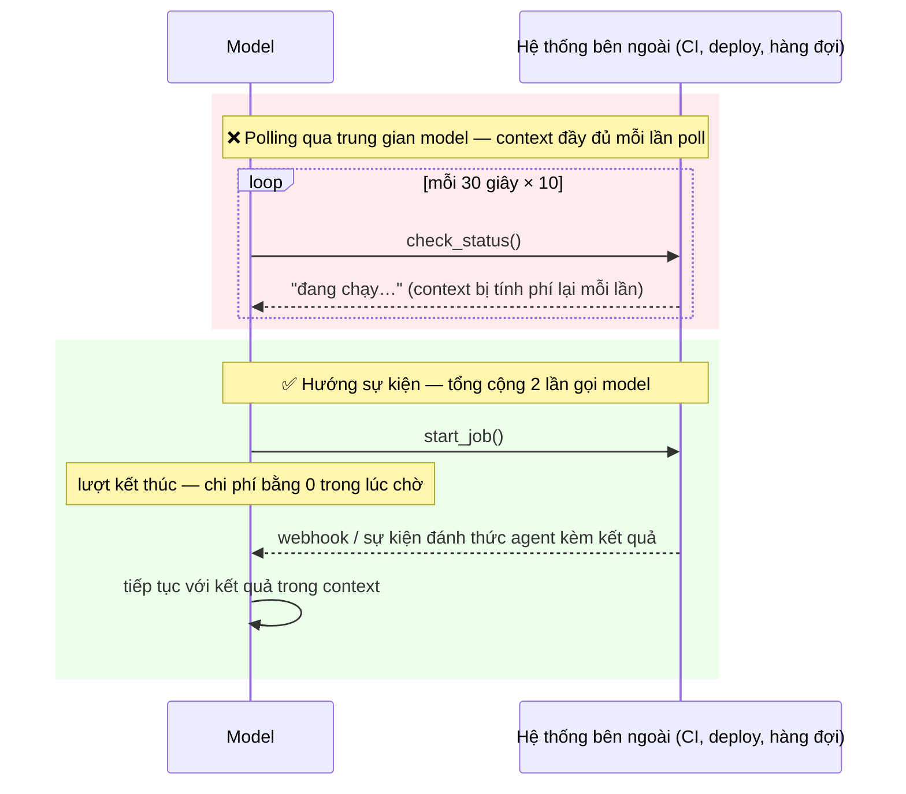
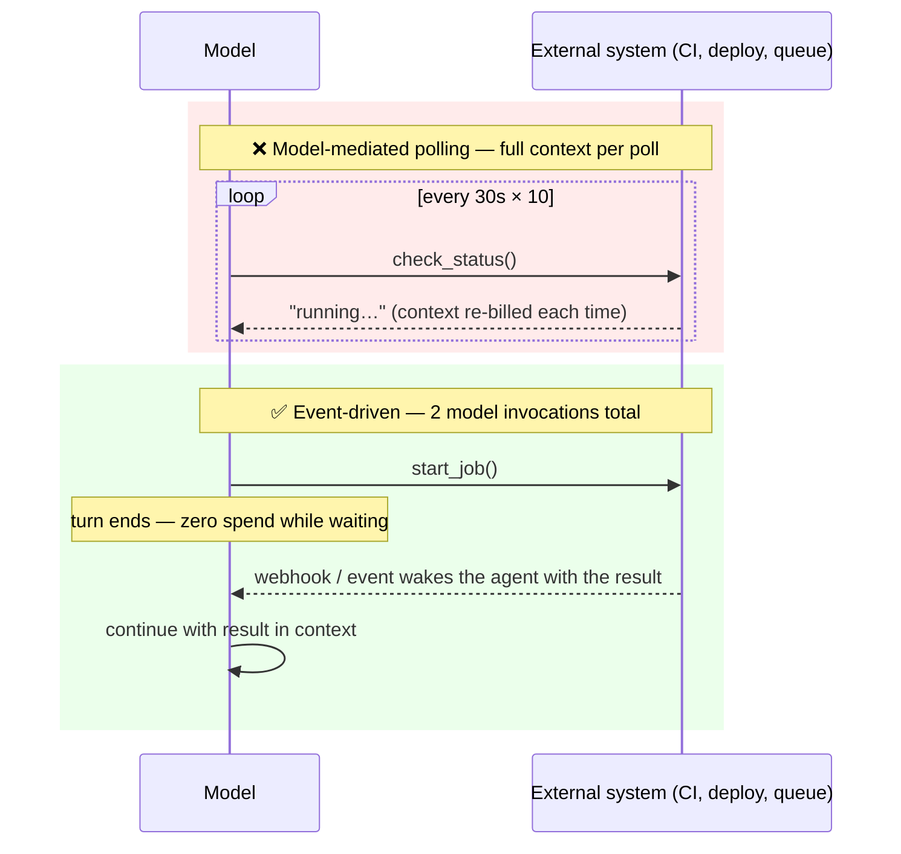

# Chờ đợi Hướng sự kiện (Diệt vòng lặp Polling) (Tiếng Việt)

**Giải quyết:** Nguyên nhân 3.3 trong [`../CAUSE.md`](../CAUSE.md)

**Ý tưởng:** Không bao giờ tốn một request model để biết "chưa xong". Đưa
việc chờ đợi ra *bên ngoài* model — webhook, luồng sự kiện, đánh thức theo
lịch, workflow bền vững — để model chỉ được gọi đúng hai lần cho mỗi lần
chờ: một lần để bắt đầu công việc, một lần khi kết quả đã sẵn sàng.

---

## Anti-pattern so với cách khắc phục

Một vòng poll 10 lần trên context 100K token đốt ~1M token input để chẳng
biết được gì. Phiên bản hướng sự kiện đốt ~0 trong lúc chờ.

## Cách áp dụng

1. **Kết thúc lượt khi bị chặn bởi thế giới bên ngoài.** Agent nên coi
   "chờ đợi" là một trạng thái kết thúc cho lần gọi hiện tại, không phải
   thứ để lấp đầy bằng các lần kiểm tra.
2. **Đánh thức khi được đẩy (push), không phải khi kéo (pull):**
   - *Webhook*: hệ thống CI (sự kiện GitHub Actions), hệ thống thanh
     toán/hàng đợi, webhook của Anthropic Managed Agents — đưa sự kiện
     hoàn tất vào phiên như một lượt/sự kiện người dùng mới.
   - *Luồng*: đăng ký SSE/WebSocket được **harness** tiêu thụ, chỉ khôi
     phục model khi có sự kiện có ý nghĩa.
3. **Khi không có push, poll trong harness, không qua model** — một
   cron/vòng lặp 5 dòng gọi endpoint trạng thái tốn $0 token; nó chỉ gọi
   model một lần, khi trạng thái thực sự thay đổi.
4. **Khớp tần suất kiểm tra với tiến trình** nếu model phải tự lên lịch
   (các harness có timer đánh thức): một lần kiểm tra tại thời điểm dự
   kiến hoàn thành tốt hơn N lần kiểm tra khoảng ngắn — một lượt CI ~8
   phút xứng đáng với một lần đánh thức ~8 phút, không phải mười sáu lần
   30 giây.
5. **Với các chờ đợi nhiều bước dài, dùng một workflow engine bền vững**
   (Temporal, Inngest, Restate, AWS Step Functions): workflow ngủ miễn
   phí, giữ trạng thái bền vững, và chỉ gọi LLM tại các điểm ra quyết
   định.
6. **Bao gồm cả retry**: thử lại các thất bại của *tool* trong harness
   với backoff (không cần model); chỉ đưa lên cho model khi ngân sách
   retry đã cạn và cần một quyết định.

## Công cụ hiện đại nhất (SOTA)

### Có sẵn — coding agent & API của nhà cung cấp

| Nhà cung cấp / agent | Tính năng | Ghi chú |
| --- | --- | --- |
| Anthropic Managed Agents | Webhook & sự kiện phiên | Chuyển trạng thái được đẩy tới endpoint của bạn; không polling |
| Claude Code | `ScheduleWakeup`, phiên kích hoạt theo cron, đăng ký hoạt động PR | Các lần kiểm tra tự lên lịch phù hợp với tiến trình đang chờ; sự kiện CI/review đánh thức phiên |
| Tích hợp GitHub Actions (Claude Code Action, tác vụ đám mây Codex, GitHub Action của Gemini CLI) | Chạy agent kích hoạt bởi sự kiện | Agent *được khởi động bởi* sự kiện thay vì phải chờ nó |

### Bên thứ ba — không phụ thuộc agent (ưu tiên mã nguồn mở)

| Công cụ | Giấy phép | Ghi chú |
| --- | --- | --- |
| Temporal | MIT | Ngủ bền vững + tín hiệu; LLM chỉ được gọi tại các điểm ra quyết định; Inngest / Restate là các lựa chọn thay thế có phần lõi mã nguồn mở |
| Webhook GitHub / GitLab | Nền tảng (miễn phí) | Kết quả CI và bình luận review đánh thức bất kỳ agent nào thay vì để nó polling |
| NATS | Apache-2.0 | Hàng đợi tin nhắn đệm các sự kiện hoàn tất; SQS / Pub/Sub là các lựa chọn quản lý tương đương |

## Đánh đổi

- Đòi hỏi hỗ trợ từ harness/hạ tầng để khôi phục một phiên theo sự kiện
  bên ngoài — các triển khai request/response thuần túy cần được tái kiến
  trúc.
- Endpoint webhook thêm bề mặt vận hành (xác thực, retry, khử trùng lặp).
- Các agent đánh thức-theo-sự-kiện phải xây lại trạng thái làm việc khi
  khôi phục — kết hợp với caching (`prompt-caching.md`, TTL dài) để request
  khôi phục đọc lại lịch sử một cách rẻ tiền thay vì lạnh.

## Tác động dự kiến

- Chi phí chờ đợi giảm từ **O(số lần poll × kích thước context)** xuống
  **~0** — thường xuyên giảm 10–100× trên các khối lượng công việc bị chi
  phối bởi việc trông chừng CI, theo dõi deploy, hoặc giám sát hàng đợi.
- Độ trễ phản ứng cũng cải thiện: một sự kiện push khôi phục agent ngay
  lập tức thay vì đợi đến lần poll tiếp theo.

---

# Event-Driven Waiting (Kill the Poll Loop)

**Addresses:** Cause 3.3 in [`../CAUSE.md`](../CAUSE.md)

**Idea:** Never spend a model request to learn "not done yet." Move waiting
*around* the model — webhooks, event streams, scheduled wake-ups, durable
workflows — so the model is invoked exactly twice per wait: once to start
the work, once when the result is ready.

---

## The anti-pattern vs the fix

A 10-iteration poll on a 100K-token context burns ~1M input tokens to learn
nothing. The event-driven version burns ~0 while waiting.

## How to apply

1. **End the turn when blocked on the outside world.** The agent should
   treat "waiting" as a terminal state for the current invocation, not
   something to fill with checks.
2. **Wake on push, not pull:**
   - *Webhooks*: CI systems (GitHub Actions events), payment/queue systems,
     Anthropic Managed Agents webhooks — deliver the completion event into
     the session as a new user-turn/event.
   - *Streams*: SSE / WebSocket subscriptions consumed by the **harness**,
     which resumes the model only on meaningful events.
3. **When push isn't available, poll in the harness, not through the
   model** — a 5-line cron/loop hitting the status endpoint costs $0 in
   tokens; it invokes the model once, when the state actually changed.
4. **Match check-in cadence to the process** if the model must self-schedule
   (harnesses with wake-up timers): one check at the expected completion
   time beats N short-interval checks — an ~8-minute CI run deserves one
   ~8-minute wake-up, not sixteen 30-second ones.
5. **For long multi-step waits, use a durable workflow engine** (Temporal,
   Inngest, Restate, AWS Step Functions): the workflow sleeps for free,
   holds state durably, and calls the LLM only at decision points.
6. **Cover retries too**: retry *tool* failures in the harness with backoff
   (no model involvement); only surface to the model when the retry budget
   is exhausted and a decision is needed.

## SOTA tools

### Native — coding agents & provider APIs

| Provider / agent | Feature | Notes |
| --- | --- | --- |
| Anthropic Managed Agents | Webhooks & session events | State transitions pushed to your endpoint; no polling |
| Claude Code | `ScheduleWakeup`, cron-triggered sessions, PR-activity subscriptions | Self-scheduled check-ins sized to the awaited process; CI/review events wake the session |
| GitHub Actions integrations (Claude Code Action, Codex cloud tasks, Gemini CLI GitHub Action) | Event-triggered agent runs | The agent is *started by* the event instead of waiting for it |

### Third-party — agent-agnostic (open source preferred)

| Tool | License | Notes |
| --- | --- | --- |
| Temporal | MIT | Durable sleep + signals; LLM invoked only at decision points; Inngest / Restate are alternatives with partly-open cores |
| GitHub / GitLab webhooks | Platform (free) | CI results and review comments wake any agent instead of it polling |
| NATS | Apache-2.0 | Message queue buffering completion events; SQS / Pub/Sub are the managed equivalents |

## Trade-offs

- Requires harness/infra support for resuming a session on an external
  event — pure request/response deployments need re-architecture.
- Webhook endpoints add operational surface (auth, retries, dedupe).
- Wake-on-event agents must rebuild working state on resume — pair with
  caching (`prompt-caching.md`, long TTLs) so the resume request re-reads
  the history cheaply rather than cold.

## Expected impact

- Waiting cost drops from **O(polls × context size)** to **~0** — routinely
  a 10–100× reduction on workloads dominated by CI babysitting, deploy
  watching, or queue monitoring.
- Latency to react improves too: a push event resumes the agent immediately
  instead of on the next poll tick.
