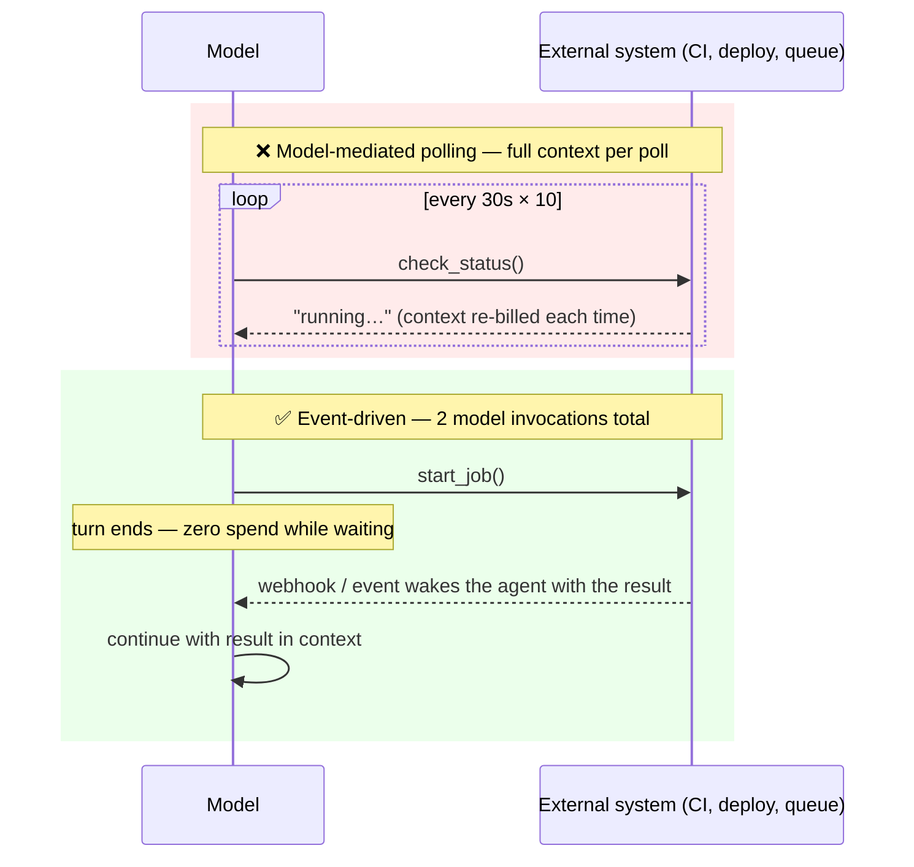

# Event-Driven Waiting (Kill the Poll Loop)

**Addresses:** Cause 3.3 in [`../CAUSE.md`](../CAUSE.md)

**Idea:** Never spend a model request to learn "not done yet." Move waiting
*around* the model — webhooks, event streams, scheduled wake-ups, durable
workflows — so the model is invoked exactly twice per wait: once to start
the work, once when the result is ready.

---

## The anti-pattern vs the fix

A 10-iteration poll on a 100K-token context burns ~1M input tokens to learn
nothing. The event-driven version burns ~0 while waiting.

## How to apply

1. **End the turn when blocked on the outside world.** The agent should
   treat "waiting" as a terminal state for the current invocation, not
   something to fill with checks.
2. **Wake on push, not pull:**
   - *Webhooks*: CI systems (GitHub Actions events), payment/queue systems,
     Anthropic Managed Agents webhooks — deliver the completion event into
     the session as a new user-turn/event.
   - *Streams*: SSE / WebSocket subscriptions consumed by the **harness**,
     which resumes the model only on meaningful events.
3. **When push isn't available, poll in the harness, not through the
   model** — a 5-line cron/loop hitting the status endpoint costs $0 in
   tokens; it invokes the model once, when the state actually changed.
4. **Match check-in cadence to the process** if the model must self-schedule
   (harnesses with wake-up timers): one check at the expected completion
   time beats N short-interval checks — an ~8-minute CI run deserves one
   ~8-minute wake-up, not sixteen 30-second ones.
5. **For long multi-step waits, use a durable workflow engine** (Temporal,
   Inngest, Restate, AWS Step Functions): the workflow sleeps for free,
   holds state durably, and calls the LLM only at decision points.
6. **Cover retries too**: retry *tool* failures in the harness with backoff
   (no model involvement); only surface to the model when the retry budget
   is exhausted and a decision is needed.

## SOTA tools

| Tool | Scope | Notes |
| --- | --- | --- |
| Temporal / Inngest / Restate | Workflow | Durable sleep + signals; LLM invoked only at decision points |
| Anthropic Managed Agents webhooks & events | Platform | Session state transitions pushed to your endpoint; no polling |
| GitHub webhooks / PR-event subscriptions | Dev-agents | CI results and review comments wake the agent instead of it polling |
| Harness wake-up schedulers (Claude Code `ScheduleWakeup`, cron-triggered sessions) | Harness | Self-scheduled check-ins sized to the awaited process |
| Message queues (SQS, Pub/Sub, NATS) | Infra | Buffer completion events; harness consumes and resumes |

## Trade-offs

- Requires harness/infra support for resuming a session on an external
  event — pure request/response deployments need re-architecture.
- Webhook endpoints add operational surface (auth, retries, dedupe).
- Wake-on-event agents must rebuild working state on resume — pair with
  caching (`prompt-caching.md`, long TTLs) so the resume request re-reads
  the history cheaply rather than cold.

## Expected impact

- Waiting cost drops from **O(polls × context size)** to **~0** — routinely
  a 10–100× reduction on workloads dominated by CI babysitting, deploy
  watching, or queue monitoring.
- Latency to react improves too: a push event resumes the agent immediately
  instead of on the next poll tick.
