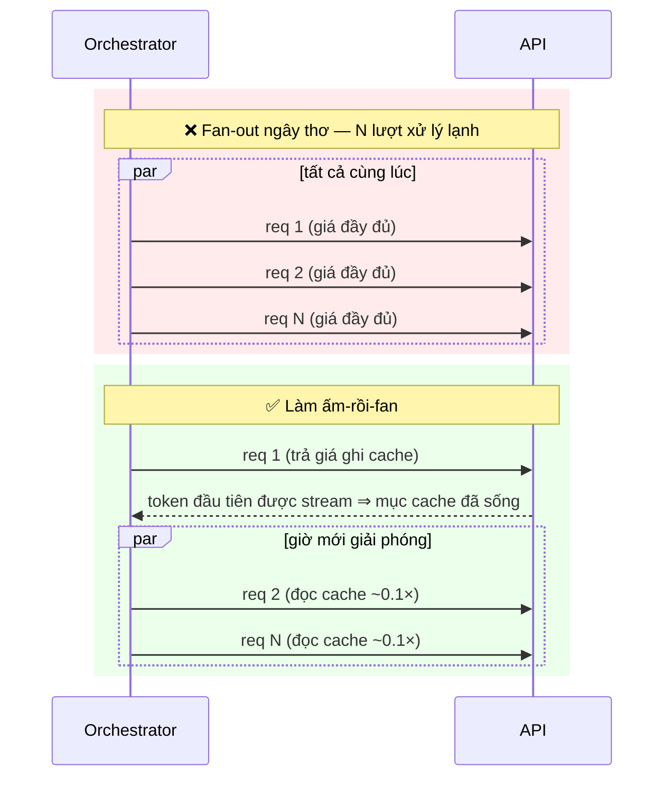
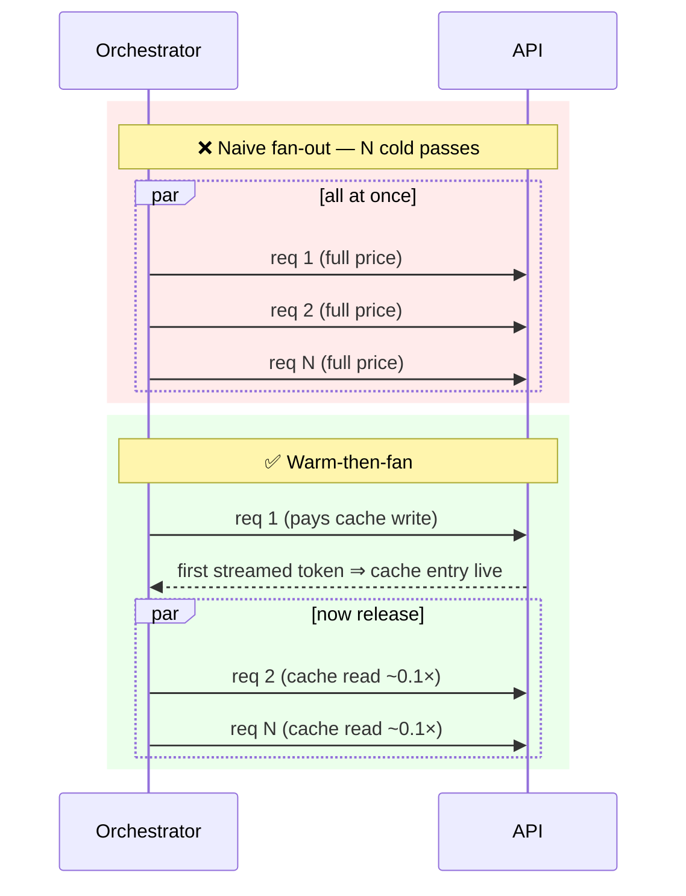

# Làm ấm Cache cho Fan-Out (Làm ấm Một, rồi Bắn N−1) (Tiếng Việt)

**Giải quyết:** Nguyên nhân 6.3 trong [`../CAUSE.md`](../CAUSE.md)

**Ý tưởng:** Khi N request song song chia sẻ một prefix lớn, đừng bắn chúng
đồng thời vào một cache lạnh — gửi **một** request trước, chờ đến khi mục
cache được ghi (thường: token đầu tiên được stream), sau đó mới giải phóng
N−1 request còn lại để đọc nó.

---

## Tại sao fan-out đồng thời trả giá đầy đủ

Một mục cache chỉ có thể đọc được sau khi request đầu tiên đã xử lý xong
prefix. N request được khởi chạy cùng lúc đều bắt đầu trước khi bất kỳ mục
nào tồn tại — mỗi request đều trả giá input đầy đủ, và N−1 trong số các
khoản trả đó lẽ ra có thể tránh được.



## Cách áp dụng

1. **Kiểm soát fan-out dựa trên tín hiệu đã ấm.** Với streaming, tín hiệu
   đáng tin cậy là *token đầu tiên được stream* của request làm ấm, chứ
   không phải chỉ đơn thuần là đã gửi request đi. Hãy chờ sự kiện đó, rồi
   mới giải phóng phần còn lại chạy đồng thời.

   ```python
   async def fan_out(shared_prefix, variants):
       first, *rest = variants
       stream = await start_stream(shared_prefix, first)
       await stream.first_token()          # mục cache giờ đã sống
       results = await asyncio.gather(
           consume(stream),
           *[run(shared_prefix, v) for v in rest],
       )
       return results
   ```

2. **Pre-warm trước các fan-out theo lịch.** Với các đợt tải dồn dập có
   thể dự đoán trước (đánh giá theo lịch cron, sinh báo cáo mỗi sáng), hãy
   làm ấm prefix ngay trước khung giờ đó — Anthropic hỗ trợ một request
   `max_tokens: 0` chuyên dụng, chỉ ghi cache rồi trả về ngay lập tức; ở
   nơi khác, một request 1-token tối thiểu cũng làm được việc tương tự.
3. **Xác minh prefix thực sự được chia sẻ.** Làm ấm-rồi-fan chỉ có ích nếu
   cả N request đều giống hệt nhau từng byte cho đến breakpoint — cùng
   system, cùng tool, cùng tài liệu, chỉ khác nhau sau đó (xem
   `prompt-caching.md` §vị trí, và quy tắc sắp xếp `[tài liệu][câu hỏi]`
   trong `document-reuse.md`).
4. **Giới hạn thời gian chờ.** Hãy thêm timeout cho giai đoạn làm ấm (hết
   hạn thì quay về bắn tất cả cùng lúc), để một request đầu tiên bị chậm
   không thể làm trì hoãn cả lô vượt quá mức lợi ích mà khoản tiết kiệm
   mang lại.
5. **Hoặc né tránh hoàn toàn bằng tier batch.** Nếu fan-out không nhạy
   cảm về độ trễ, hãy gửi nó dưới dạng một batch của nhà cung cấp thay vì
   gọi song song trực tiếp — nhà cung cấp sẽ tự tối ưu việc chia sẻ cache
   trong batch, và bạn còn được giảm giá 50% nữa (`batch-processing.md`).

## Công cụ hiện đại nhất (SOTA)

### Có sẵn — coding agent & API của nhà cung cấp

| Nhà cung cấp / agent | Tính năng | Ghi chú |
| --- | --- | --- |
| Anthropic API | Pre-warm `max_tokens: 0` | Request chuyên dụng chỉ-ghi-cache |
| SDK Anthropic / OpenAI / Gemini | Sự kiện token đầu tiên khi streaming | Tín hiệu hoàn tất làm ấm để kiểm soát fan-out |
| API batch của nhà cung cấp | Chia sẻ cache nội bộ trong batch | Lựa chọn thay thế thân thiện với cache + được giảm giá cho các fan-out không tương tác |

### Bên thứ ba — không phụ thuộc agent (ưu tiên mã nguồn mở)

| Công cụ | Giấy phép | Ghi chú |
| --- | --- | --- |
| SGLang RadixAttention / vLLM APC | Apache-2.0 | Chia sẻ prefix cấp runtime giữa các request đồng thời — cùng ý tưởng được scheduler thực thi, cho các đội hình tự host |

## Đánh đổi

- Thêm một khoảng độ trễ request để tuần tự hóa trước giai đoạn song
  song — không đáng kể với các job chạy nền, nhưng đáng kể với các
  fan-out nhạy cảm về độ trễ (ở đó, hãy cân nhắc chi phí so với lợi thế
  đi trước).
- Thêm trạng thái điều phối (tín hiệu làm ấm, timeout, fallback).
- Thời gian sống của cache ngắn (thường ở mức phút): làm ấm quá sớm là
  lãng phí; giữ khoảng cách làm-ấm→fan chặt chẽ hoặc dùng TTL dài hơn.

## Tác động dự kiến

- Chi phí input cho prefix chia sẻ giảm từ `N × giá đầy đủ` xuống
  `1 × (ghi) + (N−1) × ~0.1×` — với N=20 worker trên một prefix 50K token,
  đó là **~1M token ở giá đầy đủ → ~145K hiệu dụng**, giảm ~85–90% hóa đơn
  input của fan-out.
- N và prefix càng lớn thì tỷ lệ càng được cải thiện; các pipeline tài
  liệu map-reduce và các bộ đánh giá song song là những trường hợp thắng
  lợi kinh điển.

---

# Fan-Out Cache Warming (Warm One, Then Fire N−1)

**Addresses:** Cause 6.3 in [`../CAUSE.md`](../CAUSE.md)

**Idea:** When N parallel requests share a large prefix, don't fire them
simultaneously into a cold cache — send **one** request first, wait until
the cache entry is written (typically: first token streamed), then release
the remaining N−1 to read it.

---

## Why simultaneous fan-out pays full price

A cache entry becomes readable only after the first request has processed
the prefix. N requests launched together all start before any entry exists —
every one pays full input price, and N−1 of those payments were avoidable.



## How to apply

1. **Gate the fan-out on the warm signal.** With streaming, the reliable
   signal is the *first streamed token* of the warm request — not merely
   having sent it. Await that event, then release the rest concurrently.

   ```python
   async def fan_out(shared_prefix, variants):
       first, *rest = variants
       stream = await start_stream(shared_prefix, first)
       await stream.first_token()          # cache entry now live
       results = await asyncio.gather(
           consume(stream),
           *[run(shared_prefix, v) for v in rest],
       )
       return results
   ```

2. **Pre-warm ahead of scheduled fan-outs.** For predictable bursts (cron
   evals, morning report generation), warm the prefix just before the
   window — Anthropic supports a dedicated `max_tokens: 0` pre-warm request
   that writes the cache and returns immediately; elsewhere, a minimal
   1-token request does the job.
3. **Verify the prefix is actually shared.** Warm-then-fan only helps if
   all N requests are byte-identical up to the breakpoint — same system,
   same tools, same document, variation only after (see
   `prompt-caching.md` §placement, and the `[doc][question]` ordering rule
   in `document-reuse.md`).
4. **Bound the wait.** Add a timeout on the warm phase (fall back to firing
   everything) so a slow first request can't stall the whole batch beyond
   what the savings justify.
5. **Or sidestep via the batch tier.** If the fan-out is
   latency-insensitive, submit it as a provider batch instead — providers
   optimize cache sharing within a batch, and you collect the 50% discount
   too (`batch-processing.md`).

## SOTA tools

### Native — coding agents & provider APIs

| Provider / agent | Feature | Notes |
| --- | --- | --- |
| Anthropic API | `max_tokens: 0` pre-warm | Purpose-built cache-write-only request |
| Anthropic / OpenAI / Gemini SDKs | Streaming first-token events | The warm-completion signal to gate the fan-out on |
| Provider batch APIs | Batch-internal cache sharing | Cache-friendly + discounted alternative for non-interactive fan-outs |

### Third-party — agent-agnostic (open source preferred)

| Tool | License | Notes |
| --- | --- | --- |
| SGLang RadixAttention / vLLM APC | Apache-2.0 | Runtime-level prefix sharing across concurrent requests — the same idea enforced by the scheduler, for self-hosted fleets |

## Trade-offs

- Adds one request-latency of serialization before the parallel phase —
  irrelevant for jobs, meaningful for latency-critical fan-outs (there,
  weigh cost vs the head-start).
- More orchestration state (warm signal, timeout, fallback).
- Cache lifetimes are short (minutes-scale by default): warming too early
  is wasted; keep the warm→fan gap tight or use longer TTLs.

## Expected impact

- Input cost for the shared prefix drops from `N × full price` to
  `1 × (write) + (N−1) × ~0.1×` — for N=20 workers on a 50K-token prefix,
  that's **~1M tokens at full price → ~145K effective**, an ~85–90%
  reduction on the fan-out's input bill.
- Larger N and larger prefixes only improve the ratio; map-reduce document
  pipelines and parallel eval suites are the canonical winners.
