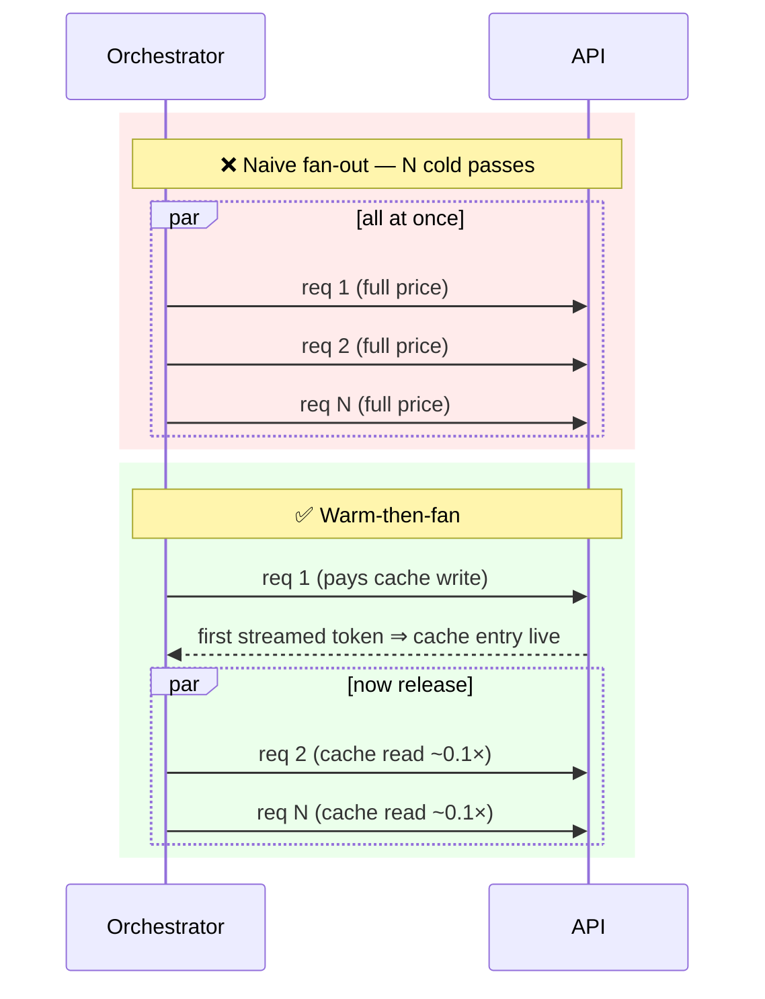

# Fan-Out Cache Warming (Warm One, Then Fire N−1)

**Addresses:** Cause 6.3 in [`../CAUSE.md`](../CAUSE.md)

**Idea:** When N parallel requests share a large prefix, don't fire them
simultaneously into a cold cache — send **one** request first, wait until
the cache entry is written (typically: first token streamed), then release
the remaining N−1 to read it.

---

## Why simultaneous fan-out pays full price

A cache entry becomes readable only after the first request has processed
the prefix. N requests launched together all start before any entry exists —
every one pays full input price, and N−1 of those payments were avoidable.



## How to apply

1. **Gate the fan-out on the warm signal.** With streaming, the reliable
   signal is the *first streamed token* of the warm request — not merely
   having sent it. Await that event, then release the rest concurrently.

   ```python
   async def fan_out(shared_prefix, variants):
       first, *rest = variants
       stream = await start_stream(shared_prefix, first)
       await stream.first_token()          # cache entry now live
       results = await asyncio.gather(
           consume(stream),
           *[run(shared_prefix, v) for v in rest],
       )
       return results
   ```

2. **Pre-warm ahead of scheduled fan-outs.** For predictable bursts (cron
   evals, morning report generation), warm the prefix just before the
   window — Anthropic supports a dedicated `max_tokens: 0` pre-warm request
   that writes the cache and returns immediately; elsewhere, a minimal
   1-token request does the job.
3. **Verify the prefix is actually shared.** Warm-then-fan only helps if
   all N requests are byte-identical up to the breakpoint — same system,
   same tools, same document, variation only after (see
   `prompt-caching.md` §placement, and the `[doc][question]` ordering rule
   in `document-reuse.md`).
4. **Bound the wait.** Add a timeout on the warm phase (fall back to firing
   everything) so a slow first request can't stall the whole batch beyond
   what the savings justify.
5. **Or sidestep via the batch tier.** If the fan-out is
   latency-insensitive, submit it as a provider batch instead — providers
   optimize cache sharing within a batch, and you collect the 50% discount
   too (`batch-processing.md`).

## SOTA tools

| Tool | Scope | Notes |
| --- | --- | --- |
| Anthropic `max_tokens: 0` pre-warm | API | Purpose-built cache-write-only request |
| Streaming first-token hooks (SDK stream events) | Harness | The warm-completion signal to gate on |
| SGLang RadixAttention / vLLM APC | Self-hosted | Runtime-level prefix sharing across concurrent requests — the same idea enforced by the scheduler |
| Provider batch APIs | API | Cache-friendly + discounted alternative for non-interactive fan-outs |

## Trade-offs

- Adds one request-latency of serialization before the parallel phase —
  irrelevant for jobs, meaningful for latency-critical fan-outs (there,
  weigh cost vs the head-start).
- More orchestration state (warm signal, timeout, fallback).
- Cache lifetimes are short (minutes-scale by default): warming too early
  is wasted; keep the warm→fan gap tight or use longer TTLs.

## Expected impact

- Input cost for the shared prefix drops from `N × full price` to
  `1 × (write) + (N−1) × ~0.1×` — for N=20 workers on a 50K-token prefix,
  that's **~1M tokens at full price → ~145K effective**, an ~85–90%
  reduction on the fan-out's input bill.
- Larger N and larger prefixes only improve the ratio; map-reduce document
  pipelines and parallel eval suites are the canonical winners.
