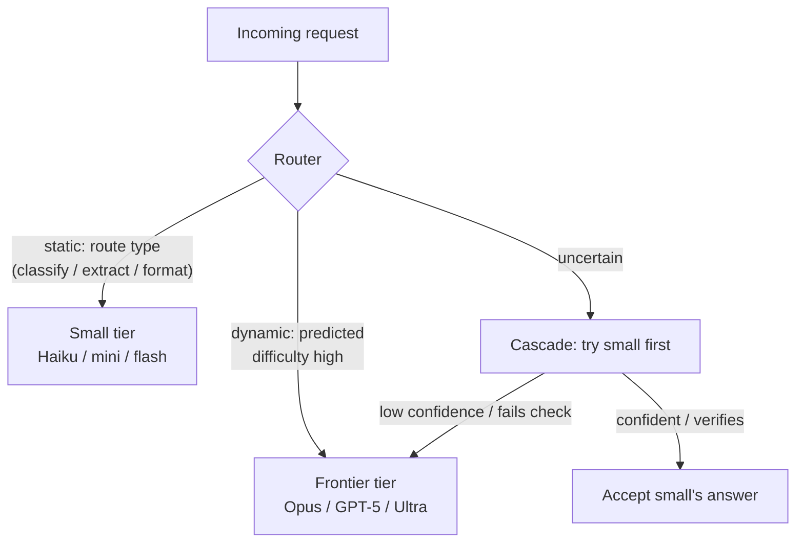

# Model Routing (Right-Size the Model per Request)

**Addresses:** Cause 6.2 in [`../CAUSE.md`](../CAUSE.md)

**Idea:** Frontier-tier models cost ~5–25× more per token than small-tier
siblings. Route each request to the cheapest model that meets its quality
bar — statically by route, dynamically by difficulty, or as a
cascade — reserving the frontier tier for the traffic that needs it.

---

## Routing patterns

1. **Static routing (do this first).** Most products have clearly separable
   routes — classification, extraction, formatting, title generation,
   routing itself — that a small model serves at full quality. Assign per
   route in config. Zero ML required, captures most of the win.
2. **Dynamic routing.** A learned router scores each query and picks the
   tier — the RouteLLM line of work showed routers trained on preference
   data can cut cost dramatically at near-frontier quality on mixed traffic.
3. **Cascading (FrugalGPT pattern).** Try cheap first; escalate on a
   confidence/verification failure. Works best where answers are
   *checkable* (schema validation, unit tests, retrieval-grounded QA) so
   escalation is triggered by evidence, not vibes.
4. **Agent-internal routing.** Within one agent: frontier model for
   planning/decisions, small models for subagent legwork
   (`subagent-context-handoff.md`), summaries, and compaction calls. Keep
   *each loop's* model fixed mid-session (cause 1.3 — cache is
   model-scoped); route at spawn boundaries.
5. **Distill stable high-volume routes.** Once a route's behavior is
   settled, fine-tune/distill a small model on the frontier model's outputs
   and route the volume there; escalate the residual.

## How to apply

- Define per-route **quality gates** (eval sets) before moving traffic —
  routing without evals is silent quality regression.
- Add **escalation telemetry**: escalation rate per route tells you when a
  small tier is misassigned (too high = wasted double-calls; ~0% = maybe
  the frontier tier wasn't needed at all).
- Measure by **cost per completed task** (`token-counting.md`) — a cheaper
  model that needs two extra correction turns can be net-negative.
- Remember the sibling lever: for latency-insensitive work, the *same*
  model at 50% off via batch (`batch-processing.md`) may beat a tier drop.

## SOTA tools

| Tool | Scope | Notes |
| --- | --- | --- |
| RouteLLM (LMSYS) | OSS router | Trained routers; reported up to ~85% cost reduction while retaining ~95% of frontier quality on mixed benchmarks |
| NotDiamond / Martian / Portkey / OpenRouter | Hosted routing | Managed multi-provider routing + fallbacks |
| FrugalGPT (research pattern) | Cascade | LLM cascades reported up to ~98% cost reduction matching frontier accuracy on QA benchmarks — the canonical cascade reference |
| LiteLLM | Gateway | Uniform API across providers — the plumbing that makes routing/cascades deployable |
| Provider tiers (Anthropic Haiku↔Sonnet↔Opus, OpenAI mini/nano↔full, Gemini Flash↔Pro) | Models | The actual price ladder (~5–25× spread per token) |
| Distillation stacks (OpenAI fine-tuning, Together, open-weight SFT) | Training | Lock in savings on stable high-volume routes |

## Trade-offs

- Router/cascade adds a decision layer: latency (cascades add a full cheap
  call on escalation), infrastructure, and its own failure modes.
- Multi-model output styles differ — downstream parsers/UX must tolerate
  the variance, and evals must run per model.
- Caches don't transfer across models; routing *mid-session* is a cache
  rebuild — route per request/spawn, not per turn of one session.
- Maintenance: the route map re-tunes on every model generation (small
  tiers improve fast — yesterday's frontier-only route is often today's
  mini-model route).

## Expected impact

- Static routing alone typically moves **50–80% of request volume** to
  tiers 5–25× cheaper — often the single largest line-item cut available.
- Published dynamic-routing results: RouteLLM up to **~85% cost reduction
  at ~95% frontier quality**; FrugalGPT cascades up to **~98%** on
  checkable QA workloads. Real mixed workloads land lower but routinely
  achieve 2–5× blended savings.
- Compounds multiplicatively with every token-count solution in this
  folder: fewer tokens × cheaper tokens.
