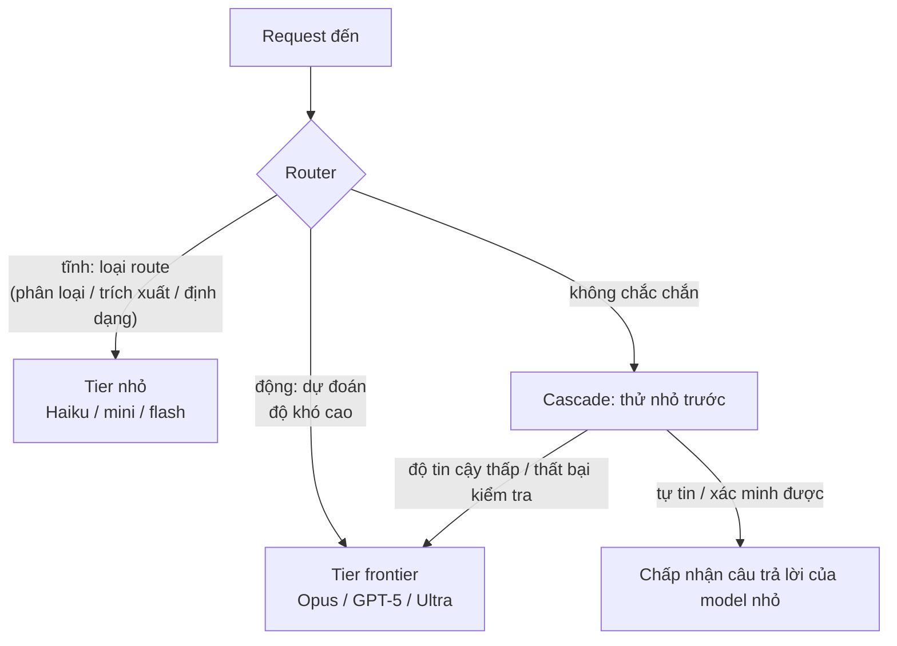
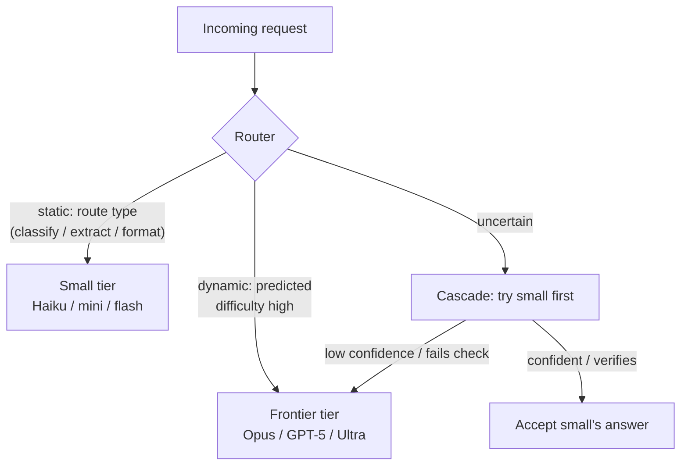

# Định tuyến Model (Đặt đúng kích thước Model theo từng Request) (Tiếng Việt)

**Giải quyết:** Nguyên nhân 6.2 trong [`../CAUSE.md`](../CAUSE.md)

**Ý tưởng:** Các model tier frontier tốn ~5–25× nhiều hơn mỗi token so với
các model tier nhỏ cùng dòng. Định tuyến mỗi request tới model rẻ nhất đáp
ứng ngưỡng chất lượng của nó — tĩnh theo route, động theo độ khó, hoặc theo
kiểu cascade — dành tier frontier cho lưu lượng thực sự cần nó.

---

## Các mẫu hình định tuyến

1. **Định tuyến tĩnh (làm điều này trước).** Hầu hết sản phẩm đều có các
   route phân tách rõ ràng — phân loại, trích xuất, định dạng, sinh tiêu
   đề, chính việc định tuyến — mà một model nhỏ phục vụ ở chất lượng đầy
   đủ. Gán theo từng route trong config. Không cần ML, nắm bắt phần lớn
   lợi ích.
2. **Định tuyến động.** Một router đã học chấm điểm mỗi truy vấn và chọn
   tier — dòng nghiên cứu RouteLLM cho thấy các router được huấn luyện
   trên dữ liệu ưu tiên có thể cắt giảm chi phí đáng kể ở chất lượng gần
   ngang hàng frontier trên lưu lượng hỗn hợp.
3. **Cascade (mẫu hình FrugalGPT).** Thử rẻ trước; leo thang khi thất bại
   độ tin cậy/xác minh. Hoạt động tốt nhất khi câu trả lời có thể *kiểm
   tra được* (kiểm định schema, unit test, hỏi-đáp có căn cứ truy xuất) để
   việc leo thang được kích hoạt bởi bằng chứng, không phải cảm tính.
4. **Định tuyến nội bộ agent.** Trong một agent: model frontier cho việc
   lập kế hoạch/quyết định, model nhỏ cho công việc chân tay của subagent
   (`subagent-context-handoff.md`), tóm tắt, và các lệnh gọi nén. Giữ
   model của *mỗi vòng lặp* cố định giữa phiên (nguyên nhân 1.3 — cache
   gắn với model cụ thể); định tuyến tại ranh giới sinh.
5. **Distill các route ổn định, khối lượng cao.** Khi hành vi của một
   route đã ổn định, fine-tune/distill một model nhỏ trên output của model
   frontier và định tuyến khối lượng đó tới đó; leo thang phần còn lại.

## Cách áp dụng

- Định nghĩa **ngưỡng chất lượng** theo từng route (bộ đánh giá) trước khi
  chuyển lưu lượng — định tuyến mà không có đánh giá là hồi quy chất lượng
  âm thầm.
- Thêm **đo lường leo thang**: tỷ lệ leo thang theo từng route cho bạn
  biết khi một tier nhỏ bị gán sai (quá cao = lãng phí gọi hai lần; ~0% =
  có thể tier frontier không cần thiết ngay từ đầu).
- Đo lường bằng **chi phí mỗi tác vụ hoàn thành** (`token-counting.md`) —
  một model rẻ hơn cần thêm hai lượt sửa lỗi có thể là âm ròng.
- Nhớ đòn bẩy anh em: với công việc không nhạy cảm về độ trễ, *cùng một*
  model giảm giá 50% qua batch (`batch-processing.md`) có thể tốt hơn hạ
  tier.

## Công cụ hiện đại nhất (SOTA)

### Có sẵn — coding agent & API của nhà cung cấp

| Nhà cung cấp / agent | Tính năng | Ghi chú |
| --- | --- | --- |
| Tier model Anthropic / OpenAI / Gemini | Haiku↔Sonnet↔Opus · mini/nano↔full · Flash↔Pro | Bậc thang giá thực tế (chênh lệch ~5–25× mỗi token) — thứ đang được định tuyến qua |
| Claude Code / Codex CLI / Gemini CLI | Chọn model theo phiên và theo subagent (`/model`, trường model trong định nghĩa agent) | Cách có sẵn từ harness để triển khai bản đồ vai trò tĩnh |
| Fine-tuning/distillation của OpenAI | Training API | Khóa chặt mức tiết kiệm trên các route khối lượng cao, ổn định |

### Bên thứ ba — không phụ thuộc agent (ưu tiên mã nguồn mở)

| Công cụ | Giấy phép | Ghi chú |
| --- | --- | --- |
| RouteLLM (LMSYS) | Apache-2.0 | Router đã huấn luyện; báo cáo giảm tới ~85% chi phí trong khi giữ ~95% chất lượng frontier trên benchmark hỗn hợp |
| LiteLLM | MIT | API thống nhất qua các nhà cung cấp — hệ thống ống nước làm cho routing/cascade triển khai được cho mọi agent |
| Gateway Portkey | MIT (gateway) | Định tuyến + fallback tự host; NotDiamond / Martian / OpenRouter là các lựa chọn thương mại host sẵn |
| FrugalGPT (mẫu hình nghiên cứu) | Nghiên cứu | Cascade LLM báo cáo giảm tới ~98% chi phí trong khi khớp độ chính xác frontier trên benchmark hỏi-đáp — tham chiếu cascade kinh điển |
| Stack SFT mã nguồn mở (Together, Axolotl, v.v.) | Apache-2.0 (công cụ) | Distill các route ổn định vào các model bạn kiểm soát |

## Đánh đổi

- Router/cascade thêm một lớp quyết định: độ trễ (cascade thêm một lệnh
  gọi rẻ đầy đủ khi leo thang), hạ tầng, và các chế độ lỗi riêng của nó.
- Văn phong output đa model khác nhau — các bộ phân tích/UX phía sau phải
  chịu được sự chênh lệch, và đánh giá phải chạy theo từng model.
- Cache không chuyển được qua các model; định tuyến *giữa phiên* là một
  lần làm mới cache — định tuyến theo từng request/lần sinh, không phải
  theo từng lượt của một phiên.
- Bảo trì: bản đồ route cần tinh chỉnh lại trên mỗi thế hệ model (các
  tier nhỏ cải thiện nhanh — route chỉ-dành-cho-hàng-đầu hôm qua thường
  là route model-mini hôm nay).

## Tác động dự kiến

- Chỉ riêng định tuyến tĩnh thường chuyển **50–80% khối lượng request**
  sang các tier rẻ hơn 5–25× — thường là khoản cắt giảm dòng lớn nhất có
  sẵn.
- Kết quả định tuyến động đã công bố: RouteLLM giảm tới **~85% chi phí ở
  ~95% chất lượng frontier**; cascade FrugalGPT tới **~98%** trên các khối
  lượng công việc hỏi-đáp có thể kiểm tra. Các khối lượng công việc hỗn hợp
  thực tế đạt thấp hơn nhưng thường xuyên đạt mức tiết kiệm pha trộn
  2–5×.
- Cộng dồn theo cấp số nhân với mọi giải pháp giảm số-lượng-token trong
  thư mục này: ít token hơn × token rẻ hơn.

---

# Model Routing (Right-Size the Model per Request)

**Addresses:** Cause 6.2 in [`../CAUSE.md`](../CAUSE.md)

**Idea:** Frontier-tier models cost ~5–25× more per token than small-tier
siblings. Route each request to the cheapest model that meets its quality
bar — statically by route, dynamically by difficulty, or as a
cascade — reserving the frontier tier for the traffic that needs it.

---

## Routing patterns

1. **Static routing (do this first).** Most products have clearly separable
   routes — classification, extraction, formatting, title generation,
   routing itself — that a small model serves at full quality. Assign per
   route in config. Zero ML required, captures most of the win.
2. **Dynamic routing.** A learned router scores each query and picks the
   tier — the RouteLLM line of work showed routers trained on preference
   data can cut cost dramatically at near-frontier quality on mixed traffic.
3. **Cascading (FrugalGPT pattern).** Try cheap first; escalate on a
   confidence/verification failure. Works best where answers are
   *checkable* (schema validation, unit tests, retrieval-grounded QA) so
   escalation is triggered by evidence, not vibes.
4. **Agent-internal routing.** Within one agent: frontier model for
   planning/decisions, small models for subagent legwork
   (`subagent-context-handoff.md`), summaries, and compaction calls. Keep
   *each loop's* model fixed mid-session (cause 1.3 — cache is
   model-scoped); route at spawn boundaries.
5. **Distill stable high-volume routes.** Once a route's behavior is
   settled, fine-tune/distill a small model on the frontier model's outputs
   and route the volume there; escalate the residual.

## How to apply

- Define per-route **quality gates** (eval sets) before moving traffic —
  routing without evals is silent quality regression.
- Add **escalation telemetry**: escalation rate per route tells you when a
  small tier is misassigned (too high = wasted double-calls; ~0% = maybe
  the frontier tier wasn't needed at all).
- Measure by **cost per completed task** (`token-counting.md`) — a cheaper
  model that needs two extra correction turns can be net-negative.
- Remember the sibling lever: for latency-insensitive work, the *same*
  model at 50% off via batch (`batch-processing.md`) may beat a tier drop.

## SOTA tools

### Native — coding agents & provider APIs

| Provider / agent | Feature | Notes |
| --- | --- | --- |
| Anthropic / OpenAI / Gemini model tiers | Haiku↔Sonnet↔Opus · mini/nano↔full · Flash↔Pro | The actual price ladder (~5–25× spread per token) — the thing being routed across |
| Claude Code / Codex CLI / Gemini CLI | Per-session and per-subagent model selection (`/model`, agent-definition model fields) | The harness-native way to implement the static role map |
| OpenAI fine-tuning / distillation | Training API | Lock in savings on stable high-volume routes |

### Third-party — agent-agnostic (open source preferred)

| Tool | License | Notes |
| --- | --- | --- |
| RouteLLM (LMSYS) | Apache-2.0 | Trained routers; reported up to ~85% cost reduction while retaining ~95% of frontier quality on mixed benchmarks |
| LiteLLM | MIT | Uniform API across providers — the plumbing that makes routing/cascades deployable for any agent |
| Portkey gateway | MIT (gateway) | Self-hostable routing + fallbacks; NotDiamond / Martian / OpenRouter are hosted commercial options |
| FrugalGPT (research pattern) | Research | LLM cascades reported up to ~98% cost reduction matching frontier accuracy on QA benchmarks — the canonical cascade reference |
| Open-weight SFT stacks (Together, Axolotl, etc.) | Apache-2.0 (tooling) | Distill stable routes onto models you control |

## Trade-offs

- Router/cascade adds a decision layer: latency (cascades add a full cheap
  call on escalation), infrastructure, and its own failure modes.
- Multi-model output styles differ — downstream parsers/UX must tolerate
  the variance, and evals must run per model.
- Caches don't transfer across models; routing *mid-session* is a cache
  rebuild — route per request/spawn, not per turn of one session.
- Maintenance: the route map re-tunes on every model generation (small
  tiers improve fast — yesterday's frontier-only route is often today's
  mini-model route).

## Expected impact

- Static routing alone typically moves **50–80% of request volume** to
  tiers 5–25× cheaper — often the single largest line-item cut available.
- Published dynamic-routing results: RouteLLM up to **~85% cost reduction
  at ~95% frontier quality**; FrugalGPT cascades up to **~98%** on
  checkable QA workloads. Real mixed workloads land lower but routinely
  achieve 2–5× blended savings.
- Compounds multiplicatively with every token-count solution in this
  folder: fewer tokens × cheaper tokens.
