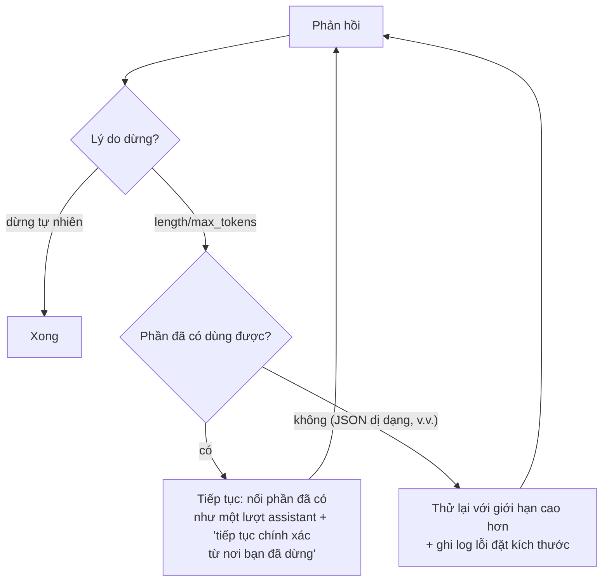
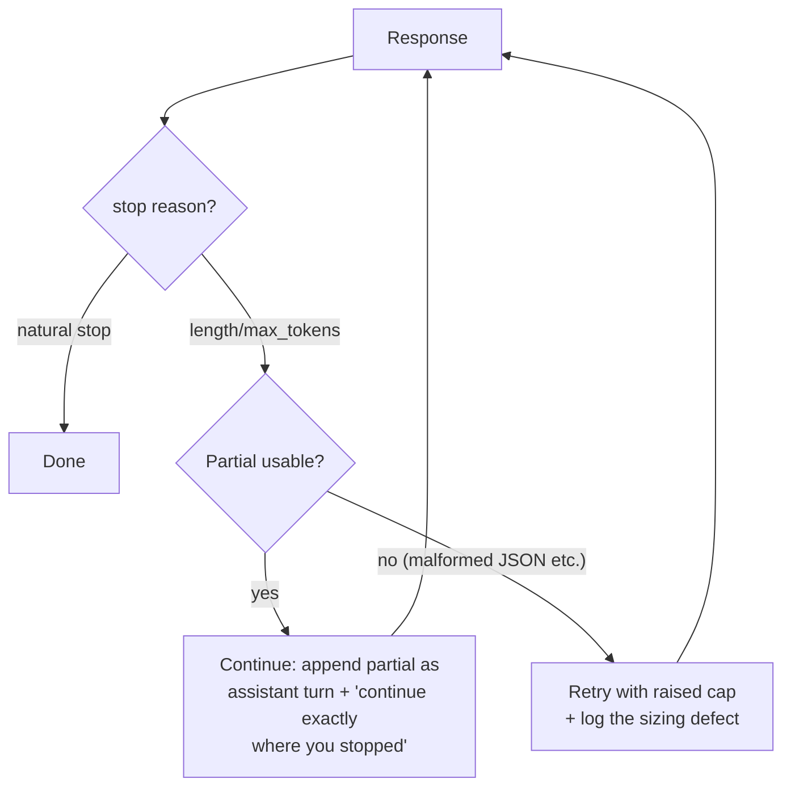

# Đặt kích thước Giới hạn Output (Chấm dứt Cắt bớt-và-Thử lại) (Tiếng Việt)

**Giải quyết:** Nguyên nhân 5.3 trong [`../CAUSE.md`](../CAUSE.md)

**Ý tưởng:** Hãy coi một phản hồi bị cắt bớt là một *lỗi có chi phí đã
biết* — toàn bộ request bị lãng phí và phải thử lại. Để loại bỏ lỗi này:
đặt giới hạn output rộng rãi, streaming các output dài, và khi tình trạng
cắt bớt vẫn xảy ra thì phục hồi bằng **continuation** (tiếp tục) thay vì
thử lại toàn bộ.

---

## Cách áp dụng

### 1. Đặt giới hạn theo từng route, một cách rộng rãi

Giới hạn là một lưới an toàn, không phải công cụ kiểm soát độ ngắn gọn của
output (đó là việc của `concise-output-prompting.md`). Nếu đặt quá thấp,
khoản tiết kiệm tưởng như $0 thực chất sẽ biến thành chi phí của những
lần thử lại toàn bộ request.

| Route | Hướng dẫn giới hạn |
| --- | --- |
| Phân loại/trích xuất | Nhỏ (256–1K) — output thực sự có giới hạn |
| Chat/tóm tắt | Cao hơn thoải mái so với output quan sát P99 (ví dụ 4–16K) |
| Coding/agentic/có bật reasoning | Lớn (16–64K+); **reasoning chia sẻ ngân sách output** — một giới hạn chặt sau khi đã tốn kém cho thinking sẽ cho ra câu trả lời bị cắt bớt dù sao cũng đã phải trả tiền cho việc suy nghĩ |
| Sinh nội dung đã biết là dài | Tối đa của nhà cung cấp, kèm streaming |

Hiệu chỉnh lại giới hạn khi di chuyển model — thay đổi tokenizer làm dịch
chuyển số token của cùng nội dung (nguyên nhân 4.3).

### 2. Streaming mọi thứ có khả năng dài

Streaming loại bỏ áp lực timeout vốn khiến người ta đặt giới hạn thấp, và
cho phép bạn thực thi giới hạn *cấp ứng dụng* (dừng tiêu thụ) mà không đầu
độc request.

### 3. Phục hồi bằng continuation, không phải thử lại toàn bộ

Khi dừng do độ dài, đừng chạy lại toàn bộ request — nối phần output đã có
như một lượt assistant và yêu cầu model tiếp tục từ nơi nó dừng lại. Bạn
trả tiền input lần nữa nhưng giữ được khoản đầu tư output đã có.

### 4. Xử lý riêng các thất bại độ dài của structured output

Một JSON bị cắt bớt là vô dụng — với các route ràng buộc bởi schema:

- Đặt giới hạn rộng rãi (output schema không thể lan man dù sao).
- Dùng các helper thử lại có kiểm định (validation-retry) ở cấp SDK để
  sửa/hỏi lại ở mức tối thiểu (kiểu Instructor), thay vì các vòng lặp yêu
  cầu lại toàn bộ một cách ngây thơ; đồng thời giới hạn số lần thử lại.
- Với các structured output rất lớn, hãy chia nhỏ schema (sinh theo từng
  trang) thay vì dùng một đối tượng khổng lồ.

### 5. Cảnh báo về tỷ lệ cắt bớt

Tỷ trọng dừng do `length` theo từng route là một chỉ số hạng nhất
(`token-counting.md`). Một cú tăng vọt nghĩa là có lỗi đặt kích thước, hoặc
model đã di chuyển khiến số token bị dịch chuyển — hãy sửa giới hạn, đừng
để vòng lặp thử lại âm thầm hấp thụ nó.

## Công cụ hiện đại nhất (SOTA)

### Có sẵn — coding agent & API của nhà cung cấp

| Nhà cung cấp / agent | Tính năng | Ghi chú |
| --- | --- | --- |
| SDK Anthropic / OpenAI / Gemini | Streaming + helper `finalMessage`/`get_final_message` | Output dài mà không cần hạ giới hạn do áp lực timeout |
| Mọi nhà cung cấp | `stop_reason` trong mỗi phản hồi | Tín hiệu mà toàn bộ luồng phục hồi dựa vào — dừng do độ dài so với dừng tự nhiên |

### Bên thứ ba — không phụ thuộc agent (ưu tiên mã nguồn mở)

| Công cụ | Giấy phép | Ghi chú |
| --- | --- | --- |
| Instructor (Python/TS) / kiểm định Zod | MIT | Thử lại tối thiểu có kiểm định cho các route schema, di động qua các nhà cung cấp |
| Dashboard lý do dừng của Langfuse / Helicone | MIT / Apache-2.0 | Cảnh báo tỷ lệ cắt bớt theo từng route cho bất kỳ agent nào đứng sau proxy/SDK wrapper |
| Prompt continuation (mẫu hình harness) | — | Cứu vãn output đã có thay vì bỏ đi — có thể triển khai trong mọi vòng lặp |

## Đánh đổi

- Giới hạn rộng rãi nghĩa là nếu xảy ra một lần sinh vượt tầm kiểm soát
  (runaway generation), nó có thể tốn nhiều hơn trước khi chạm tới lưới an
  toàn. Hãy kết hợp thêm giám sát luồng ở cấp ứng dụng để xử lý những
  trường hợp bệnh lý hiếm gặp này.
- Continuation qua hai phản hồi có thể tạo ra đường nối (token lặp lại
  hoặc bị bỏ sót tại ranh giới). Hãy chỉ dẫn model "tiếp tục chính xác từ
  nơi bạn đã dừng", và xác thực điểm nối đối với các định dạng có cấu
  trúc.
- Sinh theo schema chia nhỏ thêm độ phức tạp điều phối.

## Tác động dự kiến

- Tránh được mỗi chu kỳ cắt bớt-rồi-thử-lại nghĩa là tiết kiệm trọn một
  request: **2–3×** trên lưu lượng bị ảnh hưởng (input bị tính phí lại
  cộng với output dở dang bị bỏ phí).
- Phục hồi bằng continuation cắt chi phí cắt bớt còn lại từ "mọi thứ"
  xuống "chỉ gửi lại input" — thường cứu vãn được 50–90% giá trị của
  request thất bại.
- Cảnh báo tỷ lệ cắt bớt bắt được các dịch chuyển token do di chuyển model
  (nguyên nhân 4.3) trong vài giờ thay vì một chu kỳ billing.

---

# Output Cap Sizing (Ending Truncation-and-Retry)

**Addresses:** Cause 5.3 in [`../CAUSE.md`](../CAUSE.md)

**Idea:** Treat a truncated response as a *defect with a known cost* (the
whole request is wasted and retried), and eliminate it by sizing output caps
generously, streaming long outputs, and recovering with **continuation**
instead of full retry when truncation still happens.

---

## How to apply

### 1. Size caps by route, generously

The cap is a safety backstop, not a conciseness control (that's
`concise-output-prompting.md`). Lowballing it converts $0 of savings into
full-request retries.

| Route | Cap guidance |
| --- | --- |
| Classification / extraction | Small (256–1K) — output genuinely bounded |
| Chat / summarization | Comfortably above P99 observed output (e.g. 4–16K) |
| Coding / agentic / reasoning-enabled | Large (16–64K+); **reasoning shares the output budget** — a tight cap after expensive thinking yields a truncated answer that paid for the thinking anyway |
| Known-long generation | Provider max, with streaming |

Recalibrate caps on model migration — tokenizer changes shift the same
content's token count (cause 4.3).

### 2. Stream anything potentially long

Streaming removes the timeout pressure that pushes people toward low caps,
and lets you enforce *application-level* limits (stop consuming) without
poisoning the request.

### 3. Recover by continuation, not full retry

On a length-stop, don't re-run the whole request — append the partial
output as an assistant turn and ask the model to continue from where it
stopped. You pay the input again but keep the partial output investment.

### 4. Handle structured-output length failures specially

A truncated JSON is unusable — for schema-constrained routes:

- Cap generously (schema output can't ramble anyway).
- Use SDK-level validation-retry helpers that repair/re-ask minimally
  (Instructor-style) rather than naive full re-request loops, and bound the
  retry count.
- For very large structured outputs, split the schema (paginate the
  generation) instead of one giant object.

### 5. Alert on truncation rate

`length`-stop share per route is a first-class metric
(`token-counting.md`); a spike means a sizing defect or a model-migration
shift — fix the cap, don't let the retry loop absorb it silently.

## SOTA tools

### Native — coding agents & provider APIs

| Provider / agent | Feature | Notes |
| --- | --- | --- |
| Anthropic / OpenAI / Gemini SDKs | Streaming + `finalMessage`/`get_final_message` helpers | Long outputs without timeout-driven cap lowering |
| All providers | `stop_reason` in every response | The signal the whole recovery flow keys on — length-stop vs natural stop |

### Third-party — agent-agnostic (open source preferred)

| Tool | License | Notes |
| --- | --- | --- |
| Instructor (Python/TS) / Zod validation | MIT | Validation-aware minimal retries for schema routes, portable across providers |
| Langfuse / Helicone stop-reason dashboards | MIT / Apache-2.0 | Truncation-rate alerting per route for any agent behind the proxy/SDK wrapper |
| Continuation prompts (harness pattern) | — | Salvage partial output instead of discarding it — implementable in any loop |

## Trade-offs

- Generous caps mean a runaway generation can spend more before hitting the
  backstop — pair with application-level stream monitoring for the rare
  pathological case.
- Continuation across two responses can introduce seams (repeated/skipped
  tokens at the boundary) — instruct "continue exactly from where you
  stopped" and validate the join for structured formats.
- Split-schema generation adds orchestration complexity.

## Expected impact

- Each avoided truncate-retry cycle saves a full request: **2–3×** on the
  affected traffic (input re-billed + discarded partial output).
- Continuation recovery cuts the residual truncation cost from "everything"
  to "input re-send only" — typically salvaging 50–90% of the failed
  request's value.
- Truncation-rate alerting catches model-migration token shifts (cause 4.3)
  in hours instead of a billing cycle.
