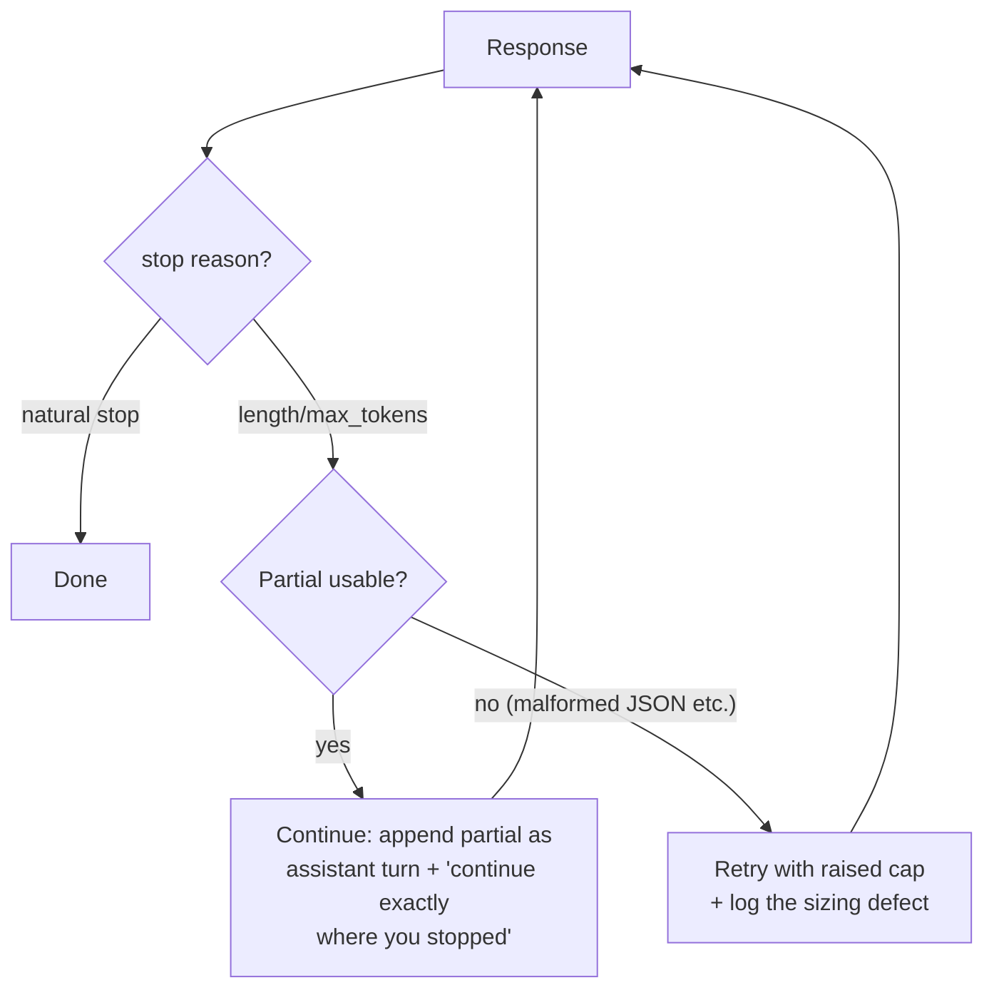

# Output Cap Sizing (Ending Truncation-and-Retry)

**Addresses:** Cause 5.3 in [`../CAUSE.md`](../CAUSE.md)

**Idea:** Treat a truncated response as a *defect with a known cost* (the
whole request is wasted and retried), and eliminate it by sizing output caps
generously, streaming long outputs, and recovering with **continuation**
instead of full retry when truncation still happens.

---

## How to apply

### 1. Size caps by route, generously

The cap is a safety backstop, not a conciseness control (that's
`concise-output-prompting.md`). Lowballing it converts $0 of savings into
full-request retries.

| Route | Cap guidance |
| --- | --- |
| Classification / extraction | Small (256–1K) — output genuinely bounded |
| Chat / summarization | Comfortably above P99 observed output (e.g. 4–16K) |
| Coding / agentic / reasoning-enabled | Large (16–64K+); **reasoning shares the output budget** — a tight cap after expensive thinking yields a truncated answer that paid for the thinking anyway |
| Known-long generation | Provider max, with streaming |

Recalibrate caps on model migration — tokenizer changes shift the same
content's token count (cause 4.3).

### 2. Stream anything potentially long

Streaming removes the timeout pressure that pushes people toward low caps,
and lets you enforce *application-level* limits (stop consuming) without
poisoning the request.

### 3. Recover by continuation, not full retry

On a length-stop, don't re-run the whole request — append the partial
output as an assistant turn and ask the model to continue from where it
stopped. You pay the input again but keep the partial output investment.

### 4. Handle structured-output length failures specially

A truncated JSON is unusable — for schema-constrained routes:

- Cap generously (schema output can't ramble anyway).
- Use SDK-level validation-retry helpers that repair/re-ask minimally
  (Instructor-style) rather than naive full re-request loops, and bound the
  retry count.
- For very large structured outputs, split the schema (paginate the
  generation) instead of one giant object.

### 5. Alert on truncation rate

`length`-stop share per route is a first-class metric
(`token-counting.md`); a spike means a sizing defect or a model-migration
shift — fix the cap, don't let the retry loop absorb it silently.

## SOTA tools

| Tool | Scope | Notes |
| --- | --- | --- |
| Provider streaming APIs + SDK `finalMessage`/`get_final_message` helpers | API | Long outputs without timeout-driven cap lowering |
| Instructor (Python/TS) / OpenAI structured outputs + Zod | SDK | Validation-aware minimal retries for schema routes |
| Stop-reason dashboards (Langfuse/Helicone custom metric) | Observability | Truncation-rate alerting per route |
| Continuation prompts (harness pattern) | Harness | Salvage partial output instead of discarding it |

## Trade-offs

- Generous caps mean a runaway generation can spend more before hitting the
  backstop — pair with application-level stream monitoring for the rare
  pathological case.
- Continuation across two responses can introduce seams (repeated/skipped
  tokens at the boundary) — instruct "continue exactly from where you
  stopped" and validate the join for structured formats.
- Split-schema generation adds orchestration complexity.

## Expected impact

- Each avoided truncate-retry cycle saves a full request: **2–3×** on the
  affected traffic (input re-billed + discarded partial output).
- Continuation recovery cuts the residual truncation cost from "everything"
  to "input re-send only" — typically salvaging 50–90% of the failed
  request's value.
- Truncation-rate alerting catches model-migration token shifts (cause 4.3)
  in hours instead of a billing cycle.
