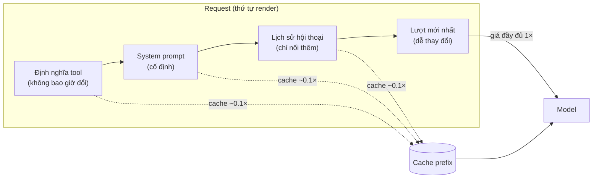
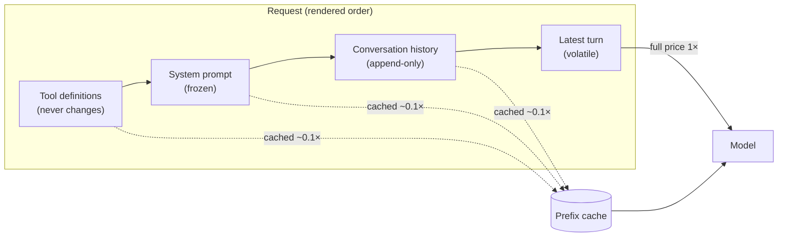

# Prompt / Prefix Caching (Tiếng Việt)

**Giải quyết:** Nguyên nhân 1.1, 1.2, 1.3, 1.4, 6.1 trong [`../CAUSE.md`](../CAUSE.md)

**Ý tưởng:** Phục vụ phần prefix ổn định của mỗi request (định nghĩa tool,
system prompt, tài liệu chung, lịch sử hội thoại) từ cache prompt của nhà
cung cấp với giá ~10–25% giá input thông thường, thay vì xử lý lại ở giá đầy
đủ trên mỗi lệnh gọi.

---

## Cách hoạt động

Caching prompt là **khớp chính xác từng byte của prefix**. Nhà cung cấp
băm (hash) request đã render từ đầu; một request có prefix khớp với một mục
cache đang sống sẽ được tính giá cache-read cho đoạn đó. Thứ tự render trên
hầu như mọi nhà cung cấp là:

```
tool → system prompt → tin nhắn (cũ nhất → mới nhất)
```

Vì vậy quy tắc thiết kế quan trọng nhất là: **sắp xếp nội dung theo độ ổn
định** — không bao giờ để các byte dễ thay đổi xuất hiện trước các byte ổn
định.



Mọi thứ bên trái ranh giới cache cuối cùng đều rẻ; chỉ có phần đuôi mới được
nối thêm mới bị tính giá đầy đủ.

## Cách áp dụng

1. **Phân loại mọi input vào prompt theo độ ổn định**
   - Không bao giờ đổi → đầu (tool, system prompt cốt lõi)
   - Theo phiên → giữa (profile người dùng, tài liệu đã tải)
   - Theo lượt → cuối (tin nhắn mới nhất, trạng thái được chèn vào)
   - Theo request (timestamp, UUID) → **loại bỏ, hoặc chuyển xuống cuối
     cùng**
2. **Bật cơ chế caching của nhà cung cấp**
   - *Anthropic*: breakpoint `cache_control: {type: "ephemeral"}` tường
     minh (tối đa 4), `ttl: "1h"` tùy chọn; có sẵn chế độ tự động đặt ở cấp
     cao nhất.
   - *OpenAI*: caching prefix tự động cho prompt ≥ 1.024 token — không cần
     bật, nhưng các quy tắc ổn định prefix vẫn quyết định việc có trúng hay
     không. `prompt_cache_key` cải thiện định tuyến hit cho các prefix lưu
     lượng cao.
   - *Google Gemini*: caching ngầm định (tự động) cộng với đối tượng
     `CachedContent` tường minh với TTL có thể kiểm soát cho các shared corpus lớn.
   - *Tự host*: vLLM **Automatic Prefix Caching (APC)**, SGLang
     **RadixAttention** — cùng các quy tắc ổn định prefix áp dụng cho tái sử
     dụng KV-cache.
3. **Cố định phần đầu của prompt**
   - Không dùng `datetime.now()` / `Date.now()` trong system prompt.
   - Serialize tất định: `json.dumps(..., sort_keys=True)`, danh sách tool
     đã sắp xếp, không lặp qua set/map.
   - Chèn context động (ngày tháng, chế độ, trạng thái người dùng) *muộn*
     — như một tin nhắn, không phải sửa system prompt. Các tin nhắn
     `role: "system"` giữa hội thoại của Anthropic tồn tại chính xác cho
     mục đích này.
4. **Chỉ nối thêm, không bao giờ viết lại** — giữ lịch sử hội thoại giống
   hệt từng byte giữa các lượt; chỉ thêm nội dung mới ở cuối.
5. **Khớp TTL với hình dạng lưu lượng** — lưu lượng liên tục giữ TTL ngắn
   mặc định luôn ấm miễn phí; lưu lượng dồn cục có khoảng nghỉ dài cần TTL
   dài hơn (Anthropic 1 giờ) hoặc một tín hiệu pre-warm (xem bên dưới).
6. **Pre-warm khi độ trễ request đầu tiên quan trọng** — Anthropic hỗ trợ
   một request `max_tokens: 0` chạy prefill (ghi cache) và trả về ngay lập
   tức; kích hoạt nó khi ứng dụng khởi động hoặc ngay trước một khung giờ
   theo lịch.
7. **Làm cho fork/subagent kế thừa prefix nguyên văn** — một lệnh gọi
   summarizer hoặc subagent xây lại `system`/`tools` với bất kỳ khác biệt
   nào sẽ bỏ lỡ hoàn toàn cache của agent cha. Sao chép chúng từng byte một,
   chỉ nối thêm nội dung riêng của fork ở cuối.

## Vòng lặp xác minh

Caching thất bại **một cách âm thầm** — cấu hình sai không tạo ra lỗi, chỉ
tạo ra hóa đơn giá đầy đủ. Hãy đo lường nó:

```python
u = response.usage
total = u.input_tokens + u.cache_read_input_tokens + u.cache_creation_input_tokens
hit_rate = u.cache_read_input_tokens / max(total, 1)
# cảnh báo nếu hit_rate thấp hơn kỳ vọng trên lưu lượng ổn định
```

Nếu số lần đọc cache bằng 0 trên các request trông giống hệt nhau, hãy so
sánh (diff) các byte request đã render đầy đủ của hai lệnh gọi liên tiếp —
đoạn gây thay đổi chính là lỗi.

## Công cụ hiện đại nhất (SOTA)

### Có sẵn — coding agent & API của nhà cung cấp

| Nhà cung cấp / agent | Tính năng | Ghi chú |
| --- | --- | --- |
| Anthropic API · Claude Code / Agent SDK | Breakpoint `cache_control`, TTL 5 phút/1 giờ, pre-warm `max_tokens: 0`, beta chẩn đoán cache | Các harness tự động đặt breakpoint — không cần cấu hình gì khi bạn chạy bên trong chúng |
| OpenAI API · Codex | Caching prefix tự động (≥1.024 token), định tuyến `prompt_cache_key` | Giảm giá 50–75% trên token đã cache; không cần bật, nhưng các quy tắc ổn định prefix vẫn quyết định việc có trúng hay không |
| Google Gemini API · Gemini CLI | Caching ngầm định + `CachedContent` tường minh có TTL | Chế độ tường minh phù hợp cho các shared corpus khổng lồ |

### Bên thứ ba — không phụ thuộc agent (ưu tiên mã nguồn mở)

| Công cụ | Giấy phép | Ghi chú |
| --- | --- | --- |
| vLLM APC / SGLang RadixAttention | Apache-2.0 | Tái sử dụng KV-cache prefix tự host; radix tree của SGLang chia sẻ các prefix một phần giữa các request đồng thời |
| Langfuse / Helicone / OpenLLMetry | MIT / Apache-2.0 | Theo dõi tỷ lệ cached-vs-uncached theo từng route để bắt được các trường hợp vô hiệu hóa âm thầm — hoạt động trước mọi agent, mọi nhà cung cấp |
| LiteLLM | MIT | Đo lường mức sử dụng cache và truyền qua TTL/key ở cấp gateway, thống nhất trên các nhà cung cấp |

## Đánh đổi

- Ghi cache có thể mang phụ phí (Anthropic: 1.25× ở TTL 5 phút, 2× ở 1 giờ)
  — các prompt dùng một lần không bao giờ tái sử dụng sẽ *mất tiền* khi
  caching.
- Tồn tại kích thước prefix tối thiểu có thể cache (≈1K–4K token tùy
  model); các prompt nhỏ sẽ âm thầm không được cache.
- Thiết kế để đạt độ ổn định giới hạn kỹ thuật viết prompt: không cá nhân
  hóa theo từng request ở đầu, chuyển đổi chế độ phải chuyển vào
  tin nhắn/tool.
- Cache gắn với model cụ thể — các A/B test trên nhiều model đều giữ cache
  riêng.

## Tác động dự kiến

- **Giảm tới ~90% chi phí input** trên đoạn được cache (đọc ở ~0.1× trên
  Anthropic; giảm giá 50–75% trên token đã cache của OpenAI/Gemini).
- **Thắng lợi lớn về độ trễ** trên các prefix dài — các nhà cung cấp báo
  cáo giảm tới ~80% thời gian đến token đầu tiên cho các prompt được cache
  nhiều.
- Trong các phiên agentic dài, nơi lịch sử chiếm phần lớn request, chi tiêu
  input hiệu dụng thường giảm **5–10×** một khi lịch sử được cache thường
  trú.
- Sửa một *yếu tố vô hiệu hóa âm thầm* thường là thay đổi có ROI cao nhất
  trong một stack agent: một dòng (một timestamp được chuyển ra khỏi
  system prompt) có thể cắt giảm hóa đơn của mọi request sau đó.

---

# Prompt / Prefix Caching

**Addresses:** Causes 1.1, 1.2, 1.3, 1.4, 6.1 in [`../CAUSE.md`](../CAUSE.md)

**Idea:** Serve the stable prefix of every request (tool definitions, system
prompt, shared documents, conversation history) from the provider's prompt
cache at ~10–25% of the normal input price, instead of re-processing it at
full price on every call.

---

## How it works

Prompt caching is a **byte-exact prefix match**. The provider hashes the
rendered request from the front; a request whose prefix matches a live cache
entry pays cache-read rates for that span. The render order on virtually all
providers is:

```
tools → system prompt → messages (oldest → newest)
```

So the single most important design rule is: **order content by stability**
— never let volatile bytes appear before stable ones.



Everything left of the last cache boundary is cheap; only the newly appended
suffix is billed at full price.

## How to apply

1. **Classify every input to the prompt by stability**
   - Never changes → front (tools, core system prompt)
   - Per-session → middle (user profile, loaded documents)
   - Per-turn → end (latest message, injected state)
   - Per-request (timestamps, UUIDs) → **eliminate, or move to the very end**
2. **Enable the provider's caching mechanism**
   - *Anthropic*: explicit `cache_control: {type: "ephemeral"}` breakpoints
     (max 4), optional `ttl: "1h"`; top-level auto-placement available.
   - *OpenAI*: automatic prefix caching for prompts ≥ 1,024 tokens — no
     opt-in, but the prefix-stability rules still decide whether it hits.
     `prompt_cache_key` improves hit routing for high-traffic prefixes.
   - *Google Gemini*: implicit caching (automatic) plus explicit
     `CachedContent` objects with a controllable TTL for large shared
     corpora.
   - *Self-hosted*: vLLM **Automatic Prefix Caching (APC)**, SGLang
     **RadixAttention** — same prefix-stability rules apply to KV-cache
     reuse.
3. **Freeze the front of the prompt**
   - No `datetime.now()` / `Date.now()` in the system prompt.
   - Deterministic serialization: `json.dumps(..., sort_keys=True)`, sorted
     tool lists, no iteration over sets/maps.
   - Inject dynamic context (date, mode, user state) *late* — as a message,
     not a system-prompt edit. Anthropic's mid-conversation `role: "system"`
     messages exist precisely for this.
4. **Append, never rewrite** — keep the conversation history byte-identical
   between turns; add new content only at the end.
5. **Match TTL to traffic shape** — continuous traffic keeps the default
   short TTL warm for free; bursty traffic with long gaps needs the longer
   TTL (Anthropic 1h) or a pre-warm ping (see below).
6. **Pre-warm when first-request latency matters** — Anthropic supports a
   `max_tokens: 0` request that runs prefill (writing the cache) and returns
   immediately; fire it at app startup or just before a scheduled window.
7. **Make forks/subagents inherit the prefix verbatim** — a summarizer or
   subagent call that rebuilds `system`/`tools` with any difference misses
   the parent's cache entirely. Copy them byte-for-byte, append the
   fork-specific content at the end.

## Verification loop

Caching fails **silently** — a missed configuration produces no error, just
full-price bills. Instrument it:

```python
u = response.usage
total = u.input_tokens + u.cache_read_input_tokens + u.cache_creation_input_tokens
hit_rate = u.cache_read_input_tokens / max(total, 1)
# alert if hit_rate < expected on steady-state traffic
```

If cache reads are zero across identical-looking requests, diff the fully
rendered request bytes of two consecutive calls — the mutating fragment is
the bug.

## SOTA tools

### Native — coding agents & provider APIs

| Provider / agent | Feature | Notes |
| --- | --- | --- |
| Anthropic API · Claude Code / Agent SDK | `cache_control` breakpoints, 5m/1h TTL, `max_tokens: 0` pre-warm, cache-diagnostics beta | The harnesses place breakpoints automatically — zero configuration when you run inside them |
| OpenAI API · Codex | Automatic prefix caching (≥1,024 tokens), `prompt_cache_key` routing | 50–75% discount on cached tokens; no opt-in, but the prefix-stability rules still decide whether it hits |
| Google Gemini API · Gemini CLI | Implicit caching + explicit `CachedContent` with TTL | Explicit mode fits huge shared corpora |

### Third-party — agent-agnostic (open source preferred)

| Tool | License | Notes |
| --- | --- | --- |
| vLLM APC / SGLang RadixAttention | Apache-2.0 | Self-hosted KV-cache prefix reuse; SGLang's radix tree shares partial prefixes across concurrent requests |
| Langfuse / Helicone / OpenLLMetry | MIT / Apache-2.0 | Cached-vs-uncached ratio tracking per route to catch silent invalidation — sits in front of any agent, any provider |
| LiteLLM | MIT | Gateway-level cache-usage telemetry and TTL/key passthrough uniform across providers |

## Trade-offs

- Cache writes can carry a surcharge (Anthropic: 1.25× at 5m TTL, 2× at 1h)
  — one-shot prompts that are never reused *lose* money on caching.
- Minimum cacheable prefix sizes exist (≈1K–4K tokens depending on model);
  small prompts silently don't cache.
- Designing for stability constrains prompt engineering: no per-request
  personalization at the front, mode switches must move into messages/tools.
- Caches are model-scoped — A/B tests across models each keep their own.

## Expected impact

- **Up to ~90% reduction in input cost** on the cached span (reads at ~0.1×
  on Anthropic; 50–75% discount on OpenAI/Gemini cached tokens).
- **Large latency wins** on long prefixes — providers report up to ~80%
  time-to-first-token reduction for heavily cached prompts.
- In long agentic sessions, where history dominates the request, effective
  input spend routinely drops **5–10×** once the history is cache-resident.
- Fixing a *silent invalidator* is usually the single highest-ROI change in
  an agent stack: one line (a timestamp moved out of the system prompt) can
  cut the bill of every subsequent request.
