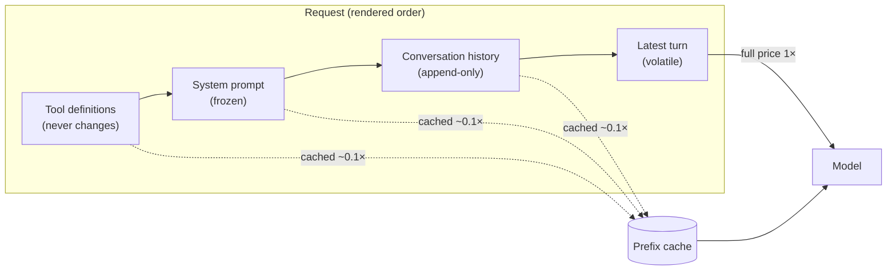

# Prompt / Prefix Caching

**Addresses:** Causes 1.1, 1.2, 1.3, 1.4, 6.1 in [`../CAUSE.md`](../CAUSE.md)

**Idea:** Serve the stable prefix of every request (tool definitions, system
prompt, shared documents, conversation history) from the provider's prompt
cache at ~10–25% of the normal input price, instead of re-processing it at
full price on every call.

---

## How it works

Prompt caching is a **byte-exact prefix match**. The provider hashes the
rendered request from the front; a request whose prefix matches a live cache
entry pays cache-read rates for that span. The render order on virtually all
providers is:

```
tools → system prompt → messages (oldest → newest)
```

So the single most important design rule is: **order content by stability**
— never let volatile bytes appear before stable ones.



Everything left of the last cache boundary is cheap; only the newly appended
suffix is billed at full price.

## How to apply

1. **Classify every input to the prompt by stability**
   - Never changes → front (tools, core system prompt)
   - Per-session → middle (user profile, loaded documents)
   - Per-turn → end (latest message, injected state)
   - Per-request (timestamps, UUIDs) → **eliminate, or move to the very end**
2. **Enable the provider's caching mechanism**
   - *Anthropic*: explicit `cache_control: {type: "ephemeral"}` breakpoints
     (max 4), optional `ttl: "1h"`; top-level auto-placement available.
   - *OpenAI*: automatic prefix caching for prompts ≥ 1,024 tokens — no
     opt-in, but the prefix-stability rules still decide whether it hits.
     `prompt_cache_key` improves hit routing for high-traffic prefixes.
   - *Google Gemini*: implicit caching (automatic) plus explicit
     `CachedContent` objects with a controllable TTL for large shared
     corpora.
   - *Self-hosted*: vLLM **Automatic Prefix Caching (APC)**, SGLang
     **RadixAttention** — same prefix-stability rules apply to KV-cache
     reuse.
3. **Freeze the front of the prompt**
   - No `datetime.now()` / `Date.now()` in the system prompt.
   - Deterministic serialization: `json.dumps(..., sort_keys=True)`, sorted
     tool lists, no iteration over sets/maps.
   - Inject dynamic context (date, mode, user state) *late* — as a message,
     not a system-prompt edit. Anthropic's mid-conversation `role: "system"`
     messages exist precisely for this.
4. **Append, never rewrite** — keep the conversation history byte-identical
   between turns; add new content only at the end.
5. **Match TTL to traffic shape** — continuous traffic keeps the default
   short TTL warm for free; bursty traffic with long gaps needs the longer
   TTL (Anthropic 1h) or a pre-warm ping (see below).
6. **Pre-warm when first-request latency matters** — Anthropic supports a
   `max_tokens: 0` request that runs prefill (writing the cache) and returns
   immediately; fire it at app startup or just before a scheduled window.
7. **Make forks/subagents inherit the prefix verbatim** — a summarizer or
   subagent call that rebuilds `system`/`tools` with any difference misses
   the parent's cache entirely. Copy them byte-for-byte, append the
   fork-specific content at the end.

## Verification loop

Caching fails **silently** — a missed configuration produces no error, just
full-price bills. Instrument it:

```python
u = response.usage
total = u.input_tokens + u.cache_read_input_tokens + u.cache_creation_input_tokens
hit_rate = u.cache_read_input_tokens / max(total, 1)
# alert if hit_rate < expected on steady-state traffic
```

If cache reads are zero across identical-looking requests, diff the fully
rendered request bytes of two consecutive calls — the mutating fragment is
the bug.

## SOTA tools

| Tool / mechanism | Scope | Notes |
| --- | --- | --- |
| Anthropic `cache_control` | API | Explicit breakpoints, 5m/1h TTL, `max_tokens: 0` pre-warm, cache-diagnostics beta |
| OpenAI prefix caching | API | Automatic ≥1,024 tokens, 50–75% discount on cached tokens, `prompt_cache_key` routing |
| Gemini context caching | API | Implicit + explicit `CachedContent` with TTL; explicit mode fits huge shared corpora |
| vLLM APC / SGLang RadixAttention | Self-hosted | KV-cache prefix reuse; SGLang's radix tree shares partial prefixes across concurrent requests |
| Langfuse / Helicone / OpenLLMetry | Observability | Track cached-vs-uncached token ratios per route to catch silent invalidation regressions |

## Trade-offs

- Cache writes can carry a surcharge (Anthropic: 1.25× at 5m TTL, 2× at 1h)
  — one-shot prompts that are never reused *lose* money on caching.
- Minimum cacheable prefix sizes exist (≈1K–4K tokens depending on model);
  small prompts silently don't cache.
- Designing for stability constrains prompt engineering: no per-request
  personalization at the front, mode switches must move into messages/tools.
- Caches are model-scoped — A/B tests across models each keep their own.

## Expected impact

- **Up to ~90% reduction in input cost** on the cached span (reads at ~0.1×
  on Anthropic; 50–75% discount on OpenAI/Gemini cached tokens).
- **Large latency wins** on long prefixes — providers report up to ~80%
  time-to-first-token reduction for heavily cached prompts.
- In long agentic sessions, where history dominates the request, effective
  input spend routinely drops **5–10×** once the history is cache-resident.
- Fixing a *silent invalidator* is usually the single highest-ROI change in
  an agent stack: one line (a timestamp moved out of the system prompt) can
  cut the bill of every subsequent request.
