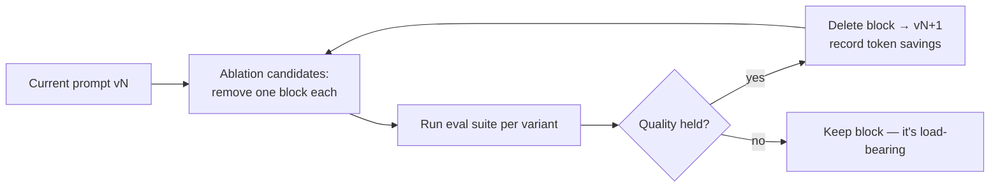

# Prompt De-Scaffolding (Audit the Accreted Overhead)

**Addresses:** Cause 6.4 in [`../CAUSE.md`](../CAUSE.md)

**Idea:** System prompts accrete scaffolding across model generations —
forced narration, step-by-step procedures, verification rituals, few-shot
batteries — that current models no longer need. Audit it against evals,
delete what the model now does unprompted, and keep the prompt version
that's *measured* cheapest at equal quality.

---

## Why scaffolding is doubly expensive

Scaffolding costs twice: as **fixed prompt overhead** on every request, and
as **induced output** — instructions like "summarize progress after every 3
tool calls" or "explain your reasoning step by step" generate tokens on
every turn that a current model wouldn't otherwise produce (reasoning models
already reason internally; modern agent models already narrate
appropriately). Over-prescriptive step lists can also *reduce* output
quality on newer models, which perform better from goals + constraints than
from enumerated procedures.

## How to apply

### 1. Inventory the suspects

Grep your prompts for the classic accretions:

| Scaffolding | Why it existed | Current status |
| --- | --- | --- |
| "Let's think step by step" / manual CoT | Pre-reasoning models needed elicitation | Redundant (and doubly billed) on reasoning-enabled models |
| "After every N tool calls, summarize progress" | Old models went silent | Current agent models narrate by default — this now *doubles* narration |
| "CRITICAL: YOU MUST use tool X" | Old models under-triggered tools | Over-triggers on literal-instruction-following models |
| Long few-shot batteries | Weak zero-shot behavior | Often droppable or cut to 1 example on frontier models |
| "Double-check / verify before returning" rituals | Unreliable outputs | Modern models self-verify; keep only where evals show lift |
| Defensive repetition (same rule stated 3 ways) | Instruction-following was flaky | One clear statement now suffices — and follows *more* literally |

### 2. Ablate with evals, not vibes

De-scaffolding is an eval-driven deletion campaign:

Track two numbers per variant: task quality and **tokens per completed
task** (prompt + induced output). Ship the Pareto winner.

### 3. Automate the search where volume justifies it

Prompt-optimization frameworks explore instruction/few-shot configurations
against your metric automatically — modern optimizers regularly find
*shorter* prompts that score higher, because they select only load-bearing
instructions and the minimal effective demo set.

### 4. Re-audit on every model migration

Each generation obsoletes another layer of scaffolding (migration guides
explicitly list which). Fold a de-scaffolding ablation pass into the
migration checklist — the prompt tuned for the old model is now both too
big and mis-tuned.

### 5. Move rarely-needed instruction into on-demand context

Static "how to handle situation X" sections that apply to 2% of requests
belong in progressively-disclosed resources (skills/playbooks/files the
model loads when relevant), not in every request's system prompt.

## SOTA tools

### Native — coding agents & provider APIs

| Provider / agent | Feature | Notes |
| --- | --- | --- |
| Anthropic / OpenAI migration guides | Reference docs | Authoritative lists of which scaffolding each model generation obsoletes |
| Claude Code / Agent SDK skills | Progressive disclosure | Where evicted situational instruction should live — loaded on demand, not carried in every request |

### Third-party — agent-agnostic (open source preferred)

| Tool | License | Notes |
| --- | --- | --- |
| DSPy (MIPROv2 / GEPA optimizers) | MIT | Metric-driven instruction+demo search; routinely finds shorter, better prompts on any provider |
| promptfoo / Langfuse experiments | MIT | The ablation harness: side-by-side variants, quality + token cost per variant; Braintrust is the commercial alternative |

## Trade-offs

- Requires a real eval suite — deleting without measurement is how quality
  regressions ship. (If you lack evals, building them is the prerequisite,
  and pays for itself across every solution in this folder.)
- Some scaffolding is load-bearing for *your* edge cases even if generally
  obsolete; ablation finds this, wholesale deletion doesn't.
- Optimizer-generated prompts need human review for tone/brand/safety
  language.

## Expected impact

- System-prompt token reductions of **30–70%** are common on prompts that
  have survived 2+ model generations — saved on *every request*, and (if
  the prompt head was cached) freeing cache-budget for content that varies.
- Induced-output savings are often larger than the prompt savings:
  dropping forced narration/CoT rituals cuts per-turn output measurably on
  agent routes.
- Frequent quality *improvement* as a side effect: less over-triggering,
  less ritual text, better instruction-following on modern literal models —
  the migration guides document this direction explicitly.
