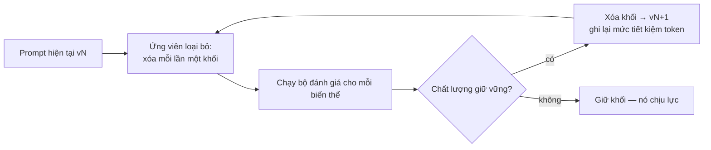
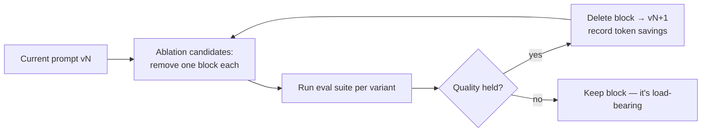

# Gỡ bỏ Scaffolding Prompt (Rà soát Chi phí Tích lũy) (Tiếng Việt)

**Giải quyết:** Nguyên nhân 6.4 trong [`../CAUSE.md`](../CAUSE.md)

**Ý tưởng:** System prompt tích lũy scaffolding qua các thế hệ model — tường
thuật bắt buộc, quy trình từng bước, nghi thức xác minh, các bộ few-shot —
mà các model hiện tại không còn cần nữa. Rà soát nó dựa trên đánh giá, xóa
những gì model hiện nay tự làm mà không cần yêu cầu, và giữ phiên bản
prompt *được đo là* rẻ nhất ở cùng mức chất lượng.

---

## Tại sao scaffolding đắt gấp đôi

Scaffolding tốn kém hai lần: như **chi phí prompt cố định** trên mỗi
request, và như **output bị gây ra** — các chỉ dẫn như "tóm tắt tiến độ
sau mỗi 3 lệnh gọi tool" hoặc "giải thích lý luận của bạn từng bước" sinh
ra token trên mỗi lượt mà một model hiện tại lẽ ra sẽ không tự tạo ra
(model reasoning đã tự suy luận nội bộ; các model agent hiện đại đã tường
thuật phù hợp). Danh sách bước quá quy định cũng có thể *làm giảm* chất
lượng output trên các model mới hơn, vốn hoạt động tốt hơn từ mục
tiêu + ràng buộc thay vì từ quy trình liệt kê.

## Cách áp dụng

### 1. Kiểm kê các nghi phạm

Grep prompt của bạn tìm các khoản tích lũy kinh điển:

| Scaffolding | Tại sao nó từng tồn tại | Trạng thái hiện tại |
| --- | --- | --- |
| "Hãy suy nghĩ từng bước" / CoT thủ công | Các model trước-reasoning cần được gợi mở | Dư thừa (và bị tính phí gấp đôi) trên các model có bật reasoning |
| "Sau mỗi N lệnh gọi tool, tóm tắt tiến độ" | Model cũ im lặng | Các model agent hiện tại tường thuật theo mặc định — điều này giờ *nhân đôi* tường thuật |
| "QUAN TRỌNG: BẠN PHẢI dùng tool X" | Model cũ ít kích hoạt tool | Kích hoạt quá mức trên các model tuân theo chỉ dẫn theo nghĩa đen |
| Các bộ few-shot dài | Hành vi zero-shot yếu | Thường có thể bỏ hoặc cắt còn 1 ví dụ trên các model frontier |
| Nghi thức "kiểm tra lại/xác minh trước khi trả về" | Output không đáng tin cậy | Các model hiện đại tự xác minh; chỉ giữ nơi đánh giá cho thấy lợi ích |
| Lặp lại phòng thủ (cùng quy tắc nói 3 cách) | Việc tuân theo chỉ dẫn từng chập chờn | Một câu rõ ràng giờ đã đủ — và được tuân theo *sát nghĩa hơn* |

### 2. Loại bỏ bằng đánh giá, không phải cảm tính

Gỡ bỏ scaffolding là một chiến dịch xóa dựa trên đánh giá:

Theo dõi hai con số cho mỗi biến thể: chất lượng tác vụ và **token mỗi tác
vụ hoàn thành** (prompt + output bị gây ra). Triển khai người thắng
Pareto.

### 3. Tự động hóa việc tìm kiếm khi khối lượng biện minh được

Các framework tối ưu prompt khám phá tự động các cấu hình
chỉ-dẫn/few-shot theo chỉ số của bạn — các trình tối ưu hiện đại thường
xuyên tìm ra các prompt *ngắn hơn* mà điểm cao hơn, vì chúng chỉ chọn các
chỉ dẫn chịu lực và bộ demo hiệu quả tối thiểu.

### 4. Rà soát lại trên mỗi lần di chuyển model

Mỗi thế hệ khiến một lớp scaffolding khác trở nên lỗi thời (hướng dẫn di
chuyển liệt kê rõ cái nào). Gấp một lượt loại bỏ scaffolding vào checklist
di chuyển — prompt được tinh chỉnh cho model cũ giờ vừa quá lớn vừa tinh
chỉnh sai.

### 5. Chuyển chỉ dẫn hiếm khi cần vào context theo yêu cầu

Các phần "cách xử lý tình huống X" tĩnh áp dụng cho 2% request nên thuộc
về tài nguyên tiết lộ dần dần (skill/playbook/file model tải khi liên
quan), không phải trong system prompt của mọi request. Mức tiết kiệm lớn
và cụ thể: với tiết lộ dần dần, chỉ có *tên + mô tả ngắn* của mỗi tài
nguyên (vài chục token) nằm trong context cho đến khi nó được kích hoạt —
nên **10 skill chỉ tốn ~1K token từ đầu thay vì ~50K** như khi toàn bộ nội
dung của chúng luôn được tải. Cấu trúc hướng dẫn dài theo cùng cách: một
SKILL.md/playbook ngắn trỏ tới các file chi tiết được tải theo yêu cầu.

## Công cụ hiện đại nhất (SOTA)

### Có sẵn — coding agent & API của nhà cung cấp

| Nhà cung cấp / agent | Tính năng | Ghi chú |
| --- | --- | --- |
| Hướng dẫn di chuyển của Anthropic / OpenAI | Tài liệu tham khảo | Danh sách chính thức về scaffolding nào mỗi thế hệ model làm lỗi thời |
| Skill của Claude Code / Agent SDK | Tiết lộ dần dần | Nơi chỉ dẫn theo tình huống bị loại bỏ nên tồn tại — tải theo yêu cầu, không mang theo trong mỗi request |

### Bên thứ ba — không phụ thuộc agent (ưu tiên mã nguồn mở)

| Công cụ | Giấy phép | Ghi chú |
| --- | --- | --- |
| DSPy (trình tối ưu MIPROv2 / GEPA) | MIT | Tìm kiếm chỉ dẫn+demo theo chỉ số; thường xuyên tìm ra các prompt ngắn hơn, tốt hơn trên mọi nhà cung cấp |
| Thí nghiệm promptfoo / Langfuse | MIT | Harness loại bỏ: các biến thể song song, chất lượng + chi phí token mỗi biến thể; Braintrust là lựa chọn thương mại thay thế |

## Đánh đổi

- Đòi hỏi một bộ đánh giá thực sự — xóa mà không đo lường là cách các
  hồi quy chất lượng lọt qua. (Nếu bạn thiếu đánh giá, xây dựng chúng là
  điều kiện tiên quyết, và tự trả giá trị của nó qua mọi giải pháp trong
  thư mục này.)
- Một số scaffolding chịu lực cho các trường hợp biên *của bạn* dù nhìn
  chung đã lỗi thời; loại bỏ từng phần phát hiện ra điều này, xóa hàng
  loạt thì không.
- Prompt do trình tối ưu sinh ra cần con người rà soát về giọng
  điệu/thương hiệu/ngôn ngữ an toàn.

## Tác động dự kiến

- Giảm token system-prompt **30–70%** là phổ biến trên các prompt đã tồn
  tại qua 2+ thế hệ model — tiết kiệm trên *mọi request*, và (nếu phần đầu
  prompt được cache) giải phóng ngân sách cache cho nội dung thay đổi.
- Tiết kiệm output bị gây ra thường lớn hơn tiết kiệm prompt: bỏ các nghi
  thức tường thuật/CoT bắt buộc cắt giảm output mỗi lượt một cách đáng kể
  trên các route agent.
- *Cải thiện* chất lượng thường xuyên như một hiệu ứng phụ: ít kích hoạt
  quá mức hơn, ít văn bản nghi thức hơn, tuân theo chỉ dẫn tốt hơn trên
  các model theo nghĩa đen hiện đại — các hướng dẫn di chuyển ghi tài liệu
  rõ ràng hướng đi này.

---

# Prompt De-Scaffolding (Audit the Accreted Overhead)

**Addresses:** Cause 6.4 in [`../CAUSE.md`](../CAUSE.md)

**Idea:** System prompts accrete scaffolding across model generations —
forced narration, step-by-step procedures, verification rituals, few-shot
batteries — that current models no longer need. Audit it against evals,
delete what the model now does unprompted, and keep the prompt version
that's *measured* cheapest at equal quality.

---

## Why scaffolding is doubly expensive

Scaffolding costs twice: as **fixed prompt overhead** on every request, and
as **induced output** — instructions like "summarize progress after every 3
tool calls" or "explain your reasoning step by step" generate tokens on
every turn that a current model wouldn't otherwise produce (reasoning models
already reason internally; modern agent models already narrate
appropriately). Over-prescriptive step lists can also *reduce* output
quality on newer models, which perform better from goals + constraints than
from enumerated procedures.

## How to apply

### 1. Inventory the suspects

Grep your prompts for the classic accretions:

| Scaffolding | Why it existed | Current status |
| --- | --- | --- |
| "Let's think step by step" / manual CoT | Pre-reasoning models needed elicitation | Redundant (and doubly billed) on reasoning-enabled models |
| "After every N tool calls, summarize progress" | Old models went silent | Current agent models narrate by default — this now *doubles* narration |
| "CRITICAL: YOU MUST use tool X" | Old models under-triggered tools | Over-triggers on literal-instruction-following models |
| Long few-shot batteries | Weak zero-shot behavior | Often droppable or cut to 1 example on frontier models |
| "Double-check / verify before returning" rituals | Unreliable outputs | Modern models self-verify; keep only where evals show lift |
| Defensive repetition (same rule stated 3 ways) | Instruction-following was flaky | One clear statement now suffices — and follows *more* literally |

### 2. Ablate with evals, not vibes

De-scaffolding is an eval-driven deletion campaign:

Track two numbers per variant: task quality and **tokens per completed
task** (prompt + induced output). Ship the Pareto winner.

### 3. Automate the search where volume justifies it

Prompt-optimization frameworks explore instruction/few-shot configurations
against your metric automatically — modern optimizers regularly find
*shorter* prompts that score higher, because they select only load-bearing
instructions and the minimal effective demo set.

### 4. Re-audit on every model migration

Each generation obsoletes another layer of scaffolding (migration guides
explicitly list which). Fold a de-scaffolding ablation pass into the
migration checklist — the prompt tuned for the old model is now both too
big and mis-tuned.

### 5. Move rarely-needed instruction into on-demand context

Static "how to handle situation X" sections that apply to 2% of requests
belong in progressively-disclosed resources (skills/playbooks/files the
model loads when relevant), not in every request's system prompt. The
saving is large and concrete: with progressive disclosure, only each
resource's *name + short description* (a few dozen tokens) sits in context
until it's triggered — so **10 skills cost ~1K tokens up front instead of
the ~50K** they would if their full bodies were always loaded. Structure
long guidance the same way: a short SKILL.md/playbook that points to
detail files loaded on demand.

## SOTA tools

### Native — coding agents & provider APIs

| Provider / agent | Feature | Notes |
| --- | --- | --- |
| Anthropic / OpenAI migration guides | Reference docs | Authoritative lists of which scaffolding each model generation obsoletes |
| Claude Code / Agent SDK skills | Progressive disclosure | Where evicted situational instruction should live — loaded on demand, not carried in every request |

### Third-party — agent-agnostic (open source preferred)

| Tool | License | Notes |
| --- | --- | --- |
| DSPy (MIPROv2 / GEPA optimizers) | MIT | Metric-driven instruction+demo search; routinely finds shorter, better prompts on any provider |
| promptfoo / Langfuse experiments | MIT | The ablation harness: side-by-side variants, quality + token cost per variant; Braintrust is the commercial alternative |

## Trade-offs

- Requires a real eval suite — deleting without measurement is how quality
  regressions ship. (If you lack evals, building them is the prerequisite,
  and pays for itself across every solution in this folder.)
- Some scaffolding is load-bearing for *your* edge cases even if generally
  obsolete; ablation finds this, wholesale deletion doesn't.
- Optimizer-generated prompts need human review for tone/brand/safety
  language.

## Expected impact

- System-prompt token reductions of **30–70%** are common on prompts that
  have survived 2+ model generations — saved on *every request*, and (if
  the prompt head was cached) freeing cache-budget for content that varies.
- Induced-output savings are often larger than the prompt savings:
  dropping forced narration/CoT rituals cuts per-turn output measurably on
  agent routes.
- Frequent quality *improvement* as a side effect: less over-triggering,
  less ritual text, better instruction-following on modern literal models —
  the migration guides document this direction explicitly.
