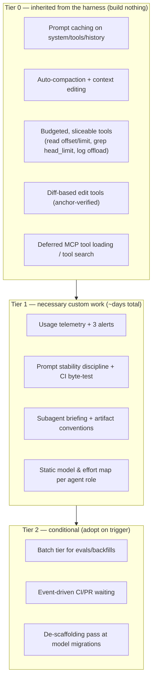

# Recommended Setup: Large Codebase, Many Agents

A prioritized recommendation distilled from the full catalog, for one
specific (and common) profile: **a large codebase worked on by many
coding/dev agents** — orchestrators spawning subagents, long sessions, heavy
tool use, MCP servers, CI interaction.

The filter applied: *setup effort vs. payoff for this profile*. Many
catalog entries are situational (RAG tuning, vision budgeting, dynamic
routers) — this page says what is **necessary**, what is **free if you
choose the right harness**, and what to explicitly **skip until telemetry
proves the need**.

---

## The core insight

For this profile, the majority of the necessary machinery should not be
built — it should be **inherited from a mature agent harness**. A modern
harness (Claude Code / Claude Agent SDK, or an equivalent with the same
properties) already ships prompt caching, auto-compaction, budgeted tools,
diff-based edits, and deferred tool loading. Building those yourself is the
classic effort trap.

What remains genuinely *yours to build* is small: **observability, prompt
stability discipline, subagent handoff conventions, and a static model/
effort map.**

---

## Tier 0 — Choose a harness that already does this (effort: a selection decision)

**Do not hand-build these.** Make them harness selection criteria instead.
Whatever you run (Claude Code / Agent SDK, OpenHands, Aider, a custom
LangGraph loop), verify it provides:

| Capability | Catalog doc | Why it's non-negotiable for this profile |
| --- | --- | --- |
| Prompt caching across turns (stable head, append-only history) | `prompt-caching.md` | Long agent sessions are 80–95% re-sent history; without cache-resident history the bill is 5–10× higher — nothing else you do matters as much |
| Auto-compaction + stale-tool-result pruning | `compaction.md`, `context-editing.md` | Many-turn sessions on a big repo hit context limits constantly; quadratic cost otherwise |
| Budgeted tools: `read(offset,limit)`, bounded search, big-output offload to files | `tool-output-budgets.md` | Large codebase = large files, large logs. Unbounded reads are the #1 waste in coding agents |
| Anchor-verified edit tools (str-replace/diff), never whole-file rewrite | `diff-based-edits.md` | 10–50× per-edit output savings; also fewer regressions |
| Deferred MCP/tool-schema loading | `tool-search.md` | Many agents ⇒ many MCP servers; schema bloat is fixed overhead on every request of every agent |

If your current setup lacks one of these, **switching/upgrading the harness
is cheaper than retrofitting the capability** in almost every case.

> A custom framework loop (bare LangGraph/SDK) can absolutely be the right
> choice — but then Tier 0 becomes your backlog, in this order: caching →
> tool budgets → compaction → diff edits → deferred tools.

---

## Tier 1 — The necessary custom work

These four don't come from any harness, are cheap (days, not weeks,
total), and gate everything else.

### 1. Usage telemetry with three alerts (~1 day) — `token-counting.md`

Drop in an LLM-observability layer (Langfuse or Helicone are the fastest
paths; OTel GenAI conventions if you have a metrics stack already). Record
the four usage quantities per request with `agent_role`, `session_id`,
`turn`. Then set exactly three alerts:

1. **Cache-hit share drop** per agent role → catches silent invalidators
   (the most expensive regression class, and invisible otherwise).
2. **Per-session input growth curve** super-linear → compaction/pruning
   broke or is mis-thresholded.
3. **Cost per completed task** step-change → catches everything else,
   including well-intentioned prompt edits.

*Why necessary:* with many agents, waste hides in aggregate. Every other
decision in this page (and the repo) is guesswork without attribution.

### 2. Prompt stability discipline (~1 day + ongoing) — `stable-prompt-architecture.md`

- Freeze each agent's head (system + tools) per session; version prompts;
  roll only at session boundaries.
- Ban `now()`/UUIDs/unsorted serialization from prompt builders.
- Add the one CI test that matters: render twice → assert byte-identical;
  render turn N and N+1 → assert prefix property.

*Why necessary:* the harness's caching (Tier 0) is only as good as the
bytes you feed it. One engineer adding a timestamp to a shared system
prompt silently un-caches **every agent in the fleet** — this is a fleet-
wide multiplier, and only discipline + the CI test prevents it.

### 3. Subagent briefing + artifact conventions (~2 days) — `subagent-context-handoff.md`

This is *the* many-agents-specific lever. Standardize two contracts:

- **Briefing in**: every spawn carries goal, constraints, exact paths/IDs,
  findings-so-far, definition of done. Make it a template the orchestrator
  prompt enforces — a one-line task description guarantees paid
  re-discovery of a large codebase.
- **Artifact out**: subagents write full results to the shared
  filesystem/artifact store and return *pointer + ≤300-token summary*.
  Parents never ingest transcript dumps.

*Why necessary:* on a large codebase, re-discovery is brutally expensive
(repo exploration is many large tool calls), and with many agents it
happens N times over. This convention typically removes 50–90% of subagent
tool spend and keeps orchestrator contexts from bloating (which otherwise
re-bills on every later turn).

### 4. Static model & effort map per agent role (~half a day) — `model-routing.md`, `reasoning-effort-tuning.md`

A config file, not a router:

| Agent role | Model tier | Reasoning effort |
| --- | --- | --- |
| Orchestrator / planner | Frontier | high |
| Coding subagents | Frontier or strong-mid | high (sweep xhigh on evals) |
| Search/explore subagents | Small–mid tier | low |
| Summarizers, compactors, verifiers, commit-message writers | Small tier | low/off |
| Classifiers, triagers, formatters | Small tier | off |

*Why necessary:* the legwork roles are the majority of request volume in a
many-agent system and need none of the frontier tier's capability. This is
50–80% of volume moved 5–25× cheaper for the cost of editing a config —
the best effort-to-payoff ratio in the entire catalog.

---

## Tier 2 — Conditional: adopt when the trigger appears

| Trigger | Then adopt | Doc |
| --- | --- | --- |
| You run eval suites, backfills, or nightly jobs against the codebase | Batch tier (flat 2× off, near-zero code change for job-shaped work) | `batch-processing.md` |
| Agents babysit CI/PRs and you catch them polling | Webhook/event-driven waiting (harness-level subscriptions first; no workflow engine yet) | `event-driven-waiting.md` |
| A model migration lands | One de-scaffolding ablation pass on the fleet's prompts | `prompt-de-scaffolding.md` |
| Telemetry shows duplicate file reads dominating history | Content-hash registry in the harness | `context-hygiene.md` |
| Map-reduce fan-outs over shared context appear | Warm-one-then-fan gate | `fan-out-warming.md` |
| Agents start consuming screenshots (browser/computer use) | Resolution budgeting + stale-screenshot pruning | `image-downsampling.md` |
| A docs/Q&A workload joins the fleet | Document reuse + retrieval tuning | `document-reuse.md`, `retrieval-tuning.md` |

## Tier 3 — Explicitly skip (for this profile, until proven otherwise)

- **Dynamic/learned model routers and cascades** (RouteLLM-style,
  FrugalGPT-style): real gains exist, but for internal dev-agent fleets the
  static role map captures most of the value at ~1% of the setup and
  maintenance cost. Revisit only if telemetry shows a single route with
  huge volume *and* high frontier-model share.
- **Hand-rolled compaction/summarization pipelines**: harness-native
  compaction is tuned and maintained; building your own is weeks of work to
  land worse.
- **Prompt-optimization frameworks (DSPy et al.) as a starting point**:
  valuable later, but they presuppose the eval infrastructure you don't
  have yet; the Tier 1 telemetry + a migration-time ablation pass covers
  the near-term need.
- **LLMLingua-style context compression**: fidelity risk on code is high
  and Tier 0/1 removes the bloat more safely.

---

## Expected result of the necessary stack

Order-of-magnitude, for a fleet that currently has none of it:

| Layer | Typical effect on total spend |
| --- | --- |
| Tier 0 harness capabilities (esp. caching + tool budgets + compaction) | 3–10× reduction vs. a naive loop |
| Tier 1.2 stability discipline | Protects the above from regressing to ~1× (its value *is* the protection) |
| Tier 1.3 handoff conventions | 30–60% off the multi-agent share of spend |
| Tier 1.4 static model/effort map | 2–4× off blended per-token price |
| Tier 1.1 telemetry | Enables all attribution; typically surfaces one additional large finding within days |

Combined, fleets going from "naive loops + frontier-everywhere" to this
setup commonly land **5–20× lower cost per completed task** — with the
entire custom-built surface being four small, low-maintenance components.
