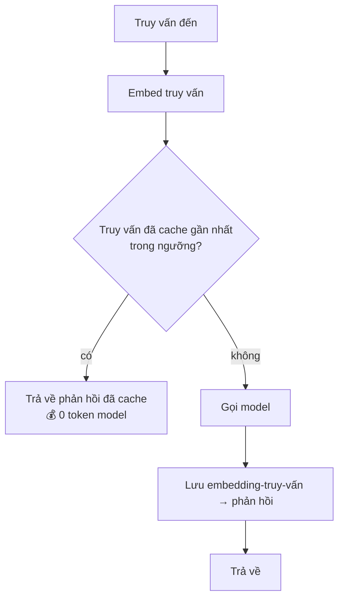
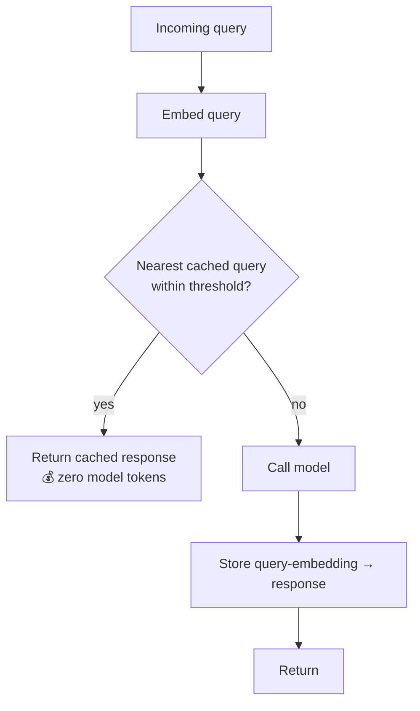

# Caching Ngữ nghĩa / Phản hồi (Bỏ qua Model khi Lặp lại) (Tiếng Việt)

**Giải quyết:** Nguyên nhân 6.6 và 6.2 (phía chi phí) trong
[`../CAUSE.md`](../CAUSE.md)

**Ý tưởng:** Khi một request mới đủ gần với một request bạn đã trả lời
rồi, trả về câu trả lời đã lưu thay vì gọi model chút nào. Không như caching
prefix — vốn vẫn chạy model, chỉ rẻ hơn — một **cache-hit ngữ nghĩa tốn 0
token model**.

---

## Khác gì so với caching prompt

| | Caching prefix/prompt | Caching ngữ nghĩa/phản hồi |
| --- | --- | --- |
| Cái gì được tái sử dụng | Trạng thái KV của một prefix giống hệt từng byte | *Câu trả lời* cuối cùng cho một truy vấn tương tự |
| Loại khớp | Byte prefix chính xác | Tương đồng embedding (hoặc hash chính xác) |
| Model có chạy không? | Có (input rẻ hơn) | **Không** khi hit |
| Tiết kiệm khi hit | Input ở ~0.1× | 100% của request |
| Rủi ro | Không có (cùng output) | Câu trả lời sai nếu khớp quá lỏng |

Chúng là các lớp bổ sung cho nhau: caching prefix làm cho các lần *trượt*
rẻ hơn; caching ngữ nghĩa loại bỏ hoàn toàn các lần *trúng*.

## Cách áp dụng

1. **Bắt đầu với caching khớp-chính-xác (rủi ro bằng 0).** Một hash của
   request đã chuẩn hóa → phản hồi là một tập con an toàn: các câu hỏi
   giống hệt nhau nhận câu trả lời giống hệt nhau miễn phí. Áp dụng điều
   này trước khi đụng đến ngưỡng tương đồng.
2. **Thêm khớp tương đồng nơi sự lặp lại mờ nhòe.** Embed truy vấn, tìm
   hàng xóm gần nhất trong các truy vấn đã lưu, chỉ phục vụ lần hit trên
   một ngưỡng cosine đã tinh chỉnh. Quá lỏng → câu trả lời sai; quá chặt →
   tỷ lệ hit thấp. Quét ngưỡng trên lưu lượng thực tế dựa trên một đánh
   giá tính đúng đắn.
3. **Phân phạm vi khóa để tránh nhiễm chéo.** Đưa người dùng/tenant,
   tool/chế độ, và bất kỳ trạng thái nào câu trả lời phụ thuộc vào trong
   khóa cache — một lần hit bỏ qua ai đang hỏi là một lỗi rò rỉ dữ liệu và
   tính đúng đắn.
4. **Đặt TTL theo mức độ biến động của câu trả lời.** Câu trả lời FAQ/tài
   liệu có thể sống nhiều ngày; bất cứ thứ gì phản ánh trạng thái thay đổi
   cần TTL ngắn hoặc vô hiệu hóa theo sự kiện.
5. **Áp dụng nơi an toàn, không phải mọi nơi.** Phù hợp tốt: bot hỏi-đáp
   hỗ trợ/tài liệu, các câu hỏi phân tích lặp lại, phân loại các input tái
   diễn, chạy lại đánh giá, các endpoint chỉ-đọc lưu lượng cao. **Không
   phù hợp:** chỉnh sửa coding agentic, bất cứ thứ gì phụ thuộc
   trạng thái hoặc cá nhân hóa, các lượt dùng tool — ở đó, một prompt
   "tương tự" hiếm khi nghĩa là một hành động đúng giống hệt, nên hãy giữ
   caching ngữ nghĩa tắt trên các route đó.

## Công cụ hiện đại nhất (SOTA)

### Có sẵn — coding agent & API của nhà cung cấp

| Nhà cung cấp / agent | Tính năng | Ghi chú |
| --- | --- | --- |
| API Anthropic / OpenAI / Gemini | Caching prompt/prefix | Lớp caching *khác* — làm cho các lần trượt rẻ hơn; kết hợp với, đừng nhầm lẫn với, caching ngữ nghĩa (`prompt-caching.md`) |
| Gateway LiteLLM | Caching có sẵn (chính xác + ngữ nghĩa qua backend vector) | Có thể lắp trực tiếp trước bất kỳ agent/nhà cung cấp nào; nơi đơn giản nhất để thêm caching phản hồi vào một stack hiện có |

### Bên thứ ba — không phụ thuộc agent (ưu tiên mã nguồn mở)

| Công cụ | Giấy phép | Ghi chú |
| --- | --- | --- |
| GPTCache (`zilliztech/GPTCache`) | MIT | Cache ngữ nghĩa tham chiếu; khớp embedding + vector store, tích hợp với LangChain/LlamaIndex; kho lưu trữ có thể cắm được (SQLite, Redis, Postgres, Mongo) |
| Redis / vector store (Milvus, pgvector, Qdrant) | BSD / Apache-2.0 | Index nền tảng cho việc tra cứu embedding truy vấn |
| Gateway Portkey (semantic cache) | MIT (gateway) | Gateway host sẵn/tự host với caching phản hồi; lựa chọn thương mại thay thế |

## Đánh đổi

- **Một lần hit lỏng lẻo là một lỗi tính đúng đắn, không chỉ là một token
  cũ** — chế độ thất bại là âm thầm trả về một câu trả lời sai nghe có vẻ
  hợp lý. Tinh chỉnh ngưỡng và khóa có phạm vi là bắt buộc, và các route
  coding/agentic nên tránh xa nó.
- Duy trì một index embedding thêm hạ tầng và độ trễ riêng cho việc tra
  cứu (thường thấp hơn nhiều một lệnh gọi model, nhưng không bằng 0).
- Tỷ lệ hit hoàn toàn phụ thuộc vào khối lượng công việc — lưu lượng FAQ
  lặp cao thắng lớn; các truy vấn đuôi dài duy nhất thấy ít lợi ích.
- Vô hiệu hóa là phần khó: khi sự thật nền tảng thay đổi, các câu trả lời
  đã cache cũ phải hết hạn (TTL) hoặc bị xóa (theo sự kiện).

## Tác động dự kiến

- Khi hit: **loại bỏ 100% chi phí model và độ trễ giảm 2–10×** — request
  không bao giờ chạm tới model.
- Mức tiết kiệm thực tế tỷ lệ với tỷ lệ hit: các khối lượng công việc
  hỏi-đáp/hỗ trợ chủ yếu đọc với độ trùng lặp truy vấn cao thường cache
  được 20–60% lưu lượng; các khối lượng công việc truy vấn duy nhất thấy
  ít lợi ích và không nên bận tâm.
- Chồng gọn gàng dưới caching prefix và batching: cache các lần hit đi,
  phục vụ các lần trượt rẻ, gộp lô phần còn lại không tương tác.

---

# Semantic / Response Caching (Skip the Model on Repeats)

**Addresses:** Causes 6.6 and 6.2 (cost-side) in [`../CAUSE.md`](../CAUSE.md)

**Idea:** When a new request is close enough to one you've already answered,
return the stored answer instead of calling the model at all. Unlike prefix
caching — which still runs the model, just cheaper — a **semantic cache hit
costs zero model tokens**.

---

## How it differs from prompt caching

| | Prefix / prompt caching | Semantic / response caching |
| --- | --- | --- |
| What's reused | The KV state of a byte-identical prefix | The final *answer* to a similar query |
| Match type | Exact prefix bytes | Embedding similarity (or exact hash) |
| Model runs? | Yes (cheaper input) | **No** on a hit |
| Savings on hit | Input at ~0.1× | 100% of the request |
| Risk | None (same output) | Wrong answer if the match is too loose |

They're complementary layers: prefix caching makes the *misses* cheap;
semantic caching removes the *hits* entirely.

## How to apply

1. **Start with exact-match caching (zero risk).** A hash of the normalized
   request → response is a safe subset: identical questions get identical
   answers for free. Adopt this before touching similarity thresholds.
2. **Add similarity matching where repeats are fuzzy.** Embed the query,
   nearest-neighbour against stored queries, serve the hit only above a
   tuned cosine threshold. Too loose → wrong answers; too tight → low hit
   rate. Sweep the threshold on real traffic against a correctness eval.
3. **Scope keys to prevent cross-contamination.** Include user/tenant,
   tool/mode, and any state the answer depends on in the cache key — a hit
   that ignores who's asking is a data-leak and correctness bug.
4. **Set TTLs to the volatility of the answer.** FAQ/docs answers can live
   for days; anything reflecting changing state needs a short TTL or event
   invalidation.
5. **Apply it where it's safe, not everywhere.** Good fits: support/docs
   Q&A bots, repeated analytics questions, classification of recurring
   inputs, eval re-runs, high-traffic read-only endpoints. **Bad fits:**
   agentic coding edits, anything state-dependent or personalized, tool-using
   turns — there, a "similar" prompt rarely means an identical correct
   action, so keep semantic caching off those routes.

## SOTA tools

### Native — coding agents & provider APIs

| Provider / agent | Feature | Notes |
| --- | --- | --- |
| Anthropic / OpenAI / Gemini APIs | Prompt/prefix caching | The *other* caching layer — makes misses cheap; pair with, don't confuse for, semantic caching (`prompt-caching.md`) |
| LiteLLM gateway | Built-in caching (exact + semantic via a vector backend) | Drop-in in front of any agent/provider; the simplest place to add response caching to an existing stack |

### Third-party — agent-agnostic (open source preferred)

| Tool | License | Notes |
| --- | --- | --- |
| GPTCache (`zilliztech/GPTCache`) | MIT | The reference semantic cache; embedding match + vector store, integrates with LangChain/LlamaIndex; pluggable stores (SQLite, Redis, Postgres, Mongo) |
| Redis / vector stores (Milvus, pgvector, Qdrant) | BSD / Apache-2.0 | The backing index for the query-embedding lookup |
| Portkey gateway (semantic cache) | MIT (gateway) | Hosted/self-hostable gateway with response caching; commercial-tier alternative |

## Trade-offs

- **A loose hit is a correctness bug, not just a stale token** — the failure
  mode is silently returning a plausible wrong answer. Threshold tuning and
  scoped keys are mandatory, and coding/agentic routes should stay off it.
- Maintaining an embedding index adds infrastructure and its own latency on
  the lookup (usually far below a model call, but nonzero).
- Hit rate is entirely workload-dependent — high-repeat FAQ traffic wins big;
  long-tail unique queries see little benefit.
- Invalidation is the hard part: when the underlying truth changes, stale
  cached answers must expire (TTL) or be purged (event-driven).

## Expected impact

- On a hit: **100% of the model cost and 2–10× latency removed** — the
  request never reaches the model.
- Realized savings scale with hit rate: read-mostly Q&A/support workloads
  with heavy query overlap commonly cache 20–60% of traffic; unique-query
  workloads see little and shouldn't bother.
- Stacks cleanly under prefix caching and batching: cache the hits away,
  serve the misses cheaply, batch the non-interactive remainder.
