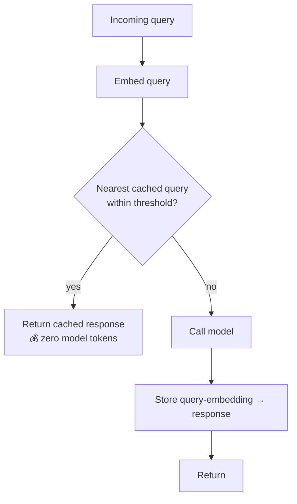

# Semantic / Response Caching (Skip the Model on Repeats)

**Addresses:** Causes 6.6 and 6.2 (cost-side) in [`../CAUSE.md`](../CAUSE.md)

**Idea:** When a new request is close enough to one you've already answered,
return the stored answer instead of calling the model at all. Unlike prefix
caching — which still runs the model, just cheaper — a **semantic cache hit
costs zero model tokens**.

---

## How it differs from prompt caching

| | Prefix / prompt caching | Semantic / response caching |
| --- | --- | --- |
| What's reused | The KV state of a byte-identical prefix | The final *answer* to a similar query |
| Match type | Exact prefix bytes | Embedding similarity (or exact hash) |
| Model runs? | Yes (cheaper input) | **No** on a hit |
| Savings on hit | Input at ~0.1× | 100% of the request |
| Risk | None (same output) | Wrong answer if the match is too loose |

They're complementary layers: prefix caching makes the *misses* cheap;
semantic caching removes the *hits* entirely.

## How to apply

1. **Start with exact-match caching (zero risk).** A hash of the normalized
   request → response is a safe subset: identical questions get identical
   answers for free. Adopt this before touching similarity thresholds.
2. **Add similarity matching where repeats are fuzzy.** Embed the query,
   nearest-neighbour against stored queries, serve the hit only above a
   tuned cosine threshold. Too loose → wrong answers; too tight → low hit
   rate. Sweep the threshold on real traffic against a correctness eval.
3. **Scope keys to prevent cross-contamination.** Include user/tenant,
   tool/mode, and any state the answer depends on in the cache key — a hit
   that ignores who's asking is a data-leak and correctness bug.
4. **Set TTLs to the volatility of the answer.** FAQ/docs answers can live
   for days; anything reflecting changing state needs a short TTL or event
   invalidation.
5. **Apply it where it's safe, not everywhere.** Good fits: support/docs
   Q&A bots, repeated analytics questions, classification of recurring
   inputs, eval re-runs, high-traffic read-only endpoints. **Bad fits:**
   agentic coding edits, anything state-dependent or personalized, tool-using
   turns — there, a "similar" prompt rarely means an identical correct
   action, so keep semantic caching off those routes.

## SOTA tools

### Native — coding agents & provider APIs

| Provider / agent | Feature | Notes |
| --- | --- | --- |
| Anthropic / OpenAI / Gemini APIs | Prompt/prefix caching | The *other* caching layer — makes misses cheap; pair with, don't confuse for, semantic caching (`prompt-caching.md`) |
| LiteLLM gateway | Built-in caching (exact + semantic via a vector backend) | Drop-in in front of any agent/provider; the simplest place to add response caching to an existing stack |

### Third-party — agent-agnostic (open source preferred)

| Tool | License | Notes |
| --- | --- | --- |
| GPTCache (`zilliztech/GPTCache`) | MIT | The reference semantic cache; embedding match + vector store, integrates with LangChain/LlamaIndex; pluggable stores (SQLite, Redis, Postgres, Mongo) |
| Redis / vector stores (Milvus, pgvector, Qdrant) | BSD / Apache-2.0 | The backing index for the query-embedding lookup |
| Portkey gateway (semantic cache) | MIT (gateway) | Hosted/self-hostable gateway with response caching; commercial-tier alternative |

## Trade-offs

- **A loose hit is a correctness bug, not just a stale token** — the failure
  mode is silently returning a plausible wrong answer. Threshold tuning and
  scoped keys are mandatory, and coding/agentic routes should stay off it.
- Maintaining an embedding index adds infrastructure and its own latency on
  the lookup (usually far below a model call, but nonzero).
- Hit rate is entirely workload-dependent — high-repeat FAQ traffic wins big;
  long-tail unique queries see little benefit.
- Invalidation is the hard part: when the underlying truth changes, stale
  cached answers must expire (TTL) or be purged (event-driven).

## Expected impact

- On a hit: **100% of the model cost and 2–10× latency removed** — the
  request never reaches the model.
- Realized savings scale with hit rate: read-mostly Q&A/support workloads
  with heavy query overlap commonly cache 20–60% of traffic; unique-query
  workloads see little and shouldn't bother.
- Stacks cleanly under prefix caching and batching: cache the hits away,
  serve the misses cheaply, batch the non-interactive remainder.
