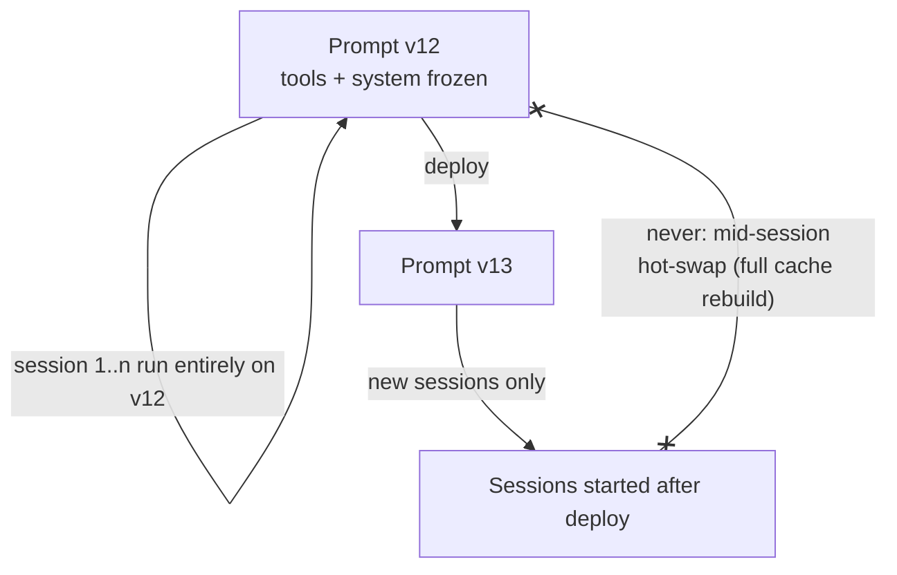

# Stable Prompt Architecture

**Addresses:** Cause 1.3 in [`../CAUSE.md`](../CAUSE.md) (and hardens 1.2)

**Idea:** Treat the front of the prompt (tools + system) as an **immutable,
versioned artifact** for the lifetime of a session, and route every dynamic
need (modes, injected state, new capabilities) through channels that append
to the end of the request instead of mutating its head.

---

## How to apply

### 1. Freeze the head, append the tail

| Dynamic need | ❌ Cache-destroying habit | ✅ Stable alternative |
| --- | --- | --- |
| Current date / time | Interpolated into system prompt | Inject as a late message ("today is …") or tool result |
| Mode switch (terse mode, safe mode) | Edit system prompt mid-session | Mid-conversation system message (Anthropic `role:"system"` in `messages`) or a `<system-reminder>` block in the next user turn |
| New capability mid-session | Add a tool to `tools[]` | Dynamic tool discovery that *appends* schemas (e.g. Anthropic tool search) — never re-sorts the existing list |
| Cheaper model for a subtask | Swap `model` on the main loop | Spawn a subagent on the cheaper model; keep the main loop's model fixed |
| Per-user data | Templated into the system prompt | Put shared instructions first (cacheable across users), user data after the last shared breakpoint |

### 2. Make rendering deterministic

The prompt builder must be a **pure function** of its inputs:

- `json.dumps(obj, sort_keys=True)` / stable stringify everywhere.
- Sort tool lists by name; never derive ordering from `dict`/`set`/`Map`
  iteration.
- Ban `random`, `uuid`, `now()` inside anything that feeds the prefix
  (enforce with a lint rule or a unit test that renders the same request
  twice and asserts byte equality).

### 3. Version prompts like code

Keep the system prompt and tool schemas in version control, deploy them as
immutable versions, and roll sessions to a new version only at session
boundaries — never mid-session.

### 4. Regression-test the invariant

Add a CI test: render two requests for the same session state and assert the
byte-identical prefix; render turn N and turn N+1 and assert turn N's bytes
are a strict prefix of turn N+1's.

## SOTA tools

| Tool | Scope | Notes |
| --- | --- | --- |
| Anthropic mid-conversation system messages | API | Operator-authority instruction appended to `messages[]` — the canonical "change behavior without touching the head" channel |
| Anthropic tool search / `defer_loading` | API | Discovered tool schemas are *appended*, preserving the existing prefix |
| Langfuse / PromptLayer / Braintrust prompt registry | Tooling | Versioned, immutable prompt artifacts with deploy gating |
| DSPy / promptfoo | Tooling | Eval harnesses so prompt-version rolls are measured, not vibes-based |
| Snapshot tests (pytest + syrupy, Jest snapshots) | CI | Cheapest way to enforce byte-stable rendering |

## Trade-offs

- Discipline cost: every "just tweak the system prompt" becomes a versioned
  change with a session-boundary rollout.
- Late-injected context carries slightly less authority than the system
  prompt on some models — use the provider's system-role channel where
  available.
- Deterministic serialization can conflict with frameworks that rebuild tool
  schemas dynamically (some MCP clients); pin and sort at the boundary.

## Expected impact

- Converts cause 1.3 from a recurring incident class into a structural
  impossibility — mid-session full-cache rebuilds (often 100K+ tokens
  re-billed at 1× in a single request) stop happening.
- Sustains the steady-state cache-hit rates that `prompt-caching.md`
  promises; teams typically see cache-read share of total input rise to
  **80–95%** in long sessions once the head is frozen.
- Secondary win: deterministic prompts make evals and regression bisection
  dramatically easier.
