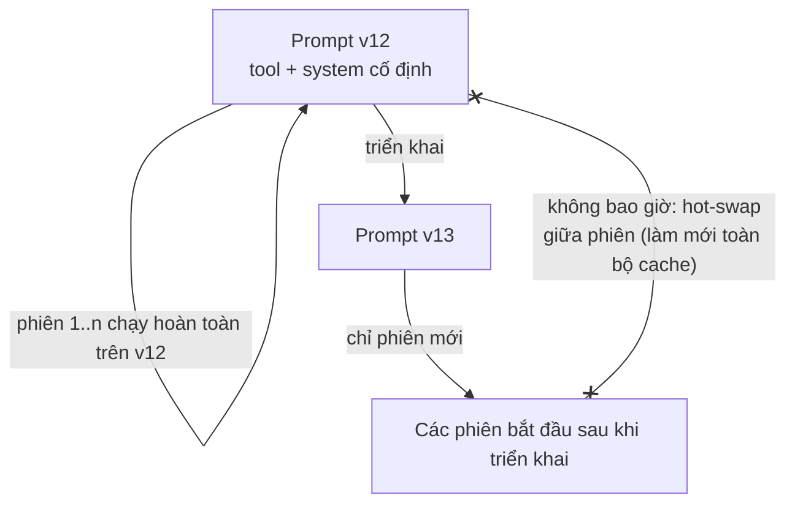
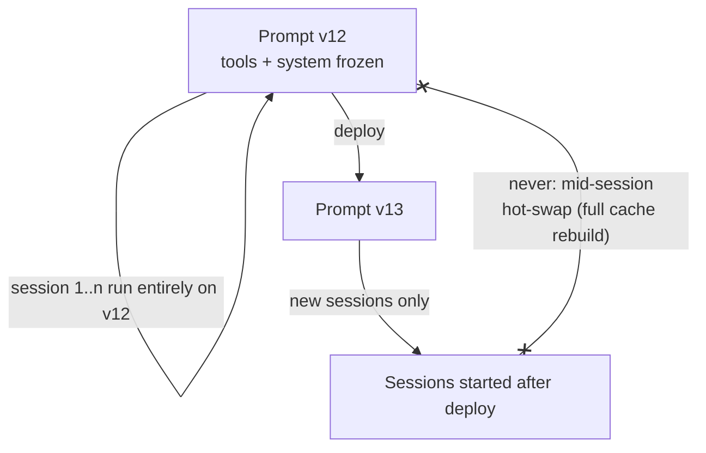

# Kiến trúc Prompt Ổn định (Tiếng Việt)

**Giải quyết:** Nguyên nhân 1.3 trong [`../CAUSE.md`](../CAUSE.md) (và củng
cố 1.2)

**Ý tưởng:** Coi phần đầu của prompt (tool + system) như một **artifact bất
biến, có phiên bản** trong suốt vòng đời của một phiên, và định tuyến mọi
nhu cầu động (chế độ, trạng thái được chèn, năng lực mới) qua các kênh chỉ
nối thêm vào cuối request thay vì thay đổi phần đầu.

---

## Cách áp dụng

### 1. Cố định phần đầu, nối thêm phần đuôi

| Nhu cầu động | ❌ Thói quen phá cache | ✅ Giải pháp ổn định |
| --- | --- | --- |
| Ngày/giờ hiện tại | Nội suy vào system prompt | Chèn dưới dạng tin nhắn muộn ("hôm nay là...") hoặc kết quả tool |
| Chuyển chế độ (chế độ ngắn gọn, chế độ an toàn) | Sửa system prompt giữa phiên | Tin nhắn system giữa hội thoại (Anthropic `role:"system"` trong `messages`) hoặc khối `<system-reminder>` trong lượt người dùng tiếp theo |
| Năng lực mới giữa phiên | Thêm một tool vào `tools[]` | Khám phá tool động chỉ *nối thêm* schema (ví dụ tool search của Anthropic) — không bao giờ sắp xếp lại danh sách hiện có |
| Model rẻ hơn cho một tác vụ con | Đổi `model` trên vòng lặp chính | Sinh một subagent trên model rẻ hơn; giữ model của vòng lặp chính cố định |
| Dữ liệu theo từng người dùng | Được templated vào system prompt | Đặt hướng dẫn chung lên trước (có thể cache qua nhiều người dùng), dữ liệu người dùng sau breakpoint chung cuối cùng |

### 2. Làm cho việc render trở nên tất định

Bộ dựng prompt phải là một **hàm thuần túy (pure function)** của các input
của nó:

- `json.dumps(obj, sort_keys=True)` / stringify ổn định ở mọi nơi.
- Sắp xếp danh sách tool theo tên; không bao giờ suy ra thứ tự từ việc lặp
  qua `dict`/`set`/`Map`.
- Cấm `random`, `uuid`, `now()` bên trong bất cứ thứ gì nạp vào prefix
  (thực thi bằng quy tắc lint hoặc unit test render cùng một request hai
  lần và khẳng định bằng nhau từng byte).

### 3. Đánh phiên bản prompt như code

Giữ system prompt và schema tool trong version control, triển khai chúng
như các phiên bản bất biến, và chỉ chuyển các phiên sang phiên bản mới tại
ranh giới phiên — không bao giờ giữa phiên.

### 4. Kiểm thử hồi quy cho bất biến này

Thêm một kiểm thử CI: render hai request cho cùng trạng thái phiên và khẳng
định prefix giống hệt nhau từng byte; render lượt N và lượt N+1 và khẳng
định byte của lượt N là một prefix chặt (strict prefix) của lượt N+1.

## Công cụ hiện đại nhất (SOTA)

### Có sẵn — coding agent & API của nhà cung cấp

| Nhà cung cấp / agent | Tính năng | Ghi chú |
| --- | --- | --- |
| Anthropic API | Tin nhắn system giữa hội thoại | Chỉ thị mang quyền hạn của operator được nối vào `messages[]` — kênh chuẩn mực cho "thay đổi hành vi mà không đụng vào phần đầu" |
| Anthropic API | Tool search / `defer_loading` | Các schema tool được khám phá đều *được nối thêm*, giữ nguyên prefix hiện có |
| Claude Code / Codex CLI / Gemini CLI | Phần đầu cố định theo phiên | Các harness lớn đã giữ system + tool ổn định từng byte trong một phiên — hãy kế thừa điều này, đừng xây lại nó |

### Bên thứ ba — không phụ thuộc agent (ưu tiên mã nguồn mở)

| Công cụ | Giấy phép | Ghi chú |
| --- | --- | --- |
| Langfuse prompt registry | MIT | Các artifact prompt bất biến, có phiên bản, có kiểm soát triển khai; PromptLayer / Braintrust là các lựa chọn thương mại thay thế |
| DSPy / promptfoo | MIT | Harness đánh giá để việc chuyển phiên bản prompt được đo lường, không dựa trên cảm tính |
| pytest + syrupy / Jest snapshots | MIT | Cách rẻ nhất để thực thi việc render ổn định từng byte trong CI — hoạt động trên mọi bộ dựng prompt trong mọi stack |

## Đánh đổi

- Chi phí kỷ luật: mỗi lần "chỉ chỉnh nhẹ system prompt" trở thành một thay
  đổi có phiên bản với việc triển khai tại ranh giới phiên.
- Context được chèn muộn mang thẩm quyền hơi thấp hơn system prompt trên
  một số model — dùng kênh vai trò system của nhà cung cấp khi có sẵn.
- Serialize tất định có thể xung đột với các framework xây lại schema tool
  một cách động (một số MCP client); hãy pin và sắp xếp tại ranh giới.

## Tác động dự kiến

- Biến nguyên nhân 1.3 từ một lớp sự cố tái diễn thành một điều bất khả thi
  về mặt cấu trúc — việc làm mới toàn bộ cache giữa phiên (thường 100K+
  token bị tính lại ở giá 1× trong một request) không còn xảy ra.
- Duy trì tỷ lệ cache-hit ổn định mà `prompt-caching.md` hứa hẹn; các đội
  thường thấy tỷ trọng cache-read trên tổng input tăng lên **80–95%** trong
  các phiên dài một khi phần đầu được cố định.
- Thắng lợi phụ: các prompt tất định làm cho việc đánh giá và tìm nguyên
  nhân hồi quy dễ dàng hơn nhiều.

---

# Stable Prompt Architecture

**Addresses:** Cause 1.3 in [`../CAUSE.md`](../CAUSE.md) (and hardens 1.2)

**Idea:** Treat the front of the prompt (tools + system) as an **immutable,
versioned artifact** for the lifetime of a session, and route every dynamic
need (modes, injected state, new capabilities) through channels that append
to the end of the request instead of mutating its head.

---

## How to apply

### 1. Freeze the head, append the tail

| Dynamic need | ❌ Cache-destroying habit | ✅ Stable alternative |
| --- | --- | --- |
| Current date / time | Interpolated into system prompt | Inject as a late message ("today is …") or tool result |
| Mode switch (terse mode, safe mode) | Edit system prompt mid-session | Mid-conversation system message (Anthropic `role:"system"` in `messages`) or a `<system-reminder>` block in the next user turn |
| New capability mid-session | Add a tool to `tools[]` | Dynamic tool discovery that *appends* schemas (e.g. Anthropic tool search) — never re-sorts the existing list |
| Cheaper model for a subtask | Swap `model` on the main loop | Spawn a subagent on the cheaper model; keep the main loop's model fixed |
| Per-user data | Templated into the system prompt | Put shared instructions first (cacheable across users), user data after the last shared breakpoint |

### 2. Make rendering deterministic

The prompt builder must be a **pure function** of its inputs:

- `json.dumps(obj, sort_keys=True)` / stable stringify everywhere.
- Sort tool lists by name; never derive ordering from `dict`/`set`/`Map`
  iteration.
- Ban `random`, `uuid`, `now()` inside anything that feeds the prefix
  (enforce with a lint rule or a unit test that renders the same request
  twice and asserts byte equality).

### 3. Version prompts like code

Keep the system prompt and tool schemas in version control, deploy them as
immutable versions, and roll sessions to a new version only at session
boundaries — never mid-session.

### 4. Regression-test the invariant

Add a CI test: render two requests for the same session state and assert the
byte-identical prefix; render turn N and turn N+1 and assert turn N's bytes
are a strict prefix of turn N+1's.

## SOTA tools

### Native — coding agents & provider APIs

| Provider / agent | Feature | Notes |
| --- | --- | --- |
| Anthropic API | Mid-conversation system messages | Operator-authority instruction appended to `messages[]` — the canonical "change behavior without touching the head" channel |
| Anthropic API | Tool search / `defer_loading` | Discovered tool schemas are *appended*, preserving the existing prefix |
| Claude Code / Codex CLI / Gemini CLI | Frozen per-session heads | The major harnesses already keep system + tools byte-stable within a session — inherit this, don't rebuild it |

### Third-party — agent-agnostic (open source preferred)

| Tool | License | Notes |
| --- | --- | --- |
| Langfuse prompt registry | MIT | Versioned, immutable prompt artifacts with deploy gating; PromptLayer / Braintrust are commercial alternatives |
| DSPy / promptfoo | MIT | Eval harnesses so prompt-version rolls are measured, not vibes-based |
| pytest + syrupy / Jest snapshots | MIT | Cheapest way to enforce byte-stable rendering in CI — works on any prompt builder in any stack |

## Trade-offs

- Discipline cost: every "just tweak the system prompt" becomes a versioned
  change with a session-boundary rollout.
- Late-injected context carries slightly less authority than the system
  prompt on some models — use the provider's system-role channel where
  available.
- Deterministic serialization can conflict with frameworks that rebuild tool
  schemas dynamically (some MCP clients); pin and sort at the boundary.

## Expected impact

- Converts cause 1.3 from a recurring incident class into a structural
  impossibility — mid-session full-cache rebuilds (often 100K+ tokens
  re-billed at 1× in a single request) stop happening.
- Sustains the steady-state cache-hit rates that `prompt-caching.md`
  promises; teams typically see cache-read share of total input rise to
  **80–95%** in long sessions once the head is frozen.
- Secondary win: deterministic prompts make evals and regression bisection
  dramatically easier.
