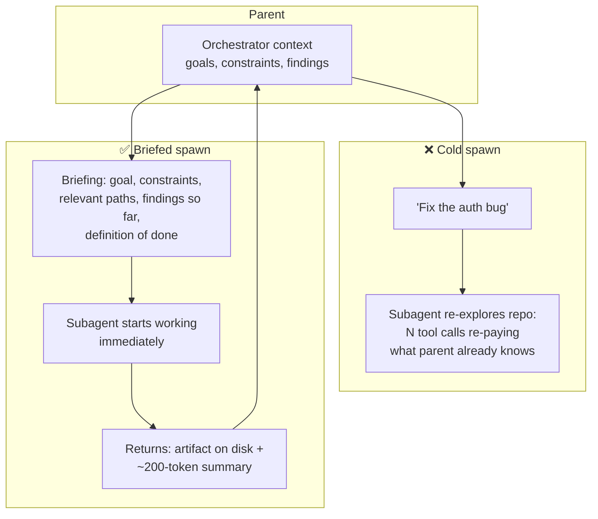

# Subagent Context Handoff

**Addresses:** Cause 6.1 in [`../CAUSE.md`](../CAUSE.md)

**Idea:** Make delegation cheap by design: hand each subagent a **written
briefing** instead of letting it re-discover context, share the parent's
cached prefix where possible, exchange results as **artifacts + summaries**
rather than transcript dumps, and keep long-lived workers warm instead of
respawning cold.

---

## The cost anatomy of a spawn

A cold subagent pays three times: (1) its own system/tool prefix, uncached
if it differs from the parent's; (2) *re-discovery* — tool calls to rebuild
understanding the parent already has; (3) the report-back, which lands in
the parent's context (and history) at whatever size it was written.

## How to apply

1. **Write real briefings.** The delegation prompt should carry everything
   the parent knows that the subtask needs: goal, constraints, exact file
   paths/IDs, findings so far, and what "done" looks like. A one-line task
   description guarantees paid re-discovery.
2. **Exchange artifacts, not transcripts.** Subagents write full results
   (reports, patches, extracted data) to the **filesystem or an artifact
   store** and return a pointer + short summary. The parent's context gains
   ~200 tokens, not 20K — and the artifact is available to later subagents
   without another pass through anyone's context.
3. **Reuse the parent's prefix byte-for-byte for same-role forks.**
   Summarizers, verifiers, and compactors that run "beside" the main loop
   should copy the parent's `system`/`tools`/`model` verbatim and append
   their instruction at the end — then they read the parent's cache instead
   of paying cold (see `prompt-caching.md`, fork rule).
4. **Right-size the worker.** Scoped, well-briefed subtasks usually don't
   need the frontier model — run subagents on a cheaper tier and/or lower
   reasoning effort (`model-routing.md`, `reasoning-effort-tuning.md`).
5. **Prefer long-lived workers over respawn for related subtasks.**
   Sending a follow-up to an existing subagent (which retains its context,
   cache-warm) beats spawning a fresh one that re-derives it. Async
   communication with persistent workers also unblocks the orchestrator.
6. **Delegate for context isolation, not reflexively.** The legitimate
   token *win* of subagents is keeping bulky exploration **out of the
   parent's history** (a search subagent absorbs 50K tokens of grep output
   and returns 300 tokens of findings). Delegation for single-file reads or
   trivial sequential steps is pure overhead — give the orchestrator
   explicit spawn/don't-spawn guidance.

## SOTA tools

### Native — coding agents & provider APIs

| Provider / agent | Feature | Notes |
| --- | --- | --- |
| Claude Code / Claude Agent SDK | Subagents with per-agent model/effort config; `SendMessage` continuation | Isolated-context workers; continuing an existing agent beats respawning cold |
| Anthropic Managed Agents | Multiagent threads sharing a filesystem | Persistent per-subagent context across follow-ups |
| OpenAI Agents SDK · Codex | Handoffs with structured context passing | The briefing contract as a first-class primitive in the OpenAI stack |

### Third-party — agent-agnostic (open source preferred)

| Tool | License | Notes |
| --- | --- | --- |
| LangGraph | MIT | Explicit state channels between nodes — the briefing/summary contract as typed graph state, any provider |
| CrewAI | MIT | Structured task+context handoff between roles |
| Shared filesystem / artifact stores (S3, MinIO, memory stores) | Various (MinIO AGPL) | The artifact side-channel that keeps bulk out of every transcript — works identically for every agent |

## Trade-offs

- Briefings cost parent output tokens — trivial vs re-discovery, but real;
  keep them dense.
- Artifact passing requires shared storage and disciplined path/ID
  conventions.
- Summaries can omit what the parent later needs (same lossiness as
  compaction) — keep the full artifact retrievable, summarize only the
  transcript-facing report.
- Long-lived workers hold state that can go stale; refresh briefings on
  drift.

## Expected impact

- Briefed spawns typically eliminate **50–90% of a subagent's tool calls**
  (the re-discovery phase) on codebase/document tasks.
- Artifact-based report-back keeps parent-context growth **10–100×**
  smaller per subtask, compounding through the parent's remaining turns
  (cause 2.1).
- Prefix-sharing forks (summarizer/verifier) run at cache-read rates —
  often making "add a verification pass" close to free on input cost.
- Done well, multi-agent fan-out becomes cheaper than single-agent
  execution for exploration-heavy tasks — the bulk lives and dies in
  disposable worker contexts instead of accreting in one.
