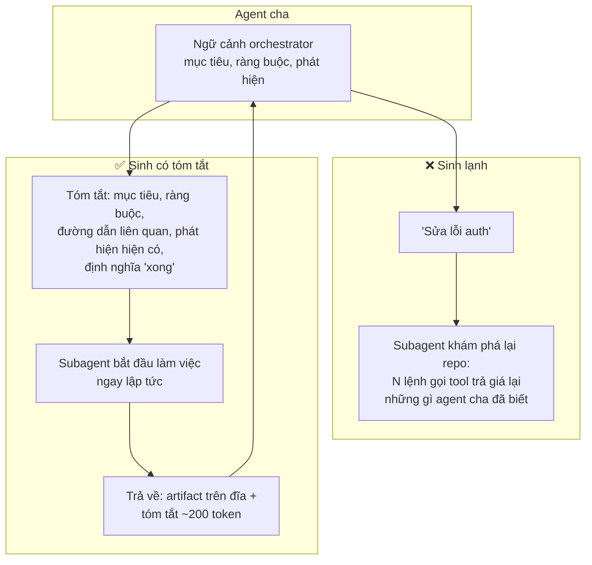
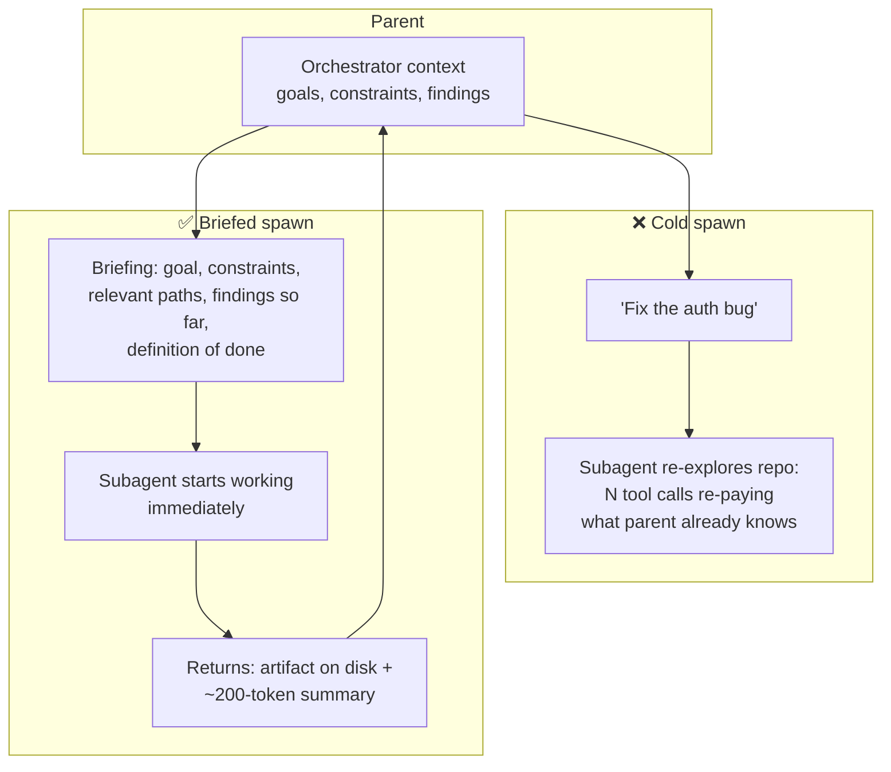

# Bàn giao Ngữ cảnh cho Subagent (Tiếng Việt)

**Giải quyết:** Nguyên nhân 6.1 trong [`../CAUSE.md`](../CAUSE.md)

**Ý tưởng:** Làm cho việc ủy thác rẻ ngay từ thiết kế: trao cho mỗi subagent
một **bản tóm tắt (briefing) viết sẵn** thay vì để nó tự khám phá lại ngữ
cảnh, chia sẻ prefix đã cache của agent cha khi có thể, trao đổi kết quả
dưới dạng **artifact + tóm tắt** thay vì đổ nguyên transcript, và giữ các
worker sống lâu luôn ấm thay vì sinh lại từ đầu ở trạng thái lạnh.

---

## Giải phẫu chi phí của một lần sinh (spawn)

Một subagent lạnh phải trả giá ba lần: (1) prefix system/tool riêng của
nó, không được cache nếu khác với của agent cha; (2) *khám phá lại* — các
lệnh gọi tool để xây lại hiểu biết mà agent cha đã có sẵn; (3) báo cáo về,
vốn sẽ vào ngữ cảnh (và lịch sử) của agent cha với bất kỳ kích thước nào nó
được viết ra.

## Cách áp dụng

1. **Viết các bản tóm tắt thực sự.** Prompt ủy thác nên mang theo mọi thứ
   agent cha biết mà tác vụ con cần: mục tiêu, ràng buộc, đường dẫn/ID
   file chính xác, phát hiện hiện có, và "xong" trông như thế nào. Một mô
   tả tác vụ một dòng đảm bảo việc phải khám phá lại và trả tiền cho nó.
2. **Trao đổi artifact, không phải transcript.** Subagent ghi toàn bộ kết
   quả (báo cáo, patch, dữ liệu trích xuất) vào **hệ thống file hoặc kho
   artifact** và trả về một con trỏ + tóm tắt ngắn. Ngữ cảnh của agent cha
   chỉ tăng ~200 token, không phải 20K — và artifact khả dụng cho các
   subagent sau mà không cần đi qua ngữ cảnh của ai một lần nữa.
3. **Tái sử dụng prefix của agent cha từng byte cho các fork cùng vai
   trò.** Các summarizer, verifier, và compactor chạy "bên cạnh" vòng lặp
   chính nên sao chép nguyên văn `system`/`tools`/`model` của agent cha và
   nối chỉ dẫn riêng của chúng ở cuối — khi đó chúng đọc cache của agent
   cha thay vì trả giá lạnh (xem `prompt-caching.md`, quy tắc fork).
4. **Đặt đúng kích thước worker.** Các tác vụ con có phạm vi rõ ràng, được
   tóm tắt tốt thường không cần model hàng đầu — chạy subagent trên tier
   rẻ hơn và/hoặc effort reasoning thấp hơn (`model-routing.md`,
   `reasoning-effort-tuning.md`).
5. **Ưu tiên worker sống lâu hơn là sinh lại cho các tác vụ con liên
   quan.** Gửi một yêu cầu tiếp nối tới một subagent hiện có (vốn giữ ngữ
   cảnh của nó, cache đang ấm) tốt hơn việc sinh một cái mới phải suy luận
   lại. Giao tiếp bất đồng bộ với các worker bền vững cũng giải phóng
   orchestrator.
6. **Ủy thác để cô lập ngữ cảnh, không phải theo phản xạ.** Thắng lợi token
   chính đáng của subagent là giữ việc khám phá cồng kềnh **ngoài lịch sử
   của agent cha** (một subagent tìm kiếm hấp thụ 50K token output grep và
   trả về 300 token phát hiện). Ủy thác cho các lần đọc một file hoặc các
   bước tuần tự tầm thường là chi phí thuần túy — hãy cho orchestrator
   hướng dẫn rõ ràng khi nào nên/không nên sinh subagent.

## Công cụ hiện đại nhất (SOTA)

### Có sẵn — coding agent & API của nhà cung cấp

| Nhà cung cấp / agent | Tính năng | Ghi chú |
| --- | --- | --- |
| Claude Code / Claude Agent SDK | Subagent có cấu hình model/effort riêng; tiếp nối bằng `SendMessage` | Worker ngữ cảnh cô lập; tiếp nối một agent hiện có tốt hơn sinh lại từ đầu ở trạng thái lạnh |
| Anthropic Managed Agents | Thread đa agent chia sẻ một hệ thống file | Ngữ cảnh bền vững cho mỗi subagent qua các lần tiếp nối |
| OpenAI Agents SDK · Codex | Handoff với truyền ngữ cảnh có cấu trúc | Hợp đồng tóm tắt như một nguyên hàm hạng nhất trong stack OpenAI |

### Bên thứ ba — không phụ thuộc agent (ưu tiên mã nguồn mở)

| Công cụ | Giấy phép | Ghi chú |
| --- | --- | --- |
| LangGraph | MIT | Kênh trạng thái tường minh giữa các node — hợp đồng tóm tắt/tổng hợp như trạng thái đồ thị có kiểu, mọi nhà cung cấp |
| CrewAI | MIT | Bàn giao tác vụ+ngữ cảnh có cấu trúc giữa các vai trò |
| Hệ thống file chia sẻ / kho artifact (S3, MinIO, kho bộ nhớ) | Nhiều loại (MinIO AGPL) | Kênh phụ artifact giữ khối lượng lớn ngoài mọi transcript — hoạt động giống hệt cho mọi agent |

## Khi nào *không* nên ủy thác (cảnh báo 15×)

Fan-out đa agent vốn dĩ tốn kém: Anthropic báo cáo các hệ thống đa agent
dùng khoảng **15× số token của một cuộc chat đơn lẻ**. Hệ số nhân đó chỉ
đáng giá khi công việc thực sự phân rã thành các hướng **độc lập, song
song** và câu trả lời đáng giá nhiều token (nghiên cứu mở là trường hợp
điển hình phù hợp). Đây là công cụ *sai* khi:

- **Các tác vụ con phụ thuộc lẫn nhau** — nếu worker B cần output của
  worker A, "song song" thoái hóa thành thực thi tuần tự cộng thêm chi
  phí.
- **Tác vụ là coding/debug/hầu hết các workflow** — chúng vốn dĩ nối
  chuỗi; một agent đơn lẻ, hoặc một pipeline tất định với các agent nhỏ
  bên trong, thắng cả về chi phí *lẫn* độ tin cậy.
- **Tác vụ nhỏ** — agent chính xử lý trực tiếp rẻ hơn lượt qua lại
  sinh + tóm tắt + báo cáo về.

Quy tắc chung: ủy thác để **cô lập ngữ cảnh song song**, không phải để
"tổ chức lại" công việc vốn dĩ mang tính tuần tự. Cho orchestrator hướng
dẫn rõ ràng khi nào nên/không nên sinh để nó không dùng subagent theo
phản xạ.

## Đánh đổi

- Bản tóm tắt tốn token output của agent cha — không đáng kể so với việc
  khám phá lại, nhưng vẫn có thực; giữ chúng cô đọng.
- Hệ số nhân 15× ở trên là rủi ro chi phối: một workflow song song hóa sai
  có thể tốn nhiều hơn hẳn đường cơ sở đơn agent mà nó thay thế.
- Trao đổi artifact đòi hỏi lưu trữ chung và các quy ước đường dẫn/ID có
  kỷ luật.
- Bản tóm tắt có thể bỏ sót điều agent cha sau này cần (cùng mất mát như
  nén) — giữ artifact đầy đủ có thể truy xuất được, chỉ tóm tắt phần báo
  cáo hướng tới transcript.
- Worker sống lâu giữ trạng thái có thể trở nên cũ; làm mới bản tóm tắt
  khi có trôi dạt.

## Tác động dự kiến

- Các lần sinh có tóm tắt thường loại bỏ **50–90% lệnh gọi tool của một
  subagent** (giai đoạn khám phá lại) trên các tác vụ codebase/tài liệu.
- Báo cáo dựa trên artifact giữ mức tăng trưởng ngữ cảnh của agent cha
  **nhỏ hơn 10–100×** mỗi tác vụ con, cộng dồn qua các lượt còn lại của
  agent cha (nguyên nhân 2.1).
- Các fork chia sẻ prefix (summarizer/verifier) chạy ở giá cache-read —
  thường làm cho "thêm một lượt xác minh" gần như miễn phí về chi phí
  input.
- Làm tốt, fan-out đa agent trở nên rẻ hơn thực thi đơn agent cho các tác
  vụ nặng về khám phá — khối lượng lớn sinh ra và mất đi trong các ngữ
  cảnh worker dùng-một-lần thay vì tích tụ trong một agent duy nhất.

---

# Subagent Context Handoff

**Addresses:** Cause 6.1 in [`../CAUSE.md`](../CAUSE.md)

**Idea:** Make delegation cheap by design: hand each subagent a **written
briefing** instead of letting it re-discover context, share the parent's
cached prefix where possible, exchange results as **artifacts + summaries**
rather than transcript dumps, and keep long-lived workers warm instead of
respawning cold.

---

## The cost anatomy of a spawn

A cold subagent pays three times: (1) its own system/tool prefix, uncached
if it differs from the parent's; (2) *re-discovery* — tool calls to rebuild
understanding the parent already has; (3) the report-back, which lands in
the parent's context (and history) at whatever size it was written.

## How to apply

1. **Write real briefings.** The delegation prompt should carry everything
   the parent knows that the subtask needs: goal, constraints, exact file
   paths/IDs, findings so far, and what "done" looks like. A one-line task
   description guarantees paid re-discovery.
2. **Exchange artifacts, not transcripts.** Subagents write full results
   (reports, patches, extracted data) to the **filesystem or an artifact
   store** and return a pointer + short summary. The parent's context gains
   ~200 tokens, not 20K — and the artifact is available to later subagents
   without another pass through anyone's context.
3. **Reuse the parent's prefix byte-for-byte for same-role forks.**
   Summarizers, verifiers, and compactors that run "beside" the main loop
   should copy the parent's `system`/`tools`/`model` verbatim and append
   their instruction at the end — then they read the parent's cache instead
   of paying cold (see `prompt-caching.md`, fork rule).
4. **Right-size the worker.** Scoped, well-briefed subtasks usually don't
   need the frontier model — run subagents on a cheaper tier and/or lower
   reasoning effort (`model-routing.md`, `reasoning-effort-tuning.md`).
5. **Prefer long-lived workers over respawn for related subtasks.**
   Sending a follow-up to an existing subagent (which retains its context,
   cache-warm) beats spawning a fresh one that re-derives it. Async
   communication with persistent workers also unblocks the orchestrator.
6. **Delegate for context isolation, not reflexively.** The legitimate
   token *win* of subagents is keeping bulky exploration **out of the
   parent's history** (a search subagent absorbs 50K tokens of grep output
   and returns 300 tokens of findings). Delegation for single-file reads or
   trivial sequential steps is pure overhead — give the orchestrator
   explicit spawn/don't-spawn guidance.

## SOTA tools

### Native — coding agents & provider APIs

| Provider / agent | Feature | Notes |
| --- | --- | --- |
| Claude Code / Claude Agent SDK | Subagents with per-agent model/effort config; `SendMessage` continuation | Isolated-context workers; continuing an existing agent beats respawning cold |
| Anthropic Managed Agents | Multiagent threads sharing a filesystem | Persistent per-subagent context across follow-ups |
| OpenAI Agents SDK · Codex | Handoffs with structured context passing | The briefing contract as a first-class primitive in the OpenAI stack |

### Third-party — agent-agnostic (open source preferred)

| Tool | License | Notes |
| --- | --- | --- |
| LangGraph | MIT | Explicit state channels between nodes — the briefing/summary contract as typed graph state, any provider |
| CrewAI | MIT | Structured task+context handoff between roles |
| Shared filesystem / artifact stores (S3, MinIO, memory stores) | Various (MinIO AGPL) | The artifact side-channel that keeps bulk out of every transcript — works identically for every agent |

## When *not* to delegate (the 15× warning)

Multi-agent fan-out is expensive by construction: Anthropic reports
multi-agent systems use roughly **15× the tokens of a single chat**. That
multiplier only pays off when the work genuinely decomposes into
**independent, parallel** directions and the answer is worth a lot of tokens
(open-ended research is the canonical fit). It is the *wrong* tool when:

- **Subtasks are dependent** — if worker B needs worker A's output,
  "parallelism" degenerates into serial execution with extra overhead.
- **The task is coding/debugging/most workflows** — these are chained by
  nature; a single agent, or a deterministic pipeline with small agents
  inside it, wins on cost *and* reliability.
- **The task is small** — the main agent handling it directly is cheaper
  than the spawn + briefing + report-back round trip.

Rule of thumb: delegate for **parallel context isolation**, not to
"organize" inherently sequential work. Give the orchestrator explicit
spawn/don't-spawn guidance so it doesn't reach for subagents reflexively.

## Trade-offs

- Briefings cost parent output tokens — trivial vs re-discovery, but real;
  keep them dense.
- The 15× multiplier above is the dominant risk: a wrongly-parallelized
  workflow can cost far more than the single-agent baseline it replaced.
- Artifact passing requires shared storage and disciplined path/ID
  conventions.
- Summaries can omit what the parent later needs (same lossiness as
  compaction) — keep the full artifact retrievable, summarize only the
  transcript-facing report.
- Long-lived workers hold state that can go stale; refresh briefings on
  drift.

## Expected impact

- Briefed spawns typically eliminate **50–90% of a subagent's tool calls**
  (the re-discovery phase) on codebase/document tasks.
- Artifact-based report-back keeps parent-context growth **10–100×**
  smaller per subtask, compounding through the parent's remaining turns
  (cause 2.1).
- Prefix-sharing forks (summarizer/verifier) run at cache-read rates —
  often making "add a verification pass" close to free on input cost.
- Done well, multi-agent fan-out becomes cheaper than single-agent
  execution for exploration-heavy tasks — the bulk lives and dies in
  disposable worker contexts instead of accreting in one.
