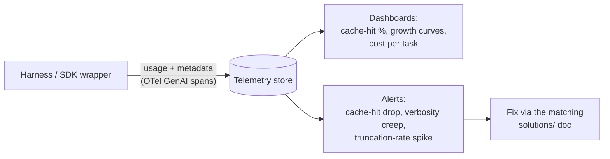

# Token Counting & Usage Observability

**Addresses:** Cause 4.3 in [`../CAUSE.md`](../CAUSE.md) — and the
*measurement layer* every other solution depends on

**Idea:** You can't optimize what you don't measure. Count tokens with the
provider's own counter for the exact target model, record per-request usage
metadata centrally, and attribute spend to routes/causes — so regressions
(silent cache misses, tokenizer shifts, verbosity creep) surface as alerts
instead of surprise invoices.

---

## How to apply

### 1. Count with the right counter

| Provider | Correct counter | Wrong counter |
| --- | --- | --- |
| Anthropic | `POST /v1/messages/count_tokens` (model-specific) | `tiktoken` (OpenAI's tokenizer — undercounts Claude by ~15–20%+, worse on code) |
| OpenAI | `tiktoken` with the *exact* model encoding | Another model's encoding |
| Gemini | `countTokens` API | chars/4 heuristics |
| Open models | The model's own HF tokenizer (`AutoTokenizer`) | Any other model's tokenizer |

Rules:

- **Re-baseline on every model migration.** Tokenizer changes across
  generations have shifted counts 30%+ for identical text — budgets,
  `max_tokens`, and compaction triggers calibrated on the old model are
  wrong on the new one.
- Pre-flight large inputs (`count_tokens` before sending) to route around
  context-overflow failures instead of discovering them at request time.

### 2. Record usage metadata on every response

Capture the full usage object (uncached input, cached input, cache writes,
output incl. reasoning) with request metadata: route/feature, model,
session ID, turn number. The four-quantity breakdown in `CAUSE.md`'s
Measurement Primer is the schema.

### 3. Attribute and alert

Dashboards/alerts that map directly onto the cause catalog:

| Metric | Detects |
| --- | --- |
| Cache-hit share of input, per route | Causes 1.1–1.4 (silent invalidation shows as a step-drop) |
| Input tokens vs turn number curve, per session | Cause 2.1 (unbounded growth = super-linear curve) |
| P95 tool-result size, per tool | Cause 3.1 |
| Requests per user-task; near-duplicate request bursts | Causes 3.2 / 3.3 |
| Output tokens vs visible-response length | Causes 5.1 / 5.2 (reasoning + verbosity) |
| `max_tokens`-stop rate | Cause 5.3 |
| Cost per completed task, per model/route | Cause 6.2 and overall ROI of every fix |

**Cost per completed task** is the north-star metric — raw token counts can
rise while cost-per-outcome falls (e.g. higher reasoning effort finishing in
fewer turns).

### 4. Standardize the pipeline

Emit OpenTelemetry GenAI semantic-convention spans (`gen_ai.usage.*`) from
the harness so any backend can consume them; or adopt an LLM-native
observability platform that captures usage automatically via SDK wrappers or
a proxy.

## SOTA tools

### Native — coding agents & provider APIs

| Provider / agent | Feature | Notes |
| --- | --- | --- |
| Anthropic / OpenAI / Gemini APIs | `count_tokens` endpoints, per-response `usage` objects, billing dashboards | Ground truth for pre-flight counts and billing reconciliation; `tiktoken` (MIT) is OpenAI's official offline counter |
| Claude Code | `/cost`, `/context` commands + OTel metrics export | In-session spend and context-composition visibility |
| Codex CLI / Gemini CLI | `/status` · `/stats` commands | Per-session token usage in the harness |

### Third-party — agent-agnostic (open source preferred)

| Tool | License | Notes |
| --- | --- | --- |
| Langfuse | MIT | Traces + per-request usage/cost, prompt versions, evals — self-hostable |
| Helicone | Apache-2.0 | One-line proxy integration in front of any agent; cost & cache analytics |
| OpenLLMetry / OTel GenAI conventions | Apache-2.0 | Vendor-neutral instrumentation for any backend (Datadog, Grafana, Honeycomb) |
| Braintrust / W&B Weave | Commercial | Tie token cost to quality scores per experiment |

## Trade-offs

- Instrumentation effort and telemetry storage cost (tiny relative to LLM
  spend — usage metadata is a few hundred bytes per request).
- Proxies add a network hop and a trust dependency; SDK-side instrumentation
  avoids both at slightly more integration work.
- Metric overload: start with cache-hit share, growth curve, and cost per
  task — the three that catch the expensive regressions.

## Expected impact

- Indirect but foundational: teams typically discover their **single
  largest waste source within days** of getting cache/growth dashboards
  (most often a silent cache invalidator or one runaway tool).
- Converts every other solution in this folder from one-off fix to
  *enforced invariant* — regressions alert instead of accruing.
- Pre-flight counting eliminates a whole failure class (context overflow on
  large inputs) that otherwise wastes the full request that discovers it.
