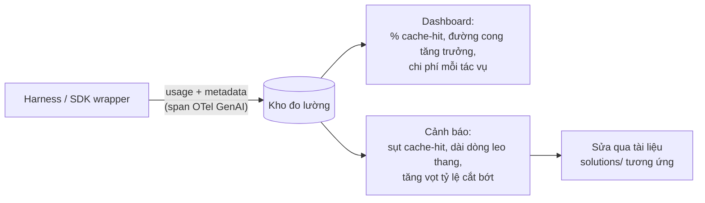
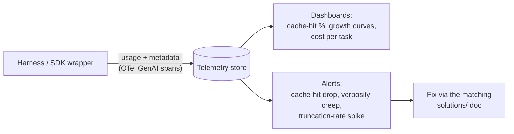

# Đếm Token & Đo lường Sử dụng (Tiếng Việt)

**Giải quyết:** Nguyên nhân 4.3 trong [`../CAUSE.md`](../CAUSE.md) — và
*lớp đo lường* mà mọi giải pháp khác phụ thuộc vào

**Ý tưởng:** Bạn không thể tối ưu thứ bạn không đo lường. Đếm token bằng
bộ đếm riêng của nhà cung cấp cho đúng model mục tiêu, ghi lại metadata sử
dụng của mỗi request một cách tập trung, và quy chi tiêu về các
route/nguyên nhân — để các hồi quy (cache trượt âm thầm, thay đổi
tokenizer, dài dòng leo thang) hiện ra thành cảnh báo thay vì hóa đơn bất
ngờ.

---

## Cách áp dụng

### 1. Đếm bằng bộ đếm đúng

| Nhà cung cấp | Bộ đếm đúng | Bộ đếm sai |
| --- | --- | --- |
| Anthropic | `POST /v1/messages/count_tokens` (theo từng model) | `tiktoken` (tokenizer của OpenAI — đếm thiếu Claude ~15–20%+, tệ hơn với code) |
| OpenAI | `tiktoken` với encoding *đúng* model | Encoding của model khác |
| Gemini | API `countTokens` | Ước lượng chars/4 |
| Model mở | Tokenizer HF riêng của model (`AutoTokenizer`) | Tokenizer của bất kỳ model nào khác |

Các quy tắc:

- **Hiệu chỉnh lại trên mỗi lần di chuyển model.** Thay đổi tokenizer qua
  các thế hệ đã làm dịch chuyển số đếm hơn 30% cho cùng văn bản — ngân
  sách, `max_tokens`, và ngưỡng kích hoạt nén được hiệu chỉnh trên model cũ
  sẽ sai trên model mới.
- Đếm trước (pre-flight) các input lớn (`count_tokens` trước khi gửi) để
  tránh các thất bại tràn ngữ cảnh thay vì phát hiện ra chúng tại thời
  điểm request.

### 2. Ghi lại metadata sử dụng trên mỗi phản hồi

Ghi lại toàn bộ đối tượng usage (input không cache, input đã cache, ghi
cache, output kể cả reasoning) cùng metadata request: route/tính năng,
model, session ID, số lượt. Bảng phân tích bốn đại lượng trong Cẩm nang Đo
lường của `CAUSE.md` chính là schema này.

### 3. Quy trách nhiệm và cảnh báo

Dashboard/cảnh báo ánh xạ trực tiếp vào danh mục nguyên nhân:

| Chỉ số | Phát hiện |
| --- | --- |
| Tỷ trọng cache-hit của input, theo từng route | Nguyên nhân 1.1–1.4 (vô hiệu hóa âm thầm hiện ra như một cú sụt bậc) |
| Đường cong token input theo số lượt, mỗi phiên | Nguyên nhân 2.1 (tăng trưởng không giới hạn = đường cong siêu tuyến tính) |
| Kích thước kết quả tool P95, theo từng tool | Nguyên nhân 3.1 |
| Số request mỗi tác vụ người dùng; các đợt request gần trùng lặp | Nguyên nhân 3.2 / 3.3 |
| Token output so với độ dài phản hồi hiển thị | Nguyên nhân 5.1 / 5.2 (reasoning + dài dòng) |
| Tỷ lệ dừng do `max_tokens` | Nguyên nhân 5.3 |
| Chi phí mỗi tác vụ hoàn thành, theo model/route | Nguyên nhân 6.2 và ROI tổng thể của mọi giải pháp |

**Chi phí mỗi tác vụ hoàn thành** là chỉ số ngôi sao dẫn đường — số token
thô có thể tăng trong khi chi phí-trên-kết-quả lại giảm (ví dụ effort
reasoning cao hơn nhưng hoàn thành trong ít lượt hơn).

### 4. Chuẩn hóa pipeline

Phát ra các span theo quy ước ngữ nghĩa OpenTelemetry GenAI
(`gen_ai.usage.*`) từ harness để bất kỳ backend nào cũng có thể tiêu thụ
chúng; hoặc áp dụng một nền tảng đo lường LLM-native tự động thu thập usage
qua SDK wrapper hoặc proxy.

## Công cụ hiện đại nhất (SOTA)

### Có sẵn — coding agent & API của nhà cung cấp

| Nhà cung cấp / agent | Tính năng | Ghi chú |
| --- | --- | --- |
| API Anthropic / OpenAI / Gemini | Endpoint `count_tokens`, đối tượng `usage` mỗi phản hồi, dashboard billing | Sự thật nền tảng cho đếm trước và đối soát billing; `tiktoken` (MIT) là bộ đếm offline chính thức của OpenAI |
| Claude Code | Lệnh `/cost`, `/context` + xuất chỉ số OTel | Khả năng thấy chi tiêu trong phiên và thành phần ngữ cảnh |
| Codex CLI / Gemini CLI | Lệnh `/status` · `/stats` | Sử dụng token mỗi phiên trong harness |

### Bên thứ ba — không phụ thuộc agent (ưu tiên mã nguồn mở)

| Công cụ | Giấy phép | Ghi chú |
| --- | --- | --- |
| Langfuse | MIT | Trace + usage/chi phí mỗi request, phiên bản prompt, đánh giá — có thể tự host |
| Helicone | Apache-2.0 | Tích hợp proxy một dòng trước bất kỳ agent nào; phân tích chi phí & cache |
| OpenLLMetry / quy ước OTel GenAI | Apache-2.0 | Đo lường trung lập với nhà cung cấp cho mọi backend (Datadog, Grafana, Honeycomb) |
| Braintrust / W&B Weave | Thương mại | Gắn chi phí token với điểm chất lượng theo từng thí nghiệm |

## Đánh đổi

- Chi phí công cụ đo lường và lưu trữ telemetry (nhỏ so với chi tiêu LLM —
  metadata usage chỉ vài trăm byte mỗi request).
- Proxy thêm một chặng mạng và một phụ thuộc tin cậy; đo lường phía SDK
  tránh cả hai nhưng tốn công tích hợp hơn một chút.
- Quá tải chỉ số: bắt đầu với tỷ trọng cache-hit, đường cong tăng trưởng,
  và chi phí mỗi tác vụ — ba chỉ số bắt được các hồi quy tốn kém.

## Tác động dự kiến

- Gián tiếp nhưng nền tảng: các đội thường phát hiện **nguồn lãng phí lớn
  nhất trong vòng vài ngày** sau khi có dashboard cache/tăng trưởng (thường
  nhất là một yếu tố vô hiệu hóa cache âm thầm hoặc một tool chạy loạn).
- Biến mọi giải pháp khác trong thư mục này từ một lần sửa đơn lẻ thành một
  *bất biến được thực thi* — các hồi quy sẽ cảnh báo thay vì tích tụ.
- Đếm trước loại bỏ hoàn toàn một lớp lỗi (tràn ngữ cảnh trên input lớn) mà
  nếu không sẽ lãng phí toàn bộ request phát hiện ra nó.

---

# Token Counting & Usage Observability

**Addresses:** Cause 4.3 in [`../CAUSE.md`](../CAUSE.md) — and the
*measurement layer* every other solution depends on

**Idea:** You can't optimize what you don't measure. Count tokens with the
provider's own counter for the exact target model, record per-request usage
metadata centrally, and attribute spend to routes/causes — so regressions
(silent cache misses, tokenizer shifts, verbosity creep) surface as alerts
instead of surprise invoices.

---

## How to apply

### 1. Count with the right counter

| Provider | Correct counter | Wrong counter |
| --- | --- | --- |
| Anthropic | `POST /v1/messages/count_tokens` (model-specific) | `tiktoken` (OpenAI's tokenizer — undercounts Claude by ~15–20%+, worse on code) |
| OpenAI | `tiktoken` with the *exact* model encoding | Another model's encoding |
| Gemini | `countTokens` API | chars/4 heuristics |
| Open models | The model's own HF tokenizer (`AutoTokenizer`) | Any other model's tokenizer |

Rules:

- **Re-baseline on every model migration.** Tokenizer changes across
  generations have shifted counts 30%+ for identical text — budgets,
  `max_tokens`, and compaction triggers calibrated on the old model are
  wrong on the new one.
- Pre-flight large inputs (`count_tokens` before sending) to route around
  context-overflow failures instead of discovering them at request time.

### 2. Record usage metadata on every response

Capture the full usage object (uncached input, cached input, cache writes,
output incl. reasoning) with request metadata: route/feature, model,
session ID, turn number. The four-quantity breakdown in `CAUSE.md`'s
Measurement Primer is the schema.

### 3. Attribute and alert

Dashboards/alerts that map directly onto the cause catalog:

| Metric | Detects |
| --- | --- |
| Cache-hit share of input, per route | Causes 1.1–1.4 (silent invalidation shows as a step-drop) |
| Input tokens vs turn number curve, per session | Cause 2.1 (unbounded growth = super-linear curve) |
| P95 tool-result size, per tool | Cause 3.1 |
| Requests per user-task; near-duplicate request bursts | Causes 3.2 / 3.3 |
| Output tokens vs visible-response length | Causes 5.1 / 5.2 (reasoning + verbosity) |
| `max_tokens`-stop rate | Cause 5.3 |
| Cost per completed task, per model/route | Cause 6.2 and overall ROI of every fix |

**Cost per completed task** is the north-star metric — raw token counts can
rise while cost-per-outcome falls (e.g. higher reasoning effort finishing in
fewer turns).

### 4. Standardize the pipeline

Emit OpenTelemetry GenAI semantic-convention spans (`gen_ai.usage.*`) from
the harness so any backend can consume them; or adopt an LLM-native
observability platform that captures usage automatically via SDK wrappers or
a proxy.

## SOTA tools

### Native — coding agents & provider APIs

| Provider / agent | Feature | Notes |
| --- | --- | --- |
| Anthropic / OpenAI / Gemini APIs | `count_tokens` endpoints, per-response `usage` objects, billing dashboards | Ground truth for pre-flight counts and billing reconciliation; `tiktoken` (MIT) is OpenAI's official offline counter |
| Claude Code | `/cost`, `/context` commands + OTel metrics export | In-session spend and context-composition visibility |
| Codex CLI / Gemini CLI | `/status` · `/stats` commands | Per-session token usage in the harness |

### Third-party — agent-agnostic (open source preferred)

| Tool | License | Notes |
| --- | --- | --- |
| Langfuse | MIT | Traces + per-request usage/cost, prompt versions, evals — self-hostable |
| Helicone | Apache-2.0 | One-line proxy integration in front of any agent; cost & cache analytics |
| OpenLLMetry / OTel GenAI conventions | Apache-2.0 | Vendor-neutral instrumentation for any backend (Datadog, Grafana, Honeycomb) |
| Braintrust / W&B Weave | Commercial | Tie token cost to quality scores per experiment |

## Trade-offs

- Instrumentation effort and telemetry storage cost (tiny relative to LLM
  spend — usage metadata is a few hundred bytes per request).
- Proxies add a network hop and a trust dependency; SDK-side instrumentation
  avoids both at slightly more integration work.
- Metric overload: start with cache-hit share, growth curve, and cost per
  task — the three that catch the expensive regressions.

## Expected impact

- Indirect but foundational: teams typically discover their **single
  largest waste source within days** of getting cache/growth dashboards
  (most often a silent cache invalidator or one runaway tool).
- Converts every other solution in this folder from one-off fix to
  *enforced invariant* — regressions alert instead of accruing.
- Pre-flight counting eliminates a whole failure class (context overflow on
  large inputs) that otherwise wastes the full request that discovers it.
