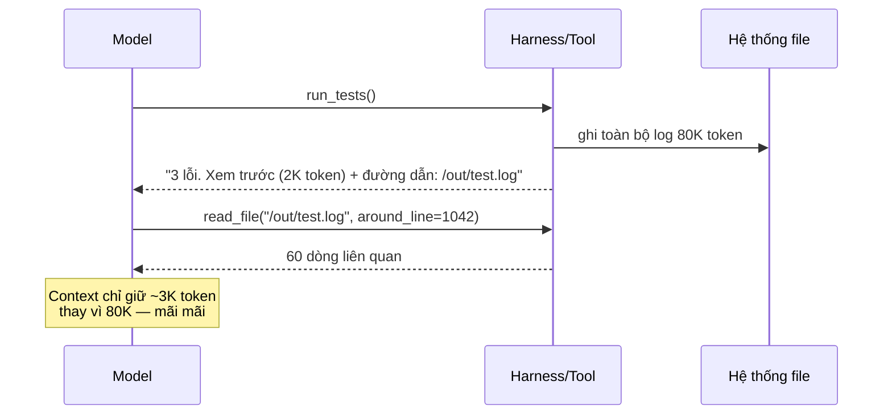
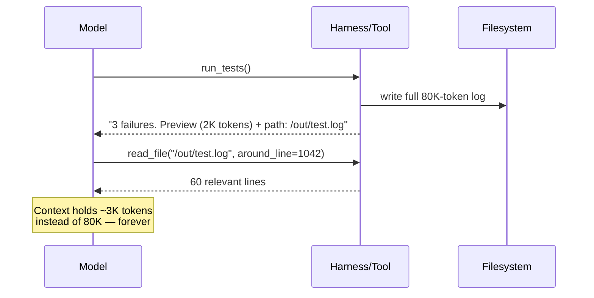

# Ngân sách Output Tool (Tiếng Việt)

**Giải quyết:** Nguyên nhân 3.1 trong [`../CAUSE.md`](../CAUSE.md)

**Ý tưởng:** Thực thi một ngân sách token cứng cho mỗi tool trên kết quả
trả về, và thiết kế tool để trả về **lát cắt tối thiểu khả dụng** — có
phân trang, lọc, xem trước — với một lối thoát (offload ra file, con trỏ
lấy thêm) cho khi model thực sự cần nhiều hơn.

---

## Cách áp dụng

### 1. Đặt ngân sách cho mọi tool

Cho mỗi tool một giới hạn output cứng (ví dụ 2K–10K token tùy vai trò) và
thực thi nó trong harness, không phải trong prompt. Khi tràn, đừng cắt bớt
một cách mù quáng — trả về một **phản hồi tràn có cấu trúc**:

```json
{
  "truncated": true,
  "total_lines": 5214,
  "preview": "<200 dòng đầu>",
  "full_output_path": "/tmp/out/build-log-7f3a.txt",
  "hint": "dùng read_file với offset/limit, hoặc grep file này"
}
```

### 2. Thiết kế tool để cắt lát, không đổ nguyên khối

- `read_file(path, offset, limit)` — không bao giờ chỉ đọc nguyên file.
- `search(query, head_limit)` — số lượng kết quả có giới hạn, các chế độ
  output chỉ-kết-quả-khớp (đường dẫn, dòng đầy đủ, hay số lượng).
- Tool dựa trên API: chọn trường (GraphQL, `?fields=`), truyền qua phân
  trang, lọc phía server — trả về 4 trường tác vụ cần, không phải phản hồi
  thô 200 trường.
- Định dạng có cấu trúc: ưu tiên bảng gọn/TSV hơn JSON in đẹp — thụt lề và
  khóa lặp lại là chi phí token thuần túy (thường 2–3× cho cùng dữ liệu).

### 3. Offload output lớn ra hệ thống file

Mẫu hình được các harness hiện đại nhất sử dụng: kết quả lớn được ghi ra
đĩa, model nhận bản xem trước + đường dẫn và đọc từng phần theo yêu cầu.



### 4. Xử lý trước khi model nhìn thấy

Với các tool nổi tiếng nhiễu (trình chạy test, trình biên dịch, crawler),
hãy loại bỏ boilerplate một cách tất định trong harness: mã ANSI, nhiễu
stack-frame, cảnh báo lặp lại, HTML → markdown/text (một trang HTML thường
đắt gấp 5–20× số token văn bản đọc được của nó).

## Công cụ hiện đại nhất (SOTA)

### Có sẵn — coding agent & API của nhà cung cấp

| Nhà cung cấp / agent | Tính năng | Ghi chú |
| --- | --- | --- |
| Claude Code | Thiết kế tool có ngân sách: `Read` offset/limit, `Grep` head_limit/chế độ output, Bash nền với file log | Triển khai tham chiếu của các tool có ngân sách, cắt lát được |
| Nền tảng Anthropic | Offload output lớn của MCP | Output tool MCP >100K token tự động offload ra file sandbox kèm xem trước + đường dẫn |
| OpenAI API · Codex | Output tool có cấu trúc + trích dẫn file | Giữ artifact cồng kềnh trong file, trích dẫn đoạn |

### Bên thứ ba — không phụ thuộc agent (ưu tiên mã nguồn mở)

| Công cụ | Giấy phép | Ghi chú |
| --- | --- | --- |
| Trafilatura / mozilla-readability | Apache-2.0 | HTML → văn bản sạch trước khi vào context của bất kỳ agent nào (nhỏ hơn 5–20×); Jina Reader là lựa chọn thay thế được host sẵn |
| `jq` / chọn trường GraphQL tại ranh giới tool | MIT | Lọc trường tất định, không tốn chi phí model, hoạt động trước mọi tool |
| MCP server có tham số phân trang/cắt lát | MIT (SDK) | Đặt ngân sách tại ranh giới MCP-server một lần → mọi agent hỗ trợ MCP đều hưởng lợi |

## Đánh đổi

- Ngân sách quá chặt gây thêm các round-trip lấy-thêm — mỗi lượt là một
  request đầy đủ. Đặt ngân sách rộng rãi cho các tool mà model gần như
  luôn cần đầy đủ output.
- Offload đòi hỏi một hệ thống file (hoặc kho artifact) trong vòng lặp và
  công cụ đọc-từng-phần.
- Lọc mạnh tay phía harness có thể xóa đúng dòng quan trọng; giữ artifact
  đầy đủ có thể truy xuất được (đó là lý do offload tốt hơn cắt bớt).

## Tác động dự kiến

- Kết quả tool thường là **tỷ trọng lớn nhất trong token input của agent**;
  ngân sách + offload thường cắt giảm input mỗi phiên **2–5×** trong các
  khối lượng công việc nặng về tool.
- Mức tiết kiệm cộng dồn với việc lịch sử tồn tại lâu (nguyên nhân 2.1):
  một kết quả chỉ chấp nhận ở mức 3K thay vì 80K token sẽ tiết kiệm phần
  chênh lệch đó trên *mọi lượt sau*, không chỉ một lần.
- Ngưỡng offload MCP của Anthropic (100K) tồn tại vì output tool không
  giới hạn là một lớp lỗi đã biết — các harness đặt ngân sách ở 2–10K thấy
  lợi ích ở quy mô nhỏ hơn nhiều.

---

# Tool Output Budgets

**Addresses:** Cause 3.1 in [`../CAUSE.md`](../CAUSE.md)

**Idea:** Enforce a per-tool token budget on results, and design tools to
return the **minimum viable slice** — paginated, filtered, previewed —
with an escape hatch (offload to file, fetch-more cursor) for when the model
genuinely needs more.

---

## How to apply

### 1. Budget every tool

Give each tool a hard output cap (e.g. 2K–10K tokens depending on role) and
enforce it in the harness, not in the prompt. On overflow, don't truncate
blindly — return a **structured overflow response**:

```json
{
  "truncated": true,
  "total_lines": 5214,
  "preview": "<first 200 lines>",
  "full_output_path": "/tmp/out/build-log-7f3a.txt",
  "hint": "use read_file with offset/limit, or grep the file"
}
```

### 2. Design tools for slicing, not dumping

- `read_file(path, offset, limit)` — never whole-file-only.
- `search(query, head_limit)` — bounded result counts, match-only output
  modes (paths vs full lines vs counts).
- API-backed tools: field selection (GraphQL, `?fields=`), pagination
  passthrough, server-side filtering — return the 4 fields the task needs,
  not the 200-field raw response.
- Structured formats: prefer compact tables/TSV over pretty-printed JSON —
  indentation and repeated keys are pure token overhead (often 2–3× for the
  same data).

### 3. Offload large outputs to the filesystem

The pattern used by state-of-the-art harnesses: big results land on disk,
the model gets a preview + path and reads slices on demand.



### 4. Post-process before the model sees it

For known-noisy tools (test runners, compilers, crawlers), strip
boilerplate deterministically in the harness: ANSI codes, stack-frame noise,
repeated warnings, HTML → markdown/text (an HTML page is typically 5–20×
its readable-text token count).

## SOTA tools

### Native — coding agents & provider APIs

| Provider / agent | Feature | Notes |
| --- | --- | --- |
| Claude Code | Budgeted tool design: `Read` offset/limit, `Grep` head_limit/output modes, background Bash with log files | Reference implementation of budgeted, sliceable tools |
| Anthropic platform | MCP large-output offload | MCP tool outputs >100K tokens auto-offload to a sandbox file with preview + path |
| OpenAI API · Codex | Structured tool outputs + file citations | Keep bulky artifacts in files, cite spans |

### Third-party — agent-agnostic (open source preferred)

| Tool | License | Notes |
| --- | --- | --- |
| Trafilatura / mozilla-readability | Apache-2.0 | HTML → clean text before it enters any agent's context (5–20× smaller); Jina Reader is a hosted alternative |
| `jq` / GraphQL field selection at the tool boundary | MIT | Deterministic field filtering, zero model cost, works in front of any tool |
| MCP servers with pagination/slicing parameters | MIT (SDKs) | Budget at the MCP-server boundary once → every MCP-capable agent benefits |

## Trade-offs

- Over-tight budgets cause extra fetch-more round trips — each is a full
  request. Budget generously for tools whose output the model almost always
  needs in full.
- Offloading requires a filesystem (or artifact store) in the loop and
  read-slice tooling.
- Aggressive harness-side filtering can strip the one line that mattered;
  keep the full artifact retrievable (that's why offload > truncate).

## Expected impact

- Tool results are typically the **largest single share of agent input
  tokens**; budgets + offload commonly cut per-session input **2–5×** in
  tool-heavy workloads.
- The savings compound with history persistence (cause 2.1): a result
  admitted at 3K instead of 80K tokens saves the difference on *every
  subsequent turn*, not once.
- Anthropic's MCP offload threshold (100K) exists because unbounded tool
  output is a known failure class — harnesses that budget at 2–10K see the
  benefit at far smaller scale.
