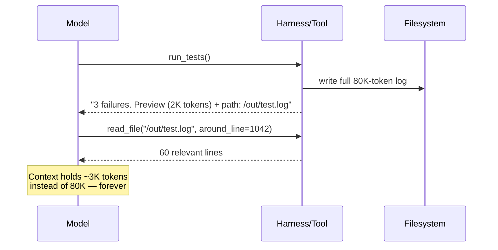

# Tool Output Budgets

**Addresses:** Cause 3.1 in [`../CAUSE.md`](../CAUSE.md)

**Idea:** Enforce a per-tool token budget on results, and design tools to
return the **minimum viable slice** — paginated, filtered, previewed —
with an escape hatch (offload to file, fetch-more cursor) for when the model
genuinely needs more.

---

## How to apply

### 1. Budget every tool

Give each tool a hard output cap (e.g. 2K–10K tokens depending on role) and
enforce it in the harness, not in the prompt. On overflow, don't truncate
blindly — return a **structured overflow response**:

```json
{
  "truncated": true,
  "total_lines": 5214,
  "preview": "<first 200 lines>",
  "full_output_path": "/tmp/out/build-log-7f3a.txt",
  "hint": "use read_file with offset/limit, or grep the file"
}
```

### 2. Design tools for slicing, not dumping

- `read_file(path, offset, limit)` — never whole-file-only.
- `search(query, head_limit)` — bounded result counts, match-only output
  modes (paths vs full lines vs counts).
- API-backed tools: field selection (GraphQL, `?fields=`), pagination
  passthrough, server-side filtering — return the 4 fields the task needs,
  not the 200-field raw response.
- Structured formats: prefer compact tables/TSV over pretty-printed JSON —
  indentation and repeated keys are pure token overhead (often 2–3× for the
  same data).

### 3. Offload large outputs to the filesystem

The pattern used by state-of-the-art harnesses: big results land on disk,
the model gets a preview + path and reads slices on demand.



### 4. Post-process before the model sees it

For known-noisy tools (test runners, compilers, crawlers), strip
boilerplate deterministically in the harness: ANSI codes, stack-frame noise,
repeated warnings, HTML → markdown/text (an HTML page is typically 5–20×
its readable-text token count).

## SOTA tools

### Native — coding agents & provider APIs

| Provider / agent | Feature | Notes |
| --- | --- | --- |
| Claude Code | Budgeted tool design: `Read` offset/limit, `Grep` head_limit/output modes, background Bash with log files | Reference implementation of budgeted, sliceable tools |
| Anthropic platform | MCP large-output offload | MCP tool outputs >100K tokens auto-offload to a sandbox file with preview + path |
| OpenAI API · Codex | Structured tool outputs + file citations | Keep bulky artifacts in files, cite spans |

### Third-party — agent-agnostic (open source preferred)

| Tool | License | Notes |
| --- | --- | --- |
| Trafilatura / mozilla-readability | Apache-2.0 | HTML → clean text before it enters any agent's context (5–20× smaller); Jina Reader is a hosted alternative |
| `jq` / GraphQL field selection at the tool boundary | MIT | Deterministic field filtering, zero model cost, works in front of any tool |
| MCP servers with pagination/slicing parameters | MIT (SDKs) | Budget at the MCP-server boundary once → every MCP-capable agent benefits |

## Trade-offs

- Over-tight budgets cause extra fetch-more round trips — each is a full
  request. Budget generously for tools whose output the model almost always
  needs in full.
- Offloading requires a filesystem (or artifact store) in the loop and
  read-slice tooling.
- Aggressive harness-side filtering can strip the one line that mattered;
  keep the full artifact retrievable (that's why offload > truncate).

## Expected impact

- Tool results are typically the **largest single share of agent input
  tokens**; budgets + offload commonly cut per-session input **2–5×** in
  tool-heavy workloads.
- The savings compound with history persistence (cause 2.1): a result
  admitted at 3K instead of 80K tokens saves the difference on *every
  subsequent turn*, not once.
- Anthropic's MCP offload threshold (100K) exists because unbounded tool
  output is a known failure class — harnesses that budget at 2–10K see the
  benefit at far smaller scale.
