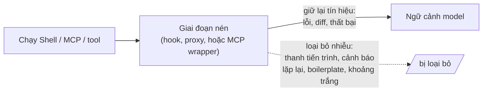
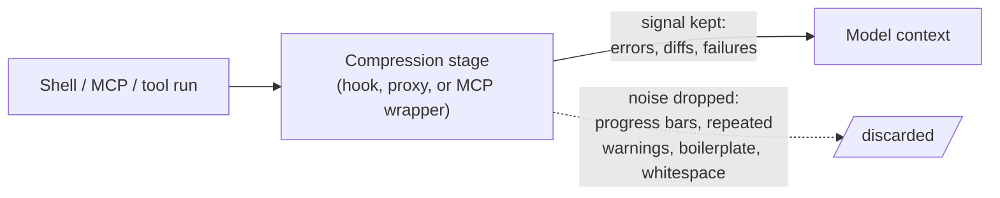

# Nén Output Tool (Thu nhỏ những gì trả về) (Tiếng Việt)

**Giải quyết:** Nguyên nhân 3.1 và 2.1 trong [`../CAUSE.md`](../CAUSE.md) —
bổ sung cho [`tool-output-budgets.md`](tool-output-budgets.md)

**Ý tưởng:** Đặt một giai đoạn nén *giữa tool và ngữ cảnh* để loại bỏ nhiễu
có thể đoán trước khỏi output lệnh, log, và dữ liệu có cấu trúc trước khi
model nhìn thấy — giữ lại tín hiệu (lỗi, diff, thất bại test, giá trị cụ
thể) và loại bỏ boilerplate.

---

## Nén so với ngân sách — hai công việc khác nhau

| | Ngân sách output tool | Nén output tool |
| --- | --- | --- |
| Cơ chế | Thiết kế lại *tool của bạn* để trả về một lát cắt nhỏ (offset/limit, offload) | Đứng trước bất cứ thứ gì đang chạy và thu nhỏ các byte nó tạo ra |
| Yêu cầu | Quyền kiểm soát tool | Không cần gì — hoạt động trên các tool bạn không thể thay đổi, kể cả MCP server và shell thô |
| Mục tiêu tốt nhất | File lớn, phản hồi API bạn sở hữu | Build log, output test, nhiễu `git`/`kubectl`/`npm`, JSON dài dòng |

Chúng chồng lên nhau: đặt ngân sách cho các tool bạn sở hữu, nén các tool
bạn không sở hữu.

## Cách áp dụng

1. **Ưu tiên tất định, chỉ dùng model khi cần.** Hầu hết nhiễu tool có thể
   loại bỏ bằng quy tắc, với chi phí token bằng 0: loại bỏ mã ANSI, thanh
   tiến trình, cảnh báo lặp lại, spam giải quyết dependency, nhiễu
   stack-frame; thu gọn khoảng trắng; giữ lại các dòng lỗi và ngữ cảnh của
   chúng. Dành việc tóm tắt bằng model cho khối lượng thực sự không có cấu
   trúc.
2. **Bảo toàn tín hiệu một cách tường minh.** Quy tắc giữ cho việc nén an
   toàn: *không bao giờ* bỏ các thất bại test, thông báo lỗi, diff, hoặc
   stack trace — nén 1.000 dòng "OK" xung quanh chúng, không phải 5 dòng
   quan trọng. Các công cụ làm điều này đi kèm danh sách cho phép/từ chối
   được tinh chỉnh theo từng lệnh.
3. **Nén mạnh nhất với dữ liệu có cấu trúc.** Output JSON/YAML/dạng bảng
   là lợi ích lớn nhất — in đẹp và khóa lặp lại là chi phí thuần túy; mảng
   đối tượng → bảng gọn thường tiết kiệm 60–95%.
4. **Chọn một điểm tích hợp:**
   - *Hook* — chặn các lệnh gọi shell/tool của agent (ví dụ hook
     `PreToolUse` của Claude Code) và viết lại lệnh hoặc xử lý output sau
     khi chạy. Trong suốt đối với model.
   - *Proxy* — một gateway cục bộ giữa agent và API nén các khối kết quả
     tool khi đang truyền; không phụ thuộc ngôn ngữ, hoạt động với mọi
     client tương thích OpenAI.
   - *MCP wrapper* — cung cấp các tool MCP `compress`/`retrieve` để mọi
     agent hỗ trợ MCP đều hưởng lợi.
5. **Giữ nguyên vẹn caching prefix.** Một trình nén viết lại các byte lịch
   sử *đã cố định* sẽ phá vỡ cache (nguyên nhân 1.3). Các trình nén tốt chỉ
   chạm vào kết quả tool mới được nối thêm và giữ lịch sử đã gửi trước đó
   giống hệt từng byte — xác minh các chỉ số cache-read không giảm sau khi
   bạn thêm một trình nén.

## Công cụ hiện đại nhất (SOTA)

### Có sẵn — coding agent & API của nhà cung cấp

| Nhà cung cấp / agent | Tính năng | Ghi chú |
| --- | --- | --- |
| Claude Code | Hook `PreToolUse` / `PostToolUse` | Điểm chặn có sẵn — viết lại lệnh Bash hoặc lọc output trước khi vào ngữ cảnh |
| Nền tảng Anthropic | Offload output lớn của MCP | Output tool >100K token tự động offload ra file kèm xem trước + đường dẫn (trường hợp nén cực đoan) |
| Mọi harness | Bộ xử lý hậu kỳ tất định tại ranh giới tool | Loại bỏ ANSI/boilerplate chỉ vài dòng code và miễn phí |

### Bên thứ ba — không phụ thuộc agent (ưu tiên mã nguồn mở)

| Công cụ | Giấy phép | Ghi chú |
| --- | --- | --- |
| RTK (Rust Token Killer, `rtk-ai/rtk`) | Apache-2.0 | Proxy/hook CLI nén 100+ lệnh dev (git, trình chạy test, công cụ build, `kubectl`, `aws`) 60–90%; giữ nguyên thất bại/diff; tích hợp có sẵn với Claude Code / Cline / Codex / Gemini |
| Headroom (`headroomlabs-ai/headroom`) | Apache-2.0 | Thư viện / proxy / MCP / agent-wrap; JSON 60–95%, shell ~85%, build log ~94%; `CacheAligner` giữ prefix ổn định cho cache; ma trận hỗ trợ gồm Claude Code, Codex, Cline, Aider, Cursor |
| Trafilatura / mozilla-readability | Apache-2.0 | HTML → văn bản sạch (nhỏ hơn 5–20×) trước khi vào ngữ cảnh của bất kỳ agent nào |
| `jq` / định dạng lại có cấu trúc tại ranh giới | MIT | Chọn trường tất định và làm phẳng mảng→bảng, không tốn chi phí model |
| Caveman (`wilpel/caveman-compression`) | MIT | Nén *output mà model viết ra* — người anh em của việc nén phía input (`concise-output-prompting.md`) |

## Đánh đổi

- Nén quá mạnh tay che mất đúng dòng quan trọng — luôn giữ artifact đầy
  đủ có thể truy xuất được (offload tốt hơn cắt bớt phá hủy), và tinh chỉnh
  danh sách từ chối một cách thận trọng.
- Đây là một mắt xích di động khác trong đường đi của request (hook/proxy/
  wrapper) với các chế độ lỗi riêng; một trình nén bị hỏng có thể làm hỏng
  kết quả tool.
- Nén dựa trên model tốn token/độ trễ riêng của nó — ưu tiên quy tắc tất
  định; dành tóm tắt bằng LLM cho khối lượng không có cấu trúc nơi nó thực
  sự đáng giá.
- Xác minh tỷ lệ cache-hit prefix sau khi thêm một trình nén — một trình
  nén ngây thơ chạm vào lịch sử đã cố định sẽ đánh đổi thắng lợi caching
  lấy thắng lợi nén.

## Tác động dự kiến

- **Giảm 60–90% trên output lệnh dev nhiễu** là điển hình (JSON có cấu
  trúc ở đầu khoảng đó, build/test log 85–94%); các dấu vết phiên đã công
  bố cho thấy ~118K → ~24K token trong một phiên lập trình 30 phút.
- Mức tiết kiệm cộng dồn với việc lịch sử tồn tại lâu (nguyên nhân 2.1):
  một build log chỉ chấp nhận ở mức 2K thay vì 40K token sẽ được tiết kiệm
  trên *mọi lượt sau đó*.
- Vì không cần thiết kế lại tool, đây thường là thắng lợi nhanh nhất có
  sẵn cho một agent hiện có — một hook hoặc proxy đứng trước các tool bạn
  đã đang chạy.

---

# Tool-Output Compression (Shrink What Comes Back)

**Addresses:** Causes 3.1 and 2.1 in [`../CAUSE.md`](../CAUSE.md) —
complements [`tool-output-budgets.md`](tool-output-budgets.md)

**Idea:** Put a compression stage *between the tool and the context* that
strips predictable noise from command output, logs, and structured data
before the model ever sees it — keeping the signal (errors, diffs, test
failures, concrete values) and discarding the boilerplate.

---

## Compression vs. budgets — two different jobs

| | Tool output budgets | Tool-output compression |
| --- | --- | --- |
| Mechanism | Redesign *your* tools to return a small slice (offset/limit, offload) | Sit in front of whatever runs and shrink the bytes it produces |
| Requires | Control over the tool | Nothing — works on tools you can't change, incl. MCP servers and raw shell |
| Best target | Big files, API responses you own | Build logs, test output, `git`/`kubectl`/`npm` noise, verbose JSON |

They stack: budget the tools you own, compress the ones you don't.

## How to apply

1. **Deterministic first, model-based only if needed.** Most tool noise is
   removable with rules, at zero token cost: strip ANSI codes, progress
   bars, repeated warnings, dependency-resolution spam, stack-frame noise;
   collapse whitespace; keep the failing lines and their context. Reserve
   model-based summarization for genuinely unstructured bulk.
2. **Preserve the signal explicitly.** The rule that keeps compression safe:
   *never* drop test failures, error messages, diffs, or stack traces —
   compress the 1,000 lines of "OK" around them, not the 5 lines that
   matter. Tools that do this ship with allow/deny lists tuned per command.
3. **Compress structured data hardest.** JSON/YAML/tabular output is the
   biggest win — pretty-printing and repeated keys are pure overhead;
   array-of-objects → compact table routinely saves 60–95%.
4. **Pick an integration point:**
   - *Hook* — intercept the agent's shell/tool calls (e.g. a Claude Code
     `PreToolUse` hook) and rewrite the command or post-process its output.
     Transparent to the model.
   - *Proxy* — a local gateway between the agent and the API that compresses
     tool-result blocks in-flight; language-agnostic, works with any
     OpenAI-compatible client.
   - *MCP wrapper* — expose `compress`/`retrieve` MCP tools so any
     MCP-capable agent benefits.
5. **Keep prefix caching intact.** A compressor that rewrites *frozen*
   history bytes busts the cache (cause 1.3). Good compressors only touch
   the newly-appended tool result and keep already-sent history
   byte-identical — verify cache-read metrics don't drop after you add one.

## SOTA tools

### Native — coding agents & provider APIs

| Provider / agent | Feature | Notes |
| --- | --- | --- |
| Claude Code | `PreToolUse` / `PostToolUse` hooks | The native interception point — rewrite Bash commands or filter output before it enters context |
| Anthropic platform | MCP large-output offload | Tool outputs >100K tokens auto-offload to a file with preview + path (the extreme case of compression) |
| All harnesses | Deterministic post-processors in the tool boundary | ANSI/boilerplate stripping is a few lines and free |

### Third-party — agent-agnostic (open source preferred)

| Tool | License | Notes |
| --- | --- | --- |
| RTK (Rust Token Killer, `rtk-ai/rtk`) | Apache-2.0 | CLI proxy/hook compressing 100+ dev commands (git, test runners, build tools, `kubectl`, `aws`) 60–90%; preserves failures/diffs; native Claude Code / Cline / Codex / Gemini integration |
| Headroom (`headroomlabs-ai/headroom`) | Apache-2.0 | Library / proxy / MCP / agent-wrap; JSON 60–95%, shell ~85%, build logs ~94%; `CacheAligner` keeps prefixes cache-stable; matrix includes Claude Code, Codex, Cline, Aider, Cursor |
| Trafilatura / mozilla-readability | Apache-2.0 | HTML → clean text (5–20× smaller) before it enters any agent |
| `jq` / structured reshaping at the boundary | MIT | Deterministic field selection and array→table flattening, zero model cost |
| Caveman (`wilpel/caveman-compression`) | MIT | Compresses *output the model writes* — the sibling to input-side compression (`concise-output-prompting.md`) |

## Trade-offs

- Over-aggressive compression hides the one line that mattered — always keep
  the full artifact retrievable (offload > destructive truncation), and tune
  deny-lists conservatively.
- It's another moving piece in the request path (a hook/proxy/wrapper) with
  its own failure modes; a broken compressor can corrupt tool results.
- Model-based compression costs its own tokens/latency — prefer deterministic
  rules; reserve LLM summarization for unstructured bulk where it pays.
- Validate prefix-cache hit rates after adding a compressor — a naive one
  that touches frozen history trades a caching win for a compression win.

## Expected impact

- **60–90% reduction on noisy dev-command output** is typical (structured
  JSON at the top of that range, build/test logs 85–94%); published
  session traces show ~118K → ~24K tokens over a 30-minute coding session.
- The savings compound with history persistence (cause 2.1): a build log
  admitted at 2K instead of 40K tokens is saved on *every subsequent turn*.
- Because it needs no tool redesign, it's often the fastest win available on
  an existing agent — a hook or proxy in front of the tools you already run.
