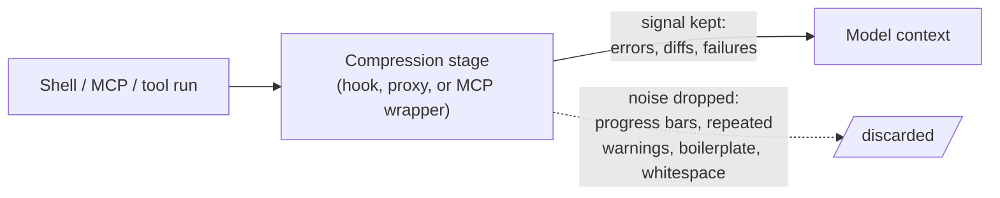

# Tool-Output Compression (Shrink What Comes Back)

**Addresses:** Causes 3.1 and 2.1 in [`../CAUSE.md`](../CAUSE.md) —
complements [`tool-output-budgets.md`](tool-output-budgets.md)

**Idea:** Put a compression stage *between the tool and the context* that
strips predictable noise from command output, logs, and structured data
before the model ever sees it — keeping the signal (errors, diffs, test
failures, concrete values) and discarding the boilerplate.

---

## Compression vs. budgets — two different jobs

| | Tool output budgets | Tool-output compression |
| --- | --- | --- |
| Mechanism | Redesign *your* tools to return a small slice (offset/limit, offload) | Sit in front of whatever runs and shrink the bytes it produces |
| Requires | Control over the tool | Nothing — works on tools you can't change, incl. MCP servers and raw shell |
| Best target | Big files, API responses you own | Build logs, test output, `git`/`kubectl`/`npm` noise, verbose JSON |

They stack: budget the tools you own, compress the ones you don't.

## How to apply

1. **Deterministic first, model-based only if needed.** Most tool noise is
   removable with rules, at zero token cost: strip ANSI codes, progress
   bars, repeated warnings, dependency-resolution spam, stack-frame noise;
   collapse whitespace; keep the failing lines and their context. Reserve
   model-based summarization for genuinely unstructured bulk.
2. **Preserve the signal explicitly.** The rule that keeps compression safe:
   *never* drop test failures, error messages, diffs, or stack traces —
   compress the 1,000 lines of "OK" around them, not the 5 lines that
   matter. Tools that do this ship with allow/deny lists tuned per command.
3. **Compress structured data hardest.** JSON/YAML/tabular output is the
   biggest win — pretty-printing and repeated keys are pure overhead;
   array-of-objects → compact table routinely saves 60–95%.
4. **Pick an integration point:**
   - *Hook* — intercept the agent's shell/tool calls (e.g. a Claude Code
     `PreToolUse` hook) and rewrite the command or post-process its output.
     Transparent to the model.
   - *Proxy* — a local gateway between the agent and the API that compresses
     tool-result blocks in-flight; language-agnostic, works with any
     OpenAI-compatible client.
   - *MCP wrapper* — expose `compress`/`retrieve` MCP tools so any
     MCP-capable agent benefits.
5. **Keep prefix caching intact.** A compressor that rewrites *frozen*
   history bytes busts the cache (cause 1.3). Good compressors only touch
   the newly-appended tool result and keep already-sent history
   byte-identical — verify cache-read metrics don't drop after you add one.

## SOTA tools

### Native — coding agents & provider APIs

| Provider / agent | Feature | Notes |
| --- | --- | --- |
| Claude Code | `PreToolUse` / `PostToolUse` hooks | The native interception point — rewrite Bash commands or filter output before it enters context |
| Anthropic platform | MCP large-output offload | Tool outputs >100K tokens auto-offload to a file with preview + path (the extreme case of compression) |
| All harnesses | Deterministic post-processors in the tool boundary | ANSI/boilerplate stripping is a few lines and free |

### Third-party — agent-agnostic (open source preferred)

| Tool | License | Notes |
| --- | --- | --- |
| RTK (Rust Token Killer, `rtk-ai/rtk`) | Apache-2.0 | CLI proxy/hook compressing 100+ dev commands (git, test runners, build tools, `kubectl`, `aws`) 60–90%; preserves failures/diffs; native Claude Code / Cline / Codex / Gemini integration |
| Headroom (`headroomlabs-ai/headroom`) | Apache-2.0 | Library / proxy / MCP / agent-wrap; JSON 60–95%, shell ~85%, build logs ~94%; `CacheAligner` keeps prefixes cache-stable; matrix includes Claude Code, Codex, Cline, Aider, Cursor |
| Trafilatura / mozilla-readability | Apache-2.0 | HTML → clean text (5–20× smaller) before it enters any agent |
| `jq` / structured reshaping at the boundary | MIT | Deterministic field selection and array→table flattening, zero model cost |
| Caveman (`wilpel/caveman-compression`) | MIT | Compresses *output the model writes* — the sibling to input-side compression (`concise-output-prompting.md`) |

## Trade-offs

- Over-aggressive compression hides the one line that mattered — always keep
  the full artifact retrievable (offload > destructive truncation), and tune
  deny-lists conservatively.
- It's another moving piece in the request path (a hook/proxy/wrapper) with
  its own failure modes; a broken compressor can corrupt tool results.
- Model-based compression costs its own tokens/latency — prefer deterministic
  rules; reserve LLM summarization for unstructured bulk where it pays.
- Validate prefix-cache hit rates after adding a compressor — a naive one
  that touches frozen history trades a caching win for a compression win.

## Expected impact

- **60–90% reduction on noisy dev-command output** is typical (structured
  JSON at the top of that range, build/test logs 85–94%); published
  session traces show ~118K → ~24K tokens over a 30-minute coding session.
- The savings compound with history persistence (cause 2.1): a build log
  admitted at 2K instead of 40K tokens is saved on *every subsequent turn*.
- Because it needs no tool redesign, it's often the fastest win available on
  an existing agent — a hook or proxy in front of the tools you already run.
