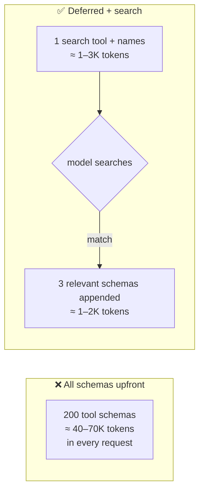

# Dynamic Tool Discovery (Tool Search / Deferred Loading)

**Addresses:** Cause 3.4 in [`../CAUSE.md`](../CAUSE.md)

**Idea:** Ship only a tiny search/discovery tool in every request; the full
catalog of tool schemas stays out of context, and the model loads the few
schemas it actually needs, on demand — with discovered schemas **appended**
so the prompt cache survives.

---

## How to apply

1. **Provider-native tool search** — *Anthropic*: declare a search tool
   (`tool_search_tool_regex_20251119` or BM25 variant) and mark the rest of
   the catalog `defer_loading: true`. Deferred tools contribute only their
   names until searched; matched schemas are appended to the request
   (prefix-cache-safe by design). Keep the handful of always-used tools
   non-deferred.
2. **MCP-level discovery** — for MCP-heavy setups (the most common source of
   schema bloat: attaching whole servers wholesale), use a harness that
   defers MCP tool schemas behind a `ToolSearch`-style meta-tool (Claude
   Code does this natively) rather than expanding every server's full
   schema into every request.
3. **Static route-scoping as the zero-tech fallback** — if requests are
   classifiable upfront ("billing task" vs "deploy task"), select the
   relevant tool subset in the harness per route. No search tool needed;
   just stop sending the union of everything. Keep each route's subset
   *stable* so caching works (cause 1.3).
4. **Trim the schemas themselves** — descriptions are prompt text: tighten
   verbose descriptions, collapse redundant enum docs, strip example
   payloads into a skill/doc the model can read on demand.

## SOTA tools

### Native — coding agents & provider APIs

| Provider / agent | Feature | Notes |
| --- | --- | --- |
| Anthropic API | Tool search (`tool_search_tool_regex/bm25`) + `defer_loading` | Append-only discovery; preserves prompt cache; regex and BM25 variants |
| Claude Code | Deferred MCP tools (`ToolSearch`) | Reference implementation for MCP catalogs |

### Third-party — agent-agnostic (open source preferred)

| Tool | License | Notes |
| --- | --- | --- |
| MCP `tools/list` lazy clients | MIT (SDKs, open standard) | Load server catalogs into a local index, expose search — not the raw union; works with any MCP-capable agent |
| Route-scoped tool registries (LangGraph node-scoped tools) | MIT | Deterministic subsetting per workflow node |

## Trade-offs

- Adds a discovery round trip when an unloaded tool is needed (one search +
  one appended schema). For catalogs under ~10 tools, deferral saves too
  little to bother.
- Search quality matters: bad tool names/descriptions → failed discovery →
  the model improvises or gives up. Invest in searchable naming.
- Never defer everything — the model must always have the search tool plus
  its core tools available (providers reject all-deferred configurations).

## Expected impact

- Fixed per-request overhead from tool schemas drops **~10–50×** for large
  catalogs (tens of thousands of tokens → 1–3K), on *every* request.
- Anthropic's published evaluations of tool search additionally show
  **accuracy improvements** on large-catalog tasks (e.g. MCP-heavy setups),
  because irrelevant schemas were degrading tool selection — cost and
  quality move together here.
- Cache-hit rates improve as a side effect: a stable, small head plus
  append-only discovery is exactly the architecture `prompt-caching.md`
  wants.
