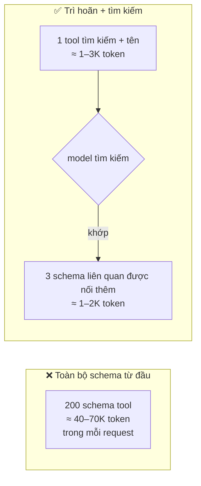
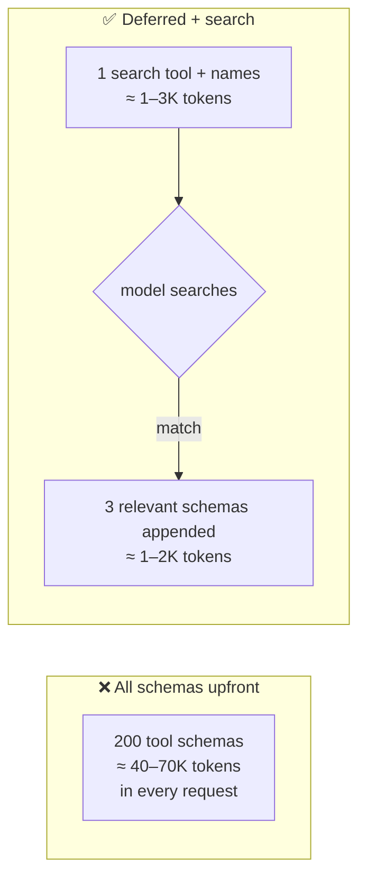

# Khám phá Tool Động (Tool Search / Tải trì hoãn) (Tiếng Việt)

**Giải quyết:** Nguyên nhân 3.4 trong [`../CAUSE.md`](../CAUSE.md)

**Ý tưởng:** Chỉ gửi một tool tìm kiếm/khám phá nhỏ xíu trong mỗi request;
toàn bộ danh mục schema tool nằm ngoài context, và model chỉ tải những
schema nó thực sự cần, theo yêu cầu — với các schema được khám phá **nối
thêm** để cache prompt còn nguyên vẹn.

---

## Tại sao điều này đang cấp bách (số liệu về sự phình to của MCP)

Vấn đề này tăng theo quy mô áp dụng MCP. Một stack điển hình gồm **bảy MCP
server tiêu tốn ~67.300 token định nghĩa tool — ~34% của context window
200K — trước khi người dùng gõ bất cứ điều gì**; các stack doanh nghiệp
5–10 server thường xuyên đốt 100–200K token chi phí schema thuần túy. Đây
không chỉ là vấn đề chi phí: khi menu tool phình to, **độ chính xác chọn
tool đã được đo là sụp đổ từ ~43% xuống dưới ~14%** — model chọn sai tool
phần lớn thời gian. Chi phí và chất lượng suy giảm cùng nhau, đó là lý do
giải pháp này giờ đã được tích hợp sẵn.

## Cách áp dụng

1. **Tool search có sẵn từ nhà cung cấp** — *Anthropic*: khai báo một tool
   tìm kiếm (`tool_search_tool_regex_20251119` hoặc biến thể BM25) và đánh
   dấu phần còn lại của danh mục là `defer_loading: true`. Các tool bị trì
   hoãn chỉ đóng góp tên của chúng cho đến khi được tìm kiếm; các schema
   khớp được nối vào request (an toàn với prefix-cache theo thiết kế). Giữ
   một vài tool luôn dùng ở chế độ không trì hoãn.
2. **Khám phá cấp MCP** — với các thiết lập nặng về MCP (nguồn phổ biến
   nhất gây phình to schema: gắn nguyên cả server), dùng một harness trì
   hoãn schema tool MCP sau một meta-tool kiểu `ToolSearch` (Claude Code
   làm điều này có sẵn) thay vì mở rộng toàn bộ schema của mọi server vào
   mỗi request.
3. **Phân phạm vi route tĩnh như phương án dự phòng không cần kỹ thuật** —
   nếu các request có thể phân loại trước ("tác vụ thanh toán" so với "tác
   vụ triển khai"), chọn tập con tool liên quan trong harness theo từng
   route. Không cần tool tìm kiếm; chỉ cần ngừng gửi hợp của mọi thứ. Giữ
   tập con của mỗi route *ổn định* để caching hoạt động (nguyên nhân 1.3).
4. **Cắt gọn chính các schema** — mô tả cũng là văn bản prompt: thắt chặt
   các mô tả dài dòng, thu gọn tài liệu enum dư thừa, tách các payload ví
   dụ ra một skill/tài liệu model có thể đọc theo yêu cầu.
5. **Hoặc trình bày danh mục dưới dạng code, không phải schema ("Code
   Mode").** Thay vì liệt kê hàng trăm tool, cho model *một* tool thực thi
   code cùng với một API có kiểu mà nó có thể gọi theo chương trình; nó
   viết một script dựa trên bề mặt API thay vì chọn từ một menu JSON phình
   to. Trên các API rất lớn (ví dụ 2.500+ endpoint), điều này đã cắt giảm
   input định nghĩa tool tới **~99,9%**, và nó kết hợp nhiều lệnh gọi trong
   một lượt — xem [`tool-composition.md`](tool-composition.md). Tải trì
   hoãn và Code Mode bổ sung cho nhau: trì hoãn những gì vẫn giữ dạng tool,
   biến thành code những bề mặt API khổng lồ.

## Công cụ hiện đại nhất (SOTA)

### Có sẵn — coding agent & API của nhà cung cấp

| Nhà cung cấp / agent | Tính năng | Ghi chú |
| --- | --- | --- |
| Anthropic API | Tool search (`tool_search_tool_regex/bm25`) + `defer_loading` | Khám phá chỉ-nối-thêm; giữ nguyên cache prompt; biến thể regex và BM25 |
| Claude Code | Tool MCP trì hoãn (`ToolSearch`) | Triển khai tham chiếu cho các danh mục MCP |

### Bên thứ ba — không phụ thuộc agent (ưu tiên mã nguồn mở)

| Công cụ | Giấy phép | Ghi chú |
| --- | --- | --- |
| Client MCP `tools/list` tải lười (lazy) | MIT (SDK, tiêu chuẩn mở) | Tải danh mục server vào một index cục bộ, cung cấp tìm kiếm — không phải hợp thô; hoạt động với mọi agent hỗ trợ MCP |
| Registry tool theo phạm vi route (tool theo node của LangGraph) | MIT | Phân tập con tất định theo từng node workflow |

## Đánh đổi

- Thêm một round-trip khám phá khi cần một tool chưa tải (một lần tìm
  kiếm + một schema được nối thêm). Với các danh mục dưới ~10 tool, việc
  trì hoãn tiết kiệm quá ít để đáng làm.
- Chất lượng tìm kiếm rất quan trọng: tên/mô tả tool tệ → khám phá thất
  bại → model tự ứng biến hoặc bỏ cuộc. Đầu tư vào việc đặt tên có thể tìm
  kiếm được.
- Không bao giờ trì hoãn mọi thứ — model phải luôn có sẵn tool tìm kiếm
  cùng các tool cốt lõi của nó (các nhà cung cấp từ chối cấu hình trì hoãn
  toàn bộ).

## Tác động dự kiến

- Chi phí cố định mỗi request từ schema tool giảm **~10–50×** cho các danh
  mục lớn (hàng chục nghìn token → 1–3K), trên *mọi* request.
- Các đánh giá đã công bố của Anthropic về tool search còn cho thấy **cải
  thiện độ chính xác** trên các tác vụ danh mục lớn (ví dụ thiết lập nặng
  về MCP), vì các schema không liên quan đang làm suy giảm việc chọn tool
  — chi phí và chất lượng cùng cải thiện ở đây.
- Tỷ lệ cache-hit cải thiện như một hiệu ứng phụ: một phần đầu nhỏ, ổn
  định cộng với khám phá chỉ-nối-thêm chính xác là kiến trúc mà
  `prompt-caching.md` mong muốn.

---

# Dynamic Tool Discovery (Tool Search / Deferred Loading)

**Addresses:** Cause 3.4 in [`../CAUSE.md`](../CAUSE.md)

**Idea:** Ship only a tiny search/discovery tool in every request; the full
catalog of tool schemas stays out of context, and the model loads the few
schemas it actually needs, on demand — with discovered schemas **appended**
so the prompt cache survives.

---

## Why this is now urgent (the MCP-bloat numbers)

The problem scaled with MCP adoption. A typical stack of **seven MCP servers
consumes ~67,300 tokens of tool definitions — ~34% of a 200K context
window — before the user types anything**; enterprise stacks of 5–10 servers
routinely burn 100–200K tokens of pure schema overhead. It's not only cost:
as tool menus balloon, **tool-selection accuracy has been measured
collapsing from ~43% to under ~14%** — the model picks the wrong tool most
of the time. Cost and quality degrade together, which is why the fix ships
natively now.

## How to apply

1. **Provider-native tool search** — *Anthropic*: declare a search tool
   (`tool_search_tool_regex_20251119` or BM25 variant) and mark the rest of
   the catalog `defer_loading: true`. Deferred tools contribute only their
   names until searched; matched schemas are appended to the request
   (prefix-cache-safe by design). Keep the handful of always-used tools
   non-deferred.
2. **MCP-level discovery** — for MCP-heavy setups (the most common source of
   schema bloat: attaching whole servers wholesale), use a harness that
   defers MCP tool schemas behind a `ToolSearch`-style meta-tool (Claude
   Code does this natively) rather than expanding every server's full
   schema into every request.
3. **Static route-scoping as the zero-tech fallback** — if requests are
   classifiable upfront ("billing task" vs "deploy task"), select the
   relevant tool subset in the harness per route. No search tool needed;
   just stop sending the union of everything. Keep each route's subset
   *stable* so caching works (cause 1.3).
4. **Trim the schemas themselves** — descriptions are prompt text: tighten
   verbose descriptions, collapse redundant enum docs, strip example
   payloads into a skill/doc the model can read on demand.
5. **Or expose the catalog as code, not schemas ("Code Mode").** Instead of
   listing hundreds of tools, give the model *one* code-execution tool plus a
   typed API it can call programmatically; it writes a script against the API
   surface rather than picking from an inflated JSON menu. On very large APIs
   (e.g. 2,500+ endpoints) this has cut tool-definition input by **~99.9%**,
   and it composes multiple calls in one pass — see
   [`tool-composition.md`](tool-composition.md). Deferred loading and Code
   Mode are complementary: defer what stays as tools, code-ify the giant
   API surfaces.

## SOTA tools

### Native — coding agents & provider APIs

| Provider / agent | Feature | Notes |
| --- | --- | --- |
| Anthropic API | Tool search (`tool_search_tool_regex/bm25`) + `defer_loading` | Append-only discovery; preserves prompt cache; regex and BM25 variants |
| Claude Code | Deferred MCP tools (`ToolSearch`) | Reference implementation for MCP catalogs |

### Third-party — agent-agnostic (open source preferred)

| Tool | License | Notes |
| --- | --- | --- |
| MCP `tools/list` lazy clients | MIT (SDKs, open standard) | Load server catalogs into a local index, expose search — not the raw union; works with any MCP-capable agent |
| Route-scoped tool registries (LangGraph node-scoped tools) | MIT | Deterministic subsetting per workflow node |

## Trade-offs

- Adds a discovery round trip when an unloaded tool is needed (one search +
  one appended schema). For catalogs under ~10 tools, deferral saves too
  little to bother.
- Search quality matters: bad tool names/descriptions → failed discovery →
  the model improvises or gives up. Invest in searchable naming.
- Never defer everything — the model must always have the search tool plus
  its core tools available (providers reject all-deferred configurations).

## Expected impact

- Fixed per-request overhead from tool schemas drops **~10–50×** for large
  catalogs (tens of thousands of tokens → 1–3K), on *every* request.
- Anthropic's published evaluations of tool search additionally show
  **accuracy improvements** on large-catalog tasks (e.g. MCP-heavy setups),
  because irrelevant schemas were degrading tool selection — cost and
  quality move together here.
- Cache-hit rates improve as a side effect: a stable, small head plus
  append-only discovery is exactly the architecture `prompt-caching.md`
  wants.
