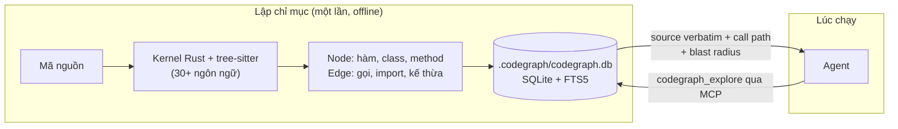
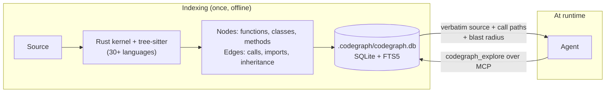

# CodeGraph (Tiếng Việt)

**Là gì:** `colbymchenry/codegraph` — một knowledge graph của codebase được
dựng sẵn, chạy hoàn toàn local, để agent **truy vấn** thay vì **đọc file**.

**Giải quyết:** nguyên nhân 4.2, 6.5, 6.1, 2.1 trong [`../CAUSE.md`](../CAUSE.md)
— xem thêm [`../solutions/code-maps.md`](../solutions/code-maps.md)

**Bằng chứng:** 🟡 Tier B (nhà cung cấp tự chạy nhưng **tái lập được**) —
**−89% lượt gọi tool, −69% token, −60% chi phí** trên 7 repo. Chi tiết và
cảnh báo: [`../PROOF.md`](../PROOF.md)

---

## Ý tưởng

Coding agent tiêu phần lớn token chỉ để **tìm** đúng đoạn code: grep, glob,
đọc 30 file rồi phát hiện 28 file không liên quan. Các phép đo đặt
**67–76% ngân sách token** vào việc đọc file. Mỗi file đã đọc còn nằm lại
trong lịch sử hội thoại đến hết phiên (nguyên nhân 2.1), và mỗi phiên mới
lại làm lại từ đầu (nguyên nhân 6.1).

CodeGraph đảo ngược thứ tự: **phân tích tĩnh làm việc đó một lần, offline**,
lưu kết quả vào một graph local, rồi agent hỏi graph một câu và nhận về đúng
những symbol cần thiết. Đây là "đừng nén công việc — hãy làm cho nó không
xảy ra".

## Cách hoạt động



Bốn điểm quan trọng về cơ chế:

1. **Tree-sitter, không phải embedding.** Đây là phân tích tĩnh cú pháp, nên
   kết quả là *chính xác* chứ không phải *gần giống* — nhưng cũng vì thế nó
   mù với những gì chỉ tồn tại lúc chạy (xem phần đánh đổi).
2. **Toàn bộ index nằm local** trong `.codegraph/codegraph.db`. Không có
   truy cập mạng lúc chạy, source code không rời khỏi máy.
3. **Bề mặt MCP được giữ hẹp có chủ đích.** Server chỉ liệt kê một tool
   chính, `codegraph_explore`, trả về source verbatim + đường gọi (kể cả
   dynamic dispatch) + phạm vi ảnh hưởng trong **một** phản hồi. Các tool
   khác (`codegraph_node`, `codegraph_search`, `codegraph_callers`,
   `codegraph_callees`, `codegraph_impact`, `codegraph_files`,
   `codegraph_status`) vẫn dùng được qua CLI nhưng không liệt kê mặc định
   trong MCP — chính là để không phình schema mỗi request (nguyên nhân 3.4).
4. **Đồng bộ tăng dần** khoảng 0.3–0.4 giây, nên index không bị lệch sau mỗi
   lần sửa file.

Chi phí lập chỉ mục ban đầu là khiêm tốn: trình biên dịch Swift (27k file)
khoảng 100 giây; nhân Linux (70k file, 6.4M quan hệ) dưới 12 phút trên VPS
2 nhân/6GB.

## Cách cài & dùng

Cài (bundle tự chứa, **không cần Node**):

```bash
# macOS / Linux — tải về, ĐỌC, rồi mới chạy
curl -fsSL https://raw.githubusercontent.com/colbymchenry/codegraph/main/install.sh -o install.sh
sh install.sh
```

```powershell
# Windows — tương tự, đừng dùng `irm ... | iex`
irm https://raw.githubusercontent.com/colbymchenry/codegraph/main/install.ps1 -OutFile install.ps1
.\install.ps1
```

Nếu có Node và npm mirror nội bộ: `npm i -g @colbymchenry/codegraph`.

> ⚠️ Dự án quảng cáo `curl ... | sh` và `irm ... | iex`. Đừng đổ code chưa
> đọc thẳng vào shell — tải xuống, đọc, rồi chạy. Mất hai phút.

Nối vào agent và lập chỉ mục:

```bash
codegraph install          # tự phát hiện & cấu hình agent đang có
codegraph init             # khởi tạo cho project hiện tại
codegraph index            # dựng graph lần đầu
codegraph status           # xác nhận index đã sẵn sàng
```

Cấu hình MCP thủ công nếu trình cài không ghi được (`~/.claude.json`):

```json
{
  "mcpServers": {
    "codegraph": {
      "type": "stdio",
      "command": "codegraph",
      "args": ["serve", "--mcp"]
    }
  }
}
```

Truy vấn trực tiếp từ CLI (hữu ích để tự kiểm chứng trước khi tin agent):

```bash
codegraph explore "nơi request được xác thực"
codegraph callers <symbol>      # ai gọi hàm này
codegraph callees <symbol>      # hàm này gọi những gì
codegraph impact <symbol> --depth 3   # phạm vi ảnh hưởng nếu sửa
codegraph affected --stdin      # từ danh sách file thay đổi (hữu ích trong CI)
```

Tinh chỉnh phạm vi bằng `codegraph.json` ở gốc project:

```json
{
  "exclude": ["static/", "**/vendor/**"],
  "include": ["Tools/", "Local/typescript/"],
  "extensions": { ".tpl": "php" }
}
```

Mặc định đã bỏ qua `node_modules`, `dist`, `build`, `vendor`, `.venv`,
`.git`, mọi thứ trong `.gitignore`, và file lớn hơn 1MB.

**Agent được hỗ trợ (qua MCP):** Claude Code, Cursor, Codex CLI, opencode,
Hermes, Gemini CLI, Antigravity, Kiro. **Không hỗ trợ Cline.**

### Nếu harness của bạn không nói MCP

MCP chỉ là đường vận chuyển, không phải giá trị cốt lõi. Graph vẫn dùng được
ở ba dạng khác:

- **CLI + dán tay** — với Aider hoặc bất kỳ quy trình nào bạn tự dựng prompt:
  `codegraph explore "..."` rồi dán kết quả vào prompt. Đây là *chính xác*
  khoản tiết kiệm đã đo, chỉ khác là bạn tự định tuyến thay vì để agent tự
  gọi.
- **Tiền xử lý trong CI** — `codegraph affected --stdin` từ danh sách file
  thay đổi, ghi ra một context pack, đưa vào prompt review. Chi phí phân tích
  trả ở CI chứ không trả bằng token.
- **Tool tự viết trong app của bạn** — bọc `codegraph explore` thành một
  function/tool trong vòng lặp agent của chính bạn. Bề mặt schema do bạn kiểm
  soát, nên phần chi phí 3.4 cũng do bạn quyết định.

Ở cả ba dạng, nguyên tắc không đổi: **đọc từ index đã dựng sẵn thay vì để
model tự dò tìm bằng token.**

## Dùng tốt nhất khi

- **Repo lớn** (trên ~1.000 file là vùng an toàn; dưới ~150 file thì không
  đáng). Đây là biến số quyết định.
- **Câu hỏi mang tính kiến trúc**: "luồng này đi qua đâu", "sửa hàm này thì
  vỡ chỗ nào", "ai gọi cái này" — đúng loại câu hỏi khiến agent mở 40 file.
- **Ngôn ngữ có kiểu tĩnh, cấu trúc tường minh** (TypeScript, Go, Rust,
  Java, C#, Swift, Kotlin…) nơi phân tích tĩnh nhìn thấy gần hết đồ thị.
- **Nhiều phiên trên cùng một repo** — chi phí index trả một lần, lợi ích
  cộng dồn qua mọi phiên sau.
- **Môi trường bị siết**: không cần Node, không có mạng lúc chạy, index nằm
  trong SQLite local — dễ giải trình với đội bảo mật.

## Không dùng / có thể phản tác dụng khi

- **Repo nhỏ.** Dưới ~150 file, vòng lặp grep của một model mạnh xong sớm
  hơn. Và OkHttp (645 file) trong chính benchmark của họ **đắt hơn**
  ($0.23 so với $0.20) dù ít token hơn — điểm hòa vốn không chỉ phụ thuộc
  số file.
- **Agent giao việc khám phá cho sub-agent đọc file.** Sub-agent không đi
  qua MCP thì index bị bỏ qua hoàn toàn. Đây là rủi ro trực tiếp với hồ sơ
  "codebase lớn, nhiều agent".
- **Code nặng reflection / DI container / routing theo quy ước / dynamic
  dispatch.** Phân tích tĩnh không nhìn thấy: độ phủ framework 74–100%
  (Django 74.1%, Spring 83.3%, ASP.NET 83.9%). Cạnh suy diễn được đánh dấu
  `provenance:'heuristic'` — hãy đối xử với chúng như gợi ý, không phải sự
  thật.
- **Cline** — không được hỗ trợ qua MCP (vẫn dùng được đường CLI ở trên).
- **WSL2 hoặc ổ mạng chia sẻ** — SQLite WAL không đáng tin ở đó. Nếu project
  nằm trên ổ Windows gắn qua WSL (`/mnt/c/...`), hãy chuyển nó vào filesystem
  Linux, hoặc đặt `CODEGRAPH_NO_DAEMON=1`.

## Đánh đổi

- **Index có thể cũ.** Đồng bộ tăng dần rất nhanh nhưng vẫn là một trạng
  thái phải bảo trì; graph dựng trước một lần refactor sẽ mô tả sai code.
- **Thêm một MCP server** nghĩa là thêm schema tool vào mọi request (nguyên
  nhân 3.4). CodeGraph đã giảm thiểu bằng cách chỉ liệt kê một tool, nhưng
  chi phí không bằng không.
- **Bạn đánh đổi khả năng đọc lấy độ chính xác.** Khi graph không thấy thứ
  gì đó, agent vẫn phải quay lại `Read`/`Grep` — hãy giữ chúng bật.
- **File >1MB bị bỏ qua** trong im lặng.

## Kiểm chứng trên hệ thống của bạn

Đo **hóa đơn thật**, không phải số tự báo:

1. Lấy baseline bằng [`../solutions/token-counting.md`](../solutions/token-counting.md).
2. Chạy cùng một tác vụ hai lần — một lần có CodeGraph, một lần không — trên
   cùng model, cùng prompt. Cách tắt tùy harness: Claude Code có
   `--strict-mcp-config`; nơi khác thì gỡ server khỏi file cấu hình MCP; với
   đường CLI thì đơn giản là đừng dán kết quả `explore` vào.
3. Điều kiện đạt: **số lần đọc file về gần 0** và tổng token đầu vào giảm.
   Nếu số lần đọc file không giảm, agent đang bỏ qua index (thường do
   sub-agent) — sửa chỗ đó trước khi kết luận công cụ vô dụng.

---

# CodeGraph

**What it is:** `colbymchenry/codegraph` — a pre-built, fully local knowledge
graph of your codebase that the agent **queries** instead of **reading
files**.

**Addresses:** causes 4.2, 6.5, 6.1, 2.1 in [`../CAUSE.md`](../CAUSE.md) —
see also [`../solutions/code-maps.md`](../solutions/code-maps.md)

**Evidence:** 🟡 Tier B (vendor-run but **reproducible**) — **−89% tool
calls, −69% tokens, −60% cost** across 7 repos. Full detail and caveats in
[`../PROOF.md`](../PROOF.md)

---

## The idea

A coding agent spends most of its tokens just **finding** the right code:
grep, glob, read 30 files, discover 28 were irrelevant. Measurements put
**67–76% of the token budget** on file reading. Every file read then sits in
history for the rest of the session (cause 2.1), and every new session
re-derives the same understanding (cause 6.1).

CodeGraph inverts the order: **static analysis does that work once,
offline**, stores it in a local graph, and the agent asks one question to get
exactly the symbols it needs. This is "don't compress the work — prevent it."

## How it works



Four things that matter about the mechanism:

1. **Tree-sitter, not embeddings.** This is syntactic static analysis, so
   results are *exact* rather than *approximate* — but it is blind to
   anything that only exists at runtime (see trade-offs).
2. **The index is entirely local**, in `.codegraph/codegraph.db`. No network
   at runtime; source never leaves the machine.
3. **The MCP surface is deliberately narrow.** The server lists one primary
   tool, `codegraph_explore`, which returns verbatim source + call paths
   (including dynamic dispatch) + blast radius in a **single** response. The
   others (`codegraph_node`, `codegraph_search`, `codegraph_callers`,
   `codegraph_callees`, `codegraph_impact`, `codegraph_files`,
   `codegraph_status`) stay available via CLI but unlisted in MCP by default
   — precisely so tool schemas don't bloat every request (cause 3.4).
4. **Incremental sync runs in ~0.3–0.4 seconds**, so the index doesn't drift
   behind your edits.

Initial indexing overhead is modest: the Swift compiler (27k files) in ~100
seconds; the Linux kernel (70k files, 6.4M relationships) in under 12 minutes
on a 2-core/6GB VPS.

## Install and use

Install (self-contained bundle, **no Node required**):

```bash
# macOS / Linux — download, READ it, then run
curl -fsSL https://raw.githubusercontent.com/colbymchenry/codegraph/main/install.sh -o install.sh
sh install.sh
```

```powershell
# Windows — same, don't use `irm ... | iex`
irm https://raw.githubusercontent.com/colbymchenry/codegraph/main/install.ps1 -OutFile install.ps1
.\install.ps1
```

With Node and an internal npm mirror: `npm i -g @colbymchenry/codegraph`.

> ⚠️ The project advertises `curl ... | sh` and `irm ... | iex`. Don't pipe
> unread code into a shell — download, read, then run. It costs two minutes.

Wire it into your agent and build the index:

```bash
codegraph install          # auto-detect and configure installed agents
codegraph init             # initialize for the current project
codegraph index            # build the graph
codegraph status           # confirm the index is live
```

Manual MCP config if the installer can't write it (`~/.claude.json`):

```json
{
  "mcpServers": {
    "codegraph": {
      "type": "stdio",
      "command": "codegraph",
      "args": ["serve", "--mcp"]
    }
  }
}
```

Query it directly from the CLI — useful for sanity-checking before you trust
the agent's answers:

```bash
codegraph explore "where requests get authenticated"
codegraph callers <symbol>            # who calls this
codegraph callees <symbol>            # what this calls
codegraph impact <symbol> --depth 3   # blast radius of a change
codegraph affected --stdin            # from a changed-file list (CI-friendly)
```

Scope it with `codegraph.json` at the project root:

```json
{
  "exclude": ["static/", "**/vendor/**"],
  "include": ["Tools/", "Local/typescript/"],
  "extensions": { ".tpl": "php" }
}
```

`node_modules`, `dist`, `build`, `vendor`, `.venv`, `.git`, anything in
`.gitignore`, and files over 1MB are excluded by default.

**Supported agents (over MCP):** Claude Code, Cursor, Codex CLI, opencode,
Hermes, Gemini CLI, Antigravity, Kiro. **No Cline support.**

### If your harness doesn't speak MCP

MCP is only the transport, not the value. The graph is still usable three
other ways:

- **CLI + paste** — for Aider, or any workflow where you assemble the prompt:
  run `codegraph explore "..."` and paste the result in. This is *exactly* the
  measured saving; you're just doing the routing the agent would have done.
- **Precompute in CI** — `codegraph affected --stdin` from a changed-file
  list, written out as a context pack fed into a review prompt. The analysis
  cost is paid in CI instead of in tokens.
- **A tool in your own app** — wrap `codegraph explore` as a function/tool in
  your own agent loop. You control the schema surface, so you also control the
  cause-3.4 overhead.

In all three the principle is unchanged: **read from a prebuilt index instead
of letting the model hunt for code with tokens.**

## Best use cases

- **Large repos** — above ~1,000 files is the safe zone; under ~150 it isn't
  worth it. This is the deciding variable.
- **Architectural questions**: "what path does this flow take", "what breaks
  if I change this", "who calls this" — exactly the questions that otherwise
  make an agent open 40 files.
- **Statically-typed, explicitly-structured languages** (TypeScript, Go,
  Rust, Java, C#, Swift, Kotlin…) where static analysis sees most of the
  graph.
- **Many sessions against the same repo** — the indexing cost is paid once
  and the benefit compounds across every later session.
- **Locked-down environments**: no Node, no runtime network, index in local
  SQLite — an easy story to tell your security team.

## When it's useless or actively costs more

- **Small repos.** Under ~150 files a strong model's grep loop finishes
  sooner. And OkHttp (645 files) in their own benchmark **cost more**
  ($0.23 vs $0.20) despite using fewer tokens — the break-even point isn't
  purely file count.
- **When the agent delegates exploration to file-reading sub-agents.** Those
  sub-agents don't go through MCP, so the index is bypassed entirely. This is
  a direct risk for the "large codebase, many agents" profile.
- **Reflection-heavy code, DI containers, convention-based routing, dynamic
  dispatch.** Static analysis can't see them: framework coverage runs 74–100%
  (Django 74.1%, Spring 83.3%, ASP.NET 83.9%). Inferred edges are marked
  `provenance:'heuristic'` — treat them as hints, not facts.
- **Cline** — unsupported over MCP (the CLI paths above still work).
- **WSL2 or network shares** — SQLite WAL is unreliable there. If the project
  lives on a WSL-mounted Windows drive (`/mnt/c/...`), move it onto the Linux
  filesystem or set `CODEGRAPH_NO_DAEMON=1`.

## Trade-offs

- **The index can go stale.** Incremental sync is fast, but it's still state
  you maintain; a graph built before a refactor misdescribes the code.
- **Another MCP server means more tool schema on every request** (cause 3.4).
  CodeGraph mitigates this by listing one tool, but the cost isn't zero.
- **You trade readability for precision.** When the graph can't see
  something, the agent still needs `Read`/`Grep` — leave them enabled.
- **Files over 1MB are silently skipped.**

## Verify it on your own system

Measure the **real bill**, not a self-reported number:

1. Baseline with [`../solutions/token-counting.md`](../solutions/token-counting.md).
2. Run the same task twice — once with CodeGraph, once without — same model,
   same prompt. How you disable it depends on the harness: Claude Code has
   `--strict-mcp-config`; elsewhere, drop the server from your MCP config; on
   the CLI path, just don't paste the `explore` output.
3. Pass condition: **file reads drop to near zero** and total input tokens
   fall. If file reads don't drop, the agent is bypassing the index (usually
   via sub-agents) — fix that before concluding the tool is useless.
