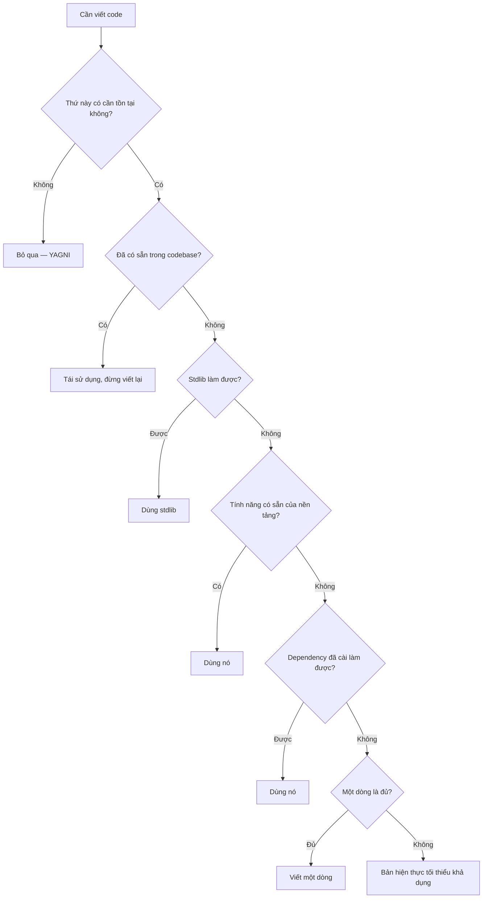
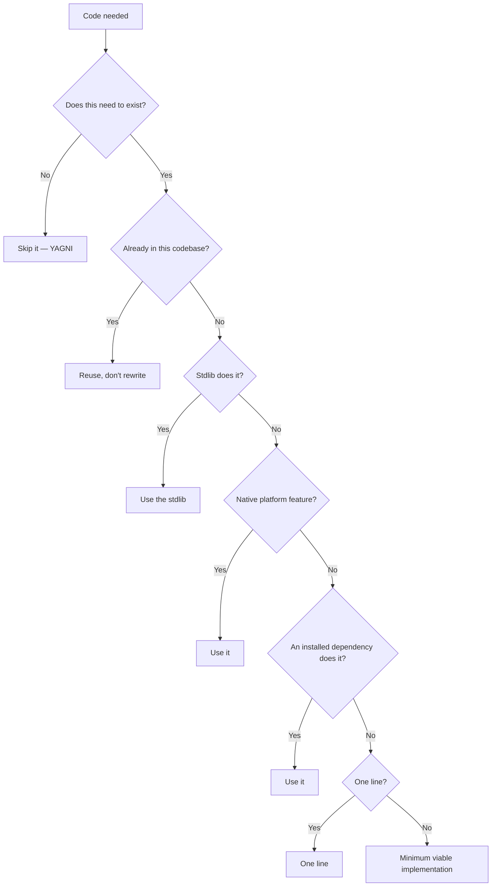

# Ponytail (Tiếng Việt)

**Là gì:** `DietrichGebert/ponytail` (MIT) — một **ruleset**, không phải
phần mềm nén, hướng agent tới lượng code tối thiểu cần thiết. Triết lý:
*"code tốt nhất là code bạn không bao giờ viết."*

**Giải quyết:** nguyên nhân 5.2 và 5.1 trong [`../CAUSE.md`](../CAUSE.md) —
liên quan
[`../solutions/concise-output-prompting.md`](../solutions/concise-output-prompting.md)

**Bằng chứng:** 🟢 Tier A — **−10.3% chi phí, p=0.004** trên 80 tác vụ ghép
cặp. Đây là **skill lan truyền duy nhất sống sót qua một thử nghiệm có đối
chứng**. Xem [`../PROOF.md`](../PROOF.md)

---

## Ý tưởng

Mọi công cụ khác trong kho này **nén công việc sau khi nó đã xảy ra**.
Ponytail ngăn công việc xảy ra ngay từ đầu.

Agent có xu hướng xây thừa: dựng scaffolding UI không ai yêu cầu, viết lớp
trừu tượng "cho sau này", tự cài lại thứ stdlib đã có. Mỗi dòng thừa đó là
output token lúc viết, input token ở mọi lượt sau đó, và thêm token nữa khi
sửa nó về sau. Ponytail can thiệp vào **quyết định xây cái gì**, trước khi có
dòng code nào tồn tại.

Đây chính là lý do nó thắng trong khi RTK và Caveman thất bại: khoản tiết
kiệm là **output thật không được sinh ra**, không phải một phản chứng được
đặt tên lại. Không có baseline ảo nào để thổi phồng.

## Cách hoạt động

Ruleset là một cái thang. Trước khi viết code, agent dừng ở nấc đầu tiên áp
dụng được:



Một chi tiết dễ bỏ sót nhưng quan trọng: ruleset yêu cầu agent **đọc luồng
code trước khi quyết định** — "lười ở giải pháp, không bao giờ lười ở việc
đọc". Nếu thiếu vế sau, "lười" sẽ thoái hóa thành đoán bừa.

**Bốn mức cường độ:**

| Mức | Ý nghĩa |
| --- | --- |
| `lite` | Hướng dẫn tối thiểu |
| `full` | Tiêu chuẩn (mặc định) |
| `ultra` | Tối giản quyết liệt |
| `off` | Tắt |

## Cách cài & dùng

### Claude Code (cấu hình đã được đo)

```
/plugin marketplace add DietrichGebert/ponytail
/plugin install ponytail@ponytail
```

Gửi thành **hai prompt riêng biệt**. Hook vòng đời của Claude Code và Codex
chạy bằng Node, nên `node` phải có trong `PATH` để chế độ luôn-bật hoạt động.

### Các agent khác

| Agent | Cách cài |
| --- | --- |
| Cline | Chép `.clinerules` vào project |
| Cursor / Windsurf | Chép `.cursor/rules/` hoặc `.windsurf/rules/` |
| Copilot | `.github/copilot-instructions.md`, hoặc `~/.copilot/copilot-instructions.md` cho toàn cục |
| Codex | `codex plugin marketplace add DietrichGebert/ponytail` rồi `codex plugin add ponytail@ponytail` |
| Gemini CLI | `gemini extensions install https://github.com/DietrichGebert/ponytail` |
| Antigravity | `agy plugin install https://github.com/DietrichGebert/ponytail` |
| Kiro / Qoder | `.kiro/steering/ponytail.md`, `.qoder/rules/ponytail.md` |

Trong workspace bị chặn plugin, chép file thẳng vào rules file vẫn chạy —
xem [`../setups/install-without-package-managers.md`](../setups/install-without-package-managers.md).
Với Claude Code và Codex, đường đi "chép vào `CLAUDE.md` / `AGENTS.md`" là
**suy diễn của kho này**, hoạt động vì harness tự nạp các file đó, nhưng dự
án không ghi nhận nó.

### Kích hoạt — biến số quyết định trên mọi harness

Ruleset chỉ có giá trị bằng đúng số lần nó thực sự vào context. Đây là chỗ
các harness khác nhau nhất, và là chỗ con số −10.3% sống hoặc chết:

| Cách nạp | Harness | Đảm bảo kích hoạt? |
| --- | --- | --- |
| Hook / plugin vòng đời | Claude Code, Codex, Gemini CLI, Antigravity | ✅ Tiêm tất định — đây là cấu hình đã được đo |
| Rules file thụ động | Cursor, Windsurf, Cline, Roo, Copilot, Kiro | ⚠️ Model tự quyết định có đọc hay không; chế độ này đã kích hoạt **0/10 phiên** |
| Bạn tự ghép vào system prompt | App tự dựng trên API | ✅ Luôn có mặt — nhưng bạn trả token cho nó ở **mọi** request (nguyên nhân 6.4) |

Hàng cuối là đánh đổi rõ ràng nhất: đảm bảo tuyệt đối, đổi lấy chi phí cố
định. Với ruleset cỡ vài trăm token và mức tiết kiệm −10.3% trên tác vụ xây
tính năng, phép tính đó thường có lời — nhưng hãy tự tính, đừng tin mặc định.

### Lệnh (trên host hỗ trợ skill)

| Lệnh | Công dụng |
| --- | --- |
| `/ponytail [lite\|full\|ultra\|off]` | Đổi cường độ, hoặc xem mức hiện tại |
| `/ponytail-review` | Soát diff hiện tại tìm chỗ xây thừa |
| `/ponytail-audit` | Soát toàn repo |
| `/ponytail-debt` | Gom các chỗ đánh dấu `ponytail:` hoãn lại thành sổ nợ |
| `/ponytail-gain` | Xem số liệu benchmark |
| `/ponytail-help` | Tra cứu nhanh |

Cursor, Windsurf, Cline, Copilot, Kiro là **adapter chỉ-instruction**: nạp
ruleset nhưng không có lệnh.

### Cấu hình

- Biến môi trường `PONYTAIL_DEFAULT_MODE` = `lite` | `full` | `ultra` | `off`
- Biến môi trường `PONYTAIL_SUBAGENT_MATCHER` — regex giới hạn ruleset vào
  một số loại sub-agent (không neo, không phân biệt hoa thường). Hữu ích khi
  bạn chỉ muốn nó áp cho sub-agent viết code chứ không phải sub-agent nghiên
  cứu.
- File cấu hình `~/.config/ponytail/config.json` với trường `defaultMode`.
  README dự án ghi đường dẫn Windows là `%APPDATA%\ponytail\config.json`;
  các trang khác trong kho này ghi `%USERPROFILE%\.config\ponytail\config.json`
  — hãy kiểm tra trên máy bạn trước khi tin trang nào.

## Ba cảnh báo trước khi dùng

1. **Cài thụ động là không làm gì cả.** Cài mà không tiêm qua hook, ruleset
   **kích hoạt 0 lần trong 10 phiên**. Ở đâu có cơ chế hook thì hãy dùng nó
   (Claude Code: hook SessionStart); ở đâu không có, hãy tự xác nhận nó thực
   sự kích hoạt. Đây không phải chi tiết nhỏ — nó là ranh giới giữa −10.3%
   và 0%.
2. **Vì thế Cline là vấn đề.** Ponytail liệt kê Cline ở nhóm *adapter chỉ
   instruction* — đúng chế độ thụ động vừa kích hoạt 0% ở trên. Chưa được đo
   và đáng ngờ về mặt cấu trúc.
3. **Chất lượng là kết quả rỗng, không phải giấy chứng nhận an toàn** — 9 tác
   vụ tệ hơn, 6 tốt hơn, 65 y hệt. Khoản tiết kiệm tập trung hoàn toàn ở tình
   huống xây thừa: −31% ở các bản build lớn, **bằng 0 khi code vốn đã tối
   giản**.

## Vì sao benchmark của chính họ đáng tin

Hiếm gặp, nên nói rõ: dự án **tự rút lại** tuyên bố cũ "giảm 80–94% code" vì
baseline đó có lẫn phần văn xuôi độn. Họ thay bằng benchmark agentic 12 tác
vụ trên repo FastAPI + React, Haiku 4.5, 4 lần chạy mỗi nhánh, đo bằng
`git diff`: LOC −54%, token −22%, chi phí −20%, thời gian −27%, an toàn 100%.

A/B độc lập sau đó đo được **−10.3%** thay vì −20% — thấp hơn, nhưng cùng dấu
và có ý nghĩa thống kê. Đó là điều duy nhất trong
[`../PROOF.md`](../PROOF.md) làm được.

## Dùng tốt nhất khi

- **Agent có xu hướng xây thừa**: scaffolding UI, lớp trừu tượng suy đoán,
  viết lại thứ stdlib đã có. Đây là hồ sơ mà −31% xuất hiện.
- **Tác vụ tính năng end-to-end**, nơi agent có tự do quyết định kiến trúc.
- **Harness có tiêm qua hook** (Claude Code, Codex). Không có hook thì không
  có bảo đảm kích hoạt.
- **Codebase mà chi phí bảo trì quan trọng hơn tốc độ giao hàng.** Khoản tiết
  kiệm token chỉ là một phần lợi ích — ít code hơn cũng là ít thứ phải đọc,
  test và sửa sau này.
- **Đây là công cụ đầu tiên nên thử**, trước mọi thứ khác trong kho này: nó
  có bằng chứng tốt nhất và cài đặt nhẹ nhất.

## Không dùng / vô ích khi

- **Code vốn đã tối giản** — mức tiết kiệm về 0. Không có hại, chỉ là không
  có lợi.
- **Sửa lỗi, refactor có phạm vi hẹp, tác vụ chỉ đọc.** Không có gì để ngăn
  xây thừa cả.
- **Harness không có cơ chế tiêm hook**, trừ khi bạn chấp nhận chép file và
  hiểu rằng con số −10.3% không áp dụng cho cấu hình đó.
- **Khi bạn thực sự muốn scaffolding.** `ultra` sẽ chống lại bạn; hãy dùng
  `/ponytail off` cho phiên đó thay vì chiến đấu với nó.

## Đánh đổi

- **Ruleset nằm trong context mọi lượt** (nguyên nhân 6.4). Với cách cài
  chép-file, đó là chi phí cố định mỗi request; khoản tiết kiệm phải lớn hơn
  nó. Với cách cài plugin + hook, nó chỉ được tiêm khi cần.
- **"Lười" có thể lệch thành thiếu.** Kết quả chất lượng là hòa, không phải
  thắng — 9 tác vụ *tệ hơn*. Nếu review của bạn lỏng, `ultra` không phải lựa
  chọn tốt; hãy bắt đầu ở `full`.
- **Nó thay đổi hành vi agent, không phải bytes.** Không có gì đảm bảo tất
  định — cùng một prompt vẫn có thể ra kết quả khác nhau.

## Kiểm chứng trên hệ thống của bạn

1. **Trước hết xác nhận nó có kích hoạt.** Đây là chế độ hỏng số một. Giao
   một tác vụ mời gọi xây thừa (ví dụ: "thêm bộ chọn ngày") và xem agent có
   giao bản tối thiểu thay vì scaffolding không.
2. Chạy ghép cặp trên tác vụ tính năng thật, đo chi phí **và** LOC bằng
   `git diff`.
3. Đừng trông đợi tiết kiệm ở tác vụ vốn đã tối giản — đưa chúng vào baseline
   thì bạn đang pha loãng chính phép đo của mình.

---

# Ponytail

**What it is:** `DietrichGebert/ponytail` (MIT) — a **ruleset**, not a
compressor, steering the agent toward the minimum necessary code. Philosophy:
*"the best code is the code you never wrote."*

**Addresses:** causes 5.2 and 5.1 in [`../CAUSE.md`](../CAUSE.md) — related:
[`../solutions/concise-output-prompting.md`](../solutions/concise-output-prompting.md)

**Evidence:** 🟢 Tier A — **−10.3% cost, p=0.004** across 80 paired tasks.
This is **the only viral skill that survived a controlled test**. See
[`../PROOF.md`](../PROOF.md)

---

## The idea

Every other tool in this repo **compresses work after it happens.** Ponytail
prevents the work from happening at all.

Agents over-build: UI scaffolding nobody asked for, abstraction layers "for
later", re-implementations of what the stdlib already has. Every surplus line
is output tokens when written, input tokens on every subsequent turn, and
more tokens again when it's edited later. Ponytail intervenes in **what the
agent decides to build**, before a line of code exists.

That's exactly why it wins where RTK and Caveman failed: the saving is **real
output never produced**, not a re-labelled counterfactual. There's no phantom
baseline to inflate.

## How it works

The ruleset is a ladder. Before writing code, the agent stops at the first
applicable rung:



An easily-missed but important detail: the ruleset requires the agent to
**read the code flow before deciding** — "lazy about the solution, never
about reading." Without that second half, "lazy" degrades into guessing.

**Four intensity modes:**

| Mode | Meaning |
| --- | --- |
| `lite` | Minimal guidance |
| `full` | Standard (default) |
| `ultra` | Aggressive minimalism |
| `off` | Disabled |

## Install and use

### Claude Code (the configuration that was measured)

```
/plugin marketplace add DietrichGebert/ponytail
/plugin install ponytail@ponytail
```

Send these as **two separate prompts**. Claude Code and Codex lifecycle hooks
run on Node, so `node` must be on your `PATH` for always-on activation.

### Other agents

| Agent | Install |
| --- | --- |
| Cline | Copy `.clinerules` into the project |
| Cursor / Windsurf | Copy `.cursor/rules/` or `.windsurf/rules/` |
| Copilot | `.github/copilot-instructions.md`, or `~/.copilot/copilot-instructions.md` globally |
| Codex | `codex plugin marketplace add DietrichGebert/ponytail` then `codex plugin add ponytail@ponytail` |
| Gemini CLI | `gemini extensions install https://github.com/DietrichGebert/ponytail` |
| Antigravity | `agy plugin install https://github.com/DietrichGebert/ponytail` |
| Kiro / Qoder | `.kiro/steering/ponytail.md`, `.qoder/rules/ponytail.md` |

In a workspace that blocks plugins, plain file-copy into a rules file still
works — see
[`../setups/install-without-package-managers.md`](../setups/install-without-package-managers.md).
For Claude Code and Codex the "copy into `CLAUDE.md` / `AGENTS.md`" path is
**this repo's inference** — it works because the harness auto-loads those
files, but the project doesn't document it.

### Activation — the deciding variable on any harness

The ruleset is worth exactly as often as it actually reaches context. This is
where harnesses differ most, and where the −10.3% lives or dies:

| How it loads | Harness | Activation guaranteed? |
| --- | --- | --- |
| Lifecycle hook / plugin | Claude Code, Codex, Gemini CLI, Antigravity | ✅ Deterministic injection — this is the configuration that was measured |
| Passive rules file | Cursor, Windsurf, Cline, Roo, Copilot, Kiro | ⚠️ The model decides whether to read it; this mode fired **0 times in 10 sessions** |
| You concatenate it into the system prompt | Your own app on the API | ✅ Always present — but you pay tokens for it on **every** request (cause 6.4) |

That last row is the cleanest trade: total certainty for a fixed cost. For a
few-hundred-token ruleset against a −10.3% saving on feature work the math
usually clears — but do the arithmetic yourself rather than assuming it.

### Commands (on skill-capable hosts)

| Command | Purpose |
| --- | --- |
| `/ponytail [lite\|full\|ultra\|off]` | Switch intensity, or report the current level |
| `/ponytail-review` | Audit the current diff for over-engineering |
| `/ponytail-audit` | Audit the whole repo |
| `/ponytail-debt` | Harvest deferred `ponytail:` shortcuts into a ledger |
| `/ponytail-gain` | Show benchmark impact metrics |
| `/ponytail-help` | Quick reference |

Cursor, Windsurf, Cline, Copilot and Kiro are **instruction-only adapters**:
they load the ruleset but get no commands.

### Configuration

- Env `PONYTAIL_DEFAULT_MODE` = `lite` | `full` | `ultra` | `off`
- Env `PONYTAIL_SUBAGENT_MATCHER` — a regex scoping the ruleset to particular
  sub-agent types (unanchored, case-insensitive). Useful when you want it on
  your code-writing sub-agents but not your research ones.
- Config file `~/.config/ponytail/config.json` with a `defaultMode` field.
  The project README gives the Windows path as
  `%APPDATA%\ponytail\config.json`; other pages in this repo give
  `%USERPROFILE%\.config\ponytail\config.json` — check on your machine before
  trusting either.

## Three warnings before adopting

1. **A passive install does nothing.** Installed without hook injection, the
   ruleset activated **zero times across ten sessions**. Wherever a hook
   mechanism exists, use it (Claude Code: a SessionStart hook); where none
   exists, verify activation yourself. This isn't a footnote — it's the
   difference between −10.3% and 0%.
2. **Which makes Cline a problem.** Ponytail lists Cline only as an
   *instruction-only adapter* — precisely the passive mode that fired 0%
   above. Unmeasured, and structurally suspect.
3. **Quality is a null result, not a clean bill of health** — 9 tasks worse,
   6 better, 65 identical. Savings concentrate entirely in over-build
   scenarios: −31% on large builds, **zero where the code is already
   minimal**.

## Why their own benchmark is credible

Rare enough to be worth stating: the project **explicitly retired** its older
"80–94% less code" claim because that baseline included prose padding. It was
replaced with an agentic benchmark — 12 feature tasks on a FastAPI + React
repo, Haiku 4.5, 4 runs per side, measured via `git diff`: LOC −54%, tokens
−22%, cost −20%, time −27%, safety 100%.

The independent A/B then measured **−10.3%** rather than −20% — lower, but
the same sign and statistically significant. Nothing else in
[`../PROOF.md`](../PROOF.md) manages that.

## Best use cases

- **Agents that tend to over-build**: UI scaffolding, speculative abstraction
  layers, re-implementing what the stdlib already has. This is the profile
  where the −31% shows up.
- **End-to-end feature tasks** where the agent has architectural latitude.
- **Harnesses with hook injection** (Claude Code, Codex). No hook means no
  activation guarantee.
- **Codebases where maintenance cost matters more than delivery speed.** The
  token saving is only part of the benefit — less code is also less to read,
  test and fix later.
- **This is the first tool to try**, ahead of everything else in this repo:
  best evidence, lightest install.

## When it's useless

- **Code that's already minimal** — savings go to zero. No harm, just no
  gain.
- **Bug fixes, narrowly-scoped refactors, read-only tasks.** There's no
  over-build to prevent.
- **Harnesses with no hook injection**, unless you accept the file-copy path
  and understand that the −10.3% figure doesn't apply to that configuration.
- **When you actually want scaffolding.** `ultra` will fight you; use
  `/ponytail off` for that session instead of arguing with it.

## Trade-offs

- **The ruleset sits in context every turn** (cause 6.4). With a file-copy
  install that's a fixed per-request cost the saving has to beat. With the
  plugin + hook install it's injected only when needed.
- **"Lazy" can drift into "insufficient."** The quality result is a tie, not
  a win — 9 tasks came out *worse*. If your review is loose, `ultra` is the
  wrong setting; start at `full`.
- **It changes agent behavior, not bytes.** Nothing about it is deterministic
  — the same prompt can still land differently.

## Verify it on your own system

1. **First confirm it activates at all.** This is failure mode number one.
   Give the agent a task that invites over-building (say, "add a date
   picker") and check that it ships the minimal version rather than
   scaffolding.
2. Run paired trials on real feature tasks, measuring cost **and** LOC via
   `git diff`.
3. Don't expect savings on already-minimal tasks — including them in your
   baseline just dilutes your own measurement.
