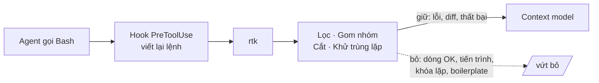
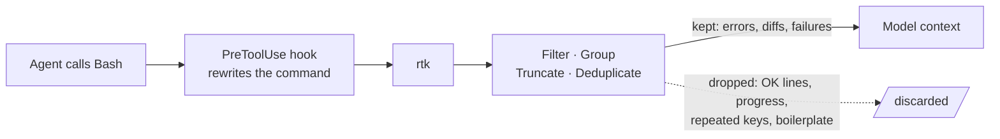

# RTK — Rust Token Killer (Tiếng Việt)

**Là gì:** `rtk-ai/rtk` (Apache-2.0) — một binary Rust duy nhất, không phụ
thuộc gì, đứng trước các lệnh shell và **nén output** trước khi nó vào
context của model.

**Giải quyết:** nguyên nhân 3.1 và 2.1 trong [`../CAUSE.md`](../CAUSE.md) —
xem [`../solutions/tool-output-compression.md`](../solutions/tool-output-compression.md)

**Bằng chứng:** 🟢 Tier A — và kết quả là **âm**. A/B ghép cặp độc lập trên
Claude Code đo được **+7.6% chi phí** (p=0.004). Đọc
[`../PROOF.md`](../PROOF.md) **trước** khi cài.

> ⚠️ **Kho này khuyên không dùng RTK *trên Claude Code*.** Đó là một kết luận
> gắn với một harness cụ thể, không phải phán quyết về công cụ. Cơ chế thì
> đúng; nó thất bại vì ba điều kiện của harness được liệt kê bên dưới. Hãy
> đối chiếu ba điều kiện đó với harness của bạn trước khi kết luận — trên
> pipeline shell-first hoặc app tự dựng, dấu của kết quả có thể ngược lại.

---

## Ý tưởng

Một lệnh `cargo test` in ra 4.000 dòng, trong đó 3.990 dòng là "ok". Một
`kubectl get pods -o json` in ra hàng chục nghìn ký tự khóa lặp lại. Tất cả
đi thẳng vào context, bị tính tiền một lần khi vào, rồi **bị tính lại ở mọi
lượt sau đó** (nguyên nhân 2.1).

RTK đặt một tầng nén tất định giữa lệnh và context: giữ lại tín hiệu (lỗi,
diff, test thất bại), vứt bỏ phần còn lại.

## Cách hoạt động



Bốn chiến lược: **lọc** nhiễu, **gom nhóm** các mục giống nhau, **cắt** có
giữ ngữ cảnh, **khử trùng lặp** dòng lặp lại kèm số đếm. Tất cả đều tất
định — không có model nào chạy ở tầng này, nên không tốn token và không có
độ trễ đáng kể.

Nó phủ hơn 100 lệnh dev: `ls`/`tree`/`find`/`grep`/`diff`, `git`, `gh`,
test runner (`pytest`, `go test`, `cargo test`, `jest`, `vitest`, `rspec`),
build/lint (`tsc`, `eslint`, `ruff`, `clippy`, `golangci-lint`), package
manager, `docker`/`kubectl`, AWS CLI, `pulumi`, và JSON/log thô.

## Vì sao nó vẫn làm hóa đơn tăng — cơ chế thất bại

Đây là phần đáng đọc nhất. Ba lỗ hổng, tất cả đều là bài học chung chứ không
riêng gì RTK:

1. **Bẫy phản chứng.** `rtk gain` tự báo đã tiết kiệm 96.2 triệu token —
   99.8% mọi thứ nó chạm vào — trong khi hóa đơn đo được lại *tăng*. Nó tính
   output thô đầy đủ là mốc so sánh, nhưng Claude Code **vốn đã cắt bớt**
   trước ngưỡng đó. Nó nén một thứ đằng nào cũng bị vứt đi.
2. **Ước lượng token bằng `bytes/4`** tại thời điểm chạy, bỏ qua việc phần
   đọc lại từ cache chỉ bị tính khoảng 1/10 giá.
3. **Hook không nhìn thấy phần lớn context.** `Read`/`Grep`/`Glob` của Claude
   Code là tool có sẵn, không đi qua shell. Chỉ 33% lệnh Bash mang chưa tới
   20% ký tự kết quả tool — nên **trần lý thuyết chỉ khoảng 3% token đầu
   vào**. Khoảng 60–90% chưa bao giờ với tới được trên harness này.

Và phần tệ hơn "không tiết kiệm": ở nỗ lực suy luận thấp, chi phí **+7.6%**,
số lượt **+13.8%**, cache read **+14.3%**. Output bị nén khiến model kém chắc
chắn và phải làm nhiều việc hơn. Ở nỗ lực cao thì kết quả về 0 (+0.1%,
p=0.99) — nghĩa là tổn hại tập trung ở đúng chỗ người ta hay chạy nhất.

### Ba điều kiện đó là *thuộc tính harness*, không phải lỗi của RTK

Đây là chỗ dễ đọc nhầm thành "RTK là công cụ tồi". Viết lại thành câu hỏi cho
harness của bạn:

| Điều kiện | Nếu harness của bạn… | Thì… |
| --- | --- | --- |
| Cắt output sẵn | **có** cắt | RTK nén thứ sắp bị vứt → gần như không có lợi |
| | **không** cắt | mức nén 80–90% chạm thẳng vào context → có dư địa thật |
| Tool đọc/tìm file riêng | **có** (Cline, Cursor, Roo, Claude Code) | phần lớn lưu lượng đi vòng qua hook → trần sụp |
| | **không** (pipeline shell-first, agent tự viết) | hook thấy gần như toàn bộ → trần cao |
| Prompt caching | **bật** | byte gửi lại chỉ tính ~1/10 giá → đếm byte nói dối |
| | **tắt / bạn tự quản** | byte tiết kiệm ≈ tiền tiết kiệm |

Ba câu trả lời của Claude Code là *có / có / bật* — trường hợp xấu nhất có
thể. Một script CI đổ log build vào một request API là *không / không / tắt*
— trường hợp tốt nhất có thể. Cùng một binary, hai kết quả trái dấu.

Xem [`README.md`](README.md) để biết cách tự đo ba giá trị này.

**Công bằng với dự án:** README của RTK trung thực. Nó nói rõ output bash chỉ
là *một* phần của token đầu vào, rằng token được ước lượng bằng `bytes/4` nên
"phần trăm thì đáng tin nhưng con số tuyệt đối là xấp xỉ", và rằng
`Read`/`Grep`/`Glob` không đi qua hook Bash. **60–90% là tỉ lệ nén văn bản,
không phải mức giảm hóa đơn.** Chính marketing và các blog phát tán lại đã
đánh đồng hai đại lượng đó.

## Cách cài & dùng

```bash
brew install rtk                    # cách khuyến nghị
cargo install --git https://github.com/rtk-ai/rtk
# hoặc tải release, đối chiếu SHA256 công bố, đặt vào ~/.local/bin
rtk --version
```

Nối vào agent (cài hook tự viết lại lệnh):

```bash
rtk init -g                 # Claude Code (hook PreToolUse)
rtk init -g --codex         # Codex
rtk init -g --gemini        # Gemini CLI
rtk init -g --copilot       # GitHub Copilot
rtk init --agent cline      # Cline / Roo Code (tầng rules-file)
rtk init -g --uninstall     # gỡ hook
```

Dùng trực tiếp, không cần agent — đây mới là chỗ nó hữu ích rõ ràng:

```bash
rtk cargo test              # chỉ in phần thất bại
rtk pytest
rtk git diff
rtk grep <pattern>
rtk gain                    # bảng tự báo — xem cảnh báo bên dưới
```

Cấu hình: `~/.config/rtk/config.toml` (macOS:
`~/Library/Application Support/rtk/config.toml`):

```toml
[hooks]
exclude_commands = ["curl", "playwright"]

[tee]
enabled = true
mode = "failures"
```

`exclude_commands` là nút quan trọng nhất: hai lỗi thật được ghi nhận trong
benchmark là vị từ `find` phức hợp gây lỗi cú pháp rồi phải thử lại, và
binary không khởi động được trên một image do yêu cầu glibc. Loại trừ sớm
những lệnh bạn không muốn nó chạm vào.

> ⚠️ **Đừng tin `rtk gain`.** Đó chính là chỉ số đã tạo ra tuyên bố sai. Nó
> đo tỉ lệ nén văn bản, thứ vừa có thật vừa không liên quan đến hóa đơn.

## Dùng tốt nhất khi

- **Harness của bạn *không* tự cắt bớt output tool.** Đây là điều kiện then
  chốt. Trên một harness đổ nguyên output vào context, mức nén 89% kia có
  chỗ để phát huy.
- **Lệnh dài dòng thật sự đi qua Bash** — pipeline shell-first, agent tự
  viết, hoặc script CI, chứ không phải agent có sẵn tool đọc/tìm file riêng.
- **Dùng như CLI thuần cho con người.** `rtk cargo test` in ra đúng phần
  hỏng là tiện lợi có thật, độc lập với chuyện token.
- **Đưa log vào prompt do bạn tự dựng.** Nếu bạn *tự tay* dán output build
  vào một request API, RTK cắt nó xuống 80–90% trước khi dán — ở đây không
  có harness nào cắt trước, nên khoản tiết kiệm là thật.

Tỉ lệ nén trên chính văn bản là có thật: `pytest`/`cargo test`/`go test`
−90%, `cargo build`/`clippy` −80%, `ruff` −80%.

## Không dùng khi

- **Claude Code** — đã đo, làm hóa đơn tăng. Đừng cài.
- **Bất kỳ agent nào có tool đọc/tìm file riêng** (Cline, Roo, Codex, Cursor
  đều có). Phần lớn lưu lượng sẽ đi vòng qua hook, và trần tiết kiệm sụp
  xuống như trên.
- **Khi bạn không định đo.** Nếu không có A/B ghép cặp trên hóa đơn thật,
  bạn sẽ nhận về một bảng số đẹp và một hóa đơn cao hơn.
- **Trong môi trường bị siết mà việc tải binary cần xin phép.** Bằng chứng
  không đủ để đánh đổi lấy phiền phức đó — bỏ qua.

**Chưa ai đo RTK trên Cline, Codex hay Gemini.** "Có thể nó tốt hơn ở đó" là
một giả thuyết, không phải bằng chứng.

## Kiểm chứng trên hệ thống của bạn

1. Chỉ so **token đầu vào bị tính tiền** giữa hai nhánh ghép cặp, cùng tác
   vụ, cùng model, chạy nhiều lần.
2. **Đừng** so `wc -c` giữa output thô và output đã bọc. Đó chính là phép đo
   đã sinh ra tuyên bố 60–90%.
3. Theo dõi thêm **số lượt** và **cache read** — chỗ RTK gây tổn hại nằm ở
   đó, không phải ở số byte.

---

# RTK — Rust Token Killer

**What it is:** `rtk-ai/rtk` (Apache-2.0) — a single dependency-free Rust
binary that sits in front of shell commands and **compresses their output**
before it enters model context.

**Addresses:** causes 3.1 and 2.1 in [`../CAUSE.md`](../CAUSE.md) — see
[`../solutions/tool-output-compression.md`](../solutions/tool-output-compression.md)

**Evidence:** 🟢 Tier A — and the result is **negative**. An independent
paired A/B on Claude Code measured **+7.6% cost** (p=0.004). Read
[`../PROOF.md`](../PROOF.md) **before** installing.

> ⚠️ **This repo recommends against RTK *on Claude Code*.** That's a
> harness-specific conclusion, not a verdict on the tool. The mechanism is
> sound; it failed because of the three harness conditions listed below.
> Check those against your own harness before concluding anything — on a
> shell-first pipeline or an app you built yourself, the sign can flip.

---

## The idea

One `cargo test` prints 4,000 lines, 3,990 of which say "ok". One
`kubectl get pods -o json` prints tens of thousands of characters of repeated
keys. All of it enters context, gets billed once on the way in, and then
**gets billed again on every subsequent turn** (cause 2.1).

RTK puts a deterministic compression stage between the command and the
context: keep the signal (errors, diffs, test failures), drop the rest.

## How it works



Four strategies: **filter** noise, **group** similar items, **truncate**
while preserving context, **deduplicate** repeated lines with counts. All
deterministic — no model runs at this layer, so it costs no tokens and adds
no meaningful latency.

It covers 100+ dev commands: `ls`/`tree`/`find`/`grep`/`diff`, `git`, `gh`,
test runners (`pytest`, `go test`, `cargo test`, `jest`, `vitest`, `rspec`),
build/lint (`tsc`, `eslint`, `ruff`, `clippy`, `golangci-lint`), package
managers, `docker`/`kubectl`, the AWS CLI, `pulumi`, and raw JSON/logs.

## Why it still raised the bill — the failure mechanism

This is the part worth reading. Three holes, all of them general lessons
rather than RTK-specific ones:

1. **The counterfactual trap.** `rtk gain` self-reported 96.2 million tokens
   saved — 99.8% of everything it touched — while the measured bill went
   *up*. It counts full raw output as the baseline, but Claude Code
   **already truncates** before that threshold. It compressed what was going
   to be discarded anyway.
2. **It estimates tokens as `bytes/4`** at execution time, ignoring that
   cached re-reads bill at roughly 1/10 the price.
3. **The hook never sees most of the context.** Claude Code's
   `Read`/`Grep`/`Glob` are built-in tools that don't go through the shell.
   Only 33% of Bash calls carried just under 20% of tool-result characters —
   so the **theoretical ceiling is ≈3% of input tokens**. The 60–90% range
   was never physically reachable on this harness.

And the part that's worse than "no saving": at low reasoning effort, cost
**+7.6%**, turns **+13.8%**, cache reads **+14.3%**. Compressed output made
the model less certain and it worked harder. At high effort the result went
to zero (+0.1%, p=0.99) — meaning the harm concentrates exactly where most
people run.

### Those three conditions are *harness properties*, not RTK bugs

This is the part that's easy to misread as "RTK is a bad tool." Restated as
questions about your harness:

| Condition | If your harness… | Then… |
| --- | --- | --- |
| Truncates output | **does** truncate | RTK compresses what was about to be discarded → near-zero gain |
| | **doesn't** truncate | 80–90% compression lands directly in context → real headroom |
| Own file-read/search tools | **has them** (Cline, Cursor, Roo, Claude Code) | most traffic bypasses the hook → ceiling collapses |
| | **doesn't** (shell-first pipelines, home-grown agents) | the hook sees nearly everything → high ceiling |
| Prompt caching | **on** | re-sent bytes bill at ~1/10 → byte counts lie |
| | **off / you manage it** | bytes saved ≈ money saved |

Claude Code answers *yes / yes / on* — the worst possible case. A CI script
piping build logs into one API request answers *no / no / off* — the best
possible case. Same binary, opposite results.

See [`README.md`](README.md) for how to measure these three on your setup.

**Credit where due:** RTK's README is honest. It states that bash output is
*one* contributor to input tokens, that token counts are estimated as
`bytes/4` so "the percentages are reliable but the absolute token numbers are
approximate," and that `Read`/`Grep`/`Glob` don't pass through the Bash hook.
**60–90% is a text-compression ratio, not a bill reduction.** The marketing
and the downstream blogs conflated the two.

## Install and use

```bash
brew install rtk                    # recommended path
cargo install --git https://github.com/rtk-ai/rtk
# or grab a release, verify the published SHA256, drop it in ~/.local/bin
rtk --version
```

Wire it into an agent (installs the auto-rewrite hook):

```bash
rtk init -g                 # Claude Code (PreToolUse hook)
rtk init -g --codex         # Codex
rtk init -g --gemini        # Gemini CLI
rtk init -g --copilot       # GitHub Copilot
rtk init --agent cline      # Cline / Roo Code (rules-file tier)
rtk init -g --uninstall     # remove the hook
```

Use it directly, no agent involved — this is where it's unambiguously
useful:

```bash
rtk cargo test              # prints only the failures
rtk pytest
rtk git diff
rtk grep <pattern>
rtk gain                    # self-reported dashboard — see the warning below
```

Config lives at `~/.config/rtk/config.toml` (macOS:
`~/Library/Application Support/rtk/config.toml`):

```toml
[hooks]
exclude_commands = ["curl", "playwright"]

[tee]
enabled = true
mode = "failures"
```

`exclude_commands` is the most important dial: the two genuine failures
recorded in the benchmark were compound `find` predicates causing usage
errors and retries, and the binary refusing to start on one task image over a
glibc requirement. Exclude commands you don't want it touching, early.

> ⚠️ **Don't trust `rtk gain`.** That is precisely the metric that produced
> the false claim. It measures a text-compression ratio, which is both real
> and irrelevant to your bill.

## Best use cases

- **Your harness does *not* truncate tool output.** This is the pivotal
  condition. On a harness that dumps raw output into context, that 89%
  compression has real headroom.
- **Verbose commands genuinely route through Bash** — shell-first pipelines,
  home-grown agents, or CI scripts, rather than an agent with its own
  file-read and search tools.
- **As a plain human CLI.** `rtk cargo test` printing only what broke is a
  real convenience, independent of tokens.
- **Feeding logs into prompts you assemble yourself.** If *you* paste build
  output into an API request, RTK cuts it 80–90% first — there's no harness
  truncating ahead of you, so the saving is real.

The compression ratios on the text itself are genuine:
`pytest`/`cargo test`/`go test` −90%, `cargo build`/`clippy` −80%, `ruff`
−80%.

## When not to use it

- **Claude Code** — measured, raises the bill. Don't install it.
- **Any agent with its own file-read/search tools** (Cline, Roo, Codex and
  Cursor all have them). Most traffic bypasses the hook and the ceiling
  collapses as above.
- **When you won't measure.** Without a paired A/B on the real bill, you get
  a pretty dashboard and a higher invoice.
- **In a locked-down environment where the binary download needs a ticket.**
  The evidence doesn't justify the friction — skip it.

**Nobody has measured RTK on Cline, Codex or Gemini.** "It might do better
there" is a hypothesis, not evidence.

## Verify it on your own system

1. Compare **billed input tokens** only, across paired arms: same task, same
   model, multiple runs.
2. **Don't** compare `wc -c` of raw vs wrapped output. That is the exact
   measurement that produced the 60–90% claim.
3. Track **turn count** and **cache reads** too — that's where RTK did its
   damage, not in the byte count.
